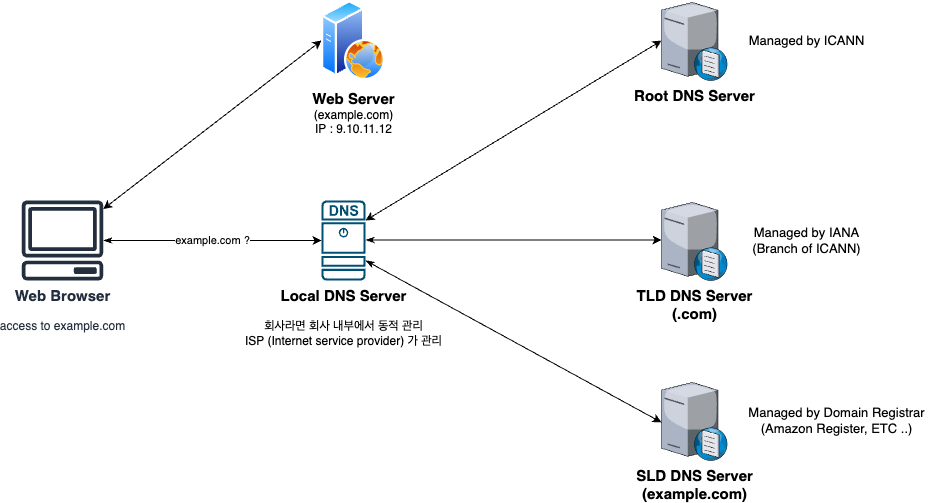

# DNS
## DNS 란 ?
Domain Name System , 호스트 이름을 대상 서버 IP 주소로 번역해 줍니다.

## DNS 계층구조
DNS 계층구조는

- **Top Level Domain (TDL) :** .com, .us, .in, .gov, .org ... 
- **Second Level Domain (SLD) :** .amazon.com, .google.com ... 

의 구조로 되어있다.

따라서 예시 도메인이 아래처럼 존재한다면,

ex) http://api.www.example.com

계층 구조는 아래와 같습니다.

- **TLD :** .com
- **SLD :** .example.com
- **Sub Domain :** .www.example.com
- **Domain Name :** .api.www.example.com
- **Protocol :** http
- **FQDN (Fully Qualified Domain Name) :** http://api.www.example.com


## DNS 동작 방식

### DNS 동작과정 다이어그렘은 다음과 같습니다.



#### 1. Local DNS Server로 요청
- 처음 클라이언트 Web Browser는 Local DNS Server에 질의합니다.
    - Local DNS Server는 회사라면 회사 내부에서 관리되고, 아니라면 ISP가 관리됩니다. (회사라도 ISP일수 있음)
- ```example.com``` 페이지에 접속하기 위해서, 해당 DNS를 알 고 있느냐 질의합니다.
    - 해당 예시에선 Local DNS가 모르는 상황

#### 2. Local DNS가 ICANN에 의해 관리되는 DNS 서버에 질의
- Local DNS가 해당 도메인을 모르기 때문에, 먼저 Root DNS Server로 ```example.com``` 도메인을 알 고 있느냐 질의합니다.
- Root DNS 서버가 모를 경우,
    - ```TLD``` 인 ```.com``` 은 알고 있다. ```.com``` 의 public IP 인 ```1.2.3.4``` 로 가보라 응답합니다.

#### 3. Local DNS가 ICANN에 의해 관리되는 ```.com``` TDL DNS 서버에 질의
- 두번째 요청에서 ```.com``` 이 ```1.2.3.4``` 인 것을 알아챗기 때문에, ```.com``` TDL DNS Server에 질의합니다.
    - TDL DNS Server는 ```example.com```은 알고 있다.  ```example.com``` 의 public IP 인 ```5.6.7.8``` 로 가보라 응답합니다.
    
#### 4. Local DNS가 ICANN에 의해 관리되는 ```example.com``` SDL DNS 서버에 질의
- 마지막으로 Local DNS Server는 ```example.com``` 도메인을 관리하는 Domain Name Registrar 인 AWS Route53, 가비아 등의 DNS Server로 요청을 질의합니다.
    - 해당 SDL Domain Server는 ```example.com``` 를 알 고 있기 때문에 , 최종 Web Server의 Public IP인 ```9.10.11.12``` 를 응답하게 되며, 

#### 5. Web Browser 가 Web Server로 요청 보냄
- 최종적으로 도메인의 Public IP를 알아낸 Web Browser가 해당 Web Server로 요청을 보내고, 응답을 받습니다.

#### 이러한 순서로 DNS Server는 동작합니다.

## DNS의 Record Type들
DNS의 레코드 종류와 설명은 다음과 같습니다.

### 1. A
HostName과 IPv4를 매핑합니다.

예를들어 아래와 같이 매핑됩니다.

```example.com -> 1.2.3.4```

### 2. AAAA

HostName과 IPv6를 매핑합니다.

예를들어 아래와 같이 매핑됩니다.

```example.com -> 1050:0:0:0:5:600:300c:326b```
### 3. CNAME
HostName과 다른 HostName을 매핑합니다.
- 매핑 대상 HostName은 다른 A나 AAAA 레코드 가 될 수 있습니다.
- Route53 에서, DNS Namespace 또는 Zone Apex의 상위 노드에 대한 CNAMES을 생성할 수 없습니다.
    - ex) ```example.com``` 은 못하지만 , ```www.example.com``` 은 생성할 수 있습니다.
### 4. NS
호스팅 존의 Name Server 입니다.

서버의 DNS Name 또는 IP 주소로 호스팅 존 (Public Hosted Zone && Private Hosted Zone) 에 대한 DNS 쿼리에 응답할 수 있습니다.
- 또한 트래픽이 도메인으로 라우팅되는 방식을 제어합니다.

호스팅 존의 종류는 , ```Public Hosted Zone```과 ```Private Hosted Zone``` 두가지로 나뉩니다.
#### Public Hosted Zone ?
만약 Public Domain Name을 구매했다면, Public Hosted Zone을 생성할 수 있습니다.

```mypublicdomain.com``` 을 구매했을 경우, 퍼블릭 존은 쿼리에

```app1.mypublicdomain.com``` 의 IP가 무엇인지 알 수 있습니다.
- 따라서 Public Hosted Zone은 누구든 해당 DNS 레코드를 찾을 수 있다는 의미

#### Private Hosted Zone ?
공개되지 않은 도메인 이름을 지원합니다.

같은 VPC(virtual private cloud) 내부에서만 해당 URL을 질의할 수 있는 호스팅 존 입니다.

예를들어 회사 내부망 (폐쇄망) 등이 있습니다.

비공개 URL이기 때문에, VPC 내부에서만 해당 HostName에 대한 IP를 리졸빙할 수 있습니다.


