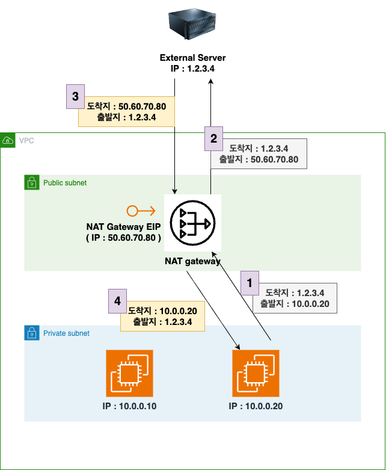

# NAT - Natework Address Translation
패킷 소스 IP 및 도착지 IP 를 변환해주는 역할을 해줍니다.

## Overview
- [NAT의 계념이 잘 정리된 블로그](https://www.stevenjlee.net/2020/07/11/%EC%9D%B4%ED%95%B4%ED%95%98%EA%B8%B0-nat-network-address-translation-%EB%84%A4%ED%8A%B8%EC%9B%8C%ED%81%AC-%EC%A3%BC%EC%86%8C-%EB%B3%80%ED%99%98/)
### 특징
1. NAT 는 PublicIP (ElasticIP) 를 가지고 있어야 합니다.
2. NAT가 존재하는 Private Subnet은 , Subnet 내부 장비와 외부가 통신하기 위해서 NAT를 통과합니다. NAT에서는 패킷의 출발지 IP와 도착지 IP를 변경합니다.
    - ***변경 과정 순서*** 
    - 숫자 번호 순서대로 트래픽이 이동하며 출발지와 도착지 IP가 NAT를 통과함에 따라 아래처럼 변화합니다.

    

### NAT 장점
1. IP 절약
    - 하나의 공인 IP를 통해 , NAT 내부 Subnet(LAN) 의 여러 장비가 Internet과 연결할 수 있기 때문에 IP를 절약할 수 있습니다.
2. 보안 준수
    - NAT 내부 Subnet(LAN 영역) 의 IP주소를 숨길 수 있기 때문에 , 보안을 준수할 수 있습니다.
    - 외부에선 NAT의 공인 IP만 가지고 통신함

## NAT Instance
이전에는 AWS에서 Amazon Liunx AMI 중 NAT Instance를 사용할 수 있엇는데, 2020/12/31 부로 지원이 종료됨.

NAT Gateway를 권장함.

### 특징
1. 가용성이 높지 않음
2. 인스턴스 크기에 따라 대역폭이 달라짐
    - 작은 크기의 인스턴스는 , 큰 크기의 인스턴스보다 네트워크 대역폭이 작음
3. Security Group과 규칙을 관리해야함
    - 인바운드 및 아웃바운드 트래픽을 Security Group으로 관리해야함..
>2023/10/4 일자 NAT AMI 없음

## NAT Gateway
NAT Instacne보다 훨 좋은 NAT Service.

### 특징
***AWS 관리형 NAT Instance***이며 , 높은 대역폭을 가지고 있고 가용성이 높으며, 사용량 및 NAT Gateway에 따라 비용이 청구됨.

특정 AZ에 생성되고 , ElasticIP를 이어받음.

**EC2와 동일한 서브넷에서 사용할 수 없음**
    - 따라서 다른 서브넷에서 액세스할 때만 NAT Gateway가 도움이 됩니다.
    - 예를들어 같은 VPC 상에서 , NAT Gateway만 Public Subnet에 위치시키고 Private Subnet에 EC2 가 존재할 때.. 이럴때 유용함
    
**대역폭 :** 초당 5GB , 45GB까지 확장 가능
**보안그룹 ?:** 관리할 필요 없음. NAT Instance처럼 연결을 위해 어떤 포트를 사용해야할지 생각할필요 없음.

### 고가용성
각기 다른 AZ에 NAT Gateway를 두고, EC2 Instance도 각각의 AZ에 존재할 경우, 하나의 AZ에서 문제가 발생했더라도 , 나머지 AZ의 NAT Gateway는 문제되지 않음.
- 각 NAT Gateway는 Router table을 생성해서 연결

각기 다른 AZ에 존재하는 NAT Gateway 는 서로 트래픽이 격리되어 고 가용성에 좋음.

