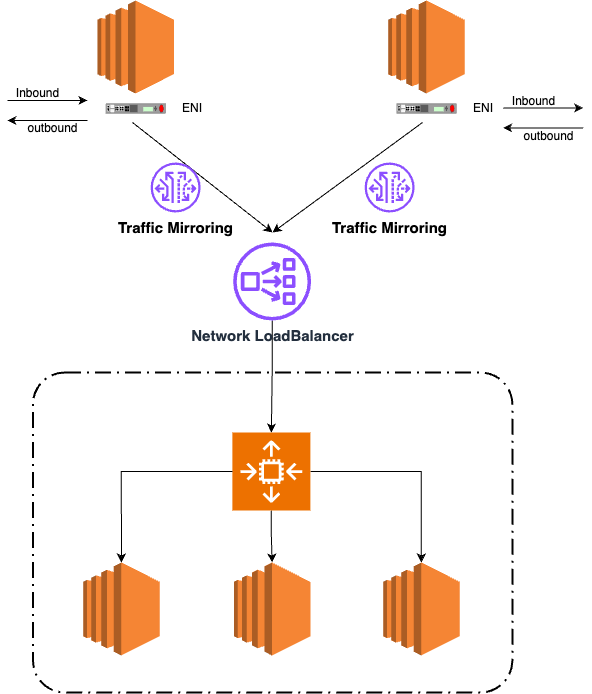

# VPC Traffic Mirroring
## Traffic Mirroring이란 ?
VPC의 트래픽 미러링 기능은 AWS의 보안 기능입니다.

VPC에서 발생하는 네트워크 트래픽을 수집/검사하되, 특정 인스턴스나 소스가 작동하는것에 방해하지 않고 실행되는 기능입니다,

## Architecture

- ENI에서 발생하는 네트워크 인바운드, 아웃바은드 트래픽을 분석하기 위해, 다음 단계를 따릅니다.

먼저 Network LoadBalaner(4계층) 생성합니다. 그리고 NLB 뒤에 오토스케일링 그룹을 두는데, 해당 그룹엔 보안 소프트웨어가 들어있는 EC2 Instance Group 입니다.

그리고 EC2 Instance에 발생하는 네트워크 트래픽을 모두 수집하고 싶다면, Traffic Mirroring을 생성한 NLB, 트래픽 감시 대상이되는 ENI와 연결하여 생성합니다.
- 모든정보가 아니라 일부만 얻는것 또한 가능합니다.

ENI 및 EC2 내부 소스로 전송되는 네트워크 트래픽은 전부 Traffic Mirroring을 통해 NLB로 보내집니다.

또한 아키텍처 처럼, 여러개의 ENI를 대상으로도 작동합니다.