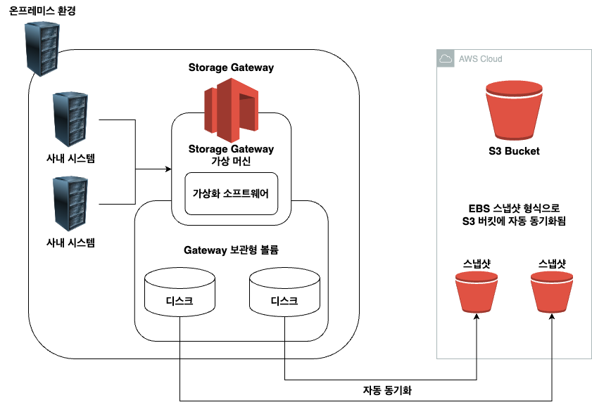

# AWS에 백업서버 두기
해당 아키텍처는, AWS에 온프레미스(혹은 타 클라우드) 에서 운영중인 서비스의 데이터들을 AWS상에 백업해둠으로써 온프레미스보다 저렴하게 백업 서버를 구축하거나, AWS에 이전하기 위한 용도로 사용되는 아키텍처

## 개요
해당 아키텍처의 기반은 온프레미스에서 작동중인 Application의 데이터를 백업

백업 대상은 용량이 큰 이미지 및 영상 파일, DB 데이터, 로그파일, 파일서버에 있는 파일
- 이떄 로그파일과 DB 파일은 장기간 보관해야함

비용을 절감하면서 자동 백업시스템을 구축하여 손이 덜가는 아키텍처를 구성해야 함

## 설계 핵심사항
1. Storage Gateway를 이용한 백업 시스템 구축
    - 온프레미스 환경에 Storage Gateway를 사용하여 백업 스토리지를 만든 후 S3에 자동 백업한다.
2. S3 및 글레이셔로 백업된 파일 수명주기 관리
    - 로그 파일 등을 S3에 백업해두고 , 데이터 라이프사이클을 지정해서 특정 일수가 지나가면 글레이셔에 아카이브하도록 한다.
3. 대용량 이미지및 영상 파일 및 DB 데이터는 S3에 백업
    - Storage Gateway에 부과되는 종량제 요금을 줄이기 위해, 용량이 큰 데이터는 Batch성 Application이나 Cron script를 이용해 S3에 백업한다.

## 온프레미스 환경의 데이터 백업 방안
아래 3가지 모두 주기적 자동화 백업방안이 될 수 있으며, S3나 EBS에 백업된 데이터를 글레이셔로 데이터 라이프사이클을 관리할 수 있음

### 1. S3에 AWS CLI를 이용해 백업
S3 API Endpoint로 Batch성 Application을 개발하거나, AWS CLI를 주기적으로 작동시키는 cron script를 작성하여 AWS S3 버킷에 백업하는 방안

S3는 사용한 스토리지 용량에따라 종량제로 과금됨. 또한 저장된 데이터의 버전관리가 가능하고 서버 사이드 암호화 또한 가능하기때문에 유기적으로 사용할 수 있음

### 2. DRBD를 통한 AWS EC2의 EBS와의 백업 - DB데이터 백업에 사용할 수 있음
#### 2.1 온라인 방식
[1번](#1-s3에-aws-cli를-이용해-백업)과 동일한 백업방식. DB를 정지시키고 Batch성 App 또는 script 작성하여 백업

DB 복구시엔 AWS CLI를 통해 S3에 저장된 데이터를 import하여 복구
- AWS CLI가 비용면에서 가장 저렴

#### 2.2 오프라인 방식
**시스템 정지 시간을 조정할 수 있지만, 장애 발생시 최대 하루치 데이터 손실을 허용하는 경우에만 사용**

DBMS에서 제공하는 구입 복제 유틸리티를 이용하거나, DRBD(Distributed Replicated Block Device) 를 이용하는 방안으로 나뉘어짐. 둘다 AWS EC2와 용량이 충분한 EBS를 준비해서, EC2 인스턴스와 연결하여 백업하는 방안.

**DBMS 기능으로 복제**하는 경우, EC2에서 DBMS를 시작해서 DBMS의 기능을 통해 데이터를 동기화함.
- DBMS들이 비동기, 동기 모드를 지원함.
    - 동기 모드는 데이터손실이 적지만 느리고, 비동기모드는 손실 가능성이 있지만 속도저하가 없음

**DRBD**를 사용하는 경우, 온프레미스 환경에서 DB 파일이 저장된 디스크볼륨과, EC2 인스턴스에 연결된 EBS 볼륨을 동기화하게 됨. 
- DRBD는 리눅스가 제공하는 기능 
- DRBD 또한 비동기, 동기 모드를 지원함.
- 백업 대상 EC2에 DBMS를 구축할 필요가 없음
- 복구할땐 구축시 만든 DRBD 동기화 방식을 역으로 하여 EC2 인스턴스로부터 온프레미스 환경의 DB 서버에 대해 역방향으로 데이터를 동기화하여 복구하면 됨.

***백업데이터로 리포트가 필요없다면, 기술적 부담이 적은 DRBD가 좋음..***

### 3. Storage Gateway를 구축하여 백업
[1번](#1-s3에-aws-cli를-이용해-백업) 과 [2번](#2-drbd를-통한-aws-ec2의-ebs와의-백업---db데이터-백업) 방식은 사람손을 많이타서 휴먼이슈가 날 수 있음.

따라서 AWS가 제공하는 Storage Gateway를 사용한다면, 백업에 손을 대는일을 최소화할 수 있음.

#### 3.1 작동 원리
Storage Gateway는 온프레미스의 서버 가상화 환경에서 동작하는 가상 머신으로 제공됨.
- VMware, MS 가상화 환경과 대응
- 이떄 로컬 디스크 혹은 SAN 디스크같은 가상 머신이 사용할 수 있는 스토리지가 필요
    - 스토리지는 1GB ~ 1TB까지 설정 가능
    - 최대 12개

또한 온프레미스 환경과 VPC를 연결할 수 있도록 Direct Connect와 같은 네트워크 설정이 필요.
- Direct Connect로 연결하여 온프레미스와 VPC간 통신을 private으로 지킬 수 있음
- 전용 회선을 사용하기에 속도도 빠름

네트워크가 연결되었다면, Storage Gateway를 사용하는 많은 방법 중, ***Gateway 보관형 볼륨***을 가장 많이이용함.

#### 3.2 Gateway 보관형 볼륨 방식

가상 머신에 달려있는 로컬 디스크 혹은 SAN 디스크가 Storage Gateway의 스토리지로써 동작하는데, AWS의 S3 Bucket과 EBS 스냅샷 형식으로 자동 동기화 됨.

이떄 EBS 스냅샷 형식이란, 볼륨을 통째로 백업하는것을 의미하는데, 증분백업 방식을 통해서 2번째 이후 동기화는 이전과의 차이(백업되지 않은 데이터) 만 전송됨.

통신 내용 및 스냅샷은 암호화되어있음.

#### 3.3 S3에 보관된 EBS 스냅샷에 접근하는 방안
1. S3에 백업되어있는 EBS 스냅샷을, 온프레미스 Storage Gateway의 Storage로 복원하는 방안.
    - 볼륨 스토리지가 손상되어 복구해야 하는 경우, 예전데이터를 얻고싶은 경우 사용

2. EBS 스냅샷을 AWS EBS 볼륨으로 복원 후 해당 EBS를 사용하는 EC2를 생성하는 방안
    - EC2에서 백업내용을 확인할 수 있음.

#### 3.4 Storage Gateway Info
Storage Gateway 1개당 최대 12개 볼륨 스토리지를 가질 수 있음.(보관형 볼륨 개수)

12개보다 더 많이 필요하면, Storage Gateway를 수평확장함.

#### 3.5 비용
[1번](#1-s3에-aws-cli를-이용해-백업) 과 [2번](#2-drbd를-통한-aws-ec2의-ebs와의-백업---db데이터-백업) 방식에 비해 비용이 많이듬.

고정요금(월 119달러)과 볼륨 스토리지 용량에 따라 종량제요금이 나오고, Direct Connect 요금, 스냅샷 스토리지 요금 등이 발생.
- 편리함과 비용은 반비례..

## 백업 파일 보관방안
### Amazon glacier
S3 백업된 로그 등의 일부데이터는 장기간 보관해야 하는데, S3보다 저렴한 Amazon glacier를 사용.

일반적인 운용관리에선 위의 방안을 사용하고, 과거의 특정 시점의 데이터 상태로 되돌리기만해도 좋은 데이터인 경우엔 Amazon glacier에 보관.

S3와 비교하면 1/5에서 1/6까지 비용절감 가능

단점으론 보관한 파일을 이용하려면 이용신청을 해야되는데, 신청부터 참조가능까지 3 ~ 5시간 소요

S3에는 ***glacier 딥 아카이브***, ***인텔리전트 티어링***, ***스탠다드-IA***, ***원 존-IA*** 와 같은 저장 클래스가 제공됨

#### 1. glacier 딥 아카이브
AWS에서 가장 저렴한 저장소, 1년에 한두번 엑세스할 파일을 저장하기위해 만들어짐.

복원에는 최대 12시간소요, 한번 저장된 데이터는 최소 180일치 비용 발생

가용성 및 내구성은 glacier와 동일

#### 2. 인텔리전트 티어링
데이터 엑세스 패턴에따라 자동으로 저장 클래스(***glacier 딥 아카이브***, ***인텔리전트 티어링***, ***스탠다드-IA***, ***원 존-IA*** 등) 를 최적화하여 비용을 최적화하는 서비스

#### 3. 스탠다드-IA
S3 Standrad와 같은 읽기성능인데 비용이 30 ~ 40% 저렴함.

***읽기에 발생하는 비용은 S3보단 비싸지만,*** 비용이 저렴하기에 자주 않읽히는 데이터를 장기보관하기 좋음(재해복구용 데이터 저장)

#### 4. 원 존-IA
스탠다드-IA랑 비슷한데 AZ를 하나만 써서 스탠다드-IA보다 20% 더 저렴함.

AZ를 한개만 쓰니까 AZ가 박살나면 데이터도 함깨 유실될 수 있으니 고려해야함.

### Amazon glacier 과금체계
glacier는 데이터를 꺼낼 때, 무료로 꺼낼 수 있는 양에 제한이 있는데, ***제한선을 넘게되면 피크시의 전송률(GB/시간) 에 대해 0.0114 달러의 과금이 당월 모든시간에 적용됨***

계산해보면 상당한 비용이 발생하기에, 데이터를 꺼내는 빈도가 대단히 낮은애들을 glacier에 저장하는것이 좋음

