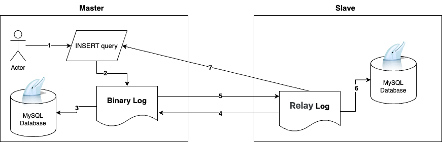

# Database 개념
## Overview
Database를 Kubernetes pod로 관리하기 전에, 파드상태로 관리되는것이 어떻게 가능한지에 대해 이해해야 합니다.

그 전, 데이터베이스에 대한 기초 지식과 복재 구성 등의 대한 지식을 해당 문서에 정리해 두었습니다.

## 1. 트랜잭션이란 ( Transaction )
Database의 트랜잭션이란 데이터베이스서 실행되는 **여러 단계의 작업 시퀀스를 의미하는데, 각 작업들은 하나로 간주되어, 전체가 성공하거나, 작업 한개가 실패했다면 전체가 실패하여 이전 상태로 Roll back 하는것을 의미합니다.**

트랜잭션은 다음 네가지 핵심 계념을 가지고 있습니다.(ACID)

1. 원자성 (Atomicity)

    - 트랜잭션 내의 작업들은 완전히 성공하거나, 완전히 실패해야 하며, 만약 실패할 경우 예전 상태로 롤백되어야 합니다.

2. 일관성 (Consistency)

    - 트랜잭션 시작 전과 시작 후의 데이터베이스의 상태는 일관되어야 합니다.

        트랜잭션 커밋이 일어난 뒤 데이터베이스의 상태가 변화해야 하며, 

        트랜잭션 커밋이란 트랜잭션 내부의 모든 작업들이 성공적으로 수행됬을 경우, 데이터베이스에 작업결과를 반영하는 것 입니다.

3. 독립성 (Isolation)

    - 동시에 실행되는 여러 트랜잭션들은 서로에게 영향을주면 안되고, 

        하나의 트랜잭션 내의 변경 사항은 해당 트랜잭션이 완료될 때 까지 다른 트랜잭션에게 보이면 안됩니다.

4. 지속성 (Durability)

    - 트랜잭션이 성공적으로 완료되면 , 해당 결과는 데이터베이스에 반영되어야 하며, 
    
        시스템 장애가 발생하더라도 결과는 보존되어야 합니다.

## 2. Database에 관하여 - Replication
Database 운영에 있어 가장 중요한것들을 꼽으려면 , 아래와 같을것입니다.
1. 확장성 (Scalability)
2. 가용성 (Availability)

따라서, 이들을 만족시키기 위해 **복제 (Replication)** 를 사용하게 됩니다.

### ETC - Replication 관련 용어변경사항
- Master -> Source --> Primary
- Slave -> Replica --> Secondary
- multithreaded slave → multithreaded **applier**
- ‘명령어, 시스템 변수, PS 테이블명, process list, replica status’ 등에 용어 변경 적용
- 예시) SHOW SLABE STATUE ⇒ SHOW **REPLICA** STATUS

### Replication을 왜 할까 ?
데이터베이스 복제를 하는 큰 이유와 장점은 다음과 같을 것 입니다.

### 1. 고가용성 보장
    
    한 서버에서 문제가 생겻을 경우, 다른 서버에서 데이터를 계속 사용할 수 있기 때문에 장애 허용시간을 최소화할 수 있습니다.

### 2. Scale-out

    읽기, 쓰기, 수정에 대한 모든 연산이 하나의 DB에서 발생할 경우, 트래픽이 늘어게 되어 병목 현상이 일어날 수 있습니다.

    따라서 쓰기와 읽기 연산을 나눈다면, 병목현상을 방지할 수 있으며, 특정 연산이 많아질 경우 해당 노드가 수평 확장되어 큰 트래픽에 유연하게 대응할 수 있습니다.

### 3. 로드벨런싱

    읽기 쿼리를 여러 서버에 분산시켜 시스템의 전체적인 성능을 향상시킬 수 있습니다. 특히 읽기 위주의 작업에서 유용합니다.

따러서 데이터베이스를 복제하여 사용하게 됩니다.

## 3. MySQL에서의 Replication
MySQL을 대상으로 Replication이 어떻게 발생하는지 기술합니다.

아래 순서도를 참고해서 설명합니다.



1. Master 서버에서 INSERT 쿼리가 실행됩니다.
2. 해당 쿼리는 Master의 Binary Log에 기록됩니다.
3. 동시에 해당 쿼리는 Master node database에 반영됩니다.
4. Slave의 I/O 스레드는 Master의 Binary Log의 위치 (coordinates)를 지속적으로 추적하며 새로운 이벤트가 발생하면 그 이벤트를 가져와 (fetch) Slave의 Relay Log에 기록합니다.
5. Slave의 SQL 스레드는 Relay Log에서 이 이벤트를 읽어와 
6. 실제 데이터베이스에 적용(apply)합니다.
7. 모든 변화가 Slave의 데이터베이스에 성공적으로 적용되면 해당 과정은 완료됩니다.

6번과 7번 사이에, Slave 노드에서 Relay Log에 성공적으로 기록되었음을 Master에게 전달하려면, ```semi-synchronous replication``` 설정을 해야 합니다.

## 4. MySQL에서 Replication이 깨지는 경우
MySQL의 Replication 구성에서, Replication이 깨지는 경우는 다음과 같습니다.

만약 Replication 구성이 다음과 같다고 생각합니다.

- 마스터노드
    - active 1대
    - standbuy 1대
- workernode
    - 1대

### Replication이 깨지는 usecase
1. 데이터 ID가 101인 레코드가 Master 노드에 INSERT 됩니다.
2. 해당 레코드가 Slave (또는 worker라고 불리는 경우도 있지만, 일반적으로는 Slave라 부릅니다)에 반영되는 중에, Master 노드가 장애를 겪어 다운됩니다.
3. Slave 노드는 다른 active된 Master 노드에 연결을 시도합니다.
4. 새로 연결된 Master 노드에는 ID 101인 레코드가 존재하지 않지만, Slave 노드에는 그 레코드가 존재합니다. 따라서 동기화를 시도하게 됩니다.
5. 하지만, 외래키 제약 조건 때문에 ID 101인 레코드가 중복되게 되어 Replication이 crash하게 됩니다.
