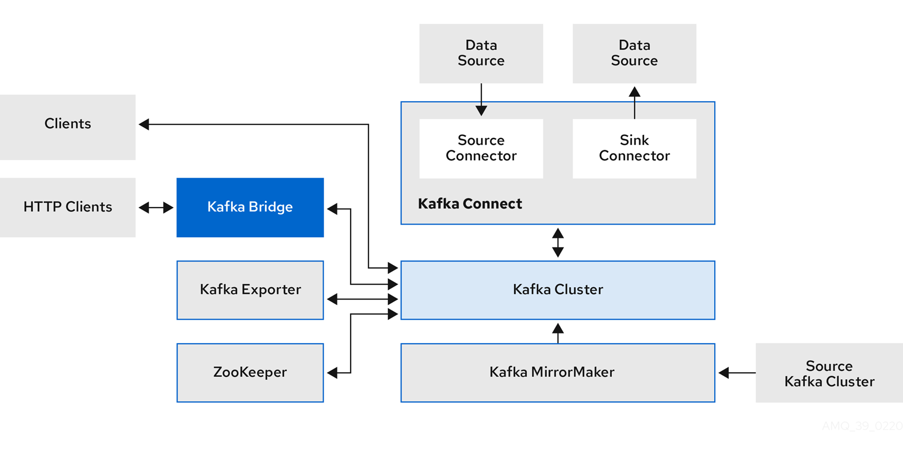
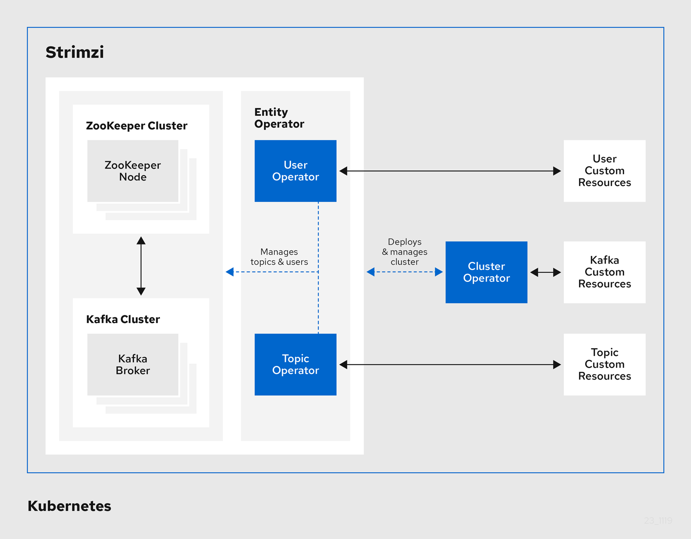
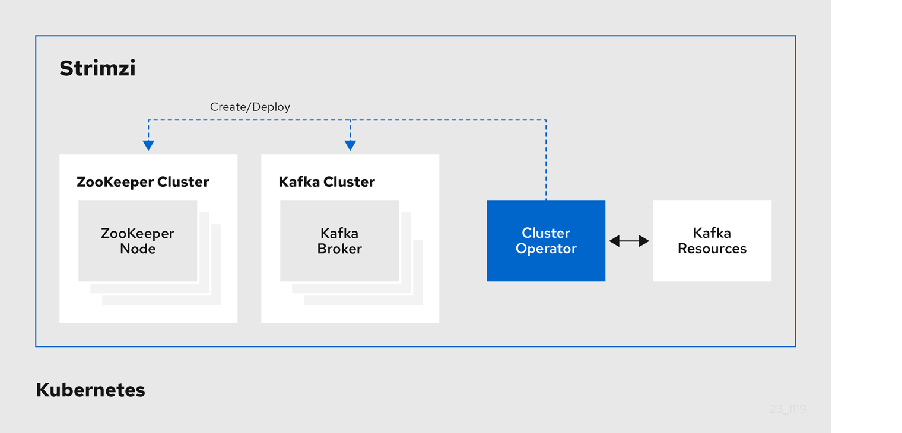
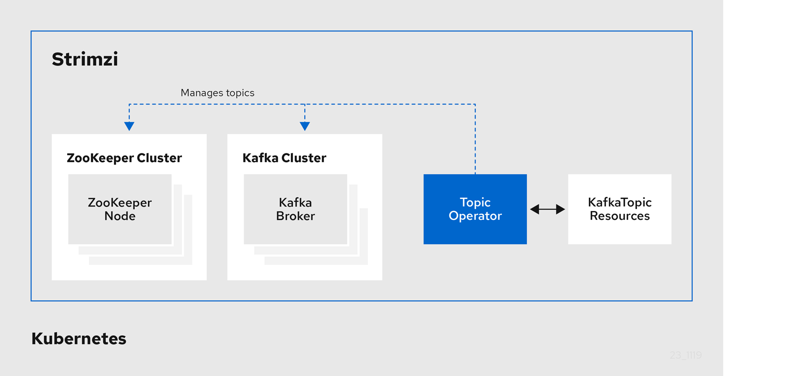
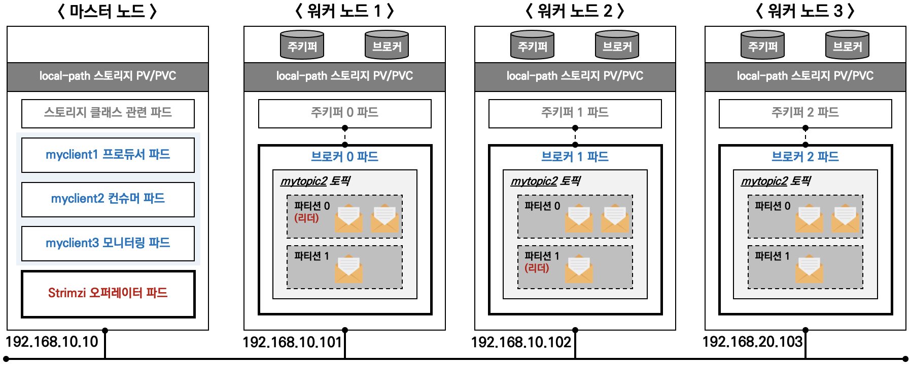
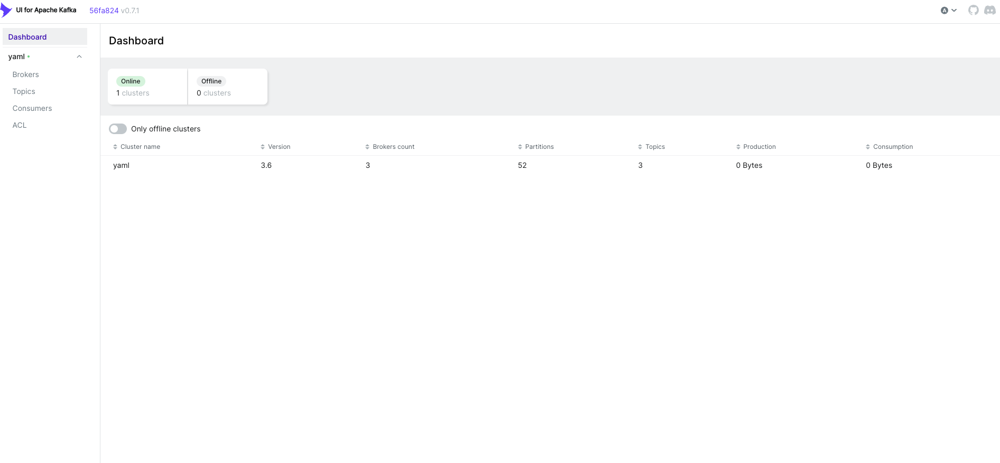
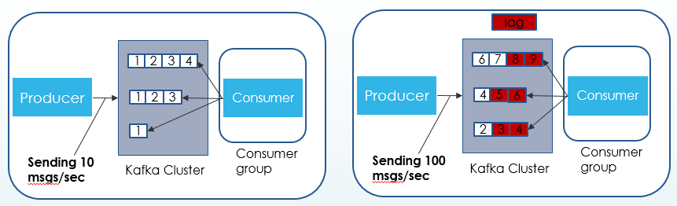
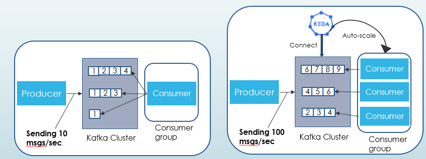

# Kafka Strimzi
Kafka Strimzi 는 쿠버네티스 환경에서 카프카 Kafka 운영 관리에 도움을 주는 Operator 입니다.
- [Strmizi v0.38.0 doc](https://strimzi.io/docs/operators/latest/overview)

## Strimzi가 제공하는 Kafka 구성요소
1. Kafka MirrorMaker
- Kafka Cluster간의 데이터 전송 / 수신을 도와주게 됩니다.

2. Kafka Bridge
- Client Application에서 Kafka Producer 또는 Consumer가 되기 위해서 라이브러리를 설치해야하는데, 불가능한 경우가 있을 수 있으며     설치자체가 어려운 상황도 있을 것 입니다.
- 따라서 이런 상황에, Kafka Bridge를 통해서 Kafka Cluster와 연결할 수 있습니다.
  
3. ZooKeeper
- Kafka의 메타데이터를 관리합니다.

4. Kafka Connect
- 카프카는 프로듀서와 컨슈머를 통해 데이터 파이프라인을 만들 수 있습니다.
    - 예를 들어 A서버의 DB에 저장한 데이터를 Kafka Producer/Consumer를 통해 B서버의 DB로도 보낼 수 있습니다.
    - 이런 데이터 파이프라인이 여러개라면 , 반복적으로 파이프라인을 사람이 구성해줘야 하는데 , 이런 귀찮음을 해결해주기 위해서 Kafka Connect를 사용합니다.
- Kafka Connect를 사용하면 , 외부 시스템에서 Kafka로 , 또는 Kafka에서 외부 시스템으로 데이터를 지속적으로 수집할 수 있습니다.



## Strimzi의 주요 기능들
- Operator 제공 **기능** : **카프카** 클러스터/구성요소 배포 및 관리, **카프카** 접속 설정, **카프카** 업그레이드, **브로커** **brokers** 관리, **토픽** **topic** 과 **유저** **user** 생성 및 관리
    - **Manages the Kafka Cluster** - Deploys and manages all of the components of this complex application, including dependencies like Apache ZooKeeper® that are traditionally hard to administer.
    - **Includes Kafka Connect** - Allows for configuration of common data sources and sinks to move data into and out of the Kafka cluster.
    - **Topic Management** - Creates and manages Kafka Topics within the cluster.
    - **User Management** - Creates and manages Kafka Users within the cluster.
    - **Connector Management** - Creates and manages Kafka Connect connectors.
    - **Includes Kafka Mirror Maker 1 and 2** - Allows for mirroring data between different Apache Kafka® clusters.
    - **Includes HTTP Kafka Bridge** - Allows clients to send and receive messages through an Apache Kafka® cluster via the HTTP protocol.
    - **Includes Cruise Control** - Automates the process of balancing partitions across an Apache Kafka® cluster.
    - **Prometheus monitoring** - Built-in support for monitoring using Prometheus.
    - **Grafana Dashboards** - Built-in support for loading Grafana® dashboards via the grafana_sidecar

- Strimzi 가 제공하는 **Operator** : 클러스터 Operator, 엔티티 Entity Operator, 토픽 Entity, 유저 Entity
    - **Operator** 로 배포 및 관리 : Kafka **clusters**, Kafka **Connect**, Kafka **MirrorMaker**, Kafka **Bridge**, Kafka **Exporter**, Cruise Control, **Entity** Operator (User, Topic)


- Cluster Operator 는 카프카/주키퍼 클러스터를 생성/배포 및 관리


- Topic Operator 는 토픽 Topic 생성, 삭제, 변경 등 관리


## 1. Strimzi를 통한 Kafka Cluster 설치
Strimzi를 통해 Kafka Cluster를 설치하게되면, 아래와같은 구성이 설치됩니다.



- Strimzi v0.38.0 버전 출시 : Apache Kafka 지원 버전 - v3.5.0, v3.5.1, v3.6.0

### 1.1 Helm으로 Strimzi를 설치합니다.
- Kafka Strimzi는 Statefulset으로 Kafka를 관리하지 않고, StrimziPodSets(CRD)로 관리합니다.
```bash
# 네임스페이스 생성
kubectl create namespace kafka

# Repo 추가
helm repo add strimzi https://strimzi.io/charts/

# helm values.yaml 설정파일을 확인합니다.
helm show values strimzi/strimzi-kafka-operator

# 차트 설치 : 오퍼레이터 파드 설치
## 설치대상 Strimzi 버전은 0.38.0
helm install kafka-operator strimzi/strimzi-kafka-operator --version 0.38.0 --namespace kafka

# 배포한 리소스 확인 : Operator 디플로이먼트(파드)
kubectl get deploy,pod -n kafka
kubectl get-all -n kafka

# 오퍼레이터가 지원하는 카프카 버전 확인
kubectl describe deploy -n kafka | grep KAFKA_IMAGES: -A3

# 배포한 리소스 확인 : CRDs - 각각이 Strimzi가 제공하는 기능,,
kubectl get crd | grep strimzi
kafkabridges.kafka.strimzi.io                2023-11-11T06:01:21Z
kafkaconnectors.kafka.strimzi.io             2023-11-11T06:01:21Z
kafkaconnects.kafka.strimzi.io               2023-11-11T06:01:20Z
kafkamirrormaker2s.kafka.strimzi.io          2023-11-11T06:01:21Z
kafkamirrormakers.kafka.strimzi.io           2023-11-11T06:01:21Z
kafkanodepools.kafka.strimzi.io              2023-11-11T06:01:21Z
kafkarebalances.kafka.strimzi.io             2023-11-11T06:01:21Z
kafkas.kafka.strimzi.io                      2023-11-11T06:01:20Z
kafkatopics.kafka.strimzi.io                 2023-11-11T06:01:21Z
kafkausers.kafka.strimzi.io                  2023-11-11T06:01:21Z
strimzipodsets.core.strimzi.io               2023-11-11T06:01:20Z

# (참고) CRD 상세 정보 확인
kubectl describe crd kafkas.kafka.strimzi.io
kubectl describe crd kafkatopics.kafka.strimzi.io
```

### 1.2 Strimzi를 통해 Kafka를 배포합니다.
- 배포 시 사용하는 kafka yaml template은 다음과 같습니다.
```yaml
apiVersion: kafka.strimzi.io/v1beta2
kind: Kafka
metadata:
  name: my-cluster # Kafka cluster name
spec:
  kafka:
    version: 3.6.0 # kafka version
    replicas: 3 # Kafka broker의 replicas 개수
    listeners: # Kafka broker에 접근하는 방법을 정의함
      - name: plain # 평문(tls가 없는) 통신을 위한 리스너
        port: 9092 # 평문접근시 사용할 포트
        type: internal # 클러스터 내부에서만 접근가능
        tls: false # tls 비활성화
      - name: tls # tls 통신을 위한 리스너
        port: 9093 # tls 접근시 사용할 포트
        type: internal # 클러스터 내부에서만 접근가능
        tls: false
      - name: external # Kafka broker 외부노출 접근
        port: 9094 # 외부 통신을 위한 포트 번호
        type: nodeport # 외부통신 타입정의
        tls: false
    readinessProbe:
      initialDelaySeconds: 15
      timeoutSeconds: 5
    livenessProbe:
      initialDelaySeconds: 15
      timeoutSeconds: 5
    config: # Kafka broker option 값들
      offsets.topic.replication.factor: 3 # topic의 Replication 개수
      transaction.state.log.replication.factor: 3 
      transaction.state.log.min.isr: 2
      default.replication.factor: 3
      min.insync.replicas: 2 # isr중 적어도 둘 이상의 브로커가 응답하도록 설정
      inter.broker.protocol.version: "3.6"
    storage:
      type: jbod
      volumes:
      - id: 0
        type: persistent-claim
        size: 10Gi
        deleteClaim: true # Broker 파드 제거되면 pvc 같이제거옵션
    template: 
      pod: 
      # app.kubernetes.io/name 라벨의 value가 kafka인 파드들이, 동일한 topology.ebs.csi.aws.com/zone 라벨 값을 가진 노드에서는 배포되지 않도록 하는 설정
        affinity: 
          podAntiAffinity: 
            requiredDuringSchedulingIgnoredDuringExecution: 
              - labelSelector: 
                  matchExpressions: 
                    - key: app.kubernetes.io/name
                      operator: In
                      values: 
                        - kafka
                topologyKey: "topology.ebs.csi.aws.com/zone"
  zookeeper: # zookeeper 옵션값
    replicas: 3
    readinessProbe:
      initialDelaySeconds: 15
      timeoutSeconds: 5
    livenessProbe:
      initialDelaySeconds: 15
      timeoutSeconds: 5
    storage:
      type: persistent-claim
      size: 10Gi
      deleteClaim: true
    template: 
      pod: 
      # app.kubernetes.io/name 라벨의 value가 zookeeper인 파드들이, 동일한 topology.ebs.csi.aws.com/zone 라벨 값을 가진 노드에서는 배포되지 않도록 하는 설정
        affinity: 
          podAntiAffinity: 
            requiredDuringSchedulingIgnoredDuringExecution: 
              - labelSelector: 
                  matchExpressions: 
                    - key: app.kubernetes.io/name
                      operator: In
                      values: 
                        - zookeeper
                topologyKey: "topology.ebs.csi.aws.com/zone"
  entityOperator:
    topicOperator: {}
    userOperator: {}
```


```bash
# 카프카 클러스터 YAML 파일 확인 : listeners(3개), podAntiAffinity
curl -s -O https://raw.githubusercontent.com/gasida/DOIK/main/strimzi/kafka-1.yaml
cat kafka-1.yaml | yh

# 카프카 클러스터 배포 : 카프카(브로커 3개), 주키퍼(3개), entityOperator 디플로이먼트
## 배포 시 requiredDuringSchedulingIgnoredDuringExecution 지원 >> preferredDuringSchedulingIgnoredDuringExecution 미지원...
kubectl apply -f kafka-1.yaml -n kafka

# 카프카 클러스터 배포상태 확인
watch kubectl get kafka,strimzipodsets,pod,svc,endpointslice,pvc -n kafka

# 배포된 리소스 확인 : 카프카/주키퍼 strimzipodsets 생성 확인 >> sts 스테이트풀셋을 사용하지 않습니다.
kubectl get strimzipodsets -n kafka

# 노드 정보 확인
kubectl describe node | more
kubectl get node --label-columns=topology.ebs.csi.aws.com/zone
kubectl describe pv | grep 'Node Affinity:' -A2

# 배포된 리소스 확인 : 배포된 파드 생성 확인
$ kubectl get pod -n kafka -l app.kubernetes.io/name=kafka
NAME                 READY   STATUS    RESTARTS   AGE
my-cluster-kafka-0   1/1     Running   0          10m
my-cluster-kafka-1   1/1     Running   0          10m
my-cluster-kafka-2   1/1     Running   0          10m


$ kubectl get pod -n kafka -l app.kubernetes.io/name=zookeeper
NAME                     READY   STATUS    RESTARTS   AGE
my-cluster-zookeeper-0   1/1     Running   0          11m
my-cluster-zookeeper-1   1/1     Running   0          11m
my-cluster-zookeeper-2   1/1     Running   0          11m


$ kubectl get pod -n kafka -l app.kubernetes.io/instance=my-cluster
NAME                                          READY   STATUS    RESTARTS   AGE
my-cluster-entity-operator-64dc7c8844-8gn2d   3/3     Running   0          9m50s
my-cluster-kafka-0                            1/1     Running   0          10m
my-cluster-kafka-1                            1/1     Running   0          10m
my-cluster-kafka-2                            1/1     Running   0          10m
my-cluster-zookeeper-0                        1/1     Running   0          11m
my-cluster-zookeeper-1                        1/1     Running   0          11m
my-cluster-zookeeper-2                        1/1     Running   0          11m

# 배포된 리소스 확인 : 서비스 Service(Headless) 등 생성 확인 - listeners(3개)
kubectl get svc,endpointslice -n kafka

# 배포된 리소스 확인 : 카프카/주키퍼 파드 저장소 확인
kubectl get pvc,pv -n kafka
kubectl df-pv

# 배포된 리소스 확인 : 컨피그맵 확인
kubectl get cm -n kafka

# 컨피그맵 상세 확인
kubectl describe cm -n kafka strimzi-cluster-operator
kubectl describe cm -n kafka my-cluster-zookeeper-config
kubectl describe cm -n kafka my-cluster-entity-topic-operator-config
kubectl describe cm -n kafka my-cluster-entity-user-operator-config


kubectl describe cm -n kafka my-cluster-kafka-0
kubectl describe cm -n kafka my-cluster-kafka-1
kubectl describe cm -n kafka my-cluster-kafka-2
...(생략)...
##########
# Node / Broker ID
##########
broker.id=${STRIMZI_BROKER_ID} # Strimzi kafka broker의 순번.  1번이면 1, 2번이면 2 ...
node.id=${STRIMZI_BROKER_ID} # Strimzi kafka broker의 순번. 1번이면 1, 2번이면 2 ...

##########
# Kafka message logs configuration >> 로그 디렉터리
##########
log.dirs=/var/lib/kafka/data-0/kafka-log${STRIMZI_BROKER_ID} # Strimzi kafka broker의 순번. 1번이면 1, 2번이면 2 ...

...

##########
# User provided configuration
##########
default.replication.factor=3
inter.broker.protocol.version=3.6
min.insync.replicas=2
offsets.topic.replication.factor=3
transaction.state.log.min.isr=2
transaction.state.log.replication.factor=3
log.message.format.version=3.6
...


# kafka 클러스터 Listeners 정보 확인 : 각각 9092 평문, 9093 TLS, 세번째 정보는 External 접속 시 NodePort 정보
kubectl get kafka -n kafka my-cluster -o jsonpath={.status.listeners} | jq

# (옵션) NetworkPolicy 확인
# Strimzi가 자동으로 networkpolicy를 세팅해줌.
kubectl get networkpolicy -n kafka
kubectl describe networkpolicy -n kafka

# (옵션) poddisruptionbudget 확인 >> 어떤 동작을 처리하는가?
kubectl get pdb -n kafka
kubectl describe pdb -n kafka
```

### 1.3 kafka 배포결과 확인
- 배포가 잘 되었는지 확인해봅니다.
```bash
$ kubectl get kafka,strimzipodsets,pod,svc,endpointslice,pvc -n kafka                                                          
NAME                                DESIRED KAFKA REPLICAS   DESIRED ZK REPLICAS   READY   WARNINGS
kafka.kafka.strimzi.io/my-cluster   3                        3                     True

NAME                                                 PODS   READY PODS   CURRENT PODS   AGE
strimzipodset.core.strimzi.io/my-cluster-kafka       3      3            3              5m5s
strimzipodset.core.strimzi.io/my-cluster-zookeeper   3      3            3              5m52s

NAME                                              READY   STATUS    RESTARTS   AGE
pod/my-cluster-entity-operator-64dc7c8844-8gn2d   3/3     Running   0          4m24s
pod/my-cluster-kafka-0                            1/1     Running   0          5m5s
pod/my-cluster-kafka-1                            1/1     Running   0          5m5s
pod/my-cluster-kafka-2                            1/1     Running   0          5m5s
pod/my-cluster-zookeeper-0                        1/1     Running   0          5m52s
pod/my-cluster-zookeeper-1                        1/1     Running   0          5m52s
pod/my-cluster-zookeeper-2                        1/1     Running   0          5m52s
pod/strimzi-cluster-operator-95d88f6b5-ggpq6      1/1     Running   0          10m

NAME                                          TYPE        CLUSTER-IP       EXTERNAL-IP   PORT(S)                                        AGE
service/my-cluster-kafka-0                    NodePort    10.100.189.14    <none>        9094:32469/TCP                                 5m6s
service/my-cluster-kafka-1                    NodePort    10.100.217.251   <none>        9094:32093/TCP                                 5m6s
service/my-cluster-kafka-2                    NodePort    10.100.109.99    <none>        9094:32577/TCP                                 5m6s
service/my-cluster-kafka-bootstrap            ClusterIP   10.100.95.197    <none>        9091/TCP,9092/TCP,9093/TCP                     5m6s
service/my-cluster-kafka-brokers              ClusterIP   None             <none>        9090/TCP,9091/TCP,8443/TCP,9092/TCP,9093/TCP   5m6s
service/my-cluster-kafka-external-bootstrap   NodePort    10.100.146.115   <none>        9094:30293/TCP                                 5m6s
service/my-cluster-zookeeper-client           ClusterIP   10.100.57.27     <none>        2181/TCP                                       5m53s
service/my-cluster-zookeeper-nodes            ClusterIP   None             <none>        2181/TCP,2888/TCP,3888/TCP                     5m53s

NAME                                                                       ADDRESSTYPE   PORTS                        ENDPOINTS                                 AGE
endpointslice.discovery.k8s.io/my-cluster-kafka-0-l426j                    IPv4          9094                         192.168.1.217                             5m6s
endpointslice.discovery.k8s.io/my-cluster-kafka-1-4gn2f                    IPv4          9094                         192.168.2.5                               5m6s
endpointslice.discovery.k8s.io/my-cluster-kafka-2-j7zmp                    IPv4          9094                         192.168.3.174                             5m6s
endpointslice.discovery.k8s.io/my-cluster-kafka-bootstrap-4gxjq            IPv4          9093,9091,9092               192.168.1.217,192.168.2.5,192.168.3.174   5m6s
endpointslice.discovery.k8s.io/my-cluster-kafka-brokers-d22bd              IPv4          9093,9091,9090 + 2 more...   192.168.1.217,192.168.2.5,192.168.3.174   5m6s
endpointslice.discovery.k8s.io/my-cluster-kafka-external-bootstrap-4zdgf   IPv4          9094                         192.168.1.217,192.168.2.5,192.168.3.174   5m6s
endpointslice.discovery.k8s.io/my-cluster-zookeeper-client-s5gcr           IPv4          2181                         192.168.2.9,192.168.3.231,192.168.1.41    5m53s
endpointslice.discovery.k8s.io/my-cluster-zookeeper-nodes-8c9nz            IPv4          3888,2888,2181               192.168.2.9,192.168.3.231,192.168.1.41    5m53s

NAME                                                STATUS   VOLUME                                     CAPACITY   ACCESS MODES   STORAGECLASS   AGE
persistentvolumeclaim/data-0-my-cluster-kafka-0     Bound    pvc-81321d13-7a4a-4c05-bccf-f376eb5b81ac   10Gi       RWO            gp2            5m6s
persistentvolumeclaim/data-0-my-cluster-kafka-1     Bound    pvc-c5526eb0-8a8b-4c3c-bb9f-65ce78bcecb9   10Gi       RWO            gp2            5m6s
persistentvolumeclaim/data-0-my-cluster-kafka-2     Bound    pvc-92d83011-9aab-43a7-80aa-eab4279403a4   10Gi       RWO            gp2            5m6s
persistentvolumeclaim/data-my-cluster-zookeeper-0   Bound    pvc-ca703799-9ab9-42d6-ae65-48e3d88b1d42   10Gi       RWO            gp2            5m53s
persistentvolumeclaim/data-my-cluster-zookeeper-1   Bound    pvc-346dec0b-1826-4633-8ad4-964f3f3eddf2   10Gi       RWO            gp2            5m53s
persistentvolumeclaim/data-my-cluster-zookeeper-2   Bound    pvc-3dd2132e-ca61-4178-9c05-d7bb11e47614   10Gi       RWO            gp2            5m53s

```


### 1.4 Kafka broker 접근테스트
- 테스트용 파드를 하나 생성하여, Kafka Broker에 정상접근되는지 확인해봅니다.

```bash
# 파일 다운로드
curl -s -O https://raw.githubusercontent.com/gasida/DOIK/main/strimzi/myclient.yaml
cat myclient.yaml | yh

# 데몬셋으로 myclient 파드 배포 
VERSION=3.6 envsubst < myclient.yaml | kubectl apply -f -
# DS라서 모든 노드에 한개씩 배포됩니다.
$ kubectl get pod -l name=kafkaclient -owide
NAME             READY   STATUS    RESTARTS   AGE   IP             NODE                                               NOMINATED NODE   READINESS GATES
myclient-77295   1/1     Running   0          21s   192.168.2.59   ip-192-168-2-41.ap-northeast-2.compute.internal    <none>           <none>
myclient-skfv8   1/1     Running   0          21s   192.168.3.21   ip-192-168-3-64.ap-northeast-2.compute.internal    <none>           <none>
myclient-v6zpm   1/1     Running   0          21s   192.168.1.61   ip-192-168-1-236.ap-northeast-2.compute.internal   <none>           <none>


# Kafka client 에서 제공되는 kafka 관련 도구들 확인
$ kubectl exec -it ds/myclient -- ls /opt/bitnami/kafka/bin
connect-distributed.sh        kafka-metadata-quorum.sh
connect-mirror-maker.sh       kafka-metadata-shell.sh
connect-plugin-path.sh        kafka-mirror-maker.sh
connect-standalone.sh         kafka-producer-perf-test.sh
kafka-acls.sh                 kafka-reassign-partitions.sh
kafka-broker-api-versions.sh  kafka-replica-verification.sh
...

# 카프카 파드의 SVC 도메인이름을 변수에 지정
SVCDNS=my-cluster-kafka-bootstrap.kafka.svc:9092
echo "export SVCDNS=my-cluster-kafka-bootstrap.kafka.svc:9092" >> /etc/profile

# 브로커 정보 확인
$ kubectl exec -it ds/myclient -- kafka-broker-api-versions.sh --bootstrap-server $SVCDNS

# 브로커에 설정된 각종 기본값 확인 : --broker --all --describe 로 조회
$ kubectl exec -it ds/myclient -- kafka-configs.sh --bootstrap-server $SVCDNS --broker 1 --all --describe
$ kubectl exec -it ds/myclient -- kafka-configs.sh --bootstrap-server $SVCDNS --broker 2 --all --describe
$ kubectl exec -it ds/myclient -- kafka-configs.sh --bootstrap-server $SVCDNS --broker 0 --all --describe

# 토픽 리스트 확인
$ kubectl exec -it ds/myclient -- kafka-topics.sh --bootstrap-server $SVCDNS --list

# 토픽 리스트 확인 (kubectl native) : PARTITIONS, REPLICATION FACTOR
## kafkatopics CRD를 통해 topic들을 확인할 수 있습니다.
$ kubectl get kafkatopics -n kafka
NAME                                                                                               CLUSTER      PARTITIONS   REPLICATION FACTOR   READY
consumer-offsets---84e7a678d08f4bd226872e5cdd4eb527fadc1c6a                                        my-cluster   50           3                    True
strimzi-store-topic---effb8e3e057afce1ecf67c3f5d8e4e3ff177fc55                                     my-cluster   1            3                    True
strimzi-topic-operator-kstreams-topic-store-changelog---b75e702040b99be8a9263134de3507fc0cc4017b   my-cluster   1            3                    True
```


### 1.5 Kafka UI 사용해보기
- Kafka Cluster 정보를 확인할 수 있는 Kafka UI를 배포합니다.

```bash
# 배포
helm repo add kafka-ui https://provectus.github.io/kafka-ui-charts
cat <<EOF > kafkaui-values.yml
yamlApplicationConfig:
  kafka:
    clusters:
      - name: yaml
        bootstrapServers: my-cluster-kafka-bootstrap.kafka.svc:9092
  auth:
    type: disabled
  management:
    health:
      ldap:
        enabled: false
EOF

# 설치
helm install kafka-ui kafka-ui/kafka-ui -f kafkaui-values.yml

# 접속 확인
kubectl patch svc kafka-ui -p '{"spec":{"type":"LoadBalancer"}}'
```

- UI 생김세


## 2. Kafka Cluster 사용해보기
Strimzi를 통해서 Kafka Cluster를 사용해봅니다.
### 2.1 토픽 생성하기
- topic을 생성할때도, Strimzi CR을 사용해서 yaml template으로 사용할 topic을 지정 생성할 수 있습니다.
```yaml
apiVersion: kafka.strimzi.io/v1beta2
kind: KafkaTopic
metadata:
  name: ${TOPICNAME}
  labels:
    strimzi.io/cluster: "my-cluster"
spec:
  partitions: 1 # 파티션 개수
  replicas: 3 # Replica 개수
  config:
    retention.ms: 7200000
    segment.bytes: 1073741824
    min.insync.replicas: 2
```

- 토픽을 생성해봅니다.
```bash
# 토픽 모니터링 : Kafka-UI 같이 확인 >> 설정 반응이 조금 느릴 수 있음
watch -d kubectl get kafkatopics -n kafka

# 토픽 Topic 생성 (kubectl native) : 파티션 1개 리플리케이션 3개, envsubst 활용
curl -s -O https://raw.githubusercontent.com/gasida/DOIK/main/3/mytopic.yaml
cat mytopic.yaml | yh
# envsubst로 topic 이름을 지정해서 apply
TOPICNAME=mytopic1 envsubst < mytopic.yaml | kubectl apply -f - -n kafka

# 토픽 생성 확인 (kubectl native)
# CRD를 통해 토픽이 정상적으로 생성된것을 확인해봅니다.
# topic의 Replica가 3인것을 확인할 수 있습니다.
$ kubectl get kafkatopics -n kafka
NAME       CLUSTER      PARTITIONS   REPLICATION FACTOR   READY
mytopic1   my-cluster   1            3
...

kubectl exec -it ds/myclient -- kafka-topics.sh --bootstrap-server $SVCDNS --list | grep mytopic
mytopic1

# 토픽 상세 정보 확인 : 설정값 미 지정 시 기본값이 적용
kubectl exec -it ds/myclient -- kafka-topics.sh --bootstrap-server $SVCDNS --topic mytopic1 --describe
Topic: mytopic1 
TopicId: piFWjSoOR0yImxQH0fznaQ 
PartitionCount: 1       
ReplicationFactor: 3    
Configs: min.insync.replicas=2,segment.bytes=1073741824,retention.ms=7200000,message.format.version=3.0-IV1
        Topic: mytopic1 Partition: 0    Leader: 1       Replicas: 1,0,2 Isr: 1,0,2


# 토픽 Topic 생성 : 파티션 1개 리플리케이션 3개
# 위에서 생성한 client 파드의 스크립트로 토픽을생성합니다.
kubectl exec -it ds/myclient -- kafka-topics.sh --create --bootstrap-server $SVCDNS --topic mytopic2 --partitions 1 --replication-factor 3 --config retention.ms=172800000

# 토픽 생성 확인
kubectl get kafkatopics -n kafka
NAME       CLUSTER      PARTITIONS   REPLICATION FACTOR   READY
mytopic1   my-cluster   1            3                    True
mytopic2   my-cluster   1            3                    True
...

kubectl exec -it ds/myclient -- kafka-topics.sh --bootstrap-server $SVCDNS --list | grep mytopic
mytopic1
mytopic2

# 토픽 상세 정보 확인
kubectl exec -it ds/myclient -- kafka-topics.sh --bootstrap-server $SVCDNS --topic mytopic2 --describe
Topic: mytopic2 
TopicId: EGywyshoRWqoc1_wrSuD2Q 
PartitionCount: 1       
ReplicationFactor: 3    
Configs: min.insync.replicas=2,retention.ms=172800000,message.format.version=3.0-IV1
        Topic: mytopic2 Partition: 0    Leader: 2       Replicas: 2,1,0 Isr: 2,1,0

# 토픽의 파티션 갯수 늘리기
$ kubectl exec -it ds/myclient -- kafka-topics.sh --bootstrap-server $SVCDNS --topic mytopic2 --alter --partitions 2
# 파티션증가 결과확인. 파티션마다 리더가 다를 수 있음
$ kubectl exec -it ds/myclient -- kafka-topics.sh --bootstrap-server $SVCDNS --topic mytopic2 --describe
Topic: 
mytopic2 
TopicId: EGywyshoRWqoc1_wrSuD2Q 
PartitionCount: 2       
ReplicationFactor: 3    
Configs: min.insync.replicas=2,retention.ms=172800000,message.format.version=3.0-IV1
        Topic: mytopic2 Partition: 0    Leader: 2       Replicas: 2,1,0 Isr: 2,1,0
        Topic: mytopic2 Partition: 1    Leader: 0       Replicas: 0,1,2 Isr: 0,1,2

# Kafka-UI 같이 확인
# 실습 구성도 그림 확인

# 토픽의 파티션 갯수 줄이기(안됨)
kubectl exec -it ds/myclient -- kafka-topics.sh --bootstrap-server $SVCDNS --topic mytopic2 --alter --partitions 1
Error while executing topic command : Topic currently has 2 partitions, which is higher than the requested 1.
[2023-11-14 13:33:22,887] ERROR org.apache.kafka.common.errors.InvalidPartitionsException: Topic currently has 2 partitions, which is higher than the requested 1.
 (kafka.admin.TopicCommand$)

# 토픽 일부 옵션 설정 : min.insync.replicas=2 를 min.insync.replicas=3 으로 수정
$ kubectl exec -it ds/myclient -- kafka-configs.sh --bootstrap-server $SVCDNS --topic mytopic2 --alter -add-config min.insync.replicas=3
# 옵션설정 결과 확인
$ kubectl exec -it ds/myclient -- kafka-topics.sh --bootstrap-server $SVCDNS --topic mytopic2 --describe
Topic: mytopic2 
TopicId: EGywyshoRWqoc1_wrSuD2Q 
PartitionCount: 2       
ReplicationFactor: 3    
Configs: min.insync.replicas=3,retention.ms=172800000,message.format.version=3.0-IV1
        Topic: mytopic2 Partition: 0    Leader: 2       Replicas: 2,1,0 Isr: 2,1,0
        Topic: mytopic2 Partition: 1    Leader: 0       Replicas: 0,1,2 Isr: 0,1,2

# 토픽 일부 옵션 설정 : 다음 실습을 위해 min.insync.replicas=2 로 다시 수정
kubectl exec -it ds/myclient -- kafka-configs.sh --bootstrap-server $SVCDNS --topic mytopic2 --alter -add-config min.insync.replicas=2
```

### 2.2 토픽에 메세지 주고받기
- Kafka UI를 통해 해당 topic에서 Live Mode로 변경하여 확인합니다.
    - 바로 위 [토픽 생성하기](#21-토픽-생성하기) 에서 생성했던 mytopic1 토픽을 사용합니다.
    - mytopic1 섹션으로 이동 후 , Messages > 우측 중앙의 모드를 Live Mode로 변경합니다.

```bash
# 토픽 모니터링
watch -d kubectl get kafkatopics -n kafka

# 사용 스크립트
kafka-console-producer.sh
kafka-console-consumer.sh

# 토픽에 데이터 넣어보기
kubectl exec -it ds/myclient -- kafka-console-producer.sh --bootstrap-server $SVCDNS --topic mytopic1
> hello
> world
> 0
> 1
> 2
CTRL+D 로 빠져나오기

# 토픽 데이터 확인
kubectl exec -it ds/myclient -- kafka-console-consumer.sh --bootstrap-server $SVCDNS --topic mytopic1 --from-beginning
hello
world
0
1
2
CTRL+C 로 빠져나오기

# 토픽에 데이터(메시지키+메시지값) 넣어보기
# 이렇게 넣어주면, topic 내부에 key-value로 데이터 스트림 값을 넣어줄 수 있습니다.
kubectl exec -it ds/myclient -- kafka-console-producer.sh --bootstrap-server $SVCDNS --topic mytopic1 --property "parse.key=true" --property "key.separator=:"
>key1:doik1
>key2:doik2
>key3:doik3
CTRL+D 로 빠져나오기

# 토픽에 데이터(메시지키+메시지값) 확인
kubectl exec -it ds/myclient -- kafka-console-consumer.sh --bootstrap-server $SVCDNS --topic mytopic1 --property print.key=true --property key.separator="-" --from-beginning
null-hello
null-world
null-0
null-1
null-2
key1-doik1
key2-doik2
key3-doik3
CTRL+C 로 빠져나오기

# 토픽에 데이터 최대 컨슘 메시지 갯수 확인
kubectl exec -it ds/myclient -- kafka-console-consumer.sh --bootstrap-server $SVCDNS --topic mytopic1 --max-messages 2 --from-beginning
doik2
hello
Processed a total of 2 messages

# 토픽에서 특정 파티션만 컨슘 확인
kubectl exec -it ds/myclient -- kafka-console-consumer.sh --bootstrap-server $SVCDNS --topic mytopic1 --partition 0 --from-beginning
...
CTRL+C 로 빠져나오기

# 특정 오프셋 기준 컨슘 확인 등 다양한 조건의 확인 가능
## offset 0번부터 컨슈밍
kubectl exec -it ds/myclient -- kafka-console-consumer.sh --bootstrap-server $SVCDNS --topic mytopic1 --partition 0 --offset 0
hello # offset : 0
world # offset : 1
test # offset : 2
test1
test2
test3

## offset 2번부터 컨슈밍, 
kubectl exec -it ds/myclient -- kafka-console-consumer.sh --bootstrap-server $SVCDNS --topic mytopic1 --partition 0 --offset 2
test
test1
test2
test3

# 토픽 삭제 (kubectl native)
kubectl delete kafkatopics -n kafka mytopic1
```


### 2.3 Kafka Cat
kafka 외부에서 Kafka broker를 접근해야 하기 때문에, NodePort로 열린 Kafka-external-bootstrap 서비스를 통해 접근합니다.

```bash
kubectl get svc -n kafka
NAME                                  TYPE        CLUSTER-IP       EXTERNAL-IP   PORT(S)                                        AGE
my-cluster-kafka-0                    NodePort    10.100.189.14    <none>        9094:32469/TCP                                 123m
my-cluster-kafka-1                    NodePort    10.100.217.251   <none>        9094:32093/TCP                                 123m
my-cluster-kafka-2                    NodePort    10.100.109.99    <none>        9094:32577/TCP                                 123m
my-cluster-kafka-bootstrap            ClusterIP   10.100.95.197    <none>        9091/TCP,9092/TCP,9093/TCP                     123m
my-cluster-kafka-brokers              ClusterIP   None             <none>        9090/TCP,9091/TCP,8443/TCP,9092/TCP,9093/TCP   123m
my-cluster-kafka-external-bootstrap   NodePort    10.100.146.115   <none>        9094:30293/TCP                                 123m
my-cluster-zookeeper-client           ClusterIP   10.100.57.27     <none>        2181/TCP                                       124m
my-cluster-zookeeper-nodes            ClusterIP   None             <none>        2181/TCP,2888/TCP,3888/TCP                     124m

```

- Kafka Cat 설치
```bash
# kafkacat 사용
# 정보 확인 : NodePort 접속
#docker run -it --network=host edenhill/kcat:1.7.1 -b YOUR_BROKER -L 
NODE1IP=$(kubectl get node -owide | grep 192.168.1 | awk '{print $6}')
NODEPORT=$(kubectl get svc -n kafka my-cluster-kafka-external-bootstrap -o jsonpath={.spec.ports[0].nodePort})
docker run -it --rm --network=host edenhill/kcat:1.7.1 -b $NODE1IP:$NODEPORT -L
Metadata for all topics (from broker -1: 127.0.0.1:30356/bootstrap):
 3 brokers:
  broker 0 at 192.168.10.103:31478 (controller)
  broker 2 at 192.168.10.101:31617
  broker 1 at 192.168.10.102:30565
4 topics:
  topic "mytopic2" with 2 partitions:
    partition 0, leader 0, replicas: 0,2,1, isrs: 0,2,1
    partition 1, leader 1, replicas: 1,2,0, isrs: 1,2,0
...

# 메시지 보내기 Producer mode (reads messages from stdin):
docker run -it --rm --network=host edenhill/kcat:1.7.1 -b $NODE1IP:$NODEPORT -t mytopic2 -P
1
2
3
CTRL+D 로 종료
```

### 2.3 Consumer Group
- kafka Consumer끼리 Group을 맺어서 Kafka Cluster에 토픽을 컨슈밍 합니다.
```bash

# 토픽에 데이터 넣어보기
kubectl exec -it ds/myclient -- kafka-console-producer.sh --bootstrap-server $SVCDNS --topic mytopic2 <<EOF
101
102
103
104
105
106
107
108
109
110
EOF

kubectl exec -it ds/myclient -- kafka-console-producer.sh --bootstrap-server $SVCDNS --topic mytopic2 <<EOF
AAA
BBB
CCC
DDD
EOF

# 컨슈머 그룹 확인
kubectl exec -it ds/myclient -- kafka-consumer-groups.sh --bootstrap-server $SVCDNS --list
__strimzi-topic-operator-kstreams

# 컨슈머 그룹 기반으로 동작, 특정 목적을 가진 컨슈머들을 묶음으로 사용하는 것. 컨슈머그룹으로 토픽의 레코드를 가져갈 경우 어느 레코드까지 읽었는지에 대한 데이터가 브로커에 저장됨
## 컨슈머 그룹은 따로 생성하는 명령을 적용하는 것이 아니라, 컨슈머를 동작할 때 컨슈머 그룹이름을 지정하면 새로 생성됨
kubectl exec -it ds/myclient -- kafka-console-consumer.sh --bootstrap-server $SVCDNS --topic mytopic2 --group mygroup --from-beginning
...
CTRL+C 로 빠져나오기

# 컨슈머 그룹 상태 확인
## 파티션 번호, 현재까지 가져간 레코드의 오프셋, 파티션 마지막 레코드의 오프셋, 컨슈머 랙 LAG, 컨슈머 ID, 호스트 정보 확인 가능
## consumer group이 소비하지 않으면, LAG 부분에 아직 컨슈밍하지않은 메세지의 수를 나타냅니다.
kubectl exec -it ds/myclient -- kafka-consumer-groups.sh --bootstrap-server $SVCDNS --group mygroup --describe
Consumer group 'mygroup' has no active members.
GROUP           TOPIC           PARTITION  CURRENT-OFFSET  LOG-END-OFFSET  LAG             CONSUMER-ID     HOST            CLIENT-ID
mygroup         mytopic2        0          14              14              0               -               -               -
mygroup         mytopic2        1          10              20              10              -               -               -

# 오프셋 리셋 : 가능한 이유? >> 컨슈머는 유연하게 메시지를 가져갈 수 있다!
kubectl exec -it ds/myclient -- kafka-consumer-groups.sh --bootstrap-server $SVCDNS --group mygroup --topic mytopic2 --reset-offsets --to-earliest --execute
GROUP                          TOPIC                          PARTITION  NEW-OFFSET
mygroup                        mytopic2                       0          0
mygroup                        mytopic2                       1          0

# 다시 컨슈머 그룹 상태 확인 : LAG 확인됨!
kubectl exec -it ds/myclient -- kafka-consumer-groups.sh --bootstrap-server $SVCDNS --group mygroup --describe
Consumer group 'mygroup' has no active members.
GROUP           TOPIC           PARTITION  CURRENT-OFFSET  LOG-END-OFFSET  LAG             CONSUMER-ID     HOST            CLIENT-ID
mygroup         mytopic2        0          0               84              84              -               -               -
mygroup         mytopic2        1          0               70              70              -               -               -

# 모니터링
while true; do kubectl exec -it ds/myclient -- kafka-consumer-groups.sh --bootstrap-server $SVCDNS --group mygroup --describe;echo "-----"; sleep 0.5; done

# 컨슈머 그룹 메시지 소비하기 : LAG 확인!
kubectl exec -it ds/myclient -- kafka-console-consumer.sh --bootstrap-server $SVCDNS --topic mytopic2 --group mygroup
...
CTRL+C 로 빠져나오기

# 다시 컨슈머 그룹 상태 확인 : LAG 0 확인!, CONSUMER-ID 확인!
kubectl exec -it ds/myclient -- kafka-consumer-groups.sh --bootstrap-server $SVCDNS --group mygroup --describe
GROUP           TOPIC           PARTITION  CURRENT-OFFSET  LOG-END-OFFSET  LAG             CONSUMER-ID                                           HOST            CLIENT-ID
mygroup         mytopic2        0          84              84              0               console-consumer-d1137e74-0d1b-4d62-9b90-5142200f2ae7 /172.16.0.7     console-consumer
mygroup         mytopic2        1          70              70              0               console-consumer-d1137e74-0d1b-4d62-9b90-5142200f2ae7 /172.16.0.7     console-consumer

```


### 2.4 로그 세그먼트
Kafka는 로그 파일에 메시지를 저장하기 때문에 설정한 일정 기간동안은 메세지를 컨슈밍할 수 있습니다.
- 로그가 실제 톰켓로그같은 로그가 아니라, 카프카 토픽에 들어간 실제 메세지를 의미합니다.

```bash
# 파드와 노드 매칭 확인
kubectl get pod -n kafka -owide | grep kafka

# 카프카 설정 확인
kubectl describe cm -n kafka my-cluster-kafka-config
...
##########
# Kafka message logs configuration  >> 로그 디렉터리
##########
log.dirs=/var/lib/kafka/data-0/kafka-log${STRIMZI_BROKER_ID}

# 로그 저장소 확인 : 특정 토픽(파티션 개수에 따른 폴더 생성됨)에 세그먼트 확인
kubectl exec -it -n kafka my-cluster-kafka-0 -c kafka -- ls -al /var/lib/kafka/data-0/kafka-log0
kubectl exec -it -n kafka my-cluster-kafka-0 -c kafka -- ls -al /var/lib/kafka/data-0/kafka-log0/mytopic2-0
kubectl exec -it -n kafka my-cluster-kafka-1 -c kafka -- ls -al /var/lib/kafka/data-0/kafka-log1
kubectl exec -it -n kafka my-cluster-kafka-2 -c kafka -- ls -al /var/lib/kafka/data-0/kafka-log2
drwxr-xr-x     - ubuntu  3 Jun 10:30  └── kafka-log2
...
.rw-r--r--     4 ubuntu  4 Jun 00:23     ├── cleaner-offset-checkpoint
.rw-r--r--     4 ubuntu  4 Jun 01:31     ├── log-start-offset-checkpoint
.rw-r--r--    88 ubuntu  3 Jun 22:48     ├── meta.properties
drwxr-xr-x     - ubuntu  4 Jun 00:34     ├── mytopic2-0
.rw-r--r--   10M ubuntu  4 Jun 00:43     │  ├── 00000000000000000000.index
.rw-r--r--  105k ubuntu  4 Jun 00:43     │  ├── 00000000000000000000.log
.rw-r--r--   10M ubuntu  4 Jun 00:43     │  ├── 00000000000000000000.timeindex
.rw-r--r--     8 ubuntu  4 Jun 00:34     │  ├── leader-epoch-checkpoint
.rw-r--r--    43 ubuntu  3 Jun 23:56     │  └── partition.metadata
drwxr-xr-x     - ubuntu  4 Jun 00:34     ├── mytopic2-1
.rw-r--r--   10M ubuntu  4 Jun 00:38     │  ├── 00000000000000000000.index
.rw-r--r--  5.2k ubuntu  4 Jun 00:43     │  ├── 00000000000000000000.log
.rw-r--r--   10M ubuntu  4 Jun 00:38     │  ├── 00000000000000000000.timeindex
.rw-r--r--     8 ubuntu  4 Jun 00:34     │  ├── leader-epoch-checkpoint
.rw-r--r--    43 ubuntu  3 Jun 23:58     │  └── partition.metadata
.rw-r--r--  1.3k ubuntu  4 Jun 01:31     ├── recovery-point-offset-checkpoint
.rw-r--r--  1.3k ubuntu  4 Jun 01:32     └── replication-offset-checkpoint


# xxd 툴로 00000000000000000000.log 의 hexdump 내용 확인 : 보낸 메시지 내용 확인, 로그 파일에 저장된 메시지는 컨슈머가 읽어갈 수 있음
kubectl exec -it -n kafka my-cluster-kafka-0 -c kafka -- cat /var/lib/kafka/data-0/kafka-log0/mytopic2-0/00000000000000000000.log | xxd
...
00000000: 0000 0000 0000 0000 0000 0095 0000 0000  ................
00000010: 0299 9a29 1100 0000 0000 0900 0001 8bce  ...)............
00000020: 2015 c000 0001 8bce 2015 d100 0000 0000   ....... .......
00000030: 0000 0100 0000 0000 0000 0000 0d0a 1200  ................
00000040: 0000 0106 3130 3100 1200 2002 0106 3130  ....101... ...10
00000050: 3200 1200 2204 0106 3130 3300 1200 2206  2..."...103...".
00000060: 0106 3130 3400 1200 2208 0106 3130 3500  ..104..."...105.
00000070: 1200 220d 0a01 0631 3036 0012 0022 0c01  .."....106..."..
00000080: 0631 3037 0012 0022 0e01 0631 3038 0012  .107..."...108..
```

 
### 2.5 메세지 키 사용
메시지 키를 사용하면 Kafka는 해당 키에 기반하여 메시지를 특정 파티션에 할당합니다. 이를 통해 동일 키를 가진 메시지들의 전달 순서를 보장하고, 메시지가 파티션에 균일하게 분산되는 것을 확인할 수 있습니다.
- 테스트 결과, key1 을 가진 메세지들은 partition 0번에, key2를 가진 메세지들은 partition 1번에 할당하는것을 확인할 수 있습니다.
- 또한 각 파티션이 최신 레코드부터 3개의 메세지를 컨슈밍하지 못했기 때문에, LAG가 3으로 표시됩니다.
```bash
# kafka ui에서 토픽정보를 확인합니다.

# 토픽에 데이터(메시지키+메시지값) 컨슈머 확인 : 파티션0
kubectl exec -it ds/myclient -- kafka-console-consumer.sh --bootstrap-server $SVCDNS --topic mytopic2 --partition 0 --property print.key=true --property key.separator=":"

# 토픽에 데이터(메시지키+메시지값) 컨슈머 확인 : 파티션1
kubectl exec -it ds/myclient -- kafka-console-consumer.sh --bootstrap-server $SVCDNS --topic mytopic2 --partition 1 --property print.key=true --property key.separator=":" 

# 토픽에 데이터(메시지키+메시지값) 넣어보기
kubectl exec -it ds/myclient -- kafka-console-producer.sh --bootstrap-server $SVCDNS --topic mytopic2 --property "parse.key=true" --property "key.separator=:" <<EOF
key1:0
key1:1
key1:2
key2:3
key2:4
key2:5
EOF

# 모니터링 파티션 번호, 현재까지 가져간 레코드의 오프셋, 파티션 마지막 레코드의 오프셋, 컨슈머 랙 LAG, 컨슈머 ID, 호스트 정보 확인
kubectl exec -it ds/myclient -- kafka-consumer-groups.sh --bootstrap-server $SVCDNS --group mygroup --describe
GROUP           TOPIC           PARTITION  CURRENT-OFFSET  LOG-END-OFFSET  LAG             CONSUMER-ID     HOST            CLIENT-ID
mygroup         mytopic2        0          24              27              3               -               -               -
mygroup         mytopic2        1          60              63              3               -               -               -


# 토픽 삭제 (kubectl native)
kubectl delete kafkatopics -n kafka mytopic1
kubectl delete kafkatopics -n kafka mytopic2
```


## 3. 장애발생 테스트
### 3.1 Kafka or Zookeeper 파드 제거
Kafka broker또는 Zookeeper 노드가 장애가 발생했을경우, 어떻게 재해복구를 수행하는지 확인합니다.
```bash
# 모니터링
watch -d kubectl get pod -owide -n kafka
kubectl logs -n kafka -l name=strimzi-cluster-operator -f   # Reconciliation 로그 확인

# 토픽 Topic 생성 (kubectl native) : 파티션 1개 리플리케이션 3개, ISR=2, envsubst 활용
TOPICNAME=mytopic3 envsubst < mytopic.yaml | kubectl apply -f - -n kafka

# 토픽 정보 확인 : 컨트롤러 브로커 위치 확인
kubectl get pod -n kafka -l app.kubernetes.io/name=kafka -owide
NODE1IP=$(kubectl get node -owide | grep 192.168.1 | awk '{print $6}')
NODEPORT=$(kubectl get svc -n kafka my-cluster-kafka-external-bootstrap -o jsonpath={.spec.ports[0].nodePort})
docker run -it --rm --network=host edenhill/kcat:1.7.1 -b $NODE1IP:$NODEPORT -L -t mytopic3 | grep controller
  broker 0 at ec2-3-36-53-67.ap-northeast-2.compute.amazonaws.com:31498 (controller) >> 해당 유동 공인IP를 가진 EC2 찾기

kubectl exec -it ds/myclient -- kafka-topics.sh --bootstrap-server $SVCDNS --topic mytopic3 --describe
Topic: mytopic3 TopicId: 9bVfeO9vSs21EWLBwaOePg PartitionCount: 1       ReplicationFactor: 3    Configs: min.insync.replicas=2,segment.bytes=1073741824,retention.ms=7200000,message.format.version=3.0-IV1
        Topic: mytopic3 Partition: 0    Leader: 2       Replicas: 2,1,0 Isr: 2,1,0

# 메시지 받기 : script 혹은 kafka-ui
kubectl exec -it ds/myclient -- kafka-console-consumer.sh --bootstrap-server $SVCDNS --topic mytopic3 --from-beginning

# (터미널1) for문 반복 메시지 보내기
$ kubectl exec -it ds/myclient -- sh -c "echo mytest | kafka-console-producer.sh --bootstrap-server $SVCDNS --topic mytopic3"
## 이 명령어로 반복수행
$ for ((i=1; i<=100;  i++)); do echo "failover-test1-$i" ; kubectl exec -it ds/myclient -- sh -c "echo test1-$i | kafka-console-producer.sh --bootstrap-server $SVCDNS --topic mytopic3" ; date ; done


# 강제로 컨트롤러 브로커 파드 삭제(위치 확인) : 오퍼레이터가 annotate 설정을 모니터링 주기(2분)가 있어서 시간이 지나면 삭제가 실행됨
## 리더 파티션이 올라가있는 파드를 strimzi.io/delete-pod-and-pvc=true 어노테이션을 통해서 장애발생시킴
## 해당 어노테이션 들어가면 , 파드 및 pvc, pv가 제거됨
## 2번이 리더라, 2번 제거
kubectl annotate pod -n kafka my-cluster-kafka-0 strimzi.io/delete-pod-and-pvc=true && kubectl get pv -w
혹은
kubectl annotate pod -n kafka my-cluster-kafka-1 strimzi.io/delete-pod-and-pvc=true && kubectl get pv -w
혹은
kubectl annotate pod -n kafka my-cluster-kafka-2 strimzi.io/delete-pod-and-pvc=true && kubectl get pv -w

# 메시지 보내고 받기 가능!
...
failover-test1-415
% Reached end of topic mytopic3 [0] at offset 491
failover-test1-416
...

# 강제로 주키퍼 파드 삭제
kubectl annotate pod -n kafka my-cluster-zookeeper-0 strimzi.io/delete-pod-and-pvc=true && kubectl get pv -w

# 메시지 보내고 받기 가능!
```
### 3.2 노드 drain test
리더 토픽 파드가 배포되어있는 노드를 Drain 시킴으로써 발생하는 상황을 모니터링합니다.
```bash
# 모니터링
watch kubectl get pod -owide -n kafka
kubetail -n kafka -l name=strimzi-cluster-operator -f   # Reconciliation 로그 확인

# 카프카 토픽 정보 확인 : 리더파드가 있는 워커노드 위치 확인
## 리더는 1번
kubectl exec -it ds/myclient -- kafka-topics.sh --bootstrap-server $SVCDNS --topic mytopic3 --describe
Topic: mytopic3 TopicId: 9bVfeO9vSs21EWLBwaOePg PartitionCount: 1       ReplicationFactor: 3    Configs: min.insync.replicas=2,segment.bytes=1073741824,retention.ms=7200000,message.format.version=3.0-IV1
        Topic: mytopic3 Partition: 0    Leader: 1       Replicas: 2,1,0 Isr: 1,0,2

# test 토픽 리더 kafka 파드의 워커노드 확인
kubectl get pod -owide -n kafka  | grep kafka

# (터미널2) 메시지 받기
kubectl exec -it ds/myclient -- kafka-console-consumer.sh --bootstrap-server $SVCDNS --topic mytopic3 --from-beginning

# (터미널1) for문 반복 메시지 보내기
for ((i=1; i<=100;  i++)); do echo "failover-test2-$i" ; kubectl exec -it ds/myclient -- sh -c "echo test2-$i | kafka-console-producer.sh --bootstrap-server $SVCDNS --topic mytopic3" ; date ; done

# test 토픽 리더 kafka 파드의 워커노드에서 drain : test topic leader pod evict
# kubectl drain <<노드>> --ignore-daemonsets --delete-emptydir-data
kubectl get node
NODE=<각자 자신의 EC2 노드 이름 지정>
NODE=ip-192-168-2-41.ap-northeast-2.compute.internal
kubectl drain $NODE --delete-emptydir-data --force --ignore-daemonsets && kubectl get node -w

# 해당 워커노드 drain 확인
kubectl get kafka,strimzipodsets -n kafka
kubectl get node 

# kafka 파드 상태
kubectl get pod -l app.kubernetes.io/name=kafka -n kafka

# 카프카 토픽 정보 확인
kubectl exec -it ds/myclient -- kafka-topics.sh --bootstrap-server $SVCDNS --topic mytopic3 --describe
Topic: mytopic3 TopicId: 9bVfeO9vSs21EWLBwaOePg PartitionCount: 1       ReplicationFactor: 3    Configs: min.insync.replicas=2,segment.bytes=1073741824,retention.ms=7200000,message.format.version=3.0-IV1
        Topic: mytopic3 Partition: 0    Leader: 2       Replicas: 2,1,0 Isr: 0,2 # broker 1번은 notready

# ISR min.insync.replicas=3 으로 증가 후 메시지 보내고 받기 확인
## 에러발생함
## min.insync.replicas=3 으로 증가시켯기에, 모든 replica에서 ack가 정상적으로 돌아와야(모든 isr에 복제되어야) 정상처리로 간주함.
## 따라서 에러발생
$ kubectl exec -it ds/myclient -- kafka-configs.sh --bootstrap-server $SVCDNS --topic mytopic3 --alter -add-config min.insync.replicas=3
...
[2023-11-14 14:30:47,698] WARN [Producer clientId=console-producer] Got error produce response with correlation id 4 on topic-partition mytopic3-0, retrying (2 attempts left). Error: NOT_ENOUGH_REPLICAS (org.apache.kafka.clients.producer.internals.Sender)
[2023-11-14 14:30:47,798] WARN [Producer clientId=console-producer] Got error produce response with correlation id 5 on topic-partition mytopic3-0, retrying (1 attempts left). Error: NOT_ENOUGH_REPLICAS (org.apache.kafka.clients.producer.internals.Sender)
[2023-11-14 14:30:47,904] WARN [Producer clientId=console-producer] Got error produce response with correlation id 6 on topic-partition mytopic3-0, retrying (0 attempts left). Error: NOT_ENOUGH_REPLICAS (org.apache.kafka.clients.producer.internals.Sender)
[2023-11-14 14:30:48,008] ERROR Error when sending message to topic mytopic3 with key: null, value: 8 bytes with error: (org.apache.kafka.clients.producer.internals.ErrorLoggingCallback)
org.apache.kafka.common.errors.NotEnoughReplicasException: Messages are rejected since there are fewer in-sync replicas than required.
Tue Nov 14 23:30:48 KST 2023
failover-test2-60
...

# 메시지 보내고 받기 확인
kubectl exec -it ds/myclient -- sh -c "echo mytest | kafka-console-producer.sh --bootstrap-server $SVCDNS --topic mytopic3"

# ISR min.insync.replicas=2 으로 설정 수정
kubectl exec -it ds/myclient -- kafka-configs.sh --bootstrap-server $SVCDNS --topic mytopic3 --alter -add-config min.insync.replicas=2

# 메시지 보내고 받기 확인
## min.insync.replicas=2 설정이기에, 리더 브로커와 적어도 1개 이상의 ISR 이 확인 응답을 보내야 하기에 에러없이 정상적으로 컨슈밍 수행합니다.
kubectl exec -it ds/myclient -- sh -c "echo mytest | kafka-console-producer.sh --bootstrap-server $SVCDNS --topic mytopic3"

# 동작 확인 후 uncordon 설정
kubectl get kafka,strimzipodsets -n kafka
kubectl uncordon $NODE
```
## 4. KEDA?
KEDA는 쿠버네티스 이벤트 기반 오토스케일러 입니다. KEDA를 사용하면 처리해야 하는 이벤트의 수에 따라 쿠버네티스의 모든 컨테이너를 확장할 수 있습니다.

특정 이벤트를 기준으로 특정 파드를 오토스케일링할 수 있습니다.

기존의 **HPA**(Horizontal Pod Autoscaler)는 리소스(CPU, Memory) 메트릭을 기반으로 스케일 여부를 결정하게 됩니다.

반면에 **KEDA**는 **특정 이벤트를 기반으로 스케일 여부를 결정**할 수 있습니다.
- 예를 들어 airflow는 metadb를 통해 현재 실행 중이거나 대기 중인 task가 얼마나 존재하는지 알 수 있습니다.
- 이러한 이벤트를 활용하여 worker의 scale을 결정한다면 , queue에 task가 많이 추가되는 시점에 더 빠르게 확장할 수 있습니다.

### 4.1 KEDA with Kafka
만약 프로듀서와 컨슈머 사이에 LAG이 발생해서 컨슈밍하지 못한 레코드가 쌓일경우에.. KEDA로 컨슈머를 오토스케일링하는 등의 작업을 통해 해당문제를 해결할 수 있습니다.
- [링크](https://medium.com/@singh.amarendra/kafka-on-kubernetes-using-strimzi-part-4-scalability-59da50575fec)

- 스케일 대응이 없을 시 : producer 의 traffic rate 를 consumer 이 처리 하지 못해서 문제 발생



- KEDA 를 통한 스케일 관리 대응 시, producer 의 traffic rate 가 기준 이상 시 consumer instances 를 자동으로 증가해서 처리할 수 있게 해줌




### 4.2 helm으로 KEDA 배포하기
Helm chart로 KEDA를 배포한 뒤 , 특정 이벤트 **(카프카의 특정 토픽의 LAG Threshold 가 '1' 이상 일 때)** 가 발생했을 경우 파드를 오토스케일링하는 테스트 입니다.

```bash
# KEDA 설치
kubectl create namespace keda
helm repo add kedacore https://kedacore.github.io/charts
helm install keda kedacore/keda --version 2.12.0 --namespace keda

# KEDA 설치 확인
kubectl get all -n keda
kubectl get-all -n keda
kubectl get crd | grep keda

# Deploy Consumer application : 컨슈머로 인해 토픽도 생성됨
curl -s -O https://raw.githubusercontent.com/gasida/DOIK/main/3/keda-deploy-svc.yaml
cat keda-deploy-svc.yaml | yh
kubectl apply -f keda-deploy-svc.yaml
kubectl get pod -n keda -l app=consumer-service

# 확인
kubectl get kafkatopics -n kafka
kubectl exec -it ds/myclient -- kafka-topics.sh --bootstrap-server $SVCDNS --topic my-topic --describe
kubectl exec -it ds/myclient -- kafka-consumer-groups.sh --bootstrap-server $SVCDNS --group keda-consumer --describe
kubectl logs -n keda -l app=consumer-service -f


# KEDA 스케일 관련 정책 생성 : LAG 1 기준 달성 시 파드 증가, producer traffic rate 가 기준 이상이 되면 consumer instances 증가
# 컨슈머 LAG (지연) = ‘프로듀서가 보낸 메시지 갯수(카프카에 남아 있는 메시지 갯수)’ - 컨슈머가 가져간 메시지 갯수’
curl -s -O https://raw.githubusercontent.com/gasida/DOIK/main/3/keda-scale.yaml
cat keda-scale.yaml | yh
kubectl apply -f keda-scale.yaml

# 모니터링
watch 'kubectl get ScaledObject,hpa,pod -n keda' 
kubectl get ScaledObject,hpa -n keda
kubectl logs -n keda -l app=consumer-service

# (터미널1) for문 반복 메시지 보내기
for ((i=1; i<=100;  i++)); do echo "keda-scale-test-$i" ; kubectl exec -it ds/myclient -- sh -c "echo test1-$i | kafka-console-producer.sh --bootstrap-server $SVCDNS --topic my-topic" ; date ; done

# 모니터링 : 증가한 consumer 파드 확인
## consumer가 오토스케일링되는것을 확인할 수 있습니다.
$ watch kubectl get pod -n keda -l app=consumer-service
NAME                        READY   STATUS              RESTARTS   AGE
consumer-6794d48c66-h27xc   1/1     Running             0          7m14s
consumer-6794d48c66-tbtjj   0/1     ContainerCreating   0          8s

# 메시지 보내기 취소 후 일정 시간이 지나면 자동으로 consumer 파드가 최소 갯수 1개로 줄어드는것을 확인할 수 있습니다.
watch kubectl get pod -n keda -l app=consumer-service
```