# Stackable Operator
## 1. Stackable Data Platform (SDP)
Kubernetes 환경에서 오픈소스 데이터 관련 애플리케이션들을 손쉽게 배포하고 관리할 수 있게끔 도와주는 Operator 입니다. 

Stackable은 계층적 구조를 가지는데, Data 관련 파이프라인(airflow-scheduled-job , data-lakehouse-iceberg-trino-spark 등..) 을 Best Pratice 환경으로 쉽게 배포해 주거나, 데이터 관리 오픈소스(Hadoop, Kafka, Spark 등) 를 설치하고 관리하는데 필요한 Third-party 서비스를 한번에 배포하는것을 도와주는 Operator 입니다.
- 데브옵스나 인프라 엔지니어가 데이터 파이프라인을 잘 알지 못해도, 쉽고 빠르게 배포하여 확인할 수 있게 해줍니다.
- 꼭 데이터 파이프라인이 아니더라도, 로깅(Zookeeper, OpenSearch 등), 모니터링(Grafana, prometheus 등) 또한 한번에 구축할 수 있도록 도와줍니다.

배포관리를 지원하는 소프트웨어는 다음과 같습니다.
- Airflow, Druid, HBase, Hadoop HDFS, Hive, Kafka, NiFi, Spark, Superset, Trino, ZooKeeper
- [지원 버전확인](https://docs.stackable.tech/home/stable/operators/supported_versions)

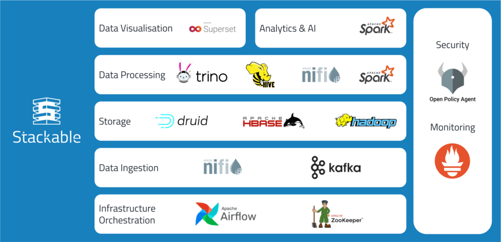

### 1.1 배포준비
Stackable Data Operator는 EKS 환경에서 배포합니다.

cloudfront를 통해 EKS를 배포하며, 배포 환경은 다음과 같습니다.
- worker 3대
- EKS Version : v1.26.10-eks-e71965b (2023/11/19일 기준 Stackable이 지원하는 latest version이 1.26)
- Instance Type : c5.2xlarge
    - [cloudfront_yaml](./eks-oneclick.yaml)

[cloudfront_yaml](./eks-oneclick.yaml) 링크에 있는 yaml을 통해 EKS를 프로비저닝 합니다.

```bash
# CloudFormation 스택 배포
## usecase
aws cloudformation deploy --template-file eks-oneclick.yaml --stack-name myeks --parameter-overrides KeyName=<My SSH Keyname> SgIngressSshCidr=<My Home Public IP Address>/32 MyIamUserAccessKeyID=<IAM User의 액세스키> MyIamUserSecretAccessKey=<IAM User의 시크릿 키> ClusterBaseName='<eks 이름>' --region ap-northeast-2
## 실사용 명령어
aws cloudformation deploy --template-file eks-oneclick.yaml --stack-name myeks --parameter-overrides KeyName=myKey SgIngressSshCidr=$(curl -s ipinfo.io/ip)/32  MyIamUserAccessKeyID=AKIA5... MyIamUserSecretAccessKey='CVNa2...' ClusterBaseName=myeks --region ap-northeast-2

# CloudFormation 스택 배포 완료 후 작업용 EC2 IP 출력
aws cloudformation describe-stacks --stack-name myeks --query 'Stacks[*].Outputs[0].OutputValue' --output text

# 작업용 EC2 SSH 접속
ssh -i ~/.ssh/myKey.pem ubuntu@$(aws cloudformation describe-stacks --stack-name myeks --query 'Stacks[*].Outputs[0].OutputValue' --output text)

# 배포상태 확인
kubectl get node --label-columns=node.kubernetes.io/instance-type
NAME                                               STATUS   ROLES    AGE   VERSION                INSTANCE-TYPE
ip-192-168-1-147.ap-northeast-2.compute.internal   Ready    <none>   13m   v1.26.10-eks-e71965b   c5.2xlarge
ip-192-168-2-113.ap-northeast-2.compute.internal   Ready    <none>   13m   v1.26.10-eks-e71965b   c5.2xlarge
ip-192-168-3-164.ap-northeast-2.compute.internal   Ready    <none>   13m   v1.26.10-eks-e71965b   c5.2xlarge
```

AWS LoadBalancer Controller, ExternalDNS를 설치합니다.
```bash
# 노드 PrivateIP 변수 지정
N1=$(kubectl get node --label-columns=topology.kubernetes.io/zone --selector=topology.kubernetes.io/zone=ap-northeast-2a -o jsonpath={.items[0].status.addresses[0].address})
N2=$(kubectl get node --label-columns=topology.kubernetes.io/zone --selector=topology.kubernetes.io/zone=ap-northeast-2b -o jsonpath={.items[0].status.addresses[0].address})
N3=$(kubectl get node --label-columns=topology.kubernetes.io/zone --selector=topology.kubernetes.io/zone=ap-northeast-2c -o jsonpath={.items[0].status.addresses[0].address})
echo "export N1=$N1" >> /etc/profile
echo "export N2=$N2" >> /etc/profile
echo "export N3=$N3" >> /etc/profile
echo $N1, $N2, $N3

# 노드 보안그룹에 eksctl-host 에서 노드(파드)에 접속 가능하게 룰(Rule) 추가 설정
NGSGID=$(aws ec2 describe-security-groups --filters Name=group-name,Values='*ng1*' --query "SecurityGroups[*].[GroupId]" --output text)
aws ec2 authorize-security-group-ingress --group-id $NGSGID --protocol '-1' --cidr 192.168.1.100/32

# AWS LoadBalancer Controller
helm repo add eks https://aws.github.io/eks-charts
helm install aws-load-balancer-controller eks/aws-load-balancer-controller -n kube-system --set clusterName=$CLUSTER_NAME \
  --set serviceAccount.create=false --set serviceAccount.name=aws-load-balancer-controller

# ExternalDNS 컨트롤러 설치 
MyDomain=<자신의 도메인>
echo "export MyDomain=<자신의 도메인>" >> /etc/profile
MyDomain=jinseongmain.link
echo "export MyDomain=jinseongmain.link" >> /etc/profile
MyDnsHostedZoneId=$(aws route53 list-hosted-zones-by-name --dns-name "${MyDomain}." --query "HostedZones[0].Id" --output text)
echo $MyDomain, $MyDnsHostedZoneId
curl -s -O https://raw.githubusercontent.com/cloudneta/cnaeblab/master/_data/externaldns.yaml
MyDomain=$MyDomain MyDnsHostedZoneId=$MyDnsHostedZoneId envsubst < externaldns.yaml | kubectl apply -f -

# ebs gp3 스토리지 클래스 생성 : 파일시스템 xfs
kubectl patch sc gp2 -p '{"metadata": {"annotations":{"storageclass.kubernetes.io/is-default-class":"false"}}}'
kubectl apply -f https://raw.githubusercontent.com/gasida/DOIK/main/1/gp3-sc-xfs.yaml

# efs 스토리지 클래스 생성 : 실습 편리를 위해서 삭제 정책은 Delete(기본값)을 사용
cat <<EOT > efs-sc.yaml
kind: StorageClass
apiVersion: storage.k8s.io/v1
metadata: 
  name: efs-sc
provisioner: efs.csi.aws.com
parameters: 
  provisioningMode: efs-ap
  fileSystemId: $EFS_ID
  directoryPerms: "700"
EOT
kubectl apply -f efs-sc.yaml
```

#### 1.1.1 보안그룹 허용
Stackable을 통해 배포된 minio 등에 접근할 수 있도록 EKS 각 노드의 Security group의 자신의 집 public IP를 허용합니다.

```bash
# 워커노드의 '#-nodegroup-ng1-remoteAccess' 보안 그룹에 자신의 집 공인IP 접속 허용 추가
NGSGID=$(aws ec2 describe-security-groups --filters Name=group-name,Values='*ng1*' --query "SecurityGroups[*].[GroupId]" --output text)
aws ec2 authorize-security-group-ingress --group-id $NGSGID --protocol '-1' --cidr $(curl -s ipinfo.io/ip)/32
```
## 2. Stackable 설치
### 2.1 Stackable Architecture


Stackable은 크게 3가지 layer로 나뉩니다.

#### 1. Operators layer
Stackable에서 배포관리할 수 있는 data product들의 operator들이 존재합니다.
```operator``` 또는 ```release``` 명령어를 통해서 operator를 설치할 수 있습니다.
#### 2. Stack layer
Operators의 상위 계층 입니다. 해당 계층에선 데이터 관련 Operator들의 Third-Party Service(minio, PG) 와 같은 서비스를 같이 배포하는 등의 기능을 하게 됩니다.

```stack``` 명령어를 통해 stack이 설치되며, stack은 release에 의존적이기에 스택을 설치할 때 필요한 릴리스도 자동으로 설치됩니다. 이는 사용자가 별도로 릴리스를 관리할 필요 없이, 스택을 설치하는 과정에서 필요한 모든 구성 요소가 자동으로 설정되도록 함을 의미합니다.

예를들어 Trino(쿼리수행) 및 Superset(시각화 툴)을 같이 배포할 수 있습니다.

#### 3. Demo layer
Data 관리 관련 파이프라인들을 한번에 통합설치및 관리를 도와주는 계층입니다.

예를들어 airflow 파이프라인을 Demo 계층에서 통합설치를 도와주게 됩니다.
- [Demo layer 지원 파이프라인 종류 링크, 여기서 다양한 Demo를 확인할 수 있으며, 하나하나 따라해보면 다양한 데이터파이프라인을 손쉽게 배포할 수 있습니다.](https://docs.stackable.tech/home/stable/demos/)

데이터 파이프라인의 Best Pratice형태의 config를 한번에 제공해주기 때문에, 데이터관리자가 아니라 하더라도 데브옵스나 인프라 엔지니어가 데이터 파이프라인을 쉽게 구축하고 관리할 수 있습니다.

### 2.2 Stackable 설치
Stackable을 사용하는 방법은 두가지가 있습니다.
1. Web 기반 Stackable plateform 
    - preview 라 차후에 사용하면 좋음
2. ```stackablectl```
    - 사용할 예정

해당 문서에는 ```stackablect```로 Stackable을 사용합니다.

프로비저닝해둔 EKS에 Stackable을 설치합니다.
- stackable은 stackablectl 명령어로 관리하게 됩니다. 따라서 바이너리를 설치한후 사용하면 됩니다.

```bash
# 바이너리 다운로드
#curl -L -o stackablectl https://github.com/stackabletech/stackable-cockpit/releases/download/stackablectl-1.0.0-rc2/stackablectl-x86_64-unknown-linux-gnu
curl -L -o stackablectl https://github.com/stackabletech/stackable-cockpit/releases/download/stackablectl-1.0.0-rc3/stackablectl-x86_64-unknown-linux-gnu
chmod +x stackablectl
mv stackablectl /usr/local/bin

# 확인
stackablectl -h
stackablectl -V
stackablectl 1.0.0-rc3

stackablectl release list
...

# 자동완성
wget https://raw.githubusercontent.com/stackabletech/stackable-cockpit/main/extra/completions/stackablectl.bash
mv stackablectl.bash /etc/bash_completion.d/

# stackalbe 제공 오퍼레이터
stackablectl operator list

# stackalbe 제공 스택
stackablectl stack list

# stackalbe 제공 데모 : Stackable release 설치 > 스택 구성 > 데이터 구성
stackablectl demo list
```

## 3. stackable Demo 직접 사용해보기 - Trino-Taxi-Data
- [Trino-Taxi-Data Demo 공식 Docs](https://docs.stackable.tech/home/stable/demos/trino-taxi-data)

Trino-Taxi-Data Demo는 2.5년동안의 뉴욕 택시 데이터를 S3 bucket으로 갖고와서, Trino table을 만들어 쿼리 결과를 Superset dashboard에 반영하는 예제 입니다.

해당 Demo를 수행하기 위한 최소사양은 다음과 같습니다.
- 7 cpu units (core/hyperthread)
- 16GiB memory
- 28GiB disk storage

설치되는 데이터 관리 툴은 다음과 같습니다.
- **Superset**: 모던 데이터를 시각화하는 플렛폼. 이 Demo에서는 Trino를 통한 SQL 쿼리 결과를 데시보드에서 확인하기 위해 사용합니다.
- **Trino**: 사용자의 데이터 universe에 빅데이터 분석을 위한 SQL query engine. 분산형 SQL 쿼리 엔진입니다 (SQL 쿼리를 분산해서 빠르게 결과를 반환). 이 Demo에서는 data에 SQL로 접근하기 위해 사용합니다. 
- **MinIO**: S3 object storage 플렛폼. 이 Demo에서는 모든 사용 데이터들을 저장하기 위해 사용합니다.
- **Hive metastore**: Apache Hive와 다른 서비스들의 메타데이터 관련을 저장하는 서비스. 이 Demo에서는 Trino의 메타데이터를 저장하기 위해 사용합니다.
- **Open policy agent (OPA)**: 클라우드 네이티브 환경에 적합한 오픈소스 이며, stack 전반에 걸쳐 policy를 통합하는 범용 policy engine 입니다. 이 Demo에서는 Trino의 권한 부여자로 사용하여 어떤 사용자가 어떤 데이터를 쿼리할 수 있는지 결정합니다.

Demo의 아키텍처는 다음과 같습니다.

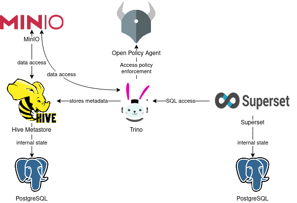

### 3.1 Demo 정보 확인
```bash
# Demo 정보 확인
## Demo 리스트 확인
stackablectl demo list
stackablectl demo list -o json | jq
## trino-taxi-data demo 정보 확인
stackablectl demo describe trino-taxi-data
 Demo             trino-taxi-data                                                                                              
 Description      Demo loading 2.5 years of New York taxi data into S3 bucket, creating a Trino table and a Superset dashboard 
 Documentation    https://docs.stackable.tech/stackablectl/stable/demos/trino-taxi-data.html                                   
 Stackable stack  trino-superset-s3                                                                                            
 Labels           trino, superset, minio, s3, ny-taxi-data
```

가져오는 데이터는 다음과 같습니다.
- [뉴욕 택시 데이터](https://www.nyc.gov/site/tlc/about/tlc-trip-record-data.page)

### 3.2 Demo 수행
```bash
# [터미널] 모니터링
## Stackable을 통해 배포되는 파드, pvc, job, svc 를 확인해 봅니다.
watch -d "kubectl get pod -n stackable-operators;echo;kubectl get pod,job,svc,pvc"

# 데모 설치 : 데이터셋 다운로드 job 포함 8분 정도 소요
stackablectl demo install trino-taxi-data

# 설치 확인
## Stackable 또한 크게는 helm chart로 각 데이터 product를 설치하는데 사용하게 됩니다.
helm list -n stackable-operators
helm list

kubectl top node
kubectl top pod -A

kubectl get-all -n default
kubectl get deploy,sts,pod
kubectl get job
kubectl get job load-ny-taxi-data -o yaml | kubectl neat | cat -l yaml
kubectl get job create-ny-taxi-data-table-in-trino -o yaml | kubectl neat | cat -l yaml
kubectl get job setup-superset -o yaml | kubectl neat | cat -l yaml
kubectl get job superset -o yaml | kubectl neat | cat -l yaml

## Stackable은 secrets.stackable.tech 라는 storageClass도 같이 배포되는데, 여기에 값이 노출되면 안되는(계정정보 등) 값들이 저장되게 됩니다.
$ kubectl get sc
NAME                     PROVISIONER              RECLAIMPOLICY   VOLUMEBINDINGMODE      ALLOWVOLUMEEXPANSION   AGE
efs-sc                   efs.csi.aws.com          Delete          Immediate              false                  71m
gp2                      kubernetes.io/aws-ebs    Delete          WaitForFirstConsumer   false                  109m
gp3 (default)            ebs.csi.aws.com          Delete          WaitForFirstConsumer   true                   72m
secrets.stackable.tech   secrets.stackable.tech   Delete          Immediate              false                  23m

## pvc나 pv를 확인해보면, 특정 리소스들은 secrets.stackable.tech storageclass에 저장되는것을 확인할 수 있습니다.
kubectl get sc,pvc,pv
kubectl get pv |grep gp3
kubectl get sc secrets.stackable.tech -o yaml | kubectl neat | cat -l yaml
kubectl df-pv
kubectl get svc,ep,endpointslices
kubectl get cm,secret

## 설치되는 서드파티 서비스(minio, hive, 등) 에 대한 config들은, configmap에 저장되게 됩니다.
kubectl get cm minio -o yaml | kubectl neat | cat -l yaml
kubectl describe cm minio

kubectl get cm hive-metastore-default -o yaml | kubectl neat | cat -l yaml
kubectl get cm hive -o yaml | kubectl neat | cat -l yaml
kubectl get cm postgresql-hive-extended-configuration -o yaml | kubectl neat | cat -l yaml

kubectl get cm trino-coordinator-default -o yaml | kubectl neat | cat -l yaml
kubectl get cm trino-coordinator-default-catalog -o yaml | kubectl neat | cat -l yaml
kubectl get cm trino-worker-default -o yaml | kubectl neat | cat -l yaml
kubectl get cm trino-worker-default-catalog -o yaml | kubectl neat | cat -l yaml
kubectl get cm create-ny-taxi-data-table-in-trino-script -o yaml | kubectl neat | cat -l yaml

kubectl get cm superset-node-default -o yaml | kubectl neat | cat -l yaml
kubectl get cm superset-init-db -o yaml | kubectl neat | cat -l yaml
kubectl get cm setup-superset-script -o yaml | kubectl neat | cat -l yaml

## 설치되는 서드파티 서비스(minio, hive, 등) 에 대한 secret들은, secret에 저장되게 됩니다.
kubectl get secret minio -o yaml | kubectl neat | cat -l yaml
kubectl get secret minio-s3-credentials -o yaml | kubectl neat | cat -l yaml
kubectl get secret postgresql-hive -o yaml | kubectl neat | cat -l yaml
kubectl get secret postgresql-superset -o yaml | kubectl neat | cat -l yaml
kubectl get secret trino-users -o yaml | kubectl neat | cat -l yaml
kubectl get secret trino-internal-secret -o yaml | kubectl neat | cat -l yaml
kubectl get secret superset-credentials -o yaml | kubectl neat | cat -l yaml
kubectl get secret superset-mapbox-api-key -o yaml | kubectl neat | cat -l yaml

## Stackable의 crd list
$ kubectl get crd | grep stackable
authenticationclasses.authentication.stackable.tech   2023-11-22T14:52:26Z
druidconnections.superset.stackable.tech              2023-11-22T14:53:22Z
hiveclusters.hive.stackable.tech                      2023-11-22T14:52:43Z
opaclusters.opa.stackable.tech                        2023-11-22T14:53:00Z
s3buckets.s3.stackable.tech                           2023-11-22T14:52:26Z
s3connections.s3.stackable.tech                       2023-11-22T14:52:26Z
secretclasses.secrets.stackable.tech                  2023-11-22T14:53:18Z
supersetclusters.superset.stackable.tech              2023-11-22T14:53:22Z
supersetdbs.superset.stackable.tech                   2023-11-22T14:53:22Z
trinocatalogs.trino.stackable.tech                    2023-11-22T14:53:40Z
trinoclusters.trino.stackable.tech                    2023-11-22T14:53:40Z

## Stackable의 cr list
kubectl explain trinoclusters
kubectl describe trinoclusters.trino.stackable.tech

kubectl get hivecluster,opacluster,s3connection
kubectl get supersetcluster,supersetdb
kubectl get trinocluster,trinocatalog

kubectl get hivecluster -o yaml | kubectl neat | cat -l yaml
kubectl get s3connection -o yaml | kubectl neat | cat -l yaml
kubectl get supersetcluster -o yaml | kubectl neat | cat -l yaml
kubectl get supersetdb -o yaml | kubectl neat | cat -l yaml
kubectl get trinocluster -o yaml | kubectl neat | cat -l yaml
kubectl get trinocatalog -o yaml | kubectl neat | cat -l yaml


# 배포 스택 정보 확인 : 바로 확인 하지 말고, 설치 완료 후 아래 확인 할 것 - Endpoint(접속 주소 정보), Conditions(상태 정보)
$ stackablectl stacklet list
┌────────────┬──────────────────────────────────┬────────────┬─────────────────────────────────────────────────┬─────────────────────────────────┐
│ PRODUCT    ┆ NAME                             ┆ NAMESPACE  ┆ ENDPOINTS                                       ┆ CONDITIONS                      │
╞════════════╪══════════════════════════════════╪════════════╪═════════════════════════════════════════════════╪═════════════════════════════════╡
│ hive       ┆ hive                             ┆ default    ┆                                                 ┆ Available, Reconciling, Running │
├╌╌╌╌╌╌╌╌╌╌╌╌┼╌╌╌╌╌╌╌╌╌╌╌╌╌╌╌╌╌╌╌╌╌╌╌╌╌╌╌╌╌╌╌╌╌╌┼╌╌╌╌╌╌╌╌╌╌╌╌┼╌╌╌╌╌╌╌╌╌╌╌╌╌╌╌╌╌╌╌╌╌╌╌╌╌╌╌╌╌╌╌╌╌╌╌╌╌╌╌╌╌╌╌╌╌╌╌╌╌┼╌╌╌╌╌╌╌╌╌╌╌╌╌╌╌╌╌╌╌╌╌╌╌╌╌╌╌╌╌╌╌╌╌┤
│ opa        ┆ opa                              ┆ default    ┆                                                 ┆ Available, Reconciling, Running │
├╌╌╌╌╌╌╌╌╌╌╌╌┼╌╌╌╌╌╌╌╌╌╌╌╌╌╌╌╌╌╌╌╌╌╌╌╌╌╌╌╌╌╌╌╌╌╌┼╌╌╌╌╌╌╌╌╌╌╌╌┼╌╌╌╌╌╌╌╌╌╌╌╌╌╌╌╌╌╌╌╌╌╌╌╌╌╌╌╌╌╌╌╌╌╌╌╌╌╌╌╌╌╌╌╌╌╌╌╌╌┼╌╌╌╌╌╌╌╌╌╌╌╌╌╌╌╌╌╌╌╌╌╌╌╌╌╌╌╌╌╌╌╌╌┤
│ superset   ┆ superset                         ┆ default    ┆ external-superset   http://<public-ip>:30445    ┆ Available, Reconciling, Running │
├╌╌╌╌╌╌╌╌╌╌╌╌┼╌╌╌╌╌╌╌╌╌╌╌╌╌╌╌╌╌╌╌╌╌╌╌╌╌╌╌╌╌╌╌╌╌╌┼╌╌╌╌╌╌╌╌╌╌╌╌┼╌╌╌╌╌╌╌╌╌╌╌╌╌╌╌╌╌╌╌╌╌╌╌╌╌╌╌╌╌╌╌╌╌╌╌╌╌╌╌╌╌╌╌╌╌╌╌╌╌┼╌╌╌╌╌╌╌╌╌╌╌╌╌╌╌╌╌╌╌╌╌╌╌╌╌╌╌╌╌╌╌╌╌┤
│ trino      ┆ trino                            ┆ default    ┆ coordinator-metrics <public-ip>:32572           ┆ Available, Reconciling, Running │
│            ┆                                  ┆            ┆ coordinator-https   https://<public-ip>:32307   ┆                                 │
├╌╌╌╌╌╌╌╌╌╌╌╌┼╌╌╌╌╌╌╌╌╌╌╌╌╌╌╌╌╌╌╌╌╌╌╌╌╌╌╌╌╌╌╌╌╌╌┼╌╌╌╌╌╌╌╌╌╌╌╌┼╌╌╌╌╌╌╌╌╌╌╌╌╌╌╌╌╌╌╌╌╌╌╌╌╌╌╌╌╌╌╌╌╌╌╌╌╌╌╌╌╌╌╌╌╌╌╌╌╌┼╌╌╌╌╌╌╌╌╌╌╌╌╌╌╌╌╌╌╌╌╌╌╌╌╌╌╌╌╌╌╌╌╌┤
│ grafana    ┆ kube-prometheus-stack-grafana    ┆ monitoring ┆                                                 ┆                                 │
├╌╌╌╌╌╌╌╌╌╌╌╌┼╌╌╌╌╌╌╌╌╌╌╌╌╌╌╌╌╌╌╌╌╌╌╌╌╌╌╌╌╌╌╌╌╌╌┼╌╌╌╌╌╌╌╌╌╌╌╌┼╌╌╌╌╌╌╌╌╌╌╌╌╌╌╌╌╌╌╌╌╌╌╌╌╌╌╌╌╌╌╌╌╌╌╌╌╌╌╌╌╌╌╌╌╌╌╌╌╌┼╌╌╌╌╌╌╌╌╌╌╌╌╌╌╌╌╌╌╌╌╌╌╌╌╌╌╌╌╌╌╌╌╌┤
│ minio      ┆ minio-console                    ┆ default    ┆ http                http://<public-ip>:30856    ┆                                 │
├╌╌╌╌╌╌╌╌╌╌╌╌┼╌╌╌╌╌╌╌╌╌╌╌╌╌╌╌╌╌╌╌╌╌╌╌╌╌╌╌╌╌╌╌╌╌╌┼╌╌╌╌╌╌╌╌╌╌╌╌┼╌╌╌╌╌╌╌╌╌╌╌╌╌╌╌╌╌╌╌╌╌╌╌╌╌╌╌╌╌╌╌╌╌╌╌╌╌╌╌╌╌╌╌╌╌╌╌╌╌┼╌╌╌╌╌╌╌╌╌╌╌╌╌╌╌╌╌╌╌╌╌╌╌╌╌╌╌╌╌╌╌╌╌┤
│ prometheus ┆ kube-prometheus-stack-prometheus ┆ monitoring ┆                                                 ┆                                 │
└────────────┴──────────────────────────────────┴────────────┴─────────────────────────────────────────────────┴─────────────────────────────────┘

# 배포 스택의 product 접속 계정 정보 확인 : 대부분 admin / adminadmin 계정 정보 사용
stackablectl stacklet credentials superset superset
stackablectl stacklet credentials minio minio-console  # admin / adminadmin 계정 정보 출력 안됨... 아직은 rc 단계라 그런듯

# 배포 오퍼레이터 확인
$ stackablectl operator installed
┌───────────────────┬─────────┬─────────────────────┬──────────┬─────────────────────────────────────────┐
│ OPERATOR          ┆ VERSION ┆ NAMESPACE           ┆ STATUS   ┆ LAST UPDATED                            │
╞═══════════════════╪═════════╪═════════════════════╪══════════╪═════════════════════════════════════════╡
│ commons-operator  ┆ 23.7.0  ┆ stackable-operators ┆ deployed ┆ 2023-11-22 23:52:28.638388974 +0900 KST │
├╌╌╌╌╌╌╌╌╌╌╌╌╌╌╌╌╌╌╌┼╌╌╌╌╌╌╌╌╌┼╌╌╌╌╌╌╌╌╌╌╌╌╌╌╌╌╌╌╌╌╌┼╌╌╌╌╌╌╌╌╌╌┼╌╌╌╌╌╌╌╌╌╌╌╌╌╌╌╌╌╌╌╌╌╌╌╌╌╌╌╌╌╌╌╌╌╌╌╌╌╌╌╌╌┤
│ hive-operator     ┆ 23.7.0  ┆ stackable-operators ┆ deployed ┆ 2023-11-22 23:52:45.925491338 +0900 KST │
├╌╌╌╌╌╌╌╌╌╌╌╌╌╌╌╌╌╌╌┼╌╌╌╌╌╌╌╌╌┼╌╌╌╌╌╌╌╌╌╌╌╌╌╌╌╌╌╌╌╌╌┼╌╌╌╌╌╌╌╌╌╌┼╌╌╌╌╌╌╌╌╌╌╌╌╌╌╌╌╌╌╌╌╌╌╌╌╌╌╌╌╌╌╌╌╌╌╌╌╌╌╌╌╌┤
│ opa-operator      ┆ 23.7.0  ┆ stackable-operators ┆ deployed ┆ 2023-11-22 23:53:03.131909961 +0900 KST │
├╌╌╌╌╌╌╌╌╌╌╌╌╌╌╌╌╌╌╌┼╌╌╌╌╌╌╌╌╌┼╌╌╌╌╌╌╌╌╌╌╌╌╌╌╌╌╌╌╌╌╌┼╌╌╌╌╌╌╌╌╌╌┼╌╌╌╌╌╌╌╌╌╌╌╌╌╌╌╌╌╌╌╌╌╌╌╌╌╌╌╌╌╌╌╌╌╌╌╌╌╌╌╌╌┤
│ secret-operator   ┆ 23.7.0  ┆ stackable-operators ┆ deployed ┆ 2023-11-22 23:53:20.117534682 +0900 KST │
├╌╌╌╌╌╌╌╌╌╌╌╌╌╌╌╌╌╌╌┼╌╌╌╌╌╌╌╌╌┼╌╌╌╌╌╌╌╌╌╌╌╌╌╌╌╌╌╌╌╌╌┼╌╌╌╌╌╌╌╌╌╌┼╌╌╌╌╌╌╌╌╌╌╌╌╌╌╌╌╌╌╌╌╌╌╌╌╌╌╌╌╌╌╌╌╌╌╌╌╌╌╌╌╌┤
│ superset-operator ┆ 23.7.0  ┆ stackable-operators ┆ deployed ┆ 2023-11-22 23:53:25.520992465 +0900 KST │
├╌╌╌╌╌╌╌╌╌╌╌╌╌╌╌╌╌╌╌┼╌╌╌╌╌╌╌╌╌┼╌╌╌╌╌╌╌╌╌╌╌╌╌╌╌╌╌╌╌╌╌┼╌╌╌╌╌╌╌╌╌╌┼╌╌╌╌╌╌╌╌╌╌╌╌╌╌╌╌╌╌╌╌╌╌╌╌╌╌╌╌╌╌╌╌╌╌╌╌╌╌╌╌╌┤
│ trino-operator    ┆ 23.7.0  ┆ stackable-operators ┆ deployed ┆ 2023-11-22 23:53:43.689183591 +0900 KST │
└───────────────────┴─────────┴─────────────────────┴──────────┴─────────────────────────────────────────┘
```
### 3.3 Demo 결과 확인
#### 3.3.1 minio 확인
배포가 완료된 이후, stack list를 확인했을 때 노출되는 minio public IP로 접근해 봅니다.
- 접근이 안될 경우, [보안그룹 허용](#111-보안그룹-허용) 을 따라가서 worker node의 보안그룹에 자신 위치의 public ip를 allow 합니다.
- 물론 minio 등을 ingress로 열어서 externalDNS 어노테이션을 등록하여 들어가도 문제는 없습니다.
- minio default 계정은 다음과 같습니다.
    - **ID** : admin
    - **PWD** : adminadmin

bucket demo가 하나 생성되어 있습니다 !. 들어가보면..
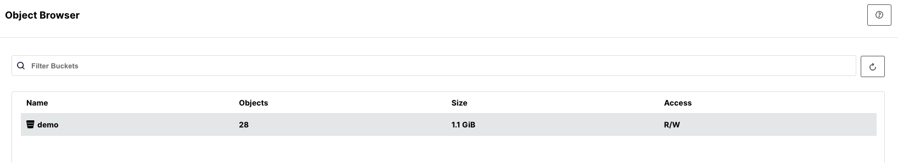

Taxi 데이터가 저장되어잇는것을 확인할 수 있습니다.
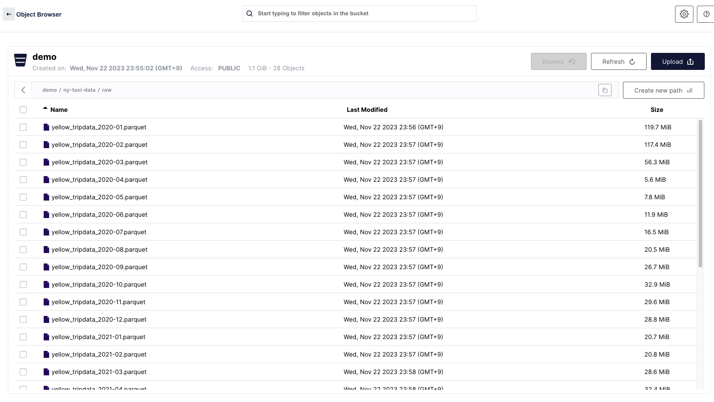

- minio를 접근해서 데이터를 확인해보면, 특정 일자에 택시데이터 용량이 . 좀적은걸 확인할 수 있습니다.
    - 이때 코로나라 적음

저장된 이유는, Stackable Demo를 배포할 때, ```load-ny-taxi-data``` job이라는 특정 batch Job이 돌면서 외부에 있는 taxi data를 curl로 꺼내와서 minio에 저장했기 때문입니다.
- ```load-ny-taxi-data``` 의 모습
```yaml
$ kubectl get job load-ny-taxi-data -o yaml | kubectl neat | cat -l yaml -p
apiVersion: batch/v1
kind: Job
metadata:
  annotations:
    batch.kubernetes.io/job-tracking: ""
  labels:
    controller-uid: 17c8b4af-0c2a-4451-aa4f-a0d65e169676
    job-name: load-ny-taxi-data
  name: load-ny-taxi-data
  namespace: default
spec:
  backoffLimit: 50
  completionMode: NonIndexed
  completions: 1
  parallelism: 1
  selector:
    matchLabels:
      controller-uid: 17c8b4af-0c2a-4451-aa4f-a0d65e169676
  suspend: false
  template:
    metadata:
      creationTimestamp: null
      labels:
        controller-uid: 17c8b4af-0c2a-4451-aa4f-a0d65e169676
        job-name: load-ny-taxi-data
    spec:
      containers:
      - command:
        - bash
        - -c
        - cd /tmp && for month in 2020-01 2020-02 2020-03 2020-04 2020-05 2020-06
          2020-07 2020-08 2020-09 2020-10 2020-11 2020-12 2021-01 2021-02 2021-03
          2021-04 2021-05 2021-06 2021-07 2021-08 2021-09 2021-10 2021-11 2021-12
          2022-01 2022-02 2022-03 2022-04; do curl -O https://repo.stackable.tech/repository/misc/ny-taxi-data/yellow_tripdata_$month.parquet # curl로 다운로드 받음
          && mc --insecure alias set minio http://minio:9000/ $(cat /minio-s3-credentials/accessKey) # minio 버킷에 복사 저장
          $(cat /minio-s3-credentials/secretKey) && mc cp yellow_tripdata_$month.parquet
          minio/demo/ny-taxi-data/raw/; done
        image: bitnami/minio:2022-debian-10
        imagePullPolicy: IfNotPresent
        name: load-ny-taxi-data
        terminationMessagePath: /dev/termination-log
        terminationMessagePolicy: File
        volumeMounts:
        - mountPath: /minio-s3-credentials
          name: minio-s3-credentials
      dnsPolicy: ClusterFirst
      restartPolicy: OnFailure
      schedulerName: default-scheduler
      terminationGracePeriodSeconds: 30
      volumes:
      - name: minio-s3-credentials
        secret:
          defaultMode: 420
          secretName: minio-s3-credentials
```

이 Demo의 전체 job은 총 4개가 돌아가게 됩니다.
```bash
$ kubectl get job
NAME                                 COMPLETIONS   DURATION   AGE
create-ny-taxi-data-table-in-trino   1/1           3m49s      17m
load-ny-taxi-data                    1/1           3m2s       17m
setup-superset                       1/1           2m         17m
superset                             1/1           73s        18m
```

#### 3.3.2 trino 확인
trino web ui에도 접근해봅시다.
- trino default 계정은 다음과 같습니다.
    - **ID** : admin
    - **PWD** : adminadmin

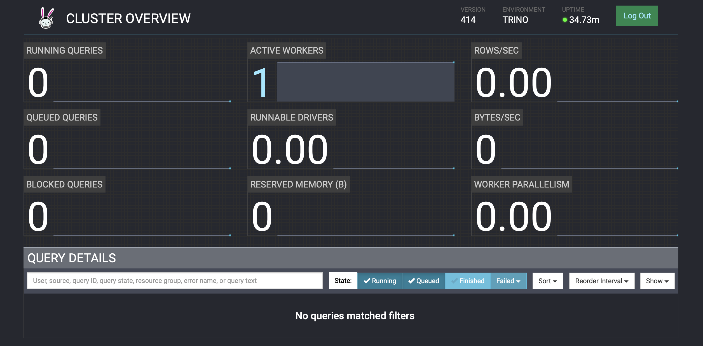

- 그리고 Active Workers를 클릭하여 Active 상태의 Worker 정보를 확인해 봅니다.

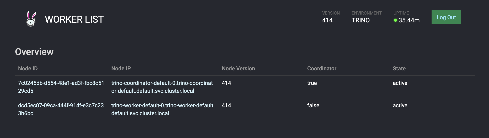

- Active한 워커 하나를 클릭해서, 상세정보를 확인해 봅니다.

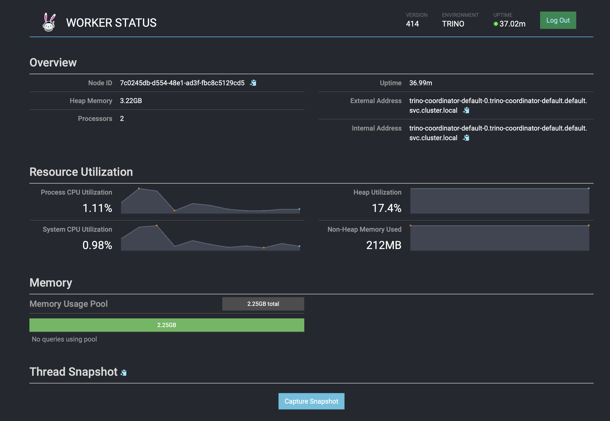

- trino의 config를 확인해 봅니다.
```bash
# trino의 svc,ep를 확인합니다.
kubectl get svc,ep trino-coordinator

# trino측 job을 확인합니다.
kubectl get job create-ny-taxi-data-table-in-trino -o yaml | kubectl neat | cat -l yaml

kubectl get trinocluster,trinocatalog
kubectl get trinocluster -o yaml | kubectl neat | cat -l yaml -p
kubectl get trinocatalog -o yaml | kubectl neat | cat -l yaml -p
...
spec:
    connector:      # hive, s3 와 연결하는 부분
      hive:
        metastore:
          configMap: hive
        s3:
          reference: minio
...

kubectl get cm trino-coordinator-default -o yaml | kubectl neat | cat -l yaml
kubectl get cm trino-coordinator-default-catalog -o yaml | kubectl neat | cat -l yaml -p
...
data:
  hive.properties: | # hive properties
    connector.name=hive
    hive.metastore.uri=thrift\://hive-metastore-default-0.hive-metastore-default.default.svc.cluster.local\:9083
    hive.s3.aws-access-key=${ENV\:CATALOG_HIVE_HIVE_S3_AWS_ACCESS_KEY} # minio accesskey
    hive.s3.aws-secret-key=${ENV\:CATALOG_HIVE_HIVE_S3_AWS_SECRET_KEY} # minio secret key
    hive.s3.endpoint=http\://minio\:9000
    hive.s3.path-style-access=true
    hive.s3.ssl.enabled=false
    hive.security=allow-all
...

# configmap을 확인해봅니다.
kubectl get cm trino-worker-default -o yaml | kubectl neat | cat -l yaml
kubectl get cm trino-worker-default-catalog -o yaml | kubectl neat | cat -l yaml
kubectl get cm create-ny-taxi-data-table-in-trino-script -o yaml | kubectl neat | cat -l yaml

# trino 관련 secret을 확인합니다.
kubectl get secret trino-users -o yaml | kubectl neat | cat -l yaml
kubectl get secret trino-internal-secret -o yaml | kubectl neat | cat -l yaml
```

- trino-operator를 통해서 trino의 active worker를 2대로 증설해 봅니다.
```bash
# 오퍼레이터 로깅 수준을 높여보자..
kubectl logs -n stackable-operators -l app.kubernetes.io/instance=trino-operator -f

# trino worker 2대로 증설
kubectl get trinocluster trino -o json | cat -l json -p

# trino worker 2대로 증설
kubectl patch trinocluster trino --type='json' -p='[{"op": "replace", "path": "/spec/workers/roleGroups/default/replicas", "value":2}]'
```

- trino ui상 active된 worker가 2대로 증설된것을 확인할 수 있습니다.

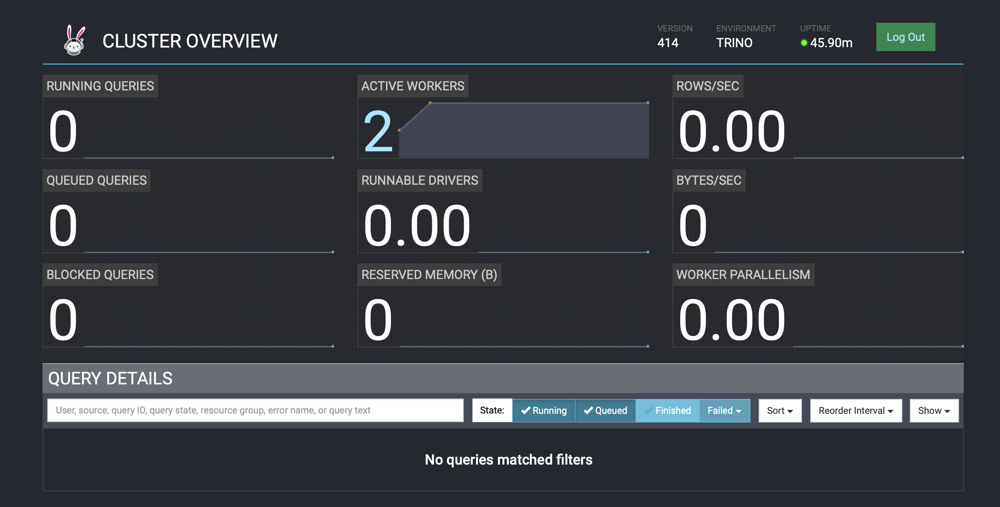

- 다시 1로 변경하여 active worker를 스케일 인 합니다.

```bash
# trino worker 1대로 축소
kubectl patch trinocluster trino --type='json' -p='[{"op": "replace", "path": "/spec/workers/roleGroups/default/replicas", "value":1}]'
```

#### 3.3.3 superset 확인
superset web ui에도 접근해봅시다.
- superset default 계정은 다음과 같습니다.
    - **ID** : admin
    - **PWD** : adminadmin

- 로그인한뒤 아래 화면을 확인할 수 있습니다.
    - Taxi data 라는 dashboard가 생성되어져 있는걸 확인할 수 있습니다.

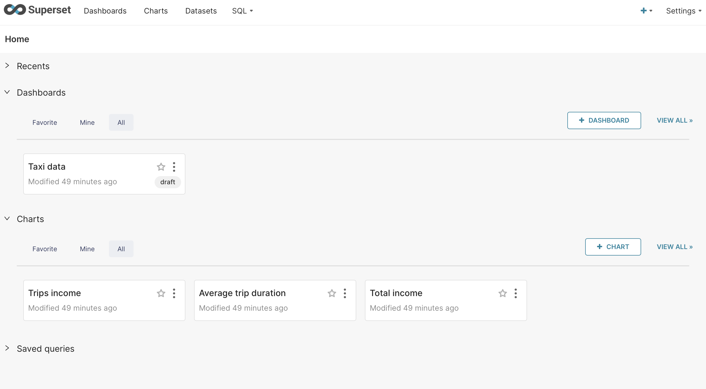

- Taxi data dashboard를 클릭해 봅니다.
    - 클릭 하는 순간 trino를 확인해보면, superset dashboard의 값을 가져오기 위해 trino가 쿼리를 수행하는 모습을 볼 수 있습니다.
    - 만약 trino의 active worker가 여러개라면, 해당 쿼리가 병렬로 수행됨으로써 더 빠르게 결과를 받아올 수 있습니다.

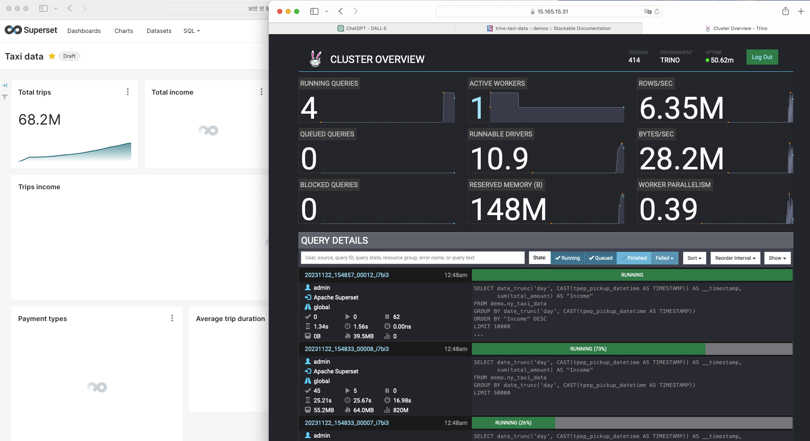

- 쿼리 수행이 완료되면, trino는 이전과 동일한 상태로 복구되고, superset의 dashboard에는 쿼리 결과값이 시각화되어 보여지게 됩니다.
- 먼저 trino 상태를 확인합니다.

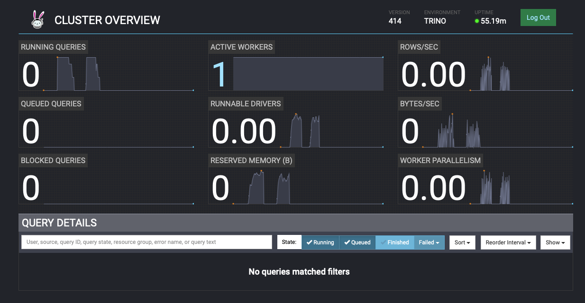

- superset dashboard를 확인합니다. 
    - dashboard로 쿼리 결과를 확인합니다.
        - Trips income을 확인해보면, 2020/03/10 이후로 승객수가 줄어든것을 확인할 수 있는데, 이것은 코로나 때문에 승객수가 줄어든것
        - Payment types으로 승객들이 택시요금을 결제할 때 어떤것을 제일 많이 사용하는지에 대해 확인할 수 있음

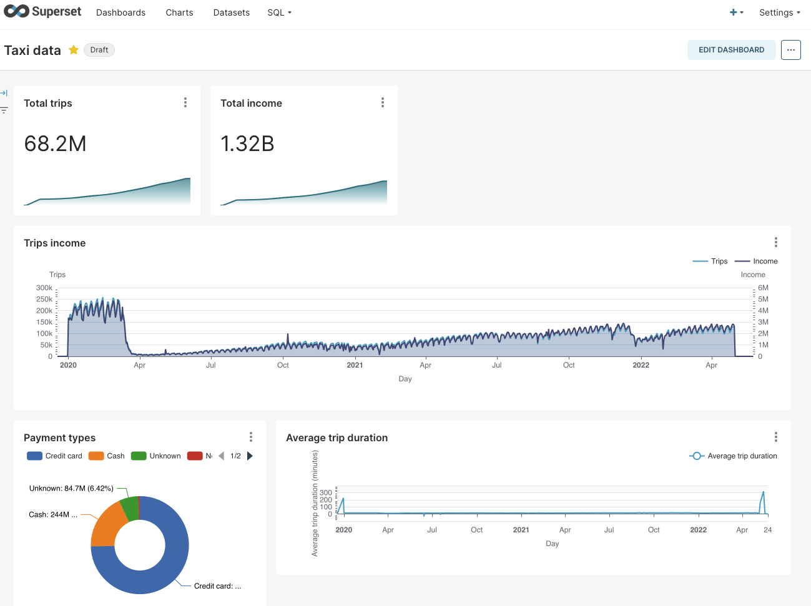

- superset에서도 trino query를 질의할 수 있습니다.
    - 상단 탭 메뉴의 SQL에 마우스 오버하여 SQL lab으로 접근합니다.

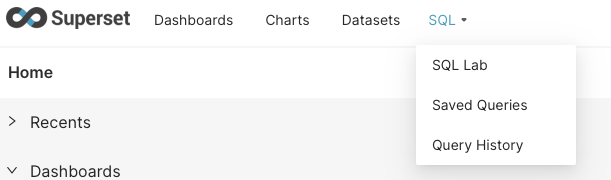

- 아래와 같이 세팅합니다.
    - schema : demo
    - SEE TABLE SCHEMA : ny_taxi_data

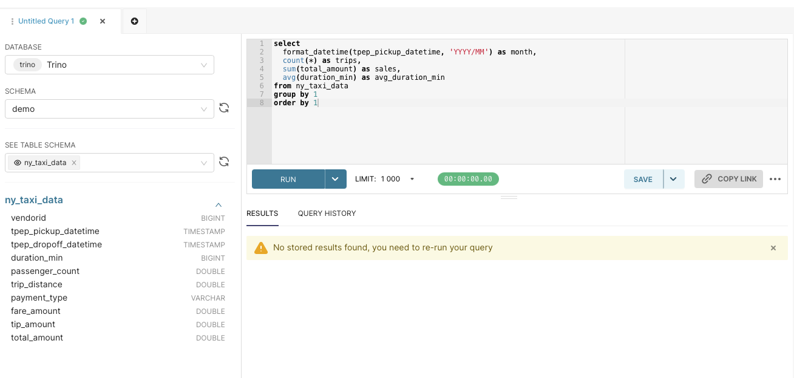

- 쿼리를 넣는 부분에 다음 쿼리를 입력해서 질의해 봅니다.
    - RUN을 누르는 순간, trino에서 쿼리가 수행됩니다.
    - 쿼리수행 속도를 더 빠르게 하고싶다면, trino active worker 개수를 늘리면 쿼리 질의를 병렬처리하여 더 빠르게 수행합니다.

```sql
select
  format_datetime(tpep_pickup_datetime, 'YYYY/MM') as month,
  count(*) as trips,
  sum(total_amount) as sales,
  avg(duration_min) as avg_duration_min
from ny_taxi_data
group by 1
order by 1
```

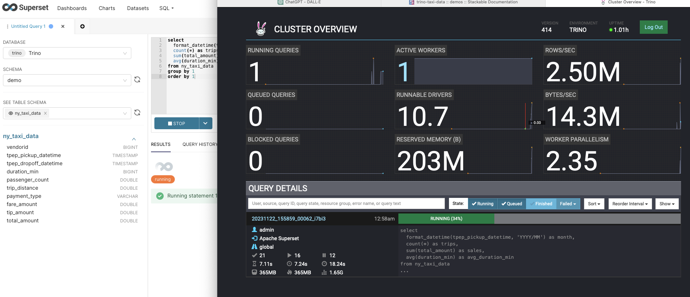

- 다음 많은 쿼리를 수행해봅니다.
    - How many taxi trips there where in the year 2021?
    
    ```sql
    select
      count(*) as trips
    from ny_taxi_data
    where year(tpep_pickup_datetime) = 2021
    ```
    
    - What was the maximum amount of passengers?
    
    ```sql
    select
      max(passenger_count) as max_passenger_count
    from ny_taxi_data;
    ```
    
    ```sql
    # Returns 112 passengers. Well that’s weird. Let’s examine the passengers distribution.
    select
      passenger_count,
      count(*) as frequency
    from ny_taxi_data
    group by 1
    order by 1 desc
    limit 100
    ```
    
    - What was the highest tip (measured in percentage of the original fee) ever given?
    
    ```sql
    select
      total_amount as fee,
      tip_amount as tip,
      tip_amount / total_amount * 100 as tip_percentage
    from ny_taxi_data
    where total_amount > 0
    order by 3 desc
    limit 5
    ```


### 3.4 Demo 삭제 - Trino-Taxi-Data 삭제
Stackable의 단점이, Demo로 설치한것들 중 Demo layer에 대해서 한번에 지우는 방안이 아직 없습니다..

그러나 , Operator layer 및 Stack layer에 대해서는 한번에 지우는것이 가능합니다.

```Trino-Taxi-Data``` Demo는 Demo layer기 때문에 아래 명령어로 제거합니다.

```bash
# Demo layer
kubectl delete supersetcluster,supersetdb superset
kubectl delete trinocluster trino && kubectl delete trinocatalog hive
kubectl delete hivecluster hive
kubectl delete s3connection minio
kubectl delete opacluster opa

# Demo로 생성된 리소스 제거
helm uninstall postgresql-superset
helm uninstall postgresql-hive
helm uninstall minio

# Demo로 생성된 리소스 제거
kubectl delete job --all
kubectl delete pvc --all

#
kubectl delete cm create-ny-taxi-data-table-in-trino-script setup-superset-script trino-opa-bundle
kubectl delete secret minio-s3-credentials secret-provisioner-tls-ca superset-credentials superset-mapbox-api-key trino-users
kubectl delete sa superset-sa

# operator layer 삭제
stackablectl operator uninstall superset trino hive secret opa commons

# 남은 리소스 확인
kubectl get-all -n stackable-operators
```

## 4. stackable을 실제로 사용하는 방안 - Demo를 안쓰고 직접 Operator를 설치하기
Demo는 말그대로 stackable의 Demo 입니다. 

따라서 실제로 stackable을 사용할땐 , 해당 방안에 따라 사용하는것이 적합합니다.
- 해당 예제는 zookeeper와 kafka를 stackable로 배포해 봅니다.

### 4.1 stackable 사용 절차
#### 4.1.1 원하는 Operator 설치
```-i``` option으로 배포하길 원하는 Stackable의 Operator를 설치할 수 있습니다.
- Operator는 release에 종속적이기 때문에, release를 명령어 맨뒤에 지정합니다.

```bash
# [터미널1] 모니터링
watch -d "kubectl get pod -n stackable-operators"

# [터미널2] 설치
stackablectl release list
## -i 옵션으로 설치할 오퍼레이터를 지정, 맨뒤에 릴리즈 지정
stackablectl release install -i commons -i secret -i zookeeper -i kafka -i nifi 23.7
[INFO ] Installing release 23.7
[INFO ] Installing commons operator in version 23.7.0
[INFO ] Installing kafka operator in version 23.7.0
[INFO ] Installing nifi operator in version 23.7.0
[INFO ] Installing secret operator in version 23.7.0
[INFO ] Installing zookeeper operator in version 23.7.0

# 설치 확인
helm list -n stackable-operators
stackablectl operator installed

## 설치완료된 crd 확인
kubectl get crd | grep stackable.tech
kubectl get pod
```
#### 4.1.2 Operator와 같이 설치된 crd로 리소스 관리
Stackable의 operator를 통해 같이 설치된 crd로 리소스를 관리합니다.

zookeeper를 관리해 봅니다.

```bash
# 모니터링
watch -d kubectl get pod,job,svc,pvc
```

Stackable의 crd로 zookeeper를 배포합니다.

```yaml
kubectl apply -f - <<EOF
---
apiVersion: zookeeper.stackable.tech/v1alpha1 # stackable zookeeper crd
kind: ZookeeperCluster
metadata:
  name: simple-zk # name
spec:
  image:
    productVersion: "3.8.1"
    stackableVersion: "23.7"
  clusterConfig:
    tls:
      serverSecretClass: null
  servers:
    roleGroups:
      primary:
        replicas: 1 # zookeeper cluster 개수
        config:
          myidOffset: 10
---
apiVersion: zookeeper.stackable.tech/v1alpha1
kind: ZookeeperZnode
metadata:
  name: simple-zk-znode
spec:
  clusterRef:
    name: simple-zk
EOF
```

zookeeper가 잘 배포되었는지 확인합니다.
```bash
# 설치 확인
kubectl get zookeepercluster,zookeeperznode
kubectl get pod,svc,ep,pvc -l app.kubernetes.io/instance=simple-zk
kubectl describe pod -l app.kubernetes.io/instance=simple-zk

# 실시간 로그 확인
kubectl logs -l app.kubernetes.io/instance=simple-zk -c zookeeper -f
```

Stackable의 crd로 kafka를 배포합니다.

```yaml
kubectl apply -f - <<EOF
---
apiVersion: kafka.stackable.tech/v1alpha1 # stackable kafka crd
kind: KafkaCluster
metadata:
  name: simple-kafka
spec:
  image:
    productVersion: "3.4.0"
    stackableVersion: "23.7"
  clusterConfig:
    zookeeperConfigMapName: simple-kafka-znode
    tls:
      serverSecretClass: null
  brokers:
    roleGroups:
      brokers:
        replicas: 3 # broker 개수
---
apiVersion: zookeeper.stackable.tech/v1alpha1
kind: ZookeeperZnode
metadata:
  name: simple-kafka-znode
spec:
  clusterRef:
    name: simple-zk
    namespace: default
EOF
```

kafka가 잘 배포되었는지 확인합니다.

```bash
# 설치 확인
kubectl get kafkacluster,zookeeperznode
kubectl get pod,svc,ep,pvc -l app.kubernetes.io/instance=simple-kafka
kubectl describe pod -l app.kubernetes.io/instance=simple-kafka

# 실시간 로그 확인
kubectl logs -l app.kubernetes.io/instance=simple-kafka -c kafka -f
```

테스트시 사용하기 위한 kafka ui를 배포합니다.

```bash
#
helm repo add kafka-ui https://provectus.github.io/kafka-ui-charts
cat <<EOF > kafkaui-values.yml
yamlApplicationConfig:
  kafka:
    clusters:
      - name: yaml
        bootstrapServers: simple-kafka-broker-brokers:9092
  auth:
    type: disabled
  management:
    health:
      ldap:
        enabled: false
EOF

# 설치
helm install kafka-ui kafka-ui/kafka-ui -f kafkaui-values.yml

# 접속 확인
kubectl patch svc kafka-ui -p '{"spec":{"type":"LoadBalancer"}}'
kubectl annotate service kafka-ui "external-dns.alpha.kubernetes.io/hostname=kafka-ui.$MyDomain"
echo -e "kafka-ui Web URL = http://kafka-ui.$MyDomain"
```

Stackable의 crd로 Apache NiFi를 배포합니다.
- Apache NiFi는 데이터 흐름 자동화 및 관리를 위한 소프트웨어입니다. 주로 대용량 데이터 흐름을 처리하고, 데이터를 다양한 시스템과 서비스 간에 전송하는 데 사용됩니다. - from gpt

```yaml
kubectl apply -f - <<EOF
---
apiVersion: zookeeper.stackable.tech/v1alpha1 # stackable zookeeper crd
kind: ZookeeperZnode
metadata:
  name: simple-nifi-znode
spec:
  clusterRef:
    name: simple-zk
---
apiVersion: v1
kind: Secret
metadata:
  name: nifi-admin-credentials-simple
stringData:
  username: admin
  password: AdminPassword
---
apiVersion: nifi.stackable.tech/v1alpha1 # stackable nifi crd
kind: NifiCluster
metadata:
  name: simple-nifi
spec:
  image:
    productVersion: "1.21.0"
    stackableVersion: "23.7"
  clusterConfig:
    listenerClass: external-unstable
    zookeeperConfigMapName: simple-nifi-znode
    authentication:
      method:
        singleUser:
          adminCredentialsSecret: nifi-admin-credentials-simple
    sensitiveProperties:
      keySecret: nifi-sensitive-property-key
      autoGenerate: true
  nodes:
    roleGroups:
      default:
        replicas: 1
EOF
```

NiFi가 잘 배포되었는지 확인합니다.

```bash
# 설치 확인 : job 완료까지 다소 시간 소요됨
kubectl get nificluster,zookeeperznode
kubectl get pod,svc,ep,pvc,job -l app.kubernetes.io/instance=simple-nifi
kubectl describe job.batch/simple-nifi-create-reporting-task-1-21-0

kubectl describe pod -l app.kubernetes.io/instance=simple-nifi
...
Args:
      /stackable/python/create_nifi_reporting_task.py -n https://simple-nifi.default.svc.cluster.local:8443/nifi-api -u "$(cat /stackable/adminuser/username | grep -oP '((cn|dn|uid)=\K[^,]+|.*)' | head -n 1)" -p "$(cat /stackable/adminuser/password)" -v 1.21.0 -m 8081 -c /stackable/cert/ca.crt
...

# 실시간 로그 확인
kubectl logs -l app.kubernetes.io/instance=simple-nifi -c nifi -f
```
#### 4.1.3 배포된 서비스 테스트하기
- 설치가 잘 되었는지 stackablectl 로 확인합니다.

```bash
$ stackablectl stacklet list
┌────────────┬──────────────────────────────────┬────────────┬────────────────────────────────────┬─────────────────────────────────┐
│ PRODUCT    ┆ NAME                             ┆ NAMESPACE  ┆ ENDPOINTS                          ┆ CONDITIONS                      │
╞════════════╪══════════════════════════════════╪════════════╪════════════════════════════════════╪═════════════════════════════════╡
│ kafka      ┆ simple-kafka                     ┆ default    ┆ metrics <public-ip>:30117          ┆ Available, Reconciling, Running │
│            ┆                                  ┆            ┆ kafka   <public-ip>:30006          ┆                                 │
├╌╌╌╌╌╌╌╌╌╌╌╌┼╌╌╌╌╌╌╌╌╌╌╌╌╌╌╌╌╌╌╌╌╌╌╌╌╌╌╌╌╌╌╌╌╌╌┼╌╌╌╌╌╌╌╌╌╌╌╌┼╌╌╌╌╌╌╌╌╌╌╌╌╌╌╌╌╌╌╌╌╌╌╌╌╌╌╌╌╌╌╌╌╌╌╌╌┼╌╌╌╌╌╌╌╌╌╌╌╌╌╌╌╌╌╌╌╌╌╌╌╌╌╌╌╌╌╌╌╌╌┤
│ nifi       ┆ simple-nifi                      ┆ default    ┆ https   https://<public-ip>:31034  ┆ Available, Reconciling, Running │
├╌╌╌╌╌╌╌╌╌╌╌╌┼╌╌╌╌╌╌╌╌╌╌╌╌╌╌╌╌╌╌╌╌╌╌╌╌╌╌╌╌╌╌╌╌╌╌┼╌╌╌╌╌╌╌╌╌╌╌╌┼╌╌╌╌╌╌╌╌╌╌╌╌╌╌╌╌╌╌╌╌╌╌╌╌╌╌╌╌╌╌╌╌╌╌╌╌┼╌╌╌╌╌╌╌╌╌╌╌╌╌╌╌╌╌╌╌╌╌╌╌╌╌╌╌╌╌╌╌╌╌┤
│ zookeeper  ┆ simple-zk                        ┆ default    ┆                                    ┆ Available, Reconciling, Running │
├╌╌╌╌╌╌╌╌╌╌╌╌┼╌╌╌╌╌╌╌╌╌╌╌╌╌╌╌╌╌╌╌╌╌╌╌╌╌╌╌╌╌╌╌╌╌╌┼╌╌╌╌╌╌╌╌╌╌╌╌┼╌╌╌╌╌╌╌╌╌╌╌╌╌╌╌╌╌╌╌╌╌╌╌╌╌╌╌╌╌╌╌╌╌╌╌╌┼╌╌╌╌╌╌╌╌╌╌╌╌╌╌╌╌╌╌╌╌╌╌╌╌╌╌╌╌╌╌╌╌╌┤
│ grafana    ┆ kube-prometheus-stack-grafana    ┆ monitoring ┆                                    ┆                                 │
├╌╌╌╌╌╌╌╌╌╌╌╌┼╌╌╌╌╌╌╌╌╌╌╌╌╌╌╌╌╌╌╌╌╌╌╌╌╌╌╌╌╌╌╌╌╌╌┼╌╌╌╌╌╌╌╌╌╌╌╌┼╌╌╌╌╌╌╌╌╌╌╌╌╌╌╌╌╌╌╌╌╌╌╌╌╌╌╌╌╌╌╌╌╌╌╌╌┼╌╌╌╌╌╌╌╌╌╌╌╌╌╌╌╌╌╌╌╌╌╌╌╌╌╌╌╌╌╌╌╌╌┤
│ prometheus ┆ kube-prometheus-stack-prometheus ┆ monitoring ┆                                    ┆                                 │
└────────────┴──────────────────────────────────┴────────────┴────────────────────────────────────┴─────────────────────────────────┘
```

- 먼저 zookeeper 상태확인 명령어 스크립트로 정보를 확인합니다.

```bash
kubectl exec -i -t simple-zk-server-primary-0 -c zookeeper -- bin/zkCli.sh
Connecting to localhost:2181
2023-11-22 16:33:18,654 [myid:] - INFO  [main:o.a.z.Environment@98] - Client environment:zookeeper.version=3.8.1-74db005175a4ec545697012f9069cb9dcc8cdda7, built on 2023-01-25 16:31 UTC
2023-11-22 16:33:18,657 [myid:] - INFO  [main:o.a.z.Environment@98] - Client environment:host.name=simple-zk-server-primary-0.simple-zk-server-primary.default.svc.cluster.local
2023-11-22 16:33:18,657 [myid:] - INFO  [main:o.a.z.Environment@98] - Client environment:java.version=11.0.19
2023-11-22 16:33:18,657 [myid:] - INFO  [main:o.a.z.Environment@98] - Client environment:java.vendor=Red Hat, Inc.
2023-11-22 16:33:18,657 [myid:] - INFO  [main:o.a.z.Environment@98] - Client environment:java.home=/usr/lib/jvm/java-11-openjdk-11.0.19.0.7-4.el8.x86_64
2023-11-22 16:33:18,657 [myid:] - INFO  [main:o.a.z.Environment@98] - Client environment:java.class.path=/stackable/apache-zookeeper-3.8.1-bin/bin/../zookeeper-server/target/classes:/stackable/apache-zookeeper-3.8.1-bin/bin/../build/classes:/stackable/apache-zookeeper-3.8.1-bin/bin/../zookeeper-server/target/lib/*.jar:/stackable/apache-zookeeper-3.8.1-bin/bin/../build/lib/*
...
```

- ls /로 zookeeper cluster 상태를 확인합니다.

```bash
[zk: localhost:2181(CONNECTED) 0] ls /
[znode-29e511bc-4055-46b8-97a5-3a322e85018b, znode-5bd7a166-8d00-4ceb-968d-398f55e52ee3, znode-b1ae8fdb-bd2d-4840-a3c0-f22cb985f0fb, zookeeper]
```

- kafka 로 토픽을 생성하고, ui에서도 확인해 봅니다.

```bash
# 토픽 생성
kubectl exec -it simple-kafka-broker-brokers-0 -c kafka -- bin/kafka-topics.sh --bootstrap-server localhost:9092 --create --topic demo
...
Created topic demo.
...

# 토픽 확인
kubectl exec -it simple-kafka-broker-brokers-0 -c kafka -- bin/kafka-topics.sh --bootstrap-server localhost:9092 --list
...
demo
...

# 토픽에 메세지 프로듀싱 (10개)
$ for ((i=1; i<=10;  i++)); do echo "test-$i" ; kubectl exec -it simple-kafka-broker-brokers-0 -c kafka -- sh -c "echo test1-$i | bin/kafka-console-producer.sh --bootstrap-server localhost:9092 --topic demo" ; date ; done
```

- kafka ui에서도 토픽이 생성된것을 확인할 수 있습니다.

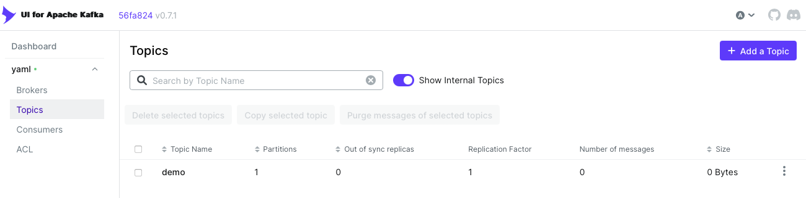

- NiFi에 접속해 봅니다.
    - NiFi ID : admin
    - NiFi PWD : AdminPassword 

```bash
# NiFi admin 계정의 암호 확인
kubectl get secrets nifi-admin-credentials-simple -o jsonpath="{.data.password}" | base64 -d && echo
AdminPassword
```

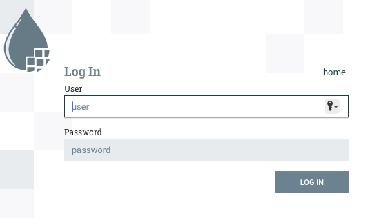

- 로그인 성공 후

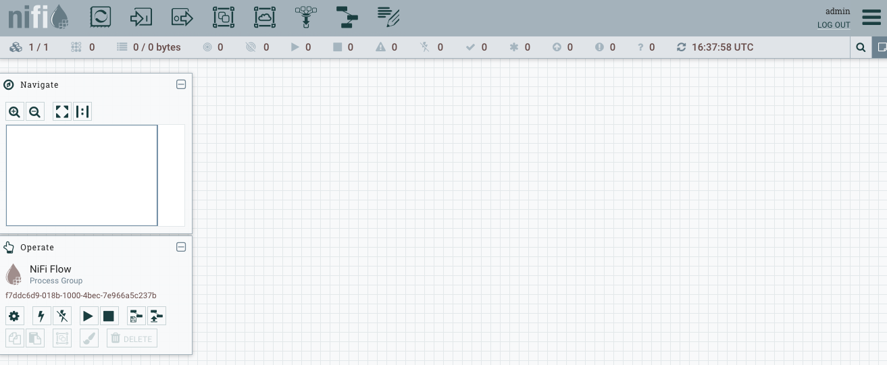


#### 4.1.4 배포된 서비스 제거하기
Demo보단 편리하게 제거할 수 있습니다.

```bash
# Apache NiFi 삭제
kubectl delete nificluster simple-nifi && kubectl delete zookeeperznode simple-nifi-znode

# kafka-ui 삭제
helm uninstall kafka-ui

# Apache kafka 삭제
kubectl delete kafkacluster simple-kafka && kubectl delete zookeeperznode simple-kafka-znode

# Apache ZooKeeper 삭제
kubectl delete zookeepercluster simple-zk && kubectl delete zookeeperznode simple-zk-znode

# secret, pvc 삭제
kubectl delete secret nifi-admin-credentials-simple nifi-sensitive-property-key secret-provisioner-tls-ca
kubectl delete pvc --all

# operator 삭제
stackablectl operator uninstall nifi kafka zookeeper secret commons

# 남은 리소스 확인
kubectl get-all -n stackable-operators
```

## ETC
### 1. Stackable 꿀팁
Stackable을 통해 리소스를 배포관리할 때 , Stackable docs에서 Operator 부분을 잘 살펴보면, 해당 Operator의 아키텍처와, 상세 설정 방안등을 확인할 수 있습니다.

예를들어 만약 **Stackable Operator for Apache Spark** 라면, 아래 docs를 확인해봅니다.
- [docs](https://docs.stackable.tech/home/stable/spark-k8s/)

### 2. EKS 제거
실습 완료 이후 EKS를 제거합니다.

```bash
eksctl delete cluster --name $CLUSTER_NAME && aws cloudformation delete-stack --stack-name $CLUSTER_NAME
```