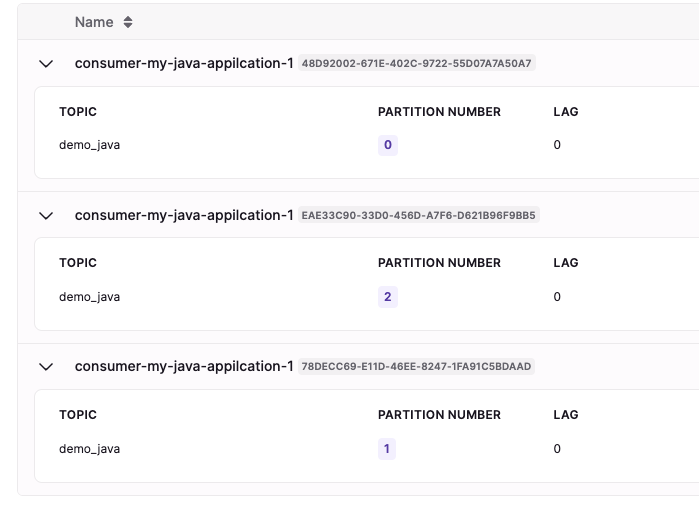

# Kafka Consumer Java

## Dependencies
아래 디팬던시 필요
- ***Kafka-clients*** : Kafka 연결사용
- ***slf4j-*** : 로깅용

```bash
dependencies {
    // https://mvnrepository.com/artifact/org.apache.kafka/kafka-clients
    implementation 'org.apache.kafka:kafka-clients:3.1.0'
    // https://mvnrepository.com/artifact/org.slf4j/slf4j-api
    implementation 'org.slf4j:slf4j-api:1.7.36'
    // https://mvnrepository.com/artifact/org.slf4j/slf4j-simple
    implementation 'org.slf4j:slf4j-simple:1.7.36'

}
```


## 1. Kafka consumer 만들기
Kafka consumer를 만들기 위해선 , 아래 단계를 거쳐야 합니다.

1. create Producer Properties
2. create the consumer
3. consumer poll

**아래 코드와 주석을 참고합니다.**
- [ConsumerDemo 예제 코드](./src/main/java/io/Conduktor/demos/kafka/ConsumerDemo.java)

로그를 확인해보면 , 아래 순서로 consumer가 동작한다는것을 알 수 있습니다.

1. Consumer Group에 join
위 코드를 살펴보면 , 처음 properties에 group.id를 지정해 줍니다.
- 이것은 Consumer Group Id를 의미하며 , 처음 consumer가 생성될 때 , 해당 group Id의 이름을 가진 consumer group을 생성하고 join 합니다.

```java
String groupId = "my-java-appilcation";
...
properties.setProperty("group.id",groupId);
```

consumer group join log
```logcatfilter
(Re-)joining group
Successfully joined group with generation Generation{generationId=1, memberId='consumer-my-java-appilcation-1-dbc5987c-a9fc-4a98-9f41-7b40fa7c67b5', protocol='range'}
...
```

2. offset 관리
해당 코드에선 ```auto.offset.reset``` 옵션으로 ```earliest``` 를 두었습니다.

consumer group에 join된 이후 , consumer는 offset이 어떻게 설정되어있는지 확인한 이후 , 해당 예제처럼 설정된 정보가 없다면 ```auto.offset.reset``` 를 따릅니다.

로그에서 확인할 수 있습니다.
```logcatfilter
...
Resetting offset for partition demo_java-2 to position FetchPosition{offset=0, offsetEpoch=Optional.empty, currentLeader=LeaderAndEpoch{leader=Optional[cluster.playground.cdkt.io:9107 (id: 22 rack: 1)], epoch=0}}.
Resetting offset for partition demo_java-0 to position FetchPosition{offset=0, offsetEpoch=Optional.empty, currentLeader=LeaderAndEpoch{leader=Optional[cluster.playground.cdkt.io:9118 (id: 32 rack: 2)], epoch=0}}.
Resetting offset for partition demo_java-1 to position FetchPosition{offset=0, offsetEpoch=Optional.empty, currentLeader=LeaderAndEpoch{leader=Optional[cluster.playground.cdkt.io:9127 (id: 6 rack: 0)], epoch=0}}.
...
```

3. data poll
offset을 earliset 옵션으로 모든 파티션에 대해 0으로 초기화한 이후 부터 , 0번째 offset 데이터를 poll해오기 시작합니다.
- 가능할 경우 broker에게 1MB 데이터를 한번에 가져올 수 있습니다.

```logcatfilter
[main] INFO ConsumerDemo - Polling
[main] INFO ConsumerDemo - KEY : null Value : hello world12
[main] INFO ConsumerDemo - Partition : 0 Offset : 0
[main] INFO ConsumerDemo - KEY : null Value : hello world13
[main] INFO ConsumerDemo - Partition : 0 Offset : 1
[main] INFO ConsumerDemo - KEY : null Value : hello world14
[main] INFO ConsumerDemo - Partition : 0 Offset : 2
[main] INFO ConsumerDemo - KEY : null Value : hello world15
...
```

### consumer 재 수행
만약 consumer group에 join된 이후 consumer를 재 시작하면 , consumer group에 Rejoin하게 되고 , 고 사이에 들어간 데이터를 받는데까진 시간이 걸립니다.

offset을 commit한 부분부터 데이터를 갖고오기에 새로운 데이터를 받기 전까지 데이터를 poll하지 않습니다.

## 2. Kafka consumer 안전하게 종료하기
위의 예제는 , Kafka consumer가 poll하는 동작을 무한루프로 수행했기에 , 재 시작했을 때 문제가 발생합니다.

따라서 우아하게 종료하는 방법은 다음과 같습니다.
- [ConsumerDemoWithShutdown 예제 코드](./src/main/java/io/Conduktor/demos/kafka/ConsumerDemoWithShutdown.java)

### 코드 동작순서
1. addShutdownHook() 스레드의 Run() 익명함수 동작
- java를 종료함과 동시에
- 여기선 java가 종료됨을 알고 , ```consumer.wakeup()``` 메서드를 동작시킵니다.
- 이후 실행중인 mainThread에 join 됩니다.
2. WakeupException 호출
- try - catch의 WakeupException() 으로 잡히면서 poll 동작이 멈추게 되고,
- ```consumer.close()``` 메서드가 호출되면서 ***offset을 commit하고 consumer가 consumer group에서 삭제되면서***
- consumer는 종료합니다.


로그는 다음과같이 출력됩니다.
```logcatfilter
...
종료를 감지함. consumer.wakeup() 메서드를 호출하고 나갈 예정...
consumer가 shutdownd을 시작함
[Consumer clientId=consumer-my-java-appilcation-1, groupId=my-java-appilcation] Revoke previously assigned partitions demo_java-0, demo_java-1, demo_java-2
[Consumer clientId=consumer-my-java-appilcation-1, groupId=my-java-appilcation] Member consumer-my-java-appilcation-1-7af2a551-c891-4de5-bf1f-1f6550291434 sending LeaveGroup request to coordinator cluster.playground.cdkt.io:9102 (id: 2147483629 rack: null) due to the consumer is being closed
[Consumer clientId=consumer-my-java-appilcation-1, groupId=my-java-appilcation] Resetting generation due to: consumer pro-actively leaving the group
[Consumer clientId=consumer-my-java-appilcation-1, groupId=my-java-appilcation] Request joining group due to: consumer pro-actively leaving the group
[main] INFO org.apache.kafka.common.metrics.Metrics - Metrics scheduler closed
[main] INFO org.apache.kafka.common.metrics.Metrics - Closing reporter org.apache.kafka.common.metrics.JmxReporter
[main] INFO org.apache.kafka.common.metrics.Metrics - Metrics reporters closed
[main] INFO org.apache.kafka.common.utils.AppInfoParser - App info kafka.consumer for consumer-my-java-appilcation-1 unregistered
```

## 3. Consumer Group의 파티션 Rebalance
**같은 Group에 존재하는 Consumer들은 토픽의 파티션을 공정하게 분배합니다.**

이말이 뭐냐면 , 아래 코드로 consumer를 3대 만든다 했을 때 , demo_java 토픽의 파티션이 3개기 때문에 파티션을 한개씩 할당받는다는 의미입니다.
- [ConsumerDemoWithShutdown 예제 코드](./src/main/java/io/Conduktor/demos/kafka/ConsumerDemoWithShutdown.java)

로그를 보면 확인할 수 있는데 , 컨슈머 그룹에 컨슈머가 1대씩 추가될 때 마다 , 파티션을 골고루 재 분배합니다.
- 아래 사진은 같은 그룹에 속한 3대의 컨슈머가 파티션을 골고루 나눠가진것을 확인할 수 있는 이미지 입니다.



또한 한대가 줄어들 때 마다 파티션을 다시 리 벨런싱 합니다.
- demo_java-1 파티션을 점유하던 컨슈머가 사라지면 , 해당 파티션을 다시 다른 컨슈머가 소비하도록 이동시킴

**따라서 컨슈머 그룹 내부의 컨슈머들은 , 파티션을 동적으로 분배하여 가지게 됩니다..!!**

>토픽 내부에 파티션이 추가되거나 , 컨슈머 그룹내부의 컨슈머가 삭제 또는 추가될때 파티션이 컨슈머 사이를 움직이는데 , 이것을 리벨런싱 이라 합니다.

### 3.1 리벨런싱 전략
#### **1.적극적 리밸런싱 - Eager Rebalance**
모든 컨슈머가 중단되고 , 컨슈머 그룹을 해제합니다.

이후 다시 컨슈머 그룹에 합류하게 되며 파티션을 재 할당 받습니다.

얘는 아래와 같은 단점이 있습니다
1. 이전 파티션을 잃어버림

모든 컨슈머가 컨슈머 그룹에서 이탈하고 , 다시 컨슈머 그룹으로 들어와서 파티션을 무작위로 할당받기 때문에 , 이전에 소비했던 파티션을 잃어버릴 수 있습니다.

2. 컨슈머 데이터 소비 중단

모든 컨슈머가 짧은시간동안 중단되기 때문에 , 잠깐동안 데이터 소비가 멈춥니다.


#### **2. 협력적 리벨런싱 - Cooperative Rebalance (Incremental Rebalance)**
모든 파티션을 모든 컨슈머에게 재 할당하지 않고 , 파티션을 작은 그룹으로 나눠서 한 컨슈머에서 다른 컨슈머로 재 할당 하는 방법

이러한 과정을 계속 반복하면서 모든 파티션을 컨슈머에게 할당합니다.

이것은 적극적 리벨런싱 문제처럼 중단이 일어나지 않는다는 장점이 있습니다.

***예를 들어 ..***

>파티션 3개와 컨슈머 2개 가 서로 소비하고있는 와중에 컨슈머 한대가 추가됐을 경우 ,
>특정 컨슈머에 중첩되어 소비되어지고있는 파티션중 한개만 뜯어져서 , 추가된 컨슈머에게 소비되는 전략 입니다.


#### **사용 방안**
```partition.assignment.strategy``` 옵션을 통해 사용합니다.

|             |                |                                                                                                  |                     |
|-------------|----------------|--------------------------------------------------------------------------------------------------|---------------------|
| **리벨런싱 전략** | **이름**             | **설명**                                                                                           | **비고**              |
| 적극적 리벨런싱    | RangeAssignor  | 파티션을 토픽당 기준으로 할당                                                                                 |                     |
| -           | RoundRobin     | 모든 파티션이 모든 토픽에 걸쳐서 할당                                                                            |                     |
| -           | StickyAssignor | 처음엔 라운드로빈처럼 동작하다가 , 컨슈머 개수에 변화가 생기면 파티션 이동을 최소화함                                                 |                     |
| 협력적 리벨런싱    | CooperativeStickyAssignor | 데이터 이동 횟수를 최소화하기 위하여 컨슈머 사이에 파티션이동 횟수를 최소화함                                                      |                     |
| -           | RangeAssignor,CooperativeStickyAssignor | 처음엔 RangeAssignor를 사용하다가 , RangeAssignor를 제거하면 CooperativeStickyAssignor 을 한번만 순차적으로 재 실행하여 사용함. | kafka 3.0 부터 기본 옵션임 |

실제로 consumer를 실행하면 , 최상단 로그에 협력적 리벨런싱의 방법이 default로 잡히는것을 확인할 수 있습니다.

```logcatfilter
...
partition.assignment.strategy = [class org.apache.kafka.clients.consumer.RangeAssignor, class org.apache.kafka.clients.consumer.CooperativeStickyAssignor]
...
```

해당 리벨런싱 전략을 변경하기 위해서 , properties를 설정할 때 key-value로 넣어주면 됩니다.

```java
// 파티션 리벨런싱전략 변경
properties.setProperty("partition.assignment.strategy", CooperativeStickyAssignor.class.getName());
```

실제 코드
- [ConsumerDemoCooperative 예제 코드](./src/main/java/io/Conduktor/demos/kafka/ConsumerDemoCooperative.java)

## 4. Static Group Membership
기본적으로 컨슈머가 그룹에서 나가거나 합류되면 , 리벨런싱이 일어남.

그래서 컨슈머가 그룹에서 나갓다가 재 할당되면 , 멤버ID 가 새로 생성되어 바뀌게 되는데 , ```group.instance.id``` 옵션으로 그룹 인스턴스 id를 특정하면 , 해당 컨슈머는 정적 멤버가 될 수 있음.

이렇게 static member가 되면 , 해당 static member에 할당된 파티션은 고정되게 됩니다.
>만약 static member가 그룹에서 사라졌을 때 , 수 밀리초에 해당하는 session.timeout 세션 시간 안에 그룹에 재 할당되면 , 기존에 자기가 소비했었던 파티션을 그대로 가져갑니다. (재할당이 일어나지 않습니다.)
>그러나 해당 시간을 초과함에도 그룹에 해당 멤버가 다시 join하지 않는다면 , 리벨런싱이 일어납니다.

### 4.1 사용 방안
static group member를 설정하기 위해서 , properties에 key-value로 넣어주면 됩니다.
- 각각의 컨슈머들에게 다른 id값을 넣어주어야 합니다.

```java
// 파티션 리벨런싱전략 변경
properties.setProperty("group.instance.id", "...");
```

## 5. consumer offset commit
자바 consumer api는 기본적으로 offset을 자동 commit 합니다.

consumer에서 브로커에게 데이터를 poll 할 때 마다 , ```enable.auto.commit``` 옵션을 ```true```로 하고 , ```auto.commit.interval.ms``` 를 ```5000```으로 두면 5초마다 자동커밋을 수행합니다.

근데 이 auto.commit을 disable하고 커밋할 스레드를 따로 두어서 호출할 수 도 있습니다.