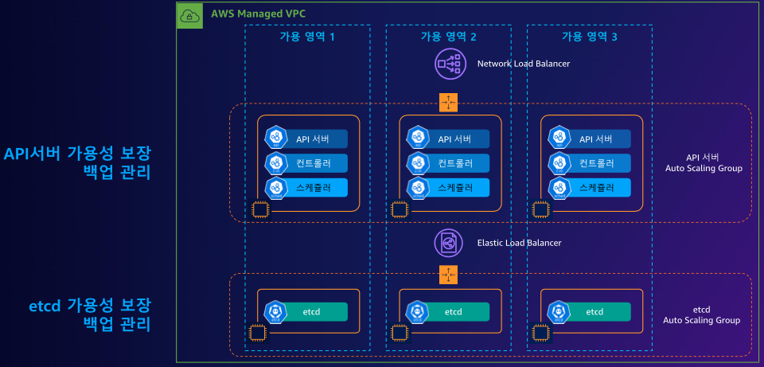
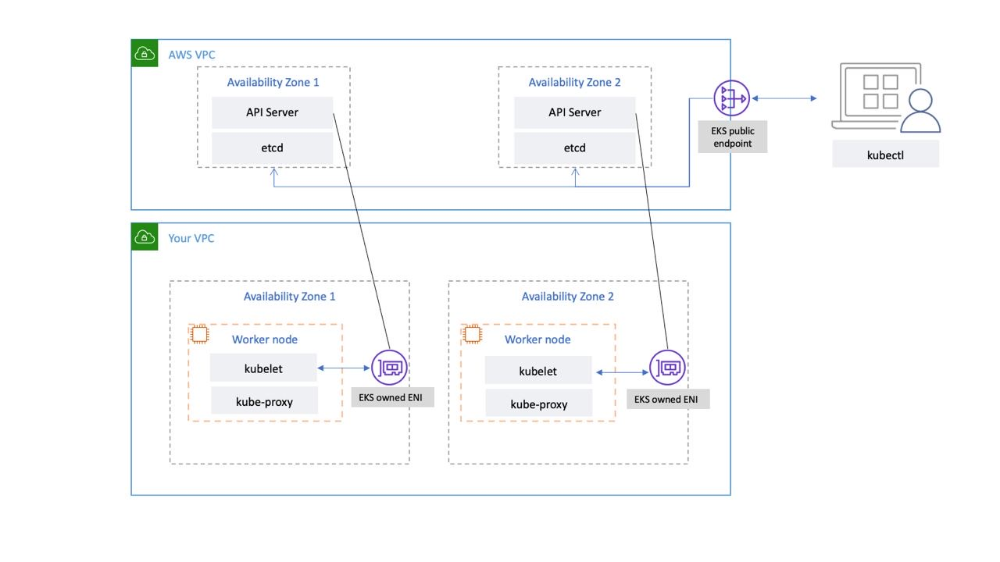
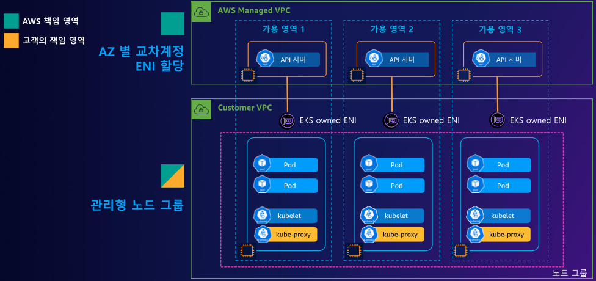
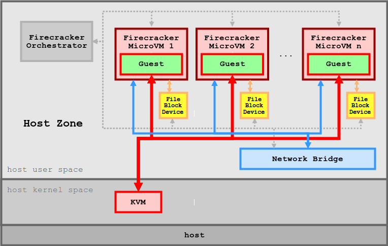
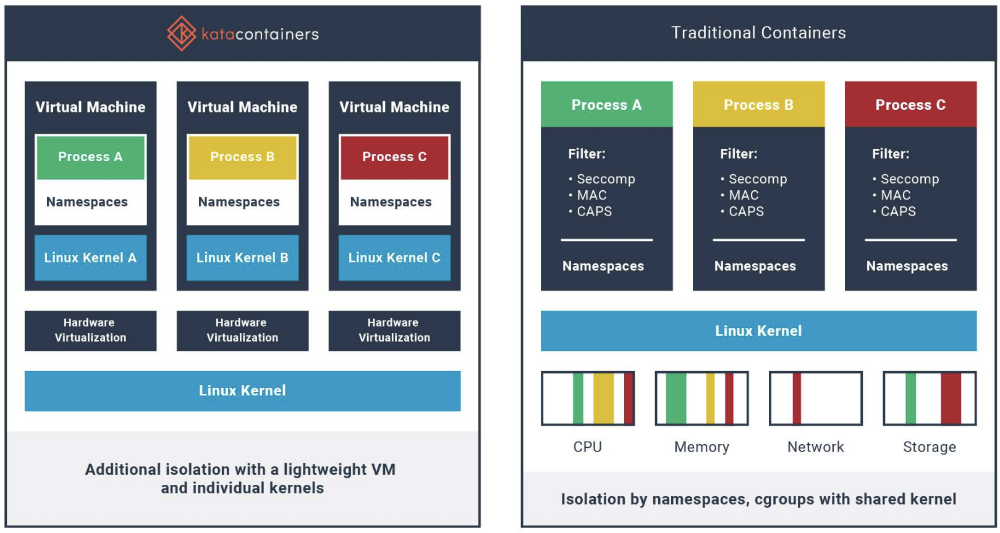
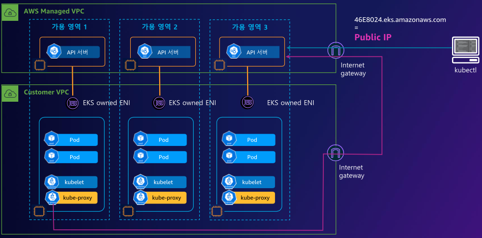
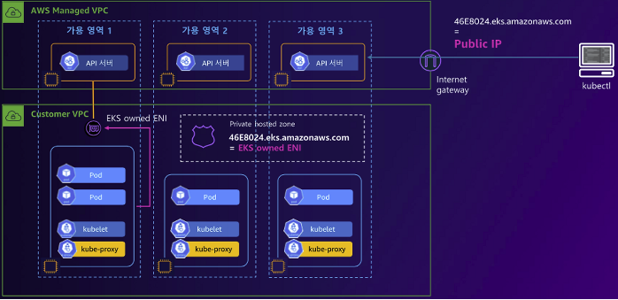
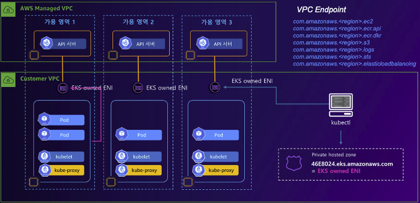

# 1주차
## 0. EKS 특징
EKS(Elastic Kubernetes Service) 는 Kubernetes Control-plane을 AWS에서 관리하게 되고, 보통 Worker Node들이 AZ별로 분산되어 구축되기에 , 운영상의 부담을 줄이면서 Kubernetes를 편하게 사용할 수 있도록 하는 서비스.
- Worker Node들에 설치되는 Kube-Proxy나 CNI 등은 설치되고 확인이 가능함.
- Worker Node를 Farget로 구성하면, Worker Node 또한 관리책임을 덜 수 있음.

장점으로는 AWS의 여러 서비스들과의 통합이 편함.
- ECR , IAM , ELB , VPC 등과 결합되어 AWS 서비스들을 확장성있게 사용이 가능함.

보통 5 ~ 6 개의 마이너 버전을 지원, 평균 3개월마다 새 버전을 제공하며 처음 14개월을 지원하고 ***버전 업데이트를 못했다면 추가로 12개월을 연장시킬 수 있음.***
- 추가 지원은 비용이 추가됨.

## 1. EKS Architecture
### EKS Control Plane Architecture


EKS Control Plane의 Architecture

API 서버와 ETCD 클러스터의 고 가용성 확보를 위해 AZ를 분산해서 배포하고, Auto Scaling Group으로 묶어서 스케일 아웃 , 스케일 인을 지원하게 된다.

또한 앞단에 각각 API 서버는 NLB , ETCD Cluster는 ELB가 위치하여 트래픽 부하분산을 이루게 된다.

API 서버가 NLB를 사용하는 이유는 안정성과 속도에 있다.
***API 서버끼리 통신할 때, TCP 프로토콜로 통신하면서 높은 처리량과 낮은 지연시간을 이룩하여 안정성을 더욱 높히고 , 나아가 NLB가 제공하는 고정 IP를 통해 서비스 안정성을 더욱 향상시킴에 있다.***

ETCD Cluster가 ELB를 사용하는 이유는 ETCD에는 Kubernetes에 생성된 리소스들의 상태와 메타데이터 정보가 저장되기에 핵심적인 백엔드 DB라 볼 수 있다.
***하여 ETCD Cluster에 접근하는 트래픽을 균등하게 부하분산하여 특정 ETCD Node가 Down 되더라도 EKS Cluster에 영향을 최소화하기 위함에 있다. 나아가 EKS Cluster가 차후 확장되었을 경우, 쉽게 수평 확장할 수 있도록 앞단에 ELB를 배치한다.***

### EKS Worker Node Architecture


EKS Worker Node Architecture

Worker Node는 사용자가 직접 관리해야 한다. 따라서 사용자의 VPC에 구축된다. 또한 VPC 내부에 각 워커노드들은 서로 상이한 AZ에 위치하여 재해복구시간을 줄이고 고 가용성을 얻는다.

또한 일반적인 Kubernetes Cluster와 동일하게 kubelet, Kube-proxy가 구성되게 된다.

특이점으로 **EKS owned ENI** 가 Worker Node AZ에 구성되게 된다. 이는 AWS가 관리하는 EKS Control Plane (API Server, ETCD) 과 통신하기 위해 별도의 Network Interface를 구성하는데, 이것이 **EKS owned ENI** 가 된다.
- **EKS owned ENI** 는 말 그대로 ENI 소유자가 AWS가 된다.

결론적으로 EKS owned ENI를 통해 Worker Node에 설치된 Kube-Proxy가 Control Plane과 통신하게 된다.

추가로 EKS 관리자는 EKS public Endpoint를 통해 EKS Control Plane에 접근하여 EKS를 관리하게 된다.


### EKS Data Plane


EKS Data Plane

위의 설명들이 잘 들어가있는 아키텍처.

### EKS with Serverless


EKS with Farget

EKS의 Worker Node들을 Farget로 선언하여, EKS 관리자가 Worker Node 인스턴스를 관리할 책임을 덜 수 있다. 

또한 Farget로 선언된 EKS Worker Node는, AWS Farget 환경에서 제공하는 Micro VM을 이용하여 Pod별로 VM이 할당되게 된다.

#### Kata Container (카타 컨테이너)


- kata container VS Docker Image

카타 컨테이너는 , 컨테이너처럼 느끼게 작동하는 경량 VM으로 하드웨어를 통한 workload 격리를 통해 더욱 안전한 컨테이너 환경을 제공하는 기술이다.

도커 컨테이너는 기본적으로 리눅스의 프로세스기 때문에 호스트 서버의 커널을 공유한다는 보안적 단점을 가지고 있다. 

그러나 ***카타 컨테이너는 컨테이너 처럼 보이는 경량 VM이기 때문에, 커널을 공유하지 않고 개별적인 전용 커널을 가지기에 보안적 강점이 있다.***

또한 도커 컨테이너는 리눅스 Namespace를 통해 격리되기에 네트워크 속도를 나누기에 속도가 낮아진다는 한계가 있는데, ***카타 컨테이너는 커널이 아예 분리되어있기에 성능의 소모가 없이 분리된 환경을 제공한다.***


## 2. EKS 배포하기
### 2.1 사전작업
EKS를 배포하는방법은 여러가지가 있다.

- 1. CloudFormation으로 한번에 배포하기
- 2. eksctl
- 3. web console

여기서는 eksctl로 배포함.
- **명령어를 수행하기 전 , aws configure로 aws command를 사용할 linux user에게 aws 리소스에 대한 권한을 부여해야 함.**

EKS를 배포할 때에, 배포대상 VPC가 필요하다면 VPC ID 값이 필요함. 또한 subnet도 지정되어 있다면, 해당 subnet ID도 필요함
- 아래 명령어를 통해 VPC, subnet ID 추출

```bash
# EKS 배포할 VPC 정보 확인
aws ec2 describe-vpcs --filters "Name=tag:Name,Values=$CLUSTER_NAME-VPC" | jq
export VPCID=$(aws ec2 describe-vpcs --filters "Name=tag:Name,Values=$CLUSTER_NAME-VPC" | jq -r .Vpcs[].VpcId)
echo "export VPCID=$VPCID" >> /etc/profile
echo $VPCID


## 퍼블릭 서브넷 ID 확인
aws ec2 describe-subnets --filters Name=tag:Name,Values="$CLUSTER_NAME-PublicSubnet1" | jq
aws ec2 describe-subnets --filters Name=tag:Name,Values="$CLUSTER_NAME-PublicSubnet1" --query "Subnets[0].[SubnetId]" --output text
export PubSubnet1=$(aws ec2 describe-subnets --filters Name=tag:Name,Values="$CLUSTER_NAME-PublicSubnet1" --query "Subnets[0].[SubnetId]" --output text)
export PubSubnet2=$(aws ec2 describe-subnets --filters Name=tag:Name,Values="$CLUSTER_NAME-PublicSubnet2" --query "Subnets[0].[SubnetId]" --output text)
echo "export PubSubnet1=$PubSubnet1" >> /etc/profile
echo "export PubSubnet2=$PubSubnet2" >> /etc/profile
echo $PubSubnet1
echo $PubSubnet2
```


### 2.2 eksctl command info
eksctl로 EKS를 배포함.
- ```--dry-run``` 명령어로 실제 배포 없이 eksctl 명령어만 학습

EKS에서 현재 지원하는 버전을 확인합니다.

```bash
# 현재 지원 버전 정보 확인
eksctl create cluster -h | grep version
      --version string        Kubernetes version (valid options: 1.23, 1.24, 1.25, 1.26, 1.27, 1.28, 1.29) (default "1.29")
```

EKS Cluster를 생성하는 명령어는 다음과 같습니다.
- 노드그룹 없이 생성
    - 명령어 수행 결과, 생성되는 AZ, Kubernetes Version, EKS 배포 Region, VPC CIDR INFO 등 다양한 정보를 확인할 수 있습니다.
    - 해당 옵션들을 상황에맞게 변경이 가능합니다.

```bash
# eks 클러스터 생성 + 노드그룹없이
eksctl create cluster --name myeks --region=ap-northeast-2 --without-nodegroup --dry-run | yh
accessConfig: 
  authenticationMode: API_AND_CONFIG_MAP
apiVersion: eksctl.io/v1alpha5
availabilityZones: 
- ap-northeast-2c
- ap-northeast-2d
- ap-northeast-2b
cloudWatch: 
  clusterLogging: {}
iam: 
  vpcResourceControllerPolicy: true
  withOIDC: false
kind: ClusterConfig
kubernetesNetworkConfig: 
  ipFamily: IPv4
metadata: 
  name: myeks
  region: ap-northeast-2
  version: "1.29"
privateCluster: 
  enabled: false
  skipEndpointCreation: false
vpc: 
  autoAllocateIPv6: false
  cidr: 192.168.0.0/16
  clusterEndpoints: 
    privateAccess: false
    publicAccess: true
  manageSharedNodeSecurityGroupRules: true
  nat: 
    gateway: Single
```

아래 명령어로 사용 AZ를 선택합니다.

```bash
# eks 클러스터 생성 + 노드그룹없이 & 사용 가용영역(2a,2c)
eksctl create cluster --name myeks --region=ap-northeast-2 --without-nodegroup --zones=ap-northeast-2a,ap-northeast-2c --dry-run | yh
...
```

아래 명령어로 AZ 선택, 관리형 노드그룹 옵션을 변경합니다.

```bash
# eks 클러스터 생성 + 관리형노드그룹생성(이름, 인스턴스 타입, EBS볼륨사이즈) & 사용 가용영역(2a,2c) + VPC 대역 지정
eksctl create cluster --name myeks --region=ap-northeast-2 --nodegroup-name=mynodegroup --node-type=t3.medium --node-volume-size=30 \
--zones=ap-northeast-2a,ap-northeast-2c --vpc-cidr=172.20.0.0/16 --dry-run | yh
```

아래 명령어로 관리형 노드그룹을 생성하고, ```--ssh-access``` 옵션을 통해 SSH 접근을 허용하며, VPC 대역을 지정합니다.

```bash
# eks 클러스터 생성 + 관리형노드그룹생성(AMI:Ubuntu 20.04, 이름, 인스턴스 타입, EBS볼륨사이즈, SSH접속허용) & 사용 가용영역(2a,2c) + VPC 대역 지정
eksctl create cluster --name myeks --region=ap-northeast-2 --nodegroup-name=mynodegroup --node-type=t3.medium --node-volume-size=30 \
--zones=ap-northeast-2a,ap-northeast-2c --vpc-cidr=172.20.0.0/16 --ssh-access --node-ami-family Ubuntu2004 --dry-run | yh
...
```


### 2.3 eksctl로 EKS 배포
먼저 사전설정에서 설정한 값들을 확인합니다.

```bash
# 변수 확인
echo $AWS_DEFAULT_REGION
echo $CLUSTER_NAME
echo $VPCID
echo $PubSubnet1,$PubSubnet2
```

배포는 eks 클러스터와 관리형 노드그룹을 배포합니다. 또한 kubernetes version은 1.28 이며. SSH 접근을 허용합니다.
- --dry-run 옵션으로 메니페스트 파일로 결과값을 미리 확인

```bash
# eks 클러스터 & 관리형노드그룹 배포 전 정보 확인
eksctl create cluster --name $CLUSTER_NAME --region=$AWS_DEFAULT_REGION --nodegroup-name=$CLUSTER_NAME-nodegroup --node-type=t3.medium \
--node-volume-size=30 --vpc-public-subnets "$PubSubnet1,$PubSubnet2" --version 1.28 --ssh-access --external-dns-access --dry-run | yh
```

터미널 한개를 더 켜서, EC2 생성정보를 모니터링 합니다.
- Worker Node가 생성되는것을 확인할 수 있음.

```bash
while true; do aws ec2 describe-instances --query "Reservations[*].Instances[*].{PublicIPAdd:PublicIpAddress,PrivateIPAdd:PrivateIpAddress,InstanceName:Tags[?Key=='Name']|[0].Value,Status:State.Name}" --filters Name=instance-state-name,Values=running --output text ; echo "------------------------------" ; sleep 1; done
aws ec2 describe-instances --query "Reservations[*].Instances[*].{PublicIPAdd:PublicIpAddress,PrivateIPAdd:PrivateIpAddress,InstanceName:Tags[?Key=='Name']|[0].Value,Status:State.Name}" --filters Name=instance-state-name,Values=running --output table
...
```

위 옵션으로 배포를 진행합니다.
- 15분정도 소요됨

```bash
# eks 클러스터 & 관리형노드그룹 배포: 총 15분 소요
eksctl create cluster --name $CLUSTER_NAME --region=$AWS_DEFAULT_REGION --nodegroup-name=$CLUSTER_NAME-nodegroup --node-type=t3.medium \
--node-volume-size=30 --vpc-public-subnets "$PubSubnet1,$PubSubnet2" --version 1.28 --ssh-access --external-dns-access --verbose 4
```

### 2.4 설치 결과 확인
0. EKS Cluster 정보 가져오기

```bash
eksctl get cluster
NAME    REGION          EKSCTL CREATED
myeks   ap-northeast-2  True
```


1. AWS 콘솔에 접근해서 Elastic Kubernetes Cluster에 접근 후 배포된 EKS 정보 확인
    - api endpoint 확인
    - 네트워크 확인
    - 생성된 노드 정보 확인

```bash
# api endpoint 확인
aws eks describe-cluster --name $CLUSTER_NAME | jq -r .cluster.endpoint
```


2. 생성된 Worker Node가 Auto Scaling Group에 묶여있는것 또한 확인

3. API enpoint 정보 확인
    - 아래 명령어로 EKS API Enpoint 주소를 출력한 뒤, EKS 콘솔에서 enpoint와 같은지 확인

```bash
kubectl cluster-info
```

4. API Enpoint 접근해보기
    - 생성된 API Enpoint에 curl 명령어를 보내서 , EKS API 서버와 통신이 가능하지 확인
    - API 서버는 Public으로 열려있어서 외부에서도 접근이 가능함.
    - 실제로는 API Server 앞단의 NLB를 통해 EKS API Server로 접근하는것임.

```bash
## dig 조회
APIDNS=$(aws eks describe-cluster --name $CLUSTER_NAME | jq -r .cluster.endpoint | cut -d '/' -f 3)
dig +short $APIDNS

# eks API 접속 시도 : 도메인 or 출력되는 ip 주소로 https://<IP>/version 외부에서도 접속 가능!
curl -k -s $(aws eks describe-cluster --name $CLUSTER_NAME | jq -r .cluster.endpoint)
curl -k -s $(aws eks describe-cluster --name $CLUSTER_NAME | jq -r .cluster.endpoint)/version | jq
```

5. 노드 정보 확인해보기
    - OS 와 컨테이너 런타임 확인


```bash
# --label-columns 옵션으로 특정 노드에 붙어있는 label을 출력함.
kubectl get node --label-columns=node.kubernetes.io/instance-type,eks.amazonaws.com/capacityType,topology.kubernetes.io/zone
...

# 노드 인스턴스 타입 확인
kubectl get node --label-columns=node.kubernetes.io/instance-type
...
```

```bash
# 모든 네임스페이스에서 모든 리소스 확인
kubectl get-all    
```


6. 노드의 capacityType 확인

```bash
# 노드 capacityType 확인
kubectl get node --label-columns=eks.amazonaws.com/capacityType
```

7. 인증 정보 확인

```bash
# Kubernetes config 정보를 확인합니다.
cat /root/.kube/config
kubectl config view
kubectl ctx
aws eks get-token --cluster-name $CLUSTER_NAME --region $AWS_DEFAULT_REGION
```

8. 파드정보 확인
    - kube-system 파드 정보를 확인합니다.
    - coredns, kube-proxy, aws-node 라는 파드가 배포된것을 확인할 수 있음.
    - AWS VPC CNI에 종속되었기에 온프레미스 Kubernetes와 다르게 같은 IP대역을 사용하는것을 확인할 수 있음.


```bash
kubectl get pod -A -o wide
NAMESPACE     NAME                       READY   STATUS    RESTARTS   AGE   IP              NODE                                               NOMINATED NODE   READINESS GATES
kube-system   aws-node-f6qzw             2/2     Running   0          23m   192.168.2.41    ip-192-168-2-41.ap-northeast-2.compute.internal    <none>           <none>
kube-system   aws-node-pk9r7             2/2     Running   0          23m   192.168.1.133   ip-192-168-1-133.ap-northeast-2.compute.internal   <none>           <none>
kube-system   coredns-56dfff779f-2q5lk   1/1     Running   0          29m   192.168.2.238   ip-192-168-2-41.ap-northeast-2.compute.internal    <none>           <none>
kube-system   coredns-56dfff779f-876ds   1/1     Running   0          29m   192.168.2.142   ip-192-168-2-41.ap-northeast-2.compute.internal    <none>           <none>
kube-system   kube-proxy-l5tf6           1/1     Running   0          23m   192.168.1.133   ip-192-168-1-133.ap-northeast-2.compute.internal   <none>           <none>
kube-system   kube-proxy-r8jlw           1/1     Running   0          23m   192.168.2.41    ip-192-168-2-41.ap-northeast-2.compute.internal    <none>           <none>
```


9. 모든 파드의 이미지정보 출력
    - EKS kube-system 파드들의 이미지정보를 출력
    - amazon ECR에서 가져오는 image인것을 확인할 수 있음.

```bash
kubectl get pods --all-namespaces -o jsonpath="{.items[*].spec.containers[*].image}" | tr -s '[[:space:]]' '\n' | sort | uniq -c
      2 602401143452.dkr.ecr.ap-northeast-2.amazonaws.com/amazon-k8s-cni:v1.15.1-eksbuild.1
      2 602401143452.dkr.ecr.ap-northeast-2.amazonaws.com/amazon/aws-network-policy-agent:v1.0.4-eksbuild.1
      2 602401143452.dkr.ecr.ap-northeast-2.amazonaws.com/eks/coredns:v1.10.1-eksbuild.4
      2 602401143452.dkr.ecr.ap-northeast-2.amazonaws.com/eks/kube-proxy:v1.28.2-minimal-eksbuild.2
```

10. AWS ECR에 저장된 이미지를 가져오기
    - docker 명령어로 ECR에 접근 수행


```bash
docker pull 602401143452.dkr.ecr.ap-northeast-2.amazonaws.com/amazon-k8s-cni:v1.15.1-eksbuild.1
Error response from daemon: Head "https://602401143452.dkr.ecr.ap-northeast-2.amazonaws.com/v2/amazon-k8s-cni/manifests/v1.15.1-eksbuild.1": no basic auth credentials
```


## 3. EKS 확인
### 3.1 Security Group Setting
먼저 EKS를 설치하면 각 노드들에게 설정되는 Security Group이 있음.

기본적으로는 작업용 EC2, 즉 API Enpoint에 접근할 수 있는 EC2에는 Worker Node에 직접 접근할 수 없게끔 Security Group이 설정되어 있음.

***만약 작업용 EC2에서 Worker Node에 접근하고 싶다면, Security Group을 Open해 주어야 함.***


```bash
# 노드 IP 확인 및 PrivateIP 변수 지정
aws ec2 describe-instances --query "Reservations[*].Instances[*].{PublicIPAdd:PublicIpAddress,PrivateIPAdd:PrivateIpAddress,InstanceName:Tags[?Key=='Name']|[0].Value,Status:State.Name}" --filters Name=instance-state-name,Values=running --output table
kubectl get node --label-columns=topology.kubernetes.io/zone
kubectl get node --label-columns=topology.kubernetes.io/zone --selector=topology.kubernetes.io/zone=ap-northeast-2a
kubectl get node --label-columns=topology.kubernetes.io/zone --selector=topology.kubernetes.io/zone=ap-northeast-2c
N1=$(kubectl get node --label-columns=topology.kubernetes.io/zone --selector=topology.kubernetes.io/zone=ap-northeast-2a -o jsonpath={.items[0].status.addresses[0].address})
N2=$(kubectl get node --label-columns=topology.kubernetes.io/zone --selector=topology.kubernetes.io/zone=ap-northeast-2c -o jsonpath={.items[0].status.addresses[0].address})
echo $N1, $N2
echo "export N1=$N1" >> /etc/profile
echo "export N2=$N2" >> /etc/profile

# eksctl-host 에서 노드의IP나 coredns 파드IP로 ping 테스트
# ping test 결과 실패, Security Group 추가 안되어있음.
ping <IP>
ping -c 1 $N1
ping -c 1 $N2

# 노드 보안그룹 ID 확인
aws ec2 describe-security-groups --filters Name=group-name,Values=*nodegroup* --query "SecurityGroups[*].[GroupId]" --output text
NGSGID=$(aws ec2 describe-security-groups --filters Name=group-name,Values=*nodegroup* --query "SecurityGroups[*].[GroupId]" --output text)
echo $NGSGID
echo "export NGSGID=$NGSGID" >> /etc/profile

# 노드 보안그룹에 eksctl-host 에서 노드(파드)에 접속 가능하게 룰(Rule) 추가 설정
aws ec2 authorize-security-group-ingress --group-id $NGSGID --protocol '-1' --cidr 192.168.1.100/32

# eksctl-host 에서 노드의IP나 coredns 파드IP로 ping 테스트
# Ping test 결과 성공
ping -c 2 $N1
ping -c 2 $N2

# 워커 노드 SSH 접속
ssh -i ~/.ssh/id_rsa ec2-user@$N1 hostname
ssh -i ~/.ssh/id_rsa ec2-user@$N2 hostname
ssh ec2-user@$N1 
exit
ssh ec2-user@$N2
exit
```

### 3.2 노드 네트워크 정보 확인
EKS VPC의 CNI는 아래 정보를 사용하게 됩니다.

```bash
kubectl -n kube-system get ds aws-node

NAME       DESIRED   CURRENT   READY   UP-TO-DATE   AVAILABLE   NODE SELECTOR   AGE
aws-node   2         2         2       2            2           <none>          35m
```

### 3.3 Node cgroup 확인
Node의 cgroup version을 확인합니다.

```bash
for i in $N1 $N2; do echo ">> node $i <<"; ssh ec2-user@$i stat -fc %T /sys/fs/cgroup/; echo; done
>> node 192.168.1.133 <<
tmpfs

>> node 192.168.2.41 <<
tmpfs
```

### 3.4 노드 프로세스 정보 확인

kubelet 정보 확인

```bash
for i in $N1 $N2; do echo ">> node $i <<"; ssh ec2-user@$i sudo systemctl status kubelet; echo; done
```

노드 실행중 프로세스 확인

```bash
for i in $N1 $N2; do echo ">> node $i <<"; ssh ec2-user@$i sudo pstree; echo; done
```

afxuwww 정보 확인

```bash
for i in $N1 $N2; do echo ">> node $i <<"; ssh ec2-user@$i ps afxuwww; echo; done
```

containerd 정보 확인

```bash
for i in $N1 $N2; do echo ">> node $i <<"; ssh ec2-user@$i ps axf |grep /usr/bin/containerd; echo; done
```

manifests 경로 확인

```bash
for i in $N1 $N2; do echo ">> node $i <<"; ssh ec2-user@$i ls /etc/kubernetes/manifests/; echo; done
```

kubelet 경로 확인

```bash
for i in $N1 $N2; do echo ">> node $i <<"; ssh ec2-user@$i ls /etc/kubernetes/kubelet/; echo; done
```

kubelet 설정값 확인

```bash
for i in $N1 $N2; do echo ">> node $i <<"; ssh ec2-user@$i cat /etc/kubernetes/kubelet/kubelet-config.json; echo; done
```

### 3.5 노드 스토리지 정보 확인

노드그룹 배포 시 30G EBS를 붙였는데, 확인이 가능함.

```bash
for i in $N1 $N2; do echo ">> node $i <<"; ssh ec2-user@$i lsblk; echo; done
```

마운트 정보 또한 쉽게 확인이 가능함.

```bash
for i in $N1 $N2; do echo ">> node $i <<"; ssh ec2-user@$i df -hT /; echo; done
```

## 4. EKS 아키텍처 통신의 특징
### 4.1 EKS owned ENI


위는 EKS의 노드 통신에 대한 아키텍처 이다.

맨 위에서 작성해 두었듯이 , EKS는 Control Plane과 Worker Node가 통신하기 위해 AWS의 네트워크 인터페이스를 사용한다.

이를 확인해볼 수 있다.

먼저, 아래 명령어를 수행하여 현재 생성되어있는 Local IP Addr -> Peer IP Addr 정보를 출력한다.
명령어 수행 결과, 총 2개의 노드에서 아래와 같은 세션연결이 있는것을 확인할 수 있다.

```bash
for i in $N1 $N2; do echo ">> node $i <<"; ssh ec2-user@$i sudo ss -tnp; echo; done
>> node 192.168.1.133 <<
State Recv-Q Send-Q Local Address:Port   Peer Address:Port Process                                                 
ESTAB 0      0      192.168.1.133:46548    10.100.0.1:443   users:(("controller",pid=3578,fd=11))                  
ESTAB 0      56     192.168.1.133:22    192.168.1.100:43726 users:(("sshd",pid=25232,fd=3),("sshd",pid=25200,fd=3))
ESTAB 0      0      192.168.1.133:52646 13.125.17.221:443   users:(("kubelet",pid=2957,fd=24))                     
ESTAB 0      0      192.168.1.133:55108   3.34.153.82:443   users:(("kube-proxy",pid=3171,fd=7))                   
ESTAB 0      0      192.168.1.133:52054 52.95.195.121:443   users:(("ssm-agent-worke",pid=2467,fd=14))             
ESTAB 0      0      192.168.1.133:54978    10.100.0.1:443   users:(("aws-k8s-agent",pid=3421,fd=7))                

>> node 192.168.2.41 <<
State      Recv-Q Send-Q Local Address:Port   Peer Address:Port Process                                    
ESTAB      0      0       192.168.2.41:36196   3.34.153.82:443   users:(("kube-proxy",pid=3140,fd=7))      
CLOSE-WAIT 0      0          127.0.0.1:43739     127.0.0.1:45008 users:(("containerd",pid=2795,fd=40))     
ESTAB      0      0       192.168.2.41:46188    10.100.0.1:443   users:(("aws-k8s-agent",pid=3394,fd=7))   
ESTAB      0      0       192.168.2.41:38742    10.100.0.1:443   users:(("controller",pid=3797,fd=11))     
ESTAB      0      0       192.168.2.41:51102 52.95.195.121:443   users:(("ssm-agent-worke",pid=2477,fd=14))
FIN-WAIT-2 0      0          127.0.0.1:45008     127.0.0.1:43739                                           
ESTAB      0      0       192.168.2.41:42542 13.125.17.221:443   users:(("kubelet",pid=2931,fd=25))        
ESTAB      0      0       192.168.2.41:50248  52.95.194.65:443   users:(("ssm-agent-worke",pid=2477,fd=10))
ESTAB      0      0       192.168.2.41:22    192.168.1.100:37532 users:(("sshd",pid=16554,fd=3),("sshd",pid=16522,fd=3))
```

이때 aws-node 데몬셋 파드 한개를 수행하여 kubectl exec 명령을 통해 bash 쉘로 세션을 잡고있자.

```bash
kubectl exec daemonsets/aws-node -it -n kube-system -c aws-eks-nodeagent -- bash
bash-4.2# 
```

그리고 새로운 터미널을 킨뒤, 다시 세션정보를 확인해보자. 그럼 아래와 같이 새로운 세션연결이 생성된것을 확인할 수 있는데, ***특이하게도 로컬과 피어 IP주소가 상이한것을 확인할 수 있다.***

```bash
for i in $N1 $N2; do echo ">> node $i <<"; ssh ec2-user@$i sudo ss -tnp; echo; done
...
ESTAB 0      0      [::ffff:192.168.2.41]:10250 [::ffff:192.168.1.194]:44894 users:(("kubelet",pid=2931,fd=12))     
```

이러한 결과는 EKS의 네트워크특징때문에 발생한다.

### 4.1 결과 확인


다시 아키텍처를 확인해보면, EKS는 크게 3가지 통신이 이루어지는것을 확인할 수 있다.

1. kubectl로 EKS Worker Node를 관리하는 관리용 EC2와 AWS Control Plane의 API Server
2. Control Plane과 EKS 관리자가 관리하는 Worker Node들에게 달려있는 ***EKS owned ENI***
3. Worker Node의 Kube-proxy와 IG를 거쳐서 연결하는 API Server

바로 위 세션 IP가 다른 이유는 EKS의 특징인 3개로 분리되어있는 통신 구조때문에 발생한다.

```kubectl exec ...``` 명령어를 수행한 주체는 관리 EC2 VM 이다. 이 친구는 해당 명령어를 EKS의 Control Plane의 API Server로 전달한다.

그리고 API Server는 해당 명령어를 수행하기 위해 Worker Node에 명령을 내려야하는데, 이때 2번 구조인  ***EKS owned ENI*** 를 통해 각 Worker Node에 통신하여 명령을 전달한다.

따라서 실제로 AWS 콘솔에서 네트워크 인터페이스를 찾아보면, 생성된 세션의 Peer Address를 확인할 수 있다.

또한 한가지 더 특징이 있는데, ***기본 옵션으로 EKS를 설치하면 Worker Node의 Kube-Proxy가 API Server와 통신하기 위해서 Public 대역으로 나갓다가 들어온다는것이다.***
- 이는 Private으로만 통신하게끔 설정을 변경할 수 있다.


### 4.2 EKS Cluster Endpoint Private 통신으로 변경
Kube-Proxy와 API Server가 통신하기 위해 Public 대역을 사용한다는것은 , 보안상 취약하다.

**따라서 API Server의 액세스 정보를 Private으로 변경해서 사용하는것이 좋다.**



위 아키텍처와 같이 관리용 EC2는 Public으로 enpoint에 접근하고, Worker Node는 ***EKS owned ENI*** 를 통해 Control Plane에 접근한다.

아래 명령어로 확인 및 설정을 변경할 수 있다.

```bash
# [모니터링1] 설정 후 변경 확인
APIDNS=$(aws eks describe-cluster --name $CLUSTER_NAME | jq -r .cluster.endpoint | cut -d '/' -f 3)
dig +short $APIDNS
while true; do dig +short $APIDNS ; echo "------------------------------" ; date; sleep 1; done

# [모니터링2] 노드에서 ControlPlane과 통신 연결 확인
N1=$(kubectl get node --label-columns=topology.kubernetes.io/zone --selector=topology.kubernetes.io/zone=ap-northeast-2a -o jsonpath={.items[0].status.addresses[0].address})
N2=$(kubectl get node --label-columns=topology.kubernetes.io/zone --selector=topology.kubernetes.io/zone=ap-northeast-2c -o jsonpath={.items[0].status.addresses[0].address})
while true; do ssh ec2-user@$N1 sudo ss -tnp | egrep 'kubelet|kube-proxy' ; echo ; ssh ec2-user@$N2 sudo ss -tnp | egrep 'kubelet|kube-proxy' ; echo "------------------------------" ; date; sleep 1; done

# Public(IP제한)+Private 로 변경 : 설정 후 8분 정도 후 반영
aws eks update-cluster-config --region $AWS_DEFAULT_REGION --name $CLUSTER_NAME --resources-vpc-config endpointPublicAccess=true,publicAccessCidrs="$(curl -s ipinfo.io/ip)/32",endpointPrivateAccess=true
```

Private 대역으로 옮기면, kubectl을 확인해야 한다.


```bash
# kubectl 사용 확인
kubectl get node -v=6
kubectl cluster-info
ss -tnp | grep kubectl  # 신규 터미널에서 확인 해보자 >> EKS 동작 VPC 내부에서는 Cluster Endpoint 도메인 질의 시 Private IP 정보를 리턴해준다

# 아래 dig 조회가 잘 안될 경우 myeks 호스트EC2를 재부팅 후 다시 해보자
dig +short $APIDNS

# EKS ControlPlane 보안그룹 ID 확인
aws ec2 describe-security-groups --filters Name=group-name,Values=*ControlPlaneSecurityGroup* --query "SecurityGroups[*].[GroupId]" --output text
CPSGID=$(aws ec2 describe-security-groups --filters Name=group-name,Values=*ControlPlaneSecurityGroup* --query "SecurityGroups[*].[GroupId]" --output text)
echo $CPSGID

# 노드 보안그룹에 eksctl-host 에서 노드(파드)에 접속 가능하게 룰(Rule) 추가 설정
aws ec2 authorize-security-group-ingress --group-id $CPSGID --protocol '-1' --cidr {my-cidr}
# usecase
aws ec2 authorize-security-group-ingress --group-id $CPSGID --protocol '-1' --cidr 192.168.1.100/32

# kubectl 사용 확인
kubectl get node -v=6
kubectl cluster-info
```


그러나 아직 관리용 EC2 instance가 Public 대역에 위치하여 보안상 취약하다. 따라서 관리용 EC2 Instance 또한 Private 대역으로 옮기는것이 좋다.


### 4.3 EKS Cluster Private 구축
관리용 EC2 Instance, Bastion Host 또한 Private 대역으로 옮겨서 , 보안상 취약한점을 줄일 수 있는 방법



Bastion Host 또한 API 서버와 통신하기 위해서 ***EKS owned ENI*** 를 통해 Control Plane에 접근한다.

위와 같이 EKS의 네트워크를 Private 대역에 구축하는것이 안전하다.

## 5. EKS Security Group
EKS를 생성하면 다양한 보안그룹이 같이 생성된다.

아래 명령어로 어떤 보안그룹이 생성되는지 체크할 수 있다.

```bash
# 명령어
$ aws ec2 describe-security-groups --query 'SecurityGroups[*].[GroupId, GroupName]' --output text

# 컨트롤플레인 접속 사용 시, Communication between the control plane and worker nodegroups
sg-08fb7735ecb810e51	eksctl-myeks-cluster-ControlPlaneSecurityGroup-1SDT1PGKXDVKG


# 관리노드 + 셀프노드 간에 서로 통신 시 허용 정책, Communication between all nodes in the cluster
sg-081a71090edaf3ca0	eksctl-myeks-cluster-ClusterSharedNodeSecurityGroup-146FE70CAM0TG 


# 컨트롤플레인 + 관리노드 + 셀프노드 모두 간에 서로 통신 시 허용 정책, , EKS created security group applied to ENI that is attached to EKS Control Plane master nodes, as well as any managed workloads.
sg-0efe39249c676d721	eks-cluster-sg-myeks-104368993 


# 노드그룹에 SSH 접속 허용 정책
sg-03cf625dccddaf53f	eksctl-myeks-nodegroup-myeks-nodegroup-remoteAccess 


# 작업용EC2 : eksctl-host Security Group
sg-03d74ab2fe08e1c7d	myeks-EKSEC2SG-1SVMDAAJO9FFC 
```


## 6. EKS 스케일 아웃, 스케일 인
EKS는 관리형 노드 , 즉 Worker Node가 Auto Scaling Group으로 묶여있기 때문에 , aws 명령어로 간단하게 노드를 추가하거나 제거할 수 있다.

```bash
# eks 노드 그룹 정보 확인
eksctl get nodegroup --cluster $CLUSTER_NAME --name $CLUSTER_NAME-nodegroup

# 노드 2개 → 3개 증가
eksctl scale nodegroup --cluster $CLUSTER_NAME --name $CLUSTER_NAME-nodegroup --nodes 3 --nodes-min 3 --nodes-max 6

# 노드 확인
kubectl get nodes -o wide
kubectl get nodes -l eks.amazonaws.com/nodegroup=$CLUSTER_NAME-nodegroup

# 노드 3개 → 2개 감소 : 적용까지 시간이 소요됨
aws eks update-nodegroup-config --cluster-name $CLUSTER_NAME --nodegroup-name $CLUSTER_NAME-nodegroup --scaling-config minSize=2,maxSize=2,desiredSize=2
```