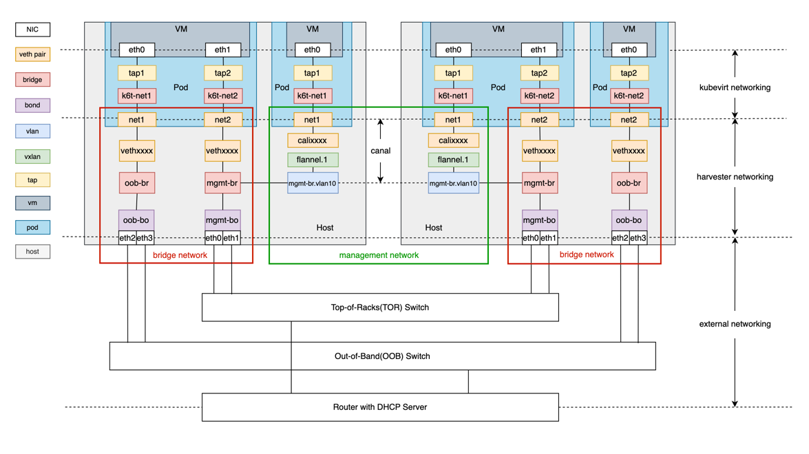

# Harvester Network DeepDive
## Overview
해당 문서는 harvester 네트워크 구조를 깊게 이해하는데 목적이 있습니다.

## 참고 문서
- [Harvester 공식문서_Network deep-dive](https://docs.harvesterhci.io/v1.5/networking/deep-dive/#network-topology)

## 0. Netowkr Topology
Harvester의 전체적인 네트웤 구조는 다음과 같습니다.


## 1. 핵심 사항
Harvester는 KVM 하이퍼바이저 기반의 KubeVirt를 기초로 동작하며, VM 네트워크를 구성하기 위해서 기본적인 K8s CNI(default : canal, flannel + Calico))와 Multus CNI를 사용함.

이때 Harvester 네트워크 구조에서 ***Multus CNI가 핵심.***

[Multus CNI](../../devops/cni/Multus.md)는 K8s Pod에 복수개의 NIC를 등록할 수 있게끔 해주는 CNI. 이를통해 Harvester는 VM, 즉 Pod VM을 실제 상면 네트워크와 Bridge network로 연결하여 통신할 수 있도록 구성함.

## 2. Harvester Network 구성 요소
### Management Network
Harvester 구축 시 자동 생성되는 기본적인 네트워크 대역

이는 다른것이 아니라, Harvester 내부 Kubernetes Clsuter의 CNI인 Canal에 의해 생성된 네트워크 대역임.
따라서 Harvester UI/API, SSH, kubelet, etcd 등의 통신이 모두 이 네트워크를 통해 이루어짐

일반적으로 [network_topology](#0-netowkr-topology)와 같이 ```eth0``` 에 붙으며, 별도 설정이 필요하지 않음.
- **만약 CNI 대역을 수정하고 싶다면, canal 수정 필요.**
### VLAN Network(사용자 정의)
VM이 외부 통신을 위해 사용하는 네트워크 대역.

VLAN ID를 명시하여 물리적 NIC의 trunk 포트를 통해 외부 네트워크와 연결됨.

VM에 직접 VLAN NIC를 할당할 수 있으며, 하이퍼바이저 노드에 Bridge Interface가 만들어지고 실제 VM은 해당 Bridge에 연결되어 통신함.

**이는 Multus CNI를 통해 VM Pod 내부 추가 NIC를 생성하기에 가능한 구조임.**

## 3. 작동 방식
### 1. 시나리오 : VM이 VLAN 100에 속한 사설망에 연결할 경우
1. 관리자는 Harvester UI에서 VLAN ID 100을 가진 ```corp-net``` 이름의 네트워크를 생성함
2. Harvester는 각 노드에 ```br-corp-net``` 이라는 브리지 인터페이스를 생성함
3. 물리 NIC (예: eth1)는 trunk 포트로 구성되어 있으므로, VLAN 100 트래픽이 전달됨
4. VM을 생성하면서 ```corp-net``` 네트워크를 추가하면, VM에 eth1이 붙고 ```br-corp-net```에 연결됨
5. 결과적으로 VM은 VLAN 100 네트워크 상에서 독립적인 IP를 가지게 됨

## 4. 고려사항
### 1. 물리 NIC(VLAN trunking)
- Harvester VM이 외부 네트워크와 연결되기 위해서는, NIC에서 VLAN trunk 모드로 설정되어 있어야 함.

### 2. Bridge 명명 규칙
- Harvester는 다음 규칙에 따라 인터페이스 이름을 생성함.
```bash
br-<네트워크 이름>
```
ex : ```corp-net``` 네트워크 생성 → ```br-corp-net``` 생성됨

### 3. IPAM 설정
- VM에 고정 IP를 할당하려면 Harvester UI 또는 YAML에서 IPAM 설정 필요
- DHCP, static, or no IP 방식 선택 가능

## 4. 결론 및 테스트
실제 VM 내부에서 NIC를 확인해 보면, 다음과 같이 두가지 NIC를 확인할 수 있음.
|인터페이스|이름|목적|할당 방식|
|--|--|--|--|
eth0|관리 네트워크|기본|CNI|
eth1|사용자 VLAN|Multus VLAN|

결론적으로, Harvester는 Pod끼리 통신하기 위한 네트워크는 canal 기반으로 Network Interface를 생성함. VM이 실제 외부와 통신하기 위해선 Multus CNI를 통해 추가 CNI를 구성하고, 해당 CNI는 Host와 Bridge Interface로 연결되어 외부와 연결함.

이때 Brigde Network는 VLAN Trunk모드로 구축되어 있어야 함.

