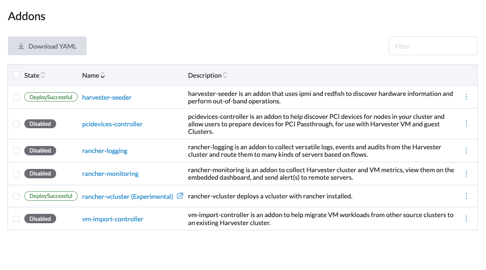
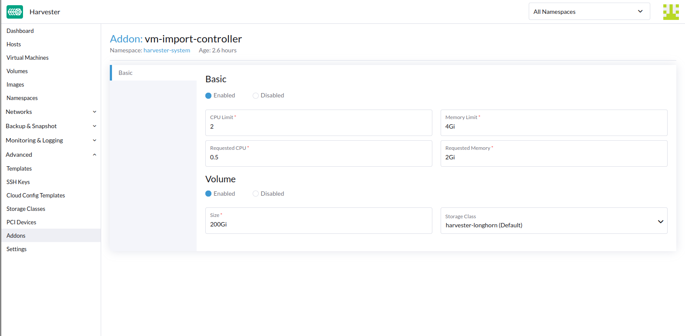

# migration vmware to harvester 
## Overview
vmware에서 harvester로 migration을 위한 확인사항, 절차 정리

## 개념 비교
### 1.1 가상화 타입
- vmware : ESXi
- harvester : KVM(kube-virt 기반)

둘은 Type-1 하이퍼바이저라는 공통점을 가짐

### 1.2 harvester <-> vmware 기능 대조
- [기능대조표](./harvester_vs_vmware_기능대조표.md)

## 방안
### 0. 참고 문서
- [공식 문서 VM Import](https://docs.harvesterhci.io/v1.5/advanced/addons/vmimport)
- [vm-import-controller Code](https://github.com/harvester/vm-import-controller/blob/main/pkg/source/vmware/client.go)
- [VirtualMachineImport Code](https://github.com/harvester/vm-import-controller/blob/main/pkg/apis/migration.harvesterhci.io/v1beta1/virtualmachines.go)

### 1. 방안 1 : VM Import 사용
    해당 방안은 /var/lib/kubelet 에 마운트된 임시 스토리지 사용

    대용량 VM 마이그레이션 할 경우, disk Space 부족으로 스케줄링이 실패할 수 있음.

    PVC 기반 StorageClass 활성화 권장.

    *PVC 크기는, 마이그레이션 대상 VM 중 가장 큰 VM 용량의 2배여야 임시 공간으로 활용이 가능
- harvester의 [vm-import-controller](https://docs.harvesterhci.io/v1.5/advanced/addons/vmimport) 사용
- 해당 Addon은 default로 disable 되어있기 때문에, harvester에서 enable 작업이 필요

#### 지원 source provider
- VMware
- OpenStack

#### 요구사항
1. 네트워크 요구사항
- **Harvester Cluster Node는 VMware vCenter 서버의 SDK 포트(TCP 443)**으로 통신이 가능해야 함.
- **vCenter 내에서 VM Disk 전송 시, ESXi 호스트 관리 포트(TCP 902)**가 사용되므로, Harvester는 해당 포트로 통신이 가능해야 함.
- 양측 간 라우팅/방화벽 정책 허용

| 통신 주체                      | 포트                | 설명                            |
| -------------------------- | ----------------- | ----------------------------- |
| Harvester → vCenter(HTTPS) | TCP 443           | vCenter SDK API (가상머신 조회/제어)  |
| Harvester → ESXi           | TCP 902           | vSphere 데이터 전송 (VMDK 추출/다운로드) |
| 클러스터 내부                    | (TCP 80/NodePort) | 컨트롤러가 노출하는 디스크 파일 전송          |

#### 상세 방법
**1. vm-import-controller Addon Enable**
- 하기 사진처럼. Harvester UI에서 Addons 중 vm-import-controller enable 진행



**2. vm-import-controller 하드웨어 리소스 조절**
- ```/var/lib/kubelet``` 마운트된 임시 스토리지 사용하기에, Volume 설정으로 StorageClass 구성(권장)



**3. VMware DataCenter 접근**
- VMware DataCenter, 인증 정보를 통해 Migration 소스 접근
```yaml
apiVersion: migration.harvesterhci.io/v1beta1
kind: VmwareSource
metadata:
  name: vcsim
  namespace: default
spec:
  endpoint: "https://vscim/sdk" # vCenter SDK Endpoint
  dc: "DCO" # DataCenter 명
  credentials: # 인증 정보
    name: vsphere-credentials
    namespace: default
```
- 이때 vCenter 인증 정보는 K8s Secret에 저장됨
    - *보안적 위협 있을 수 있어 다른방안 강구. (ex: vault)
```yaml
apiVersion: v1
kind: Secret
metadata: 
  name: vsphere-credentials
  namespace: default
stringData:
  "username": "user"
  "password": "password"
```
- dc Endpoint에 대한 인증이 완료되면, 아래처럼 VM Migration에서 사용할 수 있도록 Ready 상태 확인 가능
```bash
$ kubectl get vmwaresource.migration 
NAME      STATUS
vcsim   clusterReady
```

**4. VMware Migration Trigger**
- VirtualMachineImport CRD를 통해 실제 마이그레이션 작업 수행
- source Cluster에 매핑되어 VM Export, Import 작업 가능
```yaml
apiVersion: migration.harvesterhci.io/v1beta1
kind: VirtualMachineImport
metadata:
  name: alpine-export-test
  namespace: default
spec: 
  virtualMachineName: "alpine-export-test"
  # VMware에서 VM이 위치한 폴더 이름,
  # vCenter에서 VM이 보관된 디렉터리 경로
  folder: "Discovered VM"
  # VMware의 네트워크(dvSwitch 등)와 Harvester의 네트워크(VLAN, 네임스페이스/네트워크)를 매핑
  # sourceNetwork: VMware 환경의 가상 네트워크 이름
  # destinationNetwork: Harvester에서 연결할 네트워크. 형식은 "네임스페이스/네트워크이름"
  networkMapping:
  - sourceNetwork: "dvSwitch 1"
    destinationNetwork: "default/vlan1"
  - sourceNetwork: "dvSwitch 2"
    destinationNetwork: "default/vlan2"
  # Harvester에서 가져온 VM 디스크를 저장할 때 사용할 StorageClass 이름
  # Harvester는 Longhorn이나 기타 CSI 기반 스토리지 시스템을 사용할 수 있음
  # 해당 Image는 backing Image로, 용량이 굉장히 큼.. 이슈
  storageClass: "my-storage-class"
  # VMware dc 접근하기 위해 미리 생성한 VmwareSource CRD 정보 기입
  sourceCluster:
    name: vcsim # VMware 소스를 대표하는 CR의 이름 (vcsim)
    namespace: default # VMwareSource가 정의된 네임스페이스
    kind: VmwareSource # 리소스의 종류
    apiVersion: migration.harvesterhci.io/v1beta1 # 리소스를 정의한 API 버전
```

- 해당 과정에서,  컨트롤러는 지정된 소스 VM을 vCenter API를 통해 내보내고 (export), 디스크를 다운로드 받은 뒤 RAW 이미지로 변환
- 이 변환 과정은 VM 디스크 크기에 비례해 시간이 걸릴 수 있으며, 각 디스크당 Harvester에 ```VirtualMachineImage``` 객체가 생성
- 변환된 디스크는 **Harvester의 Longhorn 스토리지에 백업 이미지(backing image)**로 등록된 뒤, 이를 기반으로 새로운 VM이 생성/부팅됨
- 최종적으로 다음과 같은 결과를 확인할 수 있음.

    backing Image 용량이 상당히커질 수 있음. 주의

```bash
$ kubectl get virtualmachineimport.migration
NAME                    STATUS
alpine-export-test      virtualMachineRunning
openstack-cirros-test   virtualMachineRunning
```

#### 실제 마이그레이션 절차
1. ```VmwareSource``` 생성
    - vCenter 접근 정보로 ```VmwareSource``` CRD를 정의한다(예: endpoint: "https://<vcenter>/sdk", dc: "<데이터센터>", credentials 등)
2. Import CRD 생성
    - ```VirtualMachineImport``` 객체를 생성하여 ```virtualMachineName```, 필요한 경우 folder, networkMapping, storageClass, sourceCluster(VmwareSource 참조) 등을 설정한다. 예를 들어 소스 네트워크를 Harvester VLAN에 매핑한다.
3. Controller 실행
    - 컨트롤러가 이 CRD를 감지하면 vCenter에 로그인하여 해당 VM을 전원 종료하고(down) 디스크를 추출(export).
4. Disk 전송 및 전환
    - 추출된 디스크 이미지는 PVC로 다운로드되어 RAW 포멧으로 변환, Longhorn에 backing Image로 등록
5. VM 생성 및 부팅
    - 변환된 디스크 기반으로 Harvester에 새로운 VM 생성/전원 On. 생성된 ```VirtualMachineImport``` 객체의 상태는 성공 시 ```virtualMachineRunning```으로 표시
6. 검증
    - ```kubectl get virtualmachineimport.migration``` 명령으로 상태(virtualMachineRunning)를 확인하여 마이그레이션 완료 여부를 검증한다

#### VM 호환성(DISK, NIC, Driver)
- **VM 하드웨어 버전**
    - vCenter에서 사용 중인 **가상머신 버전(hardware version)이 너무 최신(vSphere 7/8의 21 이상 등)일 경우, KVM이 지원하지 못할 수도 있다.** 변환 전에 호환 가능한 가상 하드웨어까지 낮추거나, Harvester/KubeVirt가 지원하는 범위 내인지 확인해야 한다.

- **디스크 포맷**
    - 소스의 VMDK 디스크(Thick/Thin)에 관계없이 컨트롤러가 이를 RAW 이미지로 변환하여 Harvester에 저장한다. 따라서 **VMDK 특유의 Thin-provisioning이나 다중 extents는 변환 과정에서 일반 파일로 통합된다. 단, 변환 후에는 저장 공간이 늘어날 수 있으며, 오버헤드가 있을 수 있다.**
- **가상 NIC**
    - **VMware의 가상 NIC(vmxnet3 등)가 KVM에서 그대로 지원되지 않을 수 있다. Harvester는 기본적으로 VirtIO나 e1000 같은 NIC를 가상머신에 할당하므로, 소스 VM이 vmxnet3로 설정된 경우 게스트 OS에 해당 드라이버가 없으면 네트워크가 동작하지 않을 수 있다. 특히 Windows 게스트는 VirtIO 드라이버를 미리 설치**해야 한다. Linux 게스트는 대부분 VirtIO를 자동으로 인식하지만, 네트워크 매핑이 올바르게 설정되어 있어야 한다.
- **게스트 드라이버:**
    - VMware Tools, Paravirtual SCSI 드라이버 등은 Harvester로 옮긴 후 필요치 않으며, 대신 VirtIO 드라이버(네트워크, SCSI)를 사용하는 것이 성능상 유리하다. 변환 전에 **VMware Tools를 제거하거나 VirtIO 드라이버를 미리 설치**해 두면 부팅 문제를 예방할 수 있다.

#### 위험 요소
- **스케줄링 실패 위험**
    - **대용량 VM을 임시 스토리지(/var/lib/kubelet 마운트)에 그대로 다운로드하면 노드 디스크가 부족해져 Pod 스케줄링이 실패**할 수 있다. 이를 방지하려면 **반드시 PVC 기반 스토리지를 활성화하여 scratch 공간을 확보**해야 하며, **권장용량은 최대 VM 크기의 2배**로 설정해야 한다. 이를 지키지 않으면 마이그레이션 도중 노드가 용량 부족으로 중단될 수 있다.
- **장시간 전송**
    - VM 디스크 용량이 크면 데이터를 다운로드·변환하는 데 시간이 많이 걸린다. **전송 중 네트워크 오류나 컨트롤러 에러가 발생하면 작업이 중단**될 수 있으며, 중단 시점부터 시도해야 한다. **대역폭과 I/O 성능도 전체 마이그레이션 속도에 영향**을 준다.
- **네트워크 매핑 오류**
    - networkMapping 설정이 실제 환경과 맞지 않으면 일부 NIC가 Harvester의 관리망으로 연결될 수 있다. 이는 네트워크 연결 장애를 일으킬 수 있으며, **사전에 정확한 맵핑 구성이 필요**하다.
- **데이터 손실 가능성**
    - 마이그레이션은 소스 VM 디스크를 복사하는 방식이므로 직접적인 원본 손상 위험은 적다. **다만 전송 중 컨트롤러나 네트워크 장애로 복사가 완전하지 않으면 불완전한 이미지가 생성될 수 있으므로, 소스 VM을 백업해 두거나 마이그레이션 후 정상 부팅 여부를 반드시 확인**해야 한다.
- **성능 저하** 
    - **Harvester 위에서 실행되는 KVM 기반 VM의 I/O 성능은 VMware ESXi보다 낮을 수 있다.** 특히 **소스 VM이 빠른 SAN/NFS 백엔드를 썼다면, Harvester의 Longhorn 블록 스토리지는 네트워크 디스크로서 성능이 떨어질 수 있다.** 또한, **VM 변환 및 이미지 전송 과정에서 클러스터 노드의 CPU와 네트워크 부하가 일시적으로 증가하여 다른 워크로드 성능에 영향을 줄 수 있다.**