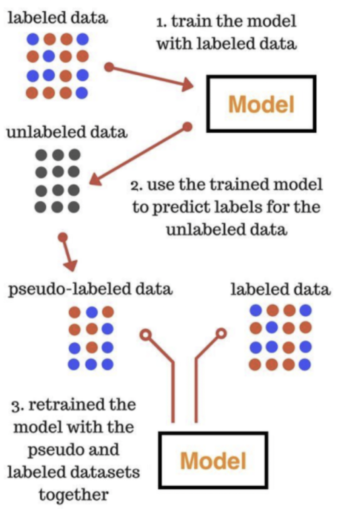
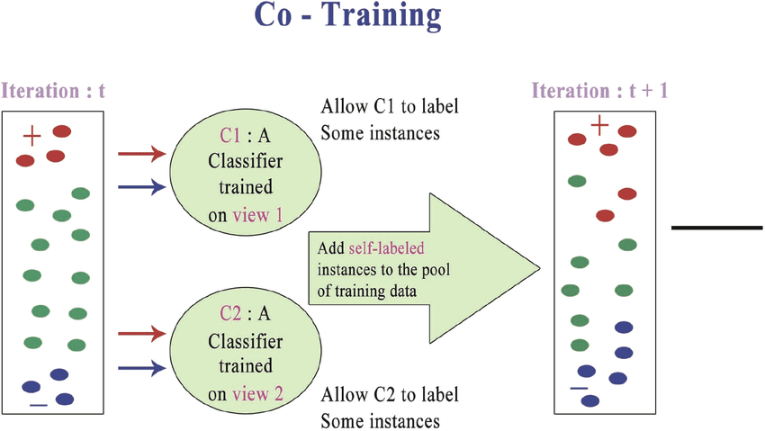
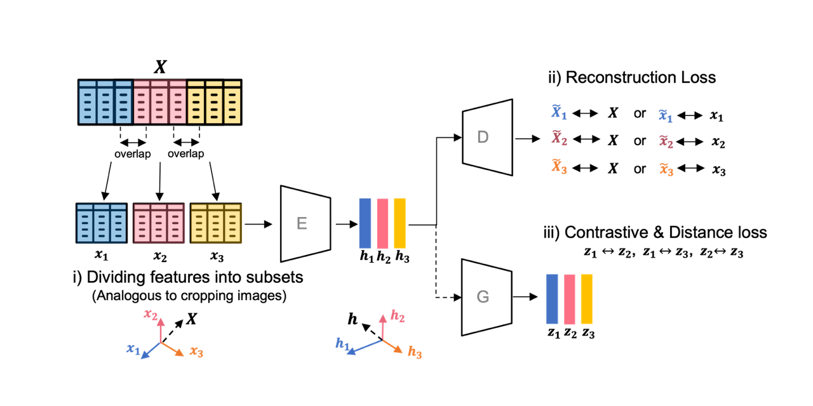

# Data Labeling 
## Data Labeling 이란 ?
기계 학습 및 딥러닝 모델을 훈련하기 위해 필요한 데이터에 의미를 부여하는 과정, 데이터에 주석을 달거나, 레이블을 지정하여 의미를 부여하는 과정

이를 통해 모델이나 컴퓨터가 데이터를 이해하고 원하는 작업을 수행할 수 있도록 돕는 중요한 단계임.

## Data Labeling 예시
데이터 종류는 굉장히 다양하기에, 예시는 무한히 많을 수 있지만 대표적 예시를 통해 이해를 도움

모든 도메인(산업분야) 에서 머신러닝이 도입된다면 모델(컴퓨터) 가 학습 데이터를 이해해야하기 때문에 Data Labeling은 필수적인 단계임.

### Image Labeling
객체 인식, 세그먼테이션, 특정 포인트 지정, 이미지 분류 등 다양한 작업에서 필요함.
- ex) 개와 고양이 이미지를 Labeling해서 개, 고양이를 구분할 수 있도록 함

### Text Labeling
텍스트 분류, 텍스트로 작성한 사람의 감정 분석, 키워드 추출 및 개체명 인식 등 다양한 작업에서 필요함.
- ex) 텍스트 문서에 글의 주제, 감정, 주요 키워드 등을 Labeling 하여 모델이 텍스트를 이해하도록 도움

### Audio Labeling
음악 인식, 음악 분류, 화자 인식. 음성 신호의 특징을 Labeling하여 모델이 오디오를 이해할 수 있도록 돕는다.

## Labeling과 AI 모델 학습 유형
Labeling은 AI 모델 학습 유형과 매우 밀접한 관계를 가지고 있음.

Data Labeling은 답이 정해져있다는것과 같은 의미인데, 그렇지 않은 경우도 있기 때문에 ***Data Labeling이 어떻게 되었느냐에 따라 학습 유형이 달라질 수 있음.***

    Data Labeling은 M/M 가 투입되고 비용도 많이 들기에 , Self-Supervised Learning 방식을 채택해서 사용하는 경우도 있음.

***학습 유형별로 다양한 알고리즘과 학습방법들이 세부적으로 나뉘게 되는데, MLOps의 관점에서는 이러한 다양한학습방법들을 모두 지원하게끔 잘 개발하는것을 목표로 두어야 함.***

***모델 학습유형을 선택할때는 도메인 특성, 데이터 양, 학습 시간 등 많은 기준을 통해 적절한 전략을 선택해야 한다. 이와같은 고려는 MLOps에서도 지원되어야 함.***

학습 유형은 크게 3가지로 나뉨.

- ***1. Supervised Learning***
- ***2. Semi-Supervised Learning***
- ***3. Self-Supervised Learning***

### 1. Supervised Learning
Data에 모든 Labeling이 존재한 상태에서 Learning 방식
- 예를들어 고양이와 개를 나눌 때, 고양이와 개에게 라벨링을 진행한 이후 학습하는 방식

모델은 Labeling 된 데이터를 기반으로 학습하여, 이후 새로운 입력 데이터에 대한 예측을 수행할 수 있음. 모델은 Labeling된 데이터로 학습함.

Supervised Learning 학습 유형으로 Classification, Regression 두가지로 분류될 수 있음.

#### Classification and Regression
- Classification 

    데이터를 여러 클래스 또는 범주로 분류하는 작업을 수행한다. 예를들어 스팸과 정상 메일을 구분하는 문제를 해결함.

- Regression

    연속적인 출력 값을 예측하는 작업을 수행한다. 예를들어 주택 가격 예측과 주식 가격 예측등의 문제를 해결함.

### 2. Semi-Supervised Learning
일부 Data만 Labeling이 존재하며, 나머지는 Labeling이 존재하지 않는 상황에서의 Learning 방식

***모델은 Labeling된 데이터를 통해 스스로 학습하고, 그 특징을 활용하여 Label이 없는 데이터를 예측한다.***

#### Semi-Supervised Learning 방법론
- ***Self training***

    예측을 진행하고 예측에서 높은 확률이 나오면 그 데이터를 labeled data로 치환하고 그렇지 못한 데이터들에 대해서 학습을 시키는 것.

    학습 순서는 다음과 같음.

    1. 레이블이 달린 데이터로 모델을 학습시킴.

    2. 이 모델을 가지고 레이블이 달리지 않은 데이터를 예측

    3. 이중에서 가장 확률값이 높은 데이터들만 레이블 데이터와 합침.

    4. 위 과정을 계속 반복하다보면 정확도가 높은 모델생성.

- ***Co training***

    데이터를 여러 독립적 부분집합 혹은 도메인으로 나누어 모델을 학습하여, Semi-supervised 학습에서의 Labeling 데이터 부족 문제를 해결함.

    각기 다른 모델 두개가 협동해서 학습하는 방식.

    학습 순서는 다음과 같음.

    1. 초기 데이터(라벨링 되어있는 데이터와 되어있지 않은 데이터가 모두 모여있는 데이터) 를 여러 부분으로 나눈다. 

        예를들어 텍스트 데이터를 특정 문장을 기준으로 나눈다.

    2. 독립된 각기다른 모델들이 나누어진 데이터를 대상으로 각각 학습한다. **이때 각 모델은 다른 View(관점) 으로 학습한다.**

        예를들어 모델 A는 1번 View로 , 모델 B는 2번 View로 학습한다.

    3. 각기 다른 모델이 각자 다른 View(관점) 에서 학습한 결과를 공유하며 서로의 예측을 보완한다.

- ***Multi view Learning***

    데이터를 여러 다른 View(관점) 또는 특성을 나누어 모델을 학습시킴.

    데이터의 다양한 특성이 중요한경우 유용함.

    학습 순서는 다음과 같음.

    1. 데이터를 여러 부분 또는 View(관점) 으로 분할함.

        예를들어 이미지 데이터를 픽셀 데이터와 색 공간 데이터로 분할
    
    2. 분할된 데이터를 통해 여러 모델에게 학습시킴.

    3. 각 View에서 얻은 정보를 종합하여 모델을 결합시킴.

### 3. Self-Supervised Learning
Labeling 된 데이터 없이도 모델을 훈련시키는 학습법.

Data에 모든 Labeling이 존재하지 않으며, 모델이 스스로 학습할 수 있도록 설계된 Learning 방식
- 예를들어 고양이 사진을 넣으면 고양이인지 예측하고, 개사진을 넣으면 개인지 예측하는 방식.

데이터 내에서 숨겨진 정보를 활용하여 모델을 학습함.

#### Self-Supervised Learning 방법론
- ***Auto Encoder***
    
    입력데이터를 압축하고 다시 복원하는 네트워크 아키텍처로 Encoder(압축부분) 와 Decoder(복원부분) 로 구성됨.

    **모델은 입력 데이터를 압축하고 다시 복원하는 과정에서, 얼마나 잘 복원됬느냐를 판단하여 정보를 학습하는 방법**

    학습이 완료되면 Encoder의 중간 embedding(특성) 을 활용하여 다른 작업에 모델을 transfer 할 수 있음

- ***Masked Language Model***

    일부 단어를 가리고 해당 단어를 예측하는 Task를 활용함.

    예를들어 `10개 프로젝트로 배우는 MLOps` 라는 문장이 있으면,  `10개 프로젝트로 --- MLOps` 이렇게 단어를 가려버림.

    이후 모델은 문맥을 이해하고 숨겨진 단어를 예측하기 위해 단어간의 관계를 학습함.

    질문을 답하는 모델, 자연어 처리 모델의 사전훈련에서 많이 사용됨.

- ***Contrastive Learning***
    
    **매우 중요함!**

    모델에게 유사한 데이터는 가깝게, 다른 데이터는 멀게 표현하도록 학습시킴.

    모델은 데이터간의 유사성을 학습하여 서로 다른 예제를 구분함.

    예를들어 기준 데이터(Anchor)를 두고, 비슷한 데이터(Positive)는 Anchor와 가깝게 둠, 근데 다른 데이터(Negatives) 는 멀게 둠.

## 일반적 모델 학습 유형
위의 라벨링여부에 따라 모델학습 유형이 나뉘어지는것을 확인할 수 있었는데, 이번엔 일반적 모델 학습 유형을 정리함.

다양하지만 대표적으로 3가지가 있음.

- ***1. Transfer Learning***
- ***2. Fine Tuning Learning***
- ***3. Online Learning & Batch Learning***

### 1. Transfer Learning
이미 훈련된 모델을 그대로 다른 작업에 적용시키는 방법.

사전 훈련된 모델은 보통 대용량 데이터로 학습되기에 다양한 특징을 추출할 수 있는데, 이를 새로운 작업에 Transfer 하는데 사용함.

- ex ) 이미지 분류할때 사전 훈련된 ResNet , VGG 모델을 그대로 의료 이미지 분류나 식물 종류 분류에 사용함. 
    
    또한 자연어 처리에선 GPT와 같은 모델을 자체적인 문서 분류나 감정 분류에 활용하는것.

### 2. Fine Tuning Learning
Transfer Learning의 한 형태로, 사전 학습된 모델을 새로운 작업에 조정하는 과정임.

모델의 일부 레이어를 고정하거나 새로운 레이어를 추가하여 작업에 맞게 모델을 튜닝하는것.

- ex ) 사전 훈련된 ResNet, VGG 모델을 의료 이미지 분류나 식물 종류 분류 데이터에 학습시켜서 모델을 학습시키고 활용함. 

    또한 자연어 처리에선 GPT와 같은 모델에 자체적 문서분류나 감정 분석에 쓰일 추가적인 데이터를 학습시켜서 활용함.

### 3. Online Learning & Batch Learning
기본적으로 먼저 Batch Learning으로 필요한 모델을 생성하고, 스트리밍 데이터가 도착할때마다 Online Learning을 진행해서 지속적으로 해당 모델을 학습시킴.

#### Online Learning
데이터를 순차적으로 처리하며 모델을 업데이터 하는 방식.

스트리밍 데이터, 즉 새로운 데이터가 도착할 때 마다 Fine Tuning Learning을 진행하여 지속적으로 학습시키는것에 유용함.

#### Batch Learning
데이터셋을 가지고 있는 상태에서 한번에 모델에 입력하는 전통적 방식