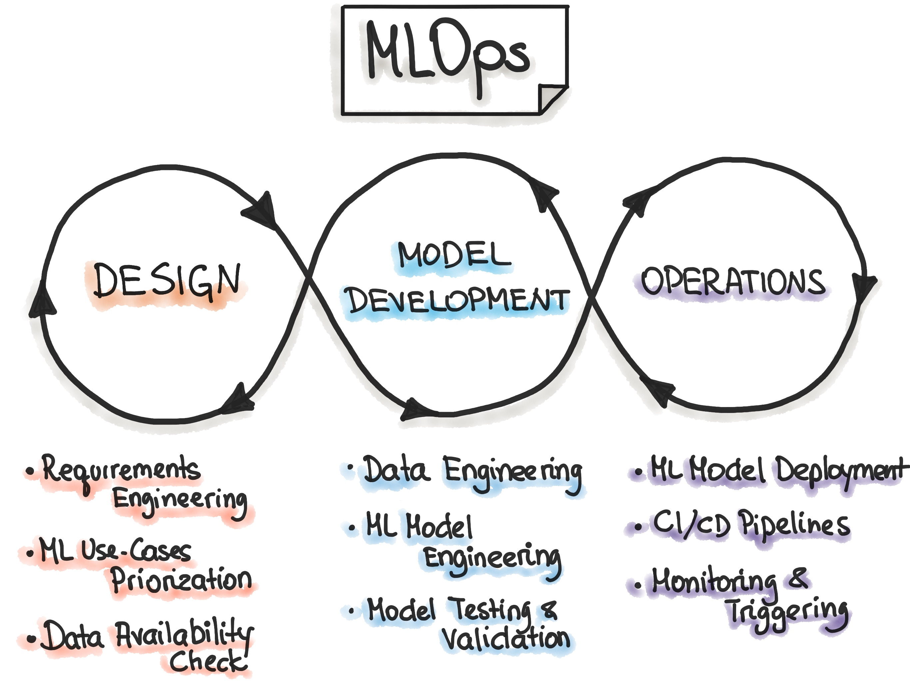

# Software System vs 머신러닝
## Normal Software vs ML Software
일반적 Software는 입력이 들어가서 출력이 나온다.

ML Software는 알고리즘과 데이터로 만들어진 패턴(Machine Learning Model) 에게 입력을 주어서 기대하는 출력값을 얻는것.

### Software System
명시적(이미 정해놓은) 알고리즘과 규칙에 따라 동작하며 일련의 작업을 수행.

예측이 가능하고 일관된 성능을 제공하며, 오류가 발생했을때 예외처리가 가능함. 그러나 예상치 못한 상황에 적응이 어렵고 새로운 규칙이나 컴파일이 필요할 때 재 배포과정이 필요

DevOps를 도입하여 Software System의 단점을극복함.
- 개발과 운영을 통합시켜서 자동화시키고 CICD (지속적인 통합과 지속적 배포)를 도입하여 개발과 운영의 릴리즈속도를 줄여 예상치 못한 상황(버그) 에 빠르게 대응하고 요구사항을 빠르게 충족함

### ML System
#### 머신러닝 ?
컴퓨터 시스템이 데이터에서 패턴을 학습하고 예측을 수행하는 인공지능 분야의 하나.

예측 불가능한 상황에서도 머신러닝은 데이터를 기반으로 스스로 학습하여 결정함.

#### 머신러닝의 주요 원칙
**1. 학습 (Learning)**

    머신러닝은 데이터로부터 학습하며 모델이 데이터의 패턴과 관계를 파악

**2. 예측 (Prediction)**

    학습한 모델을 사용하여 새로운 데이터에 대한 예측을 수행

**3. 일반화 (Generalization)**

    모델은 학습한 데이터를 기반으로 새로운 데이터에 대한 일반적 패턴을 찾음

### 머신러닝 주요 유형
**1. 지도 학습**

    데이터셋의 레이블(정답) 이 지정된 데이터를 사용하여 모델을 학습하고 예측함

**2. 비지도 학습**

    데이터셋의 레이블(정답) 이 없는 데이터를 기반으로 모델이 패턴을 찾음

**3. 강화 학습**

    모델이 환경에서 행동을 취하고 보상을 받으며 최상의 전략(패턴) 을 학습

### 머신러닝 생성 프로세스
1. 데이터 수집 및 저장
    - 학습을 위해 데이터를 수집하고 준비
2. 데이터 전처리
    - 데이터 정제, 누락된 값 처리 등의 작업 수행
3. 모델 선택
    - 적절한 머신러닝 알고리즘 구현
4. 모델 학습
    - 정제가 완료된 데이터로 학습
5. 모델 평가
    - 모델의 성능을 평가하고 필요에 따라 모델을 튜닝
6. 예측
    - 학습된 모델을 사용하여 새로운 데이터에 대한 예측 수행

### 머신러닝 도전과 한계
머신러닝은 모르는 데이터에대해서도 높은 정확도를 가져야하기 때문에 , 데이터 품질, 과적합, 데이터 양, 해석 가능성 등 다양한 측면을 신경써야함.

또한 항상 최상의 예측결과가 나오지않기 때문에, 선택한 모델의 한계를 정확히 이해하고 사용해야 함

## MLOps
[이미지 출처 : ml-ops.org](https://ml-ops.org/)

***MLOps는 모델의 개발, 배포, 운영을 자동화하고 지원하는 시스템.***

모델의 생명주기 전반을 관리하고 최적화하기 위한 접근방식.

### 머신러닝 시스템(MLOps) 주요 원칙
1. 자동화
    - 개발, 테스트, 배포 등 모든단계의 자동화 도입
2. 협력
    - 데이터 사이언티스트, 엔지니어, 운영팀 간의 협력과 의사소통
3. 지속적 통합(CI)
    - 지속적으로 코드를 통합하여 발생된 문제에 빠르게 대응하고 요구사항을 빠르게 충족시킴
4. 지속적 배포(CD)
    - 지속적 배포로 모델을 빠르게 업데이트하여 릴리즈함
5. 모델 모니터링
    - 운영중 모델 성능을 감시하여 이상징후를 식별
6. 모델 버전 관리 
    - 모델의 버전 관리를 통해 모델 업데이트 및 롤백 관리

# DevOps vs MLOps
|DevOps|비교 사항|머신러닝 시스템|
|--|--|--|
|매우 중요|자동화 필요성|매우 중요|
|소프트웨어 개발 운영 프로세스 개선|대상|***데이터로부터 학습하고 패턴을 발견함***|
|소프트웨어 릴리즈 주기를 단축, 운영|목적|소프트웨어 목적 + ***데이터 분석과 예측을 통해 의사결정을 지원하거나 자동화함***|
|CICD + 프로그래밍|프로세스|CICD + ***데이터준비/엔지니어링/모델학습/평가/예측 의 많은단계가 있음***|
|품질 검증|검증 단계|품질 검증 + ***예측결과 해석***|
|주요하게 작용하지 않음|해석 가능성|***매우 중요함***|
|CICD 도구|도구와 기술|CICD 도구 + ***머신러닝 프레임워크 + 데이터 시각화 도구***|
|소프트웨어 개발팀 + 운영팀|협업 및 의사소통|***데이터 과학자, 엔지니어, 비즈니스 전문가, 영업팀***|
|Small Data|데이터 저장 Storage|***Big Data***|

