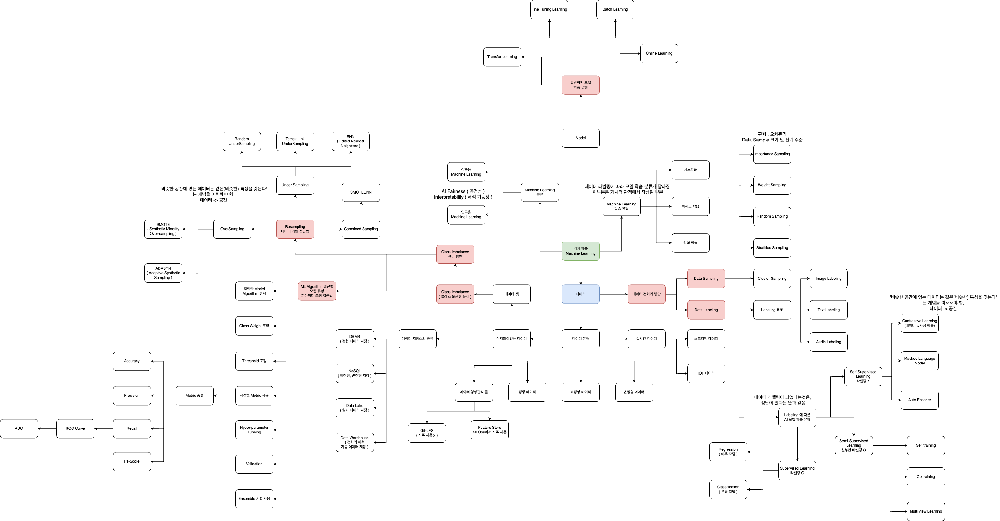

# MLOps Study
해당 폴더는 MLOps에 대해 공부한 이력을 작성해둔 폴더 입니다.

## MLOps Study Mindmap
- 초록색 : 시작
- 파란색 : 중요정보 시작
- 빨간색 : 하위 계층까지 모두 중요

## Repository RoadMap
### 1. [연구용(Research) ML vs 상품용(Production) ML](./연구용_ML_vs_상품화_ML.md)
    연구용 ML과 상품용 ML을 비교함으로써 AI의 주요 특성을 이해하고 ML 이 무엇인지 파악함.

### 2. [Software vs ML](./Software_vs_ML.md)
    Software와 머신러닝을 비교하면서 머신러닝이 무엇이고 어떤 원칙을 가지는지 확인하고 MLOps와 DevOps를 비교함.

### 3. [ML 상품화 과정](./ML_상품화_과정.md)
    모델을 상품화하기 위해 여러 과정을 거침. 이러한 과정들을 숙박어플 개발 이라는 예시를 두어 설명함.

### 4. [Data 유형 및 관리 방안](./학습용_Data_유형_및_관리방안.md)
    모델에게 학습시키기 위한 데이터의 종류들과 특징을 알아보고, 어떻게 관리되고 어디에 저장되는지, 나아가 어떻게 관리해야할지 파악함.

### 5. [Data Sampling](./Data_Sampling.md)
    수집된 빅 데이터를 Sampling 과정을 거쳐서 의미있는 작은 데이터 셋으로 바꾸는 방법과 의의에 대해 파악함.

### 6. [Data Labeling](./Data_Labeling.md)
    MLOps 구현 전 , 데이터 라벨링에 대해 학습하고 라벨링 기준 또는 일반적인 다양한 학습 유형에 대해 파악함.

### 7. [Class Imbalance](./Class_Imbalance/Class_Imbalance.md)
    Class Imbalance, 즉 데이터 불균형 문제에 대해 학습함.

- ### 7.1 [데이터 접근 방법론](./Class_Imbalance/데이터_접근_방법론_(Resampling).md)
        클래스 불균형 문제를 해결하기 위해서, 데이터 자체를 조작하는 여러가지 알고리즘 방법론에 대해 파악함.

- ### 7.2 [ML 알고리즘 방법론](./Class_Imbalance/ML_알고리즘_방법론.md)
        ML 알고리즘을 통해 클래스 불균형 문제를 해결하기 위한 방법론에 대해 파악함.

- ### 7.3 [대표적 Class Imbalance 성능평가 지표](./Class_Imbalance/Class_Imbalance_성능평가_및_선택.md)
        대표적인 모델 성능평가 지표를 확인하고, Class Imbalance 문제가 발생했을 경우 어떤 Metric(성능평가 지표) 가 적합한지 학습함.

- ### 7.4 [MLOps 와 Class Imbalance](./Class_Imbalance/MLOps_와_Class_Imbalacne.md)
        MLOps 관점에서 Class Imbalacne 문제를 어떻게 이해하고 파악하고있어야 하는지, 대응은 어떻게하는것이 좋을지 생각하고 학습함.

## OverView
### 용어정리
***AI의 목표는 인간 수준의 학습과 추론 능력을 컴퓨터에게 부여하는 것***

#### MLOps 란 ?
기계 학습(머신 러닝) 모델을 효과적으로 관리 배포 및 유지보수 하기 위한 방법과 프로세스를 가르키는 용어
#### 머신러닝 상품화
AI 모델을 실제 제품 또는 서비스에 통합하여 상업적으로 활용 가능한 형태로 전환하는 과정

#### DevOps
소프트웨어 개발과 IT 동작(상품화) 간의 협력, 통합 및 자동화를 강조하는 소프트웨어 개발 및 배포 프로세스를 가리키는 용어

#### 자동화
개발과 시스템운영 에서 반복적인 사람 노동을 소프트웨어적으로 자동화하는것. 인프라가 코드로 관리

#### CICD
CI : 변경된 코드를 빠르게 통합하고 품질 검증을 자동화
CD : 소프트웨어 버전 업데이트를 빠르게하여 사용자에게 제공하기 위한 자동화

#### 스케일링
시스템에 더 많은 요청을 처리할 수 있도록 크기를 키우는것

#### 기계 학습 (Machine Learning)
데이터를 기반으로 패턴을 학습하고 예측을 수행하는 컴퓨터 과학 분야

#### AI vs 머신러닝
기계학습은 인공지능의 하위 분야로 , 기계학습을 통해 AI 시스템을 개발함.

#### Hyperparameter
모델 학습 전에 설정되는 파라미터로, 학습 과정 자체를 제어하는데 사용됨. 

모델의 성능과 학습 속도에 직접적인 영향을 미치며, 자동으로 학습되지 않기 때문에 사용자가 사전에 정의하고 최적화해야 함.

#### 데이터 셋
모델을 훈련, 검증, 테스트하는 데 사용되는 데이터의 집합. 

데이터 셋은 일반적으로 여러 입력(Features)과 해당 출력(Labels)으로 구성되며, 출력은 모델이 예측하려고 하는 정답 또는 결과. 

특히, 정답이 포함된 데이터 셋을 **정답 셋(Ground Truth Set)**이라고 함. 

이 용어는 주로 지도 학습(Supervised Learning) 상황에서 사용되며, 모델이 학습하는 동안 정확한 예측을 할 수 있도록 정답(실제 값)을 제공.

#### Labeling
라벨링 혹은 레이블링 , 특정 객체에 의미를 부여하는 프로세스.

#### Threshold
모델이 어떠한 추론을했을때, 특정 확률값이 나옴. 이 확률값을 보통 50%로 두고, 50% 이상이면 정답, 50% 이상이면 오답이라 생각하는데 이 확률값을 **Threshold** 이라 함.