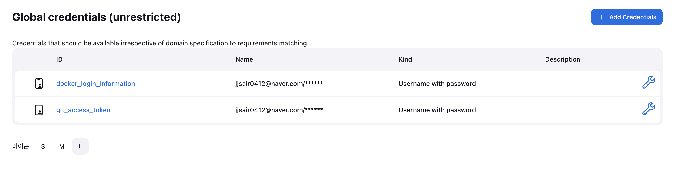
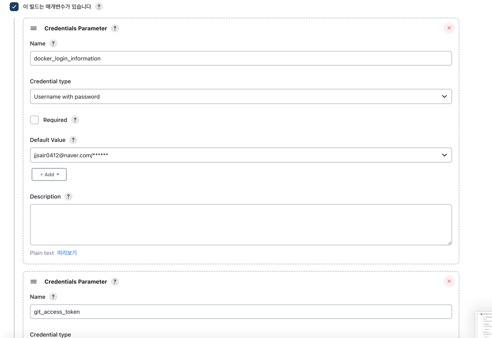

# Jenkins와 ArgoCD를 이용한 CICD Workload 구축
해당 문서는 Gradle 기반의 Sample Java Application을 Jenkins를 이용하여 Docker Image를 생성하고, ArgoCD를 이용해 해당 Image로 Kubernetes에 배포하는 과정에 대해 기술하였습니다.

## 1. 사전 설치작업
storageClass는 구축되어있다는 가정 하에 설치를 진행합니다.
```bash
kubectl get sc
NAME                 PROVISIONER          RECLAIMPOLICY   VOLUMEBINDINGMODE   ALLOWVOLUMEEXPANSION   AGE
hostpath (default)   docker.io/hostpath   Delete          Immediate           false                  7d14h
```

### 1.1 Jenkins 설치
helm chart를 통해 jenkins를 설치합니다.

***Jenkins를 설치합니다.***
```bash
$ kubectl create namespace jenkins

$ helm repo add jenkinsci https://charts.jenkins.io

$ helm repo update

$ helm pull jenkinsci/jenkins --version 4.9.1 --untar

$ helm upgrade --install jenkins . -n jenkins -f values.yaml
```

설치 상태를 확인합니다.

```bash
$ kubectl get all -n jenkins                                                                                                                               jujinseong-ui-MacBookAir.local: Tue Dec 12 14:36:14 2023

NAME            READY   STATUS    RESTARTS   AGE
pod/jenkins-0   2/2     Running   0          2m2s

NAME                    TYPE        CLUSTER-IP       EXTERNAL-IP   PORT(S)     AGE
service/jenkins         ClusterIP   10.100.147.103   <none>        8080/TCP    2m2s
service/jenkins-agent   ClusterIP   10.108.41.125    <none>        50000/TCP   2m2s

NAME                       READY   AGE
statefulset.apps/jenkins   1/1     2m2s

$ kubectl get pvc -n jenkins
NAME      STATUS   VOLUME                                     CAPACITY   ACCESS MODES   STORAGECLASS   AGE
jenkins   Bound    pvc-fe775f06-cd7f-4bad-86ea-22f0819c094c   8Gi        RWO            hostpath       2m28s
```

Jenkins용 Ingress를 구성합니다.
```bash
apiVersion: networking.k8s.io/v1
kind: Ingress
metadata:
  name: jenkins-ingress
  namespace: jenkins
  annotations:
    kubernetes.io/ingress.class: "nginx"
    ingress.kubernetes.io/rewrite-target: /
spec:
  tls:
  - hosts:
    - jinseong.xxx.com
    secretName: ingress-tls
  rules:
  - host: jinseong.xxx.com
    http:
      paths:
      - pathType: Prefix
        path: /
        backend:
          service:
            name: jenkins
            port:
              number: 8080
```

아래 명령어로 admin 계정의 default password를 확인합니다.
```bash
$ kubectl exec --namespace jenkins -it svc/jenkins -c jenkins -- /bin/cat /run/secrets/additional/chart-admin-password && echo
```

### 1.2 ArgoCD 설치
ArgoCD는 생성되어잇는 yaml manifest파일들을 통해 설치합니다.

```bash
$ kubectl create namespace argo

$ kubectl apply -n argo -f https://raw.githubusercontent.com/argoproj/argo-cd/stable/manifests/install.yaml
```

argocd ingress를 구성합니다.
```bash
apiVersion: networking.k8s.io/v1
kind: Ingress
metadata:
  name: argocd-server-http-ingress
  namespace: argo
  annotations:
    kubernetes.io/ingress.class: "nginx"
    ingress.kubernetes.io/rewrite-target: /
    nginx.ingress.kubernetes.io/force-ssl-redirect: "true"
    nginx.ingress.kubernetes.io/backend-protocol: "HTTPS"
spec:
  rules:
  - host: "jinseong.xxx.xxx.net"
    http:
      paths:
      - pathType: Prefix
        path: /
        backend:
          service:
            name: argocd-server
            port:
              number: 80
  tls: # TLS를 생성하지 않았다면 , 해당 key와 value들 제거
  - hosts:
    - jinseong.xxx.xxx.net
    secretName: # tls secret name

---
apiVersion: networking.k8s.io/v1
kind: Ingress
metadata:
  name: argocd-server-grpc-ingress
  namespace: argo
  annotations:
    kubernetes.io/ingress.class: "nginx"
    nginx.ingress.kubernetes.io/backend-protocol: "GRPC"
spec:
  rules:
  - host: "dev-jinseong.xxx.xxx.net"
    http:
      paths:
      - pathType: Prefix
        path: /
        backend:
          service:
            name: argocd-server
            port:
              number: 80
  tls: # TLS를 생성하지 않았다면 , 해당 key와 value들 제거
  - hosts:
    - dev-jinseong.xxx.xxx.net
    secretName: # tls secret name
```

아래 명령어로 admin 계정의 default password를 알아냅니다.

```bash
$ kubectl -n argo get secret argocd-initial-admin-secret -o jsonpath="{.data.password}" | base64 -d && echo
```

## 2. yaml template 생성
ArgoCD에서 배포하기위한 helm chart를 구성합니다.
- [helm chart](https://github.com/jjsair0412/sample-code-cd) 레포지토리를 사용합니다.

Helm chart 및 yaml template이 모여있는 GIT에 Token값을 발급받습니다.


## 2. CICD 구축
먼저 Jenkins plugin중 ***Docker Pipeline*** 을 설치해야 합니다.

Jenkins ci scrpit 중 withDockerRegistry 에서 사용합니다.
```bash
withDockerRegistry([ credentialsId: "$docker_login_information", url: ""]) {
    sh '''
    docker push jjsair0412/test:$BUILD_NUMBER
    '''
}
```

사용할 sample Application은 다음 Repository에 위치합니다.
- https://github.com/jjsair0412/sample-code


### 2.1 Jenkins CI 스크립트 작성
Jenkins CI 스크립트를 구축합니다.

keypoint로 , Kubernetes에 Jenkins를 배포하였기 때문에 Docker in Docker 설정과, agent pod template을 구성해야 합니다.
- [관련 문서](../../cicd/springBoot-gradle/springBoot%20(%20gradle%20)%20jenkins%20pipeline/)

#### 2.1.1 scrpit 작성 시 주의할사항
Gradle build -> docker build -> docker push 로 CI 스크립트를 작성합니다.
- [ci scrpit](../jenkins_argocd_cicdworkload/jenkins_ci_sc.sc)

해당 스크립트의 전반적인 과정은 다음과 같습니다.

1. git clone (실제소스코드)
2. docker build (소스코드빌드 후 이미지 생성)
3. helm chart git clone (helm chart clone)
4. chart의 values.yaml에서 image tag를 현재 build number로 바꿈으로써 최신 이미지 태그와 맞추기
5. helm chart git push
6. docker push
7. docker clean

이때 , 바로직전의 image tag번호를 얻기 위해 ```$previousTAG``` 전역변수를 사용합니다.

주의할점은 . ```$previousTAG``` 같은 Grovy 전역변수를 사용하는 곳은, ```$sh """ ~~~ """```$ 이렇게 쌍따움표를 꼭 사용해주어야하며, 다른부분은 ```sh ''' ~~~ '''``` 을 사용해주면 됩니다.

- Grovy 변수사용 부분
```grovy
sh """
    cd sample-code-cd
    
    sed -i 's|repository: jsair0412/test:$previousTAG|repository: jsair0412/test:${env.BUILD_NUMBER}|g' ./helm/app/values.yaml
"""
```
 
- Grovy 변수 사용 안하는 부분
```grovy
sh '''
cd sample-code-cd

cat ./helm/app/values.yaml

# Git commit and push
git add .
git commit -m "Update image tag"
git push origin main
'''
```

추가로, **sh 명령어가 생긴 경우엔 새로운 bash shell이 열렷다고 생각해야하기 때문에, 파일이 있는 위치로 cd 작업을 수행해야 합니다.**

#### sed 명령어 사용법

    sed 명령어를 통해 파일내부 특정 문자열을 새로운 문자열로 변환합니다.

    sed -i 's/기존문자열/바꿀문자열/g'

    g 는 옵션인데, g가 들어가면 매치되는 모든 문자에 대해 해당 명령을 수행한다는 의미
    
    -i 는 옵션인데, 옵션을 사용하면 파일의 내용을 직접 변경할 수 있습니다.

    예를들어 sed -i 's/apple/orange/g' 파일명은 파일 내의 모든 'apple'을 'orange'로 변경합니다.

    / 를 | 로 사용해도 무관합니다.


#### 2.1.2 Global credentials 추가
추가로, CI 스크립트에서 사용할 DockerHub의 login 정보를 Jenkins의 Global credentials 에 Username with Password kind로 만들어 둡니다.

GIT의 credentialsId 정보 또한 Jenkins의 Global credentials 에 Username with Password kind로 만들어 둡니다.



그 후, Pipeline으로 돌아와서 빌드 매개변수를 추가합니다.
- Name 칸에는 script 에서 실제로 사용할 변수명을 할당하고, Value칸에 Global credentials 에 생성해둔 credentials을 알맞게 선택합니다.




ci 스크립트를 실행하면, 스크립트에 작성해둔 pod template을 통해 jenkins agent pod가 실행되는것을 확인할 수 있습니다.
```bash
$ kubectl get pods -n jenkins

NAME               READY   STATUS    RESTARTS   AGE
jenkins-0          2/2     Running   0          67m
test-kq9hm-v5mg0   3/3     Running   0          10s
```

#### 2.1.3 Dockerfile
Dockerfile은 다음과 같습니다.
- MultiStage 기법을 적용하여 최적화
    - [MultiStage 관련 문서](../about_docker/Dockerfile_Multi_Stage/)

```Dockerfile
FROM openjdk:17-jdk-slim AS build

WORKDIR /app

COPY ./gradlew /app/
COPY ./gradle /app/gradle

COPY . /app/

RUN ls -al

RUN chmod +x ./gradlew

RUN ./gradlew clean build

FROM openjdk:17-jdk-slim
WORKDIR /app

COPY --from=build /app/build/libs/*.jar /app/

RUN ls -al /app/

EXPOSE 8080

ENTRYPOINT ["java","-jar","/app.jar"]
```


### 2.2 ArgoCD에서 CD 수행
ArgoCD를 통해 Kubernetes Cluster로 해당 Application을 배포합니다.

Jenkins ci 가 진행되었을 때, 빌드된 Image는 빌드 Number값으로 Tag를 가지기 때문에, 항상 다릅니다.

따라서 helm chart 또는 yaml template이 있는 github repository에 push가 생기는 순간에 ArgoCD가 Sync 작업을 수행하면 됩니다.