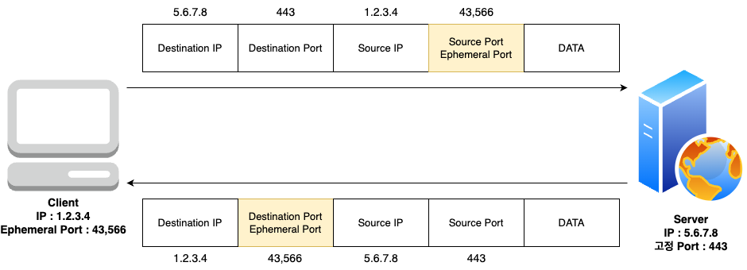

# 임시 포트?
## Overview
서버와 클라이언트가 연결될 때, 기본적으로 포트가 필요합니다.

클라이언트에서 목적지 서버로 갈 때는 , 어떤방법이던간에 Request에는 목적지의 CIDR와 포트 번호를 알 수 있습니다.

근데 , **서버에서 클라이언트로 해당 Request의 대한 Response를 전달할 땐, 클라이언트의 포트가 없는데 어떻게 요청이 오냐면 , Ephemeral Ports, 임시 포트를 사용합니다.**

## 작동 방식
임시 포트는 클라이언트 사용자에 OS에 따라 할당되는 포트번호가 달라집니다.
- ***Window일 경우 :*** 49,152 ~ 65,535
- ***Linux Kernels 사용할 경우 :*** 32,768 ~ 60,999

1. 클라이언트가 요청을 보낼 때, 자신의 임시 포트번호( Ephermeral Port )를 Request에 달아서 보냅니다.

2. 서버는 클라이언트에게 Response를 보낼 때, Client가 전송해준 임시포트( Ephermeral Port ) 로 목적지 Port를 설정하여 응답을 보내게 됩니다.

- 아키텍처

