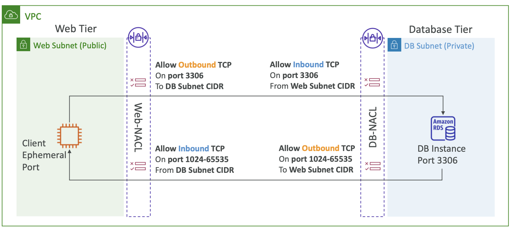

# NACL
## 0. What is NACL ?
>NACL은 Network ACl의 약자

NACL은 서브넷 계층에서 작동하는 트래픽 방화벽 입니다.

## 2. NACL deepDive
서브넷 사이의 트래픽에 대한 방화벽과 비슷한 친구.

서브넷마다 한개의 NACL을 가질 수 있고, 새로운 서브넷에는 default NACL이 할당됨.

### 2.1 NACL 규칙
#### 2.1.1 우선순위
NACL Role들이 여러개 있을 경우, 우선순위를 가질 수 있는데, 해당 우선순위는 숫자로 판단됨.
- 1부터 32,766 의 숫자를 가질 수 있음
    - 10.0.0.10/32 CIDR에 대해서 허용하는 NACL이 100, 
    - 10.0.0.10/32 CIDR에 대해서 차단하는 NACL이 200,
    - 위처럼 설정되어 있다면 , 100을 가지는 허용 NACL이 적용됨.

#### 2.2.2 권장 사항
AWS에선 우선순위 숫자를 100단위로 적용하는것을 권장함.
- 이유는 중간에 끼워넣기 좋아서

### 2.2 NACL 사용 사례
NACL로 특정 IP 주소를 차단할 수 있습니다.

## 3. Default NACL
### **기본생성 NACL은 , 모든 요청을 허용하는 특수성을 가짐**

## 4. 보안그룹 vs NACL
가장 큰 차이점으론 , **NACL은 Stateless 하지만 , 보안그룹은 Stateful 하다는것** 입니다.

### 4.1 Stateless한 NACL
>단순히 생각하면, NACL은 들어갈땐(inbound) 허용됐더라도 나올때(outbound) 막혀있으면 못나와서 Stateless
>
>보안그룹은 들어갈때(inbound) 허용되어있으면 나올때도 무조건허용되서 Stateful

- 보안 그룹

        보안 그룹은 , StateFul한 특성을 갖고잇습니다.

        그러한 이유는 , Inbound Role에서 특정 트래픽을 허용하게 되면 , 
        해당 트래픽의 응답이 자동으로 허용되기 떄문입니다.

        그말은 , Inbound에서 허용된 IP에 대해선 Outbound Role을 확인하지 않아도 허용하게 됩니다.

        outbound role을 아예 삭제해버리더라도, inbound에서 허용되면 응답또한 밖으로 나갑니다.

        근데  outbound가 막혀있으면 , instance 내부에서 밖으로 나가는건 막힙니다.

        따라서 정리하면 , outbound가 막혀있을 경우 instance 내부로 들어온 요청에 대해서 허용됐다면 응답또한 허용되지만.. instance 내부에서 밖으로 나가는건 허용되지 않습니다.

- NACL

        그러나 , NACL은 Stateless 한 특성을 가집니다.

        그러한 이유는 , NACL은 보안 그룹과 다르게 각 패킷을 개별적으로 평가하고, 
        Inbound와 Outbound를 모두 충족해야만이 해당 IP에 대한 트래픽을 허용하기 때문입니다.

### 4.2 적용 범위
- 보안 그룹

        인스턴스 수준에서 작동

        특정 EC2 Instance에 대한 트래픽을 허용하거나 차단하는데 사용

- NACL

        서브넷 수준에서 작동

        특정 서브넷 내에서의 트래픽을 허용하거나 차단하는 데 사용

### 4.3 규칙 타입
- 보안 그룹

        허용 규칙만 있음, 차단규칙 없음

- NACL

        허용규칙 및 차단규칙 둘다 있음.

## 5. NACL에서의 임시 포트
먼저 임시포트에 대해 알아야 합니다.
- [NACL-임시포트-문서](../VPC/NACL-임시포트.md)

NACL에서 임시 포트는 주요하게 작동합니다.

### 5.1 작동방식
- Request_Client_TO_Server
    1. 웹 클라이언트의 Subnet NACL outboud에선 3306번 포트와 CIDR는 Backend DB Subeet를 Target으로 허용 
    2. DB Subnet NACL Inbound에서 3306 포트와 Web Client Subnet의 CIDR를 허용

- Response_Server_TO_Client
    1. DB Subnet NACL Outbound에서 **Client 요청시 받은 임시포트와 Client Subnet CIDR를 Target으로 허용**
    2. 웹 클라이언트 Subnet NACL Inbound에서 **임시포트와 DBSubnet CIDR를 허용**

## 6. 다중 서브넷을 가지는 NACL
### NACL은 여러 서브넷을 포함할 수 있기 때문에, 각 NACL 조합이 상대방의 모든 서브넷를 허용하는지 확인해야만 합니다.

## 7. NACL과 보안그룹을 같이 사용하는 이유
### 7.1 다중 보안 계층
NACL에선 서브넷에 대해서 광범위한 트래픽 필터링을 제공하고, 보안그룹은 특정 인스턴스에 대해 트래픽을 세밀하게 제어할 수 있기 때문에 , 위험 트래픽이 보안그룹을 뚫고다니는걸 NACL에서 1차적으로 막을 수 있음.

### 7.2 유연성
NACL에서 광범위하게 조절, 보안그룹에서 세밀하게 조절

### 7.3 상호보완성
NACL은 허용과 비 허용이 가능하지만, 보안그룹은 허용만 가능. 따라서 둘은 상호 보완적이기 때문에 NACL을 이용해 여러 서브넷에 대한 광범위 트래픽을 모아서 처리하고, 보안그룹으로 서브넷 내부 인스턴스에대해 트래픽 조절 가능

### 7.4 보안 강화
필요한것만 허용하고 나머진 다 차단한다는 네트워크보안의 기본을 잘 조절할 수 있음.