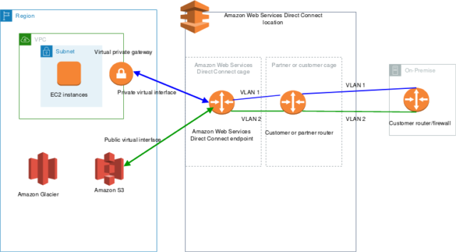
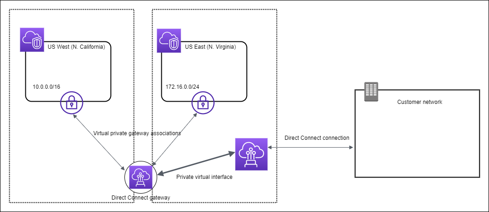

# Direct Connect (DX)
## 1. Direct Connect란 ?
원격 온프레미스 네트워크로부터 AWS VPC로의 전용 Private 연결을 제공합니다.

AWS환경에 바로 연결되는 것이 아닌 Direct Connect Location을 거쳐 AWS 환경으로 연결됩니다.

따라서 Public Network를 통하지 않고 Private Network로만 AWS Public Resource(S3 등) 에 접근할 수 있기 때문에 비용면에서도 이득이 많습니다.

### 장점
비용 절감 및 속도에 있어서 장점이 있습니다.

Public Internet 을 통하지 않아도되기 때문에 속도가 빠르고 비용이 절약되기 때문입니다.

## 2. Direct Connect Gateway
온프레미스(외부) 네트워크에서, AWS상 각기 다른 리전에있는 하나 이상의 VPC와 연결하고 싶을 때 Direct Connect Gateway를 사용합니다.

고가용성, Fail-over를 위해 Direct Connect를 여러 개로 구성하는 것도 가능합니다.

### 2.1 특징
Direct Connect 는 암호화 기능이 없어서 데이터가 암호화되지 않지만, Private Connect기 때문에 보안유지가 가능합니다.

만약 암호화를 원한다면, Direct Connect와 VPN을 함께 구성하여, 암호화된 Private Connect가 가능합니다.

