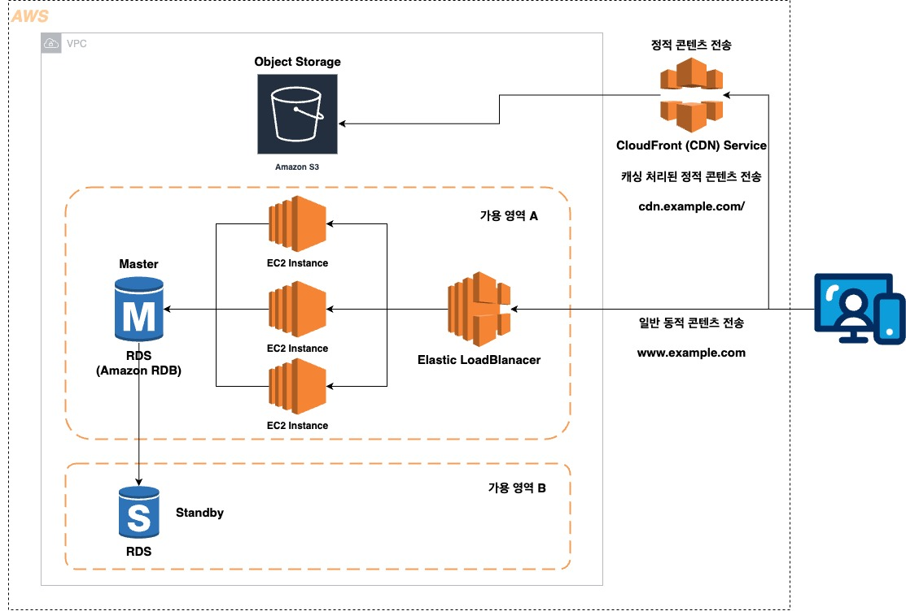

# Enterprize WEB
HA를 통해 가용성을 확보하고, CDN을 통해 정적 콘텐츠를 전송하는 아키텍처

## 설계 핵심사항
1. 웹 서버 다중화
    - ELB를 통한 웹서버의 다중화 구성
2. DB 서버 다중화
    - RDS (AWS 관리형 RDBMS) 사용하여 간단한 설정으로 DB 다중화
3. CDN과 Object Storage를 통한 정적 콘텐츠 배포
    - CloudFront(AWS CDN Service) , AWS Object Storage인 S3 사용하여 정적 리소스의 응답속도를 높히고 웹 서버의 접속을 줄일 수 있음

### RDS 사용 시 메인터넌스 기능 제약사항
AWS 웹 서비스를 구축할 때, RDB를 구성하는방법은 크게 두가지로 나뉨.
- 1. EC2에 RDB 설치
- 2. AWS 관리형 RDS 사용

그런데 AWS RDS를 사용하는편이 편리하긴 하지만, 운영에 제약이 있음
- 아래 제약사항을 잘 확인해서 , 상황에 맞게 선택 구축해야 함

||||
|--|--|--|
|**자동 유지보수**|백업|자동으로 백업이 생성되기에, 페일오버 시간을 줄일 수 있음|
|**-**|패치|마이너 버전업이 자동으로 적용|
|**제한되는 사항**|OS 접속|OS 사용자로 로그인할 수 없기에, 프로그램이나 도구를 설치할 수 없음. 로그, 성능관리 인터페이스는 제공됨|
|**-**|DB 관리자 사용자 이용|관리자 사용자로 로그인할 수 없음. 파라미터 변경과 일부 관리기능을 위한 인터페이스는 제공됨.|
|**-**|멀티-AZ 이외의 다중화 기능|RDBMS나 서드파티 복제 소프트웨어를 이용한 고가용상 구성이나, 오라클 RAC등의 다중화기능은 사용할 수 없음.|
|**-**|메인터넌스|주 1회 메인터넌스를 위해 중지됨|

## Architecture
해당 아키텍처 인프라의 핵심 설계 사항은 다음과 같으며, 해당 사항을 충족하는 아키텍처 입니다.

1. 웹 서버 다중화
    - 로드밸런서로 장애에 대비하고, 부하가 높아진 경우에 대비해 웹 서버 추가를 가능하게 한다.
2. DB 서버 다중화
    - AWS 관리형 RDS 서비스를 사용하여 DB 서버를 다중 가용 영역으로 복재하며, 버전 업데이트를 자동화 한다.
3. CDN과 Object Storage를 사용한 정적 콘텐츠 전송
    - 웹 서버로의 접속빈도를 줄여 운영 비용을 절감하고, 정적 콘텐츠의 응답속도를 높힌다.

