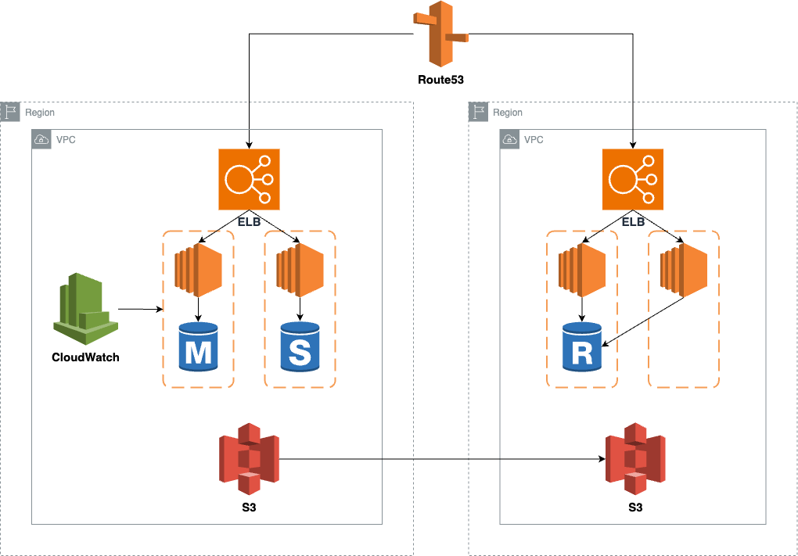

# 가용성에 민감한 인프라 아키텍쳐 설계하기
해당 인프라 아키텍처는, AWS의 가용영역에 재해가 발생하더라도 서비스가 문제없이 작동할 수 있도록, HA를 만족시키는 인프라 아키텍쳐 입니다.
- Multiple AZ에 걸쳐 백업서버를 구축한다는 것은, 인프라 관리에 있어 비용이 많이소모됩니다. 따라서 필요에 따라 적용하는것이 좋습니다. 

## 설계 핵심사항
1. 데이터 센터 다중화
    - Multiple AZ에 걸쳐 인프라를 구성합니다.
2. 장애 자동복구
    - CloudWatch 경보를 통해 장애를 조기 탐지하고 자동복구 합니다.
3. 리전의 다중화
    - Rout53의 기능인 DNS 자동복구 기능을 사용, 장애 발생시 백업 사이트로 자동 전환되게끔 구성합니다.

## Architecture

## Multiple AZ 구성
백업 AZ , 메인 AZ를 구성하여 에러 발생시 백업 AZ에 배포된 Application으로 자동 전환되게끔 구성

### 1, Route53 
Route53에선 ELB의 상태를 감시하며, ELB에 헬스체크로 연결된 EC2들이 모두 fail이라 판단될 경우, 백업 AZ의 ELB로 연결을 재 설정함
- 설정은 콘솔에서 진행할 수 있음

### 2. ELB and EC2
EC2와 ELB는 다중 AZ에 분산 배치하여 Route53에서 바라볼 수 있게끔 구성

### 3. CloudWatch
CloudWatch에선 EC2 Instance를 대상으로 모니터링 메트릭을 구성하여, 특정 임계치에 도달하게 되면 경보 발생하여 ***Auto Recovery*** 되게끔 구성

### 4. EBS
EBS에는 실시간 복재기능이 없기 때문에, 아래 두가지 방법 중 택1하여 진행

#### 4.1 정기 스냅샷
EBS를 정기적으로 스냅샷을 찍어서, 백업 사이트로 복사하는 방안

#### 4.2 EC2 내부 동기화도구 사용
Linux의 DRBD 등을 사용하여, 디스크 내용을 실시간 동기화 하는 방안

### 5. RDS
RDS는 Multi Az 기능을통해 Master에 장애 발생 시 Standby가 Master로 자동승격
- 장애 복구시 Application과 연결이 해제되는데, 프레임워크 기능 등을 사용해 DB에 자동으로 재연결이 되게끔 구성

AZ 자체가 장애 발생하여 기존 Master RDS, Replica RDS 전부가 작동불능 시, Route53에서 백업 AZ ELB로 이동되었다면
- 장애 발생 상황을 CloudWatch에서 감지하여, 이벤트 트리거 기능인 CloudWatch Events를 사용하여 람다를 이용해 읽기전용 복제본을 Master로 승격시키는 API를 호출하도록 구성

### 6. S3
S3에선 리전간 복제 기능을 이용하여 백업 AZ와 데이터 동기화
- 관리 콘솔 상에 S3 설정에서, 리전 간 복제(Cross-Region Replicaion)를 활성화하면 사용할 수 있음

## 데이터만 백업하여 다중화비용 최적화
장애 시간이 길어도 괜찮은 사이트라면 , 아래 옵션을 선택할 수 있을것임.

EC2의 AMI, EBS, S3, RDS 데이터를 백업 사이트에 복사함. 그리고 장애 발생시 해당 데이터들을 통해서 인프라 아키텍처를 재 구축하여 배포