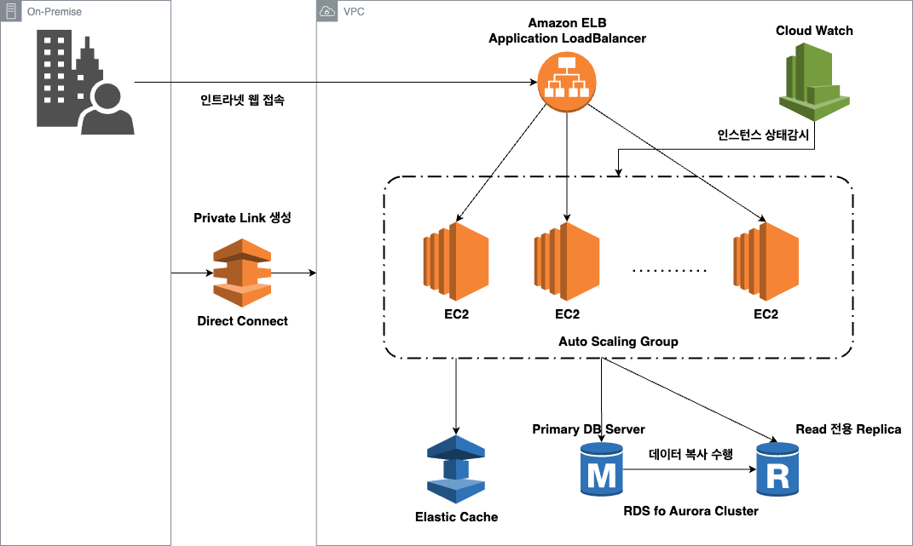

# Internet System
## 설계 핵심사항
1. 오토스케일링을 통한 동적 프로비저닝
    - 특정 시점(업무 일자 등)에 사용량이 높은 인트라넷의 특성에 맞게, 사용량이 높아지면 인스턴스가 오토스케일링 되게끔 구성
2. 인메모리 데이터 엑세스
    - 엑세스가 많은 데이터들은 인메모리 캐시를 사용하여 데이터 엑세스 지연시간을 줄여야 함

        Amazon Elastic Cache를 사용
3. 고속의 RDS
    - Amazon Aurora를 활용하여 트랜잭션 처리 시간을 줄여야 함

## 트랜잭션 및 접근 시간을 줄이기
웹 서비스에서, 데이터를 처리하는 트랜잭션과정의 데이터 액세스에 병목현상이 발생해서 처리 시간의 대부분을 차지합니다.

따라서 인메모리 캐시서버와 Aurora RDS를 통해 트랜잭션 시간을 줄임

Amazon Elastic Cache에 자주 사용하는 데이터를 캐시하여 빠르게 응답할 수 있게끔 구성

네트워크 접속 시간을 줄이기 위해, 온프레미스 환경과 AWS VPC를 AWS Direct Connect를 사용하여 네트워크 대역폭을 확보함

### 1. ELB -> Auto Scaling Group with Cloud Watch
EC2 AMI를 생성 후 Auto Scaling Group을 생성할 때, Lunch Template으로 등록

Auto Scaling Group에서 ELB를 연결하여, 스케일 아웃되어 생성된 EC2 Instance를 자동으로 ELB Target에 등록되게끔 구성

Cloud Watch의 경보 옵션들을 통해 스케일링 기준을 생성
- 경보 발생 시 스케일링
    - 지표 유형을 직접 생성할 수도 있고, 미리 AWS에 생성되어있는 지표를 사용할 수 도 있음

        지표는 평균 CPU 사용률, Target Group 당 Application LoadBalacner 요청 수등 다양함

이떄 스케일 아웃 되어 생성된 인스턴스를 스팟 인스턴스로 구성해 두면, 스케일링 시 생성되는 인스턴스의 비용을 줄일 수 있음
- 온디멘드보다 스팟이 더 저렴

Auto Scaling 시 생성되는 Instance의 AMI는 Application을 구동할 수 있는 상태로 프로비저닝 되어야 함.
- user data에 스크립트 등록하여 해결

또한 Scaling 된 인스턴스가 종료되면, 해당 Instance의 휘발성 저장소(메모리 등) 또한 삭제되기에, 주요 데이터는 EBS 또는 EFS 등에 저장하도록 Application을 구성해 두는게 좋음

### 2. Amazon Elastic Cache
Amazon의 관리형 인 메모리 데이터베이스 캐싱 서비스

Memcached(맴캐시드)와 Redis 로 나뉘어짐.
- Memcached는 멀티스레드지원, Redis는 싱글스레드

    Redis는 다양한 용도로 사용이 가능, 그러나 Memcached는 단순하고 명료한 작업을 위해 사용

지원하는 데이터 는 Key-value 값으로 이루어지며, 큰 특징은 **RDS와 다르게 VPC 외부에서 접속이 불가능함**
- 타 VPC에서 접근하기 위해선, VPC 피어링, Transit Gateway 등을 사용해야 함
    - [ElasticCache Cluster Access Parttern docs](https://docs.aws.amazon.com/ko_kr/AmazonElastiCache/latest/mem-ug/elasticache-vpc-accessing.html)

정적 데이터를 저장하는데 특화됨

#### 주의
***Elastic Cache는 패치가 자동으로 적용되기에, 유지관리를 위해 다운타임이 어쩔수없이 발생함***

따라서 무중단이 요구되는 시스템에서 Elastic Cache에 접근할 수 없을 땐, 백엔드 RDS에 접근해서 데이터를 꺼내오게끔 Application에서 구성해야 함

### 3. Amazon Aurora MySQL
정적 데이터를 제외한 타 데이터들을 Amazon의 관계형 데이터베이스인 RDS Aurora MySQL을 사용, 저장하여 빠른 DB를 통해 트랜잭션 시간을 줄임

Amazon Aurora의 성능은, RDS for MySQL에 비해 최대 5배 또는 최대 2.5배 더 빠름. (벤치마크 성능테스트한 사이트마다 다른듯)

Aurora는 PG, MySQL 등 다양한 DB를 지원

DBMS를 간편하게 수평확장이 가능

MySQL의 경우 기존 RDS 클러스터링 시, Master와 Replica 끼리 데이터 정합성을 위해 바이너리 로그를 전달하는데, Aurora는 Master와 Replica가 동일한 스토리지 저장소를 사용하기 때문에 바이너리 로그를 전달할 필요가 없어 더 빠름

또한 기존 MySQL은 읽기 전용 Replica가 많을수록 복제 처리 부하(바이너리 교환) 가 증가해서, 최대 5개인데, Amazon Aurora는 복제 처리 부하를 신경쓸필요 없어서 최대 15개까지 허용됨

### 4. Aws Direct Connect
AWS와 온프레미스간의 전용 Private 네트워크 대역폭을 Direct Connect로 생성하여 , AWS VPC에 접근할 때 Public Internet에 접근하지 않게끔 구성

Public Internet에 접근하지 않기 때문에, 통신 과정에 있어 병목현상이 발생하거나 대기 시간이 예기치않게 증가할 확률을 줄임

## Architecture
아래 설계 핵심사항을 고려한 아키텍처

1. 오토스케일링을 통한 동적 프로비저닝
    - ELB -> Auto Scaling Group 구성을 통해 특정 시점에 인스턴스가 스케일 아웃 되게끔 구성
2. 데이터 처리 트랜잭션의 속도가 빨라야함
    - Amazon Elastic Cache , Amazon Aurora RDS MySQL 도입
3. 고속의 RDS
    - Amazon Aurora를 활용하여 트랜잭션 처리 시간을 줄여야 함

