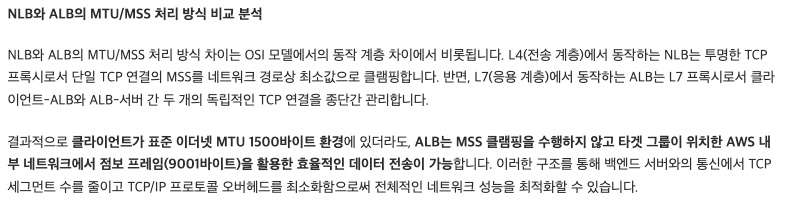

# MTU, MSS와 클라우드 간의 상관관계
- 온프레미스 <-> 클라우드 간 커넥션을 맻을 때, MTU Missmatch로 Response 패킷이 유실되었던 장애 내용.
- 블로그에 상세히 작성해 두었음.
- https://jjsair0412.tistory.com/30

## 인사이트
장애 내용과 원인도 중요하나, 얻은 인사이트는 여기도 정리해두고자 함.

아래 사진과 같이 AWS 문서에는 ALB는 MSS Clamping이 발생하지 않고 따로 협상해서 NLB보다 성능적으로 좋다고 나온다.

근데 그럼 NLB는 4계층이라 속도가 더 빨라 성능이 좋다고 단순히 생각했는데, 내 생각이 너무 단편적이었나 싶어 GPT와 생각해 봤다.

해당 문제에서 나오는 네트워크 성능을 최적화할 수 있다는 건.. 속도적인 측면만 말한 게 아닌듯 하다.

일단 일반적으로 NLB가 ALB보다 빠른 건 맞다.

- NLB (Network Load Balancer)
  - L4 계층에서 TCP/UDP 연결을 단순히 포워딩. 성능적으로는 ALB보다 훨씬 단순하기 때문에 지연(latency)이 적음.
- ALB (Application Load Balancer)
  - L7 계층에서 HTTP(S) 레벨의 해석과 라우팅. 더 많은 기능(쿠키 기반 세션, Path 기반 라우팅 등)을 제공하지만 L7 처리가 들어가기 때문에 오버헤드 존재.
 
그런데 MTU, MSS, PMTUD 간의 관계를 생각해 본다면..
- TCP 통신에서 MTU보다 큰 패킷은 쪼개져서 전달해야 한다. 이때 PMTUD가 정상 작동하지 않을 경우, 패킷 유실이 발생한다.
- 그래서 MSS Clamping이 중요한데,
  1. NLB는 TCP 핸드셰이크 과정을 스니핑해서(통신구간 중간에) MSS Clamping을 수행
  2. ALB는 L7 프록시라 기본적으로 TCP 세션을 각각 맺기 때문에 PMTUD 이슈가 덜 나타남.

따라서 속도적 측면뿐만 아니라, 문제가 덜 발생하는. 즉 네트워크 호환성이 높은 안정적인 환경을 구축할 수 있다는 결론인듯하다.
온프레미스와 통신해야 하거나,, 속도보다 패킷 유실에 민감한 금융 등의 시스템을 클라우드 환경 운영할 때, NLB보단 ALB나 GWLB(보안) 등을 사용하는 편이 좋을 듯하다.

