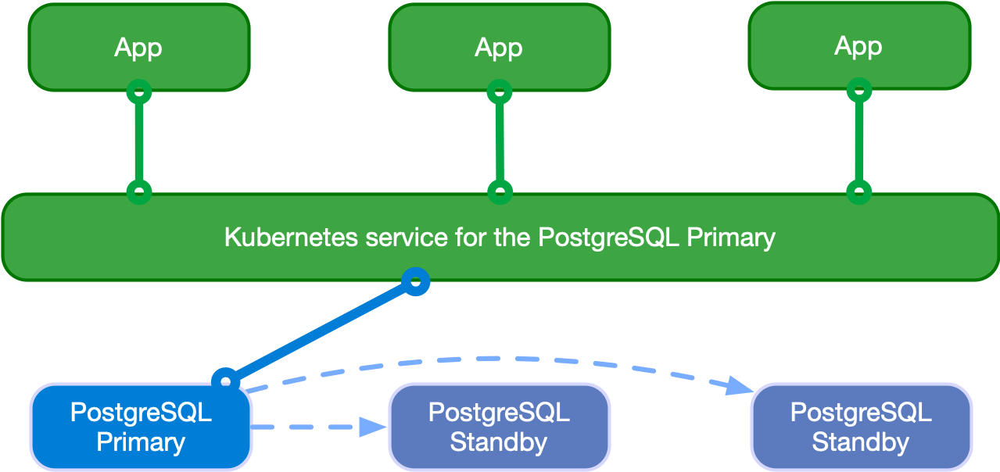

# CloudNative한 PostgreSQL
## Overview
- [CloudNativePG 공식문서](https://cloudnative-pg.io/documentation/1.15/)

## PostgreSQL 
PostgreSQL(줄여서 PG)은 라이센스에 제약받지 않고 복사, 연구, 수정배포등의 제한이 없지만, 트랜잭션, 인덱싱 등 데이터베이스 기능과 클러스터 등 안정성을 위한 기능들을 제공하는 RDBMS

## CloudNativePG Cluster 구성
PG DB Instance는 3가지로 나뉘게 되며, 종류는 다음과 같습니다.
**- RW**
    - 쓰기를 위한 primary DB인스턴스 접근
**- R**
    - 읽기를 위한 아무 DB인스턴스 접근
**- RO**
    - 읽기를 위한 standby DB인스턴스 접근

### 1. Read Write Workloads


아키텍처 상에서 볼 수 있듯이, Application은 RW 요청에 대해 Primary Instance로 접근하여 쿼리를 수행하게 됩니다.

### 2. Read Only and Read Workloads


아키텍처 상에서 볼 수 있듯이, Application은 RO 및 R 요청에 대해 Standby Instance로 접근하여 쿼리를 수행하게 됩니다.

부하분산 기준은 RoundRobin 입니다.

### 3. Multi-cluster deployments
여러 Kubernetes Cluster에 배포된 CloudNatviePG끼리 동기화 또한 지원합니다.

Multi Cluster Database 환경에서, 비즈니스 연속성을 이루기 위해 다음이 필요합니다.

**1. 전세계 복구 지점 목표(RPO) 축소**

    다양한 위치, 지역에 PostgreSQL 백업 데이터를 저장하고, 가능하다면 다른 제공자를 사용하여 글로벌 복구 지점 목표(RPO)를 줄입니다 (재해 복구).

**2. 글로벌 복구 시간 목표(RTO) 축소**

    기본 Kubernetes 클러스터를 넘어 PostgreSQL 복제를 활용하여 글로벌 복구 시간 목표(RTO)를 줄입니다 (고가용성).

위의 두가지 요구사항을 충족하기 위해 , CloudNatviePG는 PostgreSQL Replica cluster 개념을 사용합니다.


아키텍처에서 확인할 수 있듯이, Replica Cluster 에 Designated Primary 는 Primary 클러스터의 Primary 의 Replica로써 동작하게 되며, 고가용성과 재해복구 시간을 축소 시킵니다.

## OLM - Operator Lifecycle Manager 을 통한 CloudNativePG 설치
CloudNativePG를 OLM으로 설치합니다.

### OLM 설치 및 cloudnativePG 구성
OLM(Operator Lifecycle Manager) 이란 , CloudNative Operator를 간단히 설치하고 상태관리를 유연하게할 수 있게 도와줍니다.
- [operator hub](https://operatorhub.io/) 에서 OLM을 제공합니다.
- OLM은 CR yaml template으로 버전이나 클러스터의 인스턴스 개수등을 조절할 수 있습니다.
```bash
# 클러스터에 실행중인 Operator를 관리하기 위한 Operator Lifecycle Manager(OLM) 을 설치합니다.
# olm namespace에 설치됩니다.
$ curl -sL https://github.com/operator-framework/operator-lifecycle-manager/releases/download/v0.25.0/install.sh | bash -s v0.25.0

# 설치결과 확인
$ kubectl get ns
$ kubectl get all -n olm
$ kubectl get-all -n olm
$ kubectl get all -n operators
$ kubectl get-all -n operators | grep -v packagemanifest


# cloudnativePG Opeartor를 설치합니다.
# operators namesapce에 설치됩니다.
$ curl -s -O https://operatorhub.io/install/cloudnative-pg.yaml

$ cat cloudnative-pg.yaml | yh
apiVersion: operators.coreos.com/v1alpha1
kind: Subscription
metadata: 
  name: my-cloudnative-pg
  namespace: operators
spec: 
  channel: stable-v1
  name: cloudnative-pg
  source: operatorhubio-catalog
  sourceNamespace: olm

$ kubectl create -f cloudnative-pg.yaml

$ kubectl get all -n operators
NAME                                           READY   STATUS    RESTARTS   AGE
pod/cnpg-controller-manager-58f7d5c965-xfnr7   1/1     Running   0          44s

NAME                                      TYPE        CLUSTER-IP       EXTERNAL-IP   PORT(S)   AGE
service/cnpg-controller-manager-service   ClusterIP   10.100.182.221   <none>        443/TCP   44s
service/cnpg-webhook-service              ClusterIP   10.100.102.226   <none>        443/TCP   45s

NAME                                      READY   UP-TO-DATE   AVAILABLE   AGE
deployment.apps/cnpg-controller-manager   1/1     1            1           44s

NAME                                                 DESIRED   CURRENT   READY   AGE
replicaset.apps/cnpg-controller-manager-58f7d5c965   1         1         1       44s

$ kubectl get-all -n operators | grep -v packagemanifest
...

$ kubectl get crd | grep cnpg
backups.postgresql.cnpg.io                    2023-10-29T02:47:55Z
clusters.postgresql.cnpg.io                   2023-10-29T02:47:56Z
poolers.postgresql.cnpg.io                    2023-10-29T02:47:56Z
scheduledbackups.postgresql.cnpg.io           2023-10-29T02:47:56Z
```

설치한 CloudNativePG의 API 정보를 확인합니다.
```bash
kubectl explain clusters
kubectl explain backups


# 다음 명령어로 설치한 cluster 정보를 확인합니다.
# To use it, checkout the custom resource definitions (CRDs) introduced by this operator to start using it.
$ kubectl get clusterserviceversions -n operators # csv = clusterserviceversions 축약
NAME                     DISPLAY         VERSION   REPLACES   PHASE
cloudnative-pg.v1.21.0   CloudNativePG   1.21.0               Succeeded

$ kubectl get csv -A
```

### cloudnativePG cluster 설치
설치 대상 PG 버전은 15.3 입니다.

구성은 다음과 같습니다.
- primary 1대
- standby 2대
- config parameter 설정
- pg_hba 설청
    - all open
- bootstrap 설정
    - database : app
    - encoding : UTF8
    - owner : app user
- pod monitoring 설정
    - prometheus에서 메트릭을 수집할 수 있게 하기 위하여 monitoring 구성

#### yaml template
```yaml
cat <<EOT> mycluster1.yaml
# Example of PostgreSQL cluster
apiVersion: postgresql.cnpg.io/v1
kind: Cluster
metadata:
  name: mycluster
spec:
  imageName: ghcr.io/cloudnative-pg/postgresql:15.3
  instances: 3  
  storage:
    size: 3Gi
  postgresql:
    parameters:
      max_worker_processes: "40"
      timezone: "Asia/Seoul"
    pg_hba:
      - host all postgres all trust
  primaryUpdateStrategy: unsupervised 
  enableSuperuserAccess: true
  bootstrap:
    initdb:
      database: app
      encoding: UTF8
      localeCType: C
      localeCollate: C
      owner: app

  monitoring:
    enablePodMonitor: true
EOT
```

```mycluster1.yaml``` 파일을 통해 PG Cluster를 구성합니다.
- 각 instance 별로 initdb pod가 먼저 생성되어 구성된 이후에, PG Cluster에 instance가 join 됩니다.
```bash
# 설치되는 파드 순서 확인 : job.batch(initdb -> join)
kubectl apply -f mycluster1.yaml && kubectl get pod -w
```

설치된 PG Cluster 상태를 확인합니다.
- r, ro, rw 세가지 cluster가 구성된것을 확인할 수 있습니다.
- get cluster 명령으로 cluster의 이름, 인스턴스 개수, ready 상태 인스턴스 개수, PRIMARY instance 정보를 확인합니다.
```bash
$ kubectl get all
NAME              READY   STATUS    RESTARTS   AGE
pod/mycluster-1   1/1     Running   0          4m7s
pod/mycluster-2   1/1     Running   0          3m11s
pod/mycluster-3   1/1     Running   0          2m23s

NAME                   TYPE        CLUSTER-IP       EXTERNAL-IP   PORT(S)    AGE
service/kubernetes     ClusterIP   10.100.0.1       <none>        443/TCP    83m
service/mycluster-r    ClusterIP   10.100.60.67     <none>        5432/TCP   5m4s
service/mycluster-ro   ClusterIP   10.100.200.9     <none>        5432/TCP   5m4s
service/mycluster-rw   ClusterIP   10.100.114.165   <none>        5432/TCP   5m4s

$ kubectl get cluster
NAME        AGE     INSTANCES   READY   STATUS                     PRIMARY
mycluster   5m55s   3           3       Cluster in healthy state   mycluster-1
```

cnpg 플러그인을 설치하여, 구성한 클러스터의 상세 정보를 보기 편하게 출력하여 확인합니다.
```bash
# 설치
$ kubectl krew install cnpg
Updated the local copy of plugin index.
Installing plugin: cnpg
Installed plugin: cnpg
\
 | Use this plugin:
 |      kubectl cnpg
 | Documentation:
 |      https://github.com/cloudnative-pg/cloudnative-pg
/
WARNING: You installed plugin "cnpg" from the krew-index plugin repository.
   These plugins are not audited for security by the Krew maintainers.
   Run them at your own risk.


# mycluster 정보확인
$ kubectl cnpg status mycluster
Cluster Summary
Name:                mycluster
Namespace:           default
System ID:           7296108506094428180
PostgreSQL Image:    ghcr.io/cloudnative-pg/postgresql:15.3
Primary instance:    mycluster-1
Primary start time:  2023-10-31 13:07:37 +0000 UTC (uptime 6m22s)
Status:              Cluster in healthy state 
Instances:           3
Ready instances:     3
Current Write LSN:   0/6030FB8 (Timeline: 1 - WAL File: 000000010000000000000006)

Certificates Status
Certificate Name       Expiration Date                Days Left Until Expiration
----------------       ---------------                --------------------------
mycluster-ca           2024-01-29 13:01:31 +0000 UTC  89.99
mycluster-replication  2024-01-29 13:01:31 +0000 UTC  89.99
mycluster-server       2024-01-29 13:01:31 +0000 UTC  89.99

Continuous Backup status
Not configured

Streaming Replication status
Replication Slots Enabled
Name         Sent LSN   Write LSN  Flush LSN  Replay LSN  Write Lag  Flush Lag  Replay Lag  State      Sync State  Sync Priority  Replication Slot
----         --------   ---------  ---------  ----------  ---------  ---------  ----------  -----      ----------  -------------  ----------------
mycluster-2  0/6030FB8  0/6030FB8  0/6030FB8  0/6030FB8   00:00:00   00:00:00   00:00:00    streaming  async       0              active
mycluster-3  0/6030FB8  0/6030FB8  0/6030FB8  0/6030FB8   00:00:00   00:00:00   00:00:00    streaming  async       0              active

Unmanaged Replication Slot Status
No unmanaged replication slots found

Instances status
Name         Database Size  Current LSN  Replication role  Status  QoS         Manager Version  Node
----         -------------  -----------  ----------------  ------  ---         ---------------  ----
mycluster-1  29 MB          0/6030FB8    Primary           OK      BestEffort  1.21.0           ip-x-x-1-81.ap-northeast-2.compute.internal
mycluster-2  29 MB          0/6030FB8    Standby (async)   OK      BestEffort  1.21.0           ip-x-x-2-171.ap-northeast-2.compute.internal
mycluster-3  29 MB          0/6030FB8    Standby (async)   OK      BestEffort  1.21.0           ip-x-x-3-107.ap-northeast-2.compute.internal
```

구성한 mycluster의 -v 및 config 설정 적용이 잘 되었는지 또한 확인합니다..
```bash
$ kubectl cnpg status mycluster --verbose
...
```

그런데 특이점이, Database를 Kubernetes에 구축한다 하면, Statefulset을 구성하는게 일반적일탠데, CloudNatviePG는 그렇지 않고 기본 리소스를 사용합니다.

그러한 이유는 , 최근엔 statefulset을 안쓰고 operator를 직접 개발하여 입맛에 맞게 db cluster를 만드는경우가 있기 때문입니다.
- PG Cluster에는 다음과같은 요구사항이 있는데, 기존 Statefulset의 기능으로는 충족시킬 수 없기에 자체 Operator를 사용하게 됩니다.
    - PV 에 저장된 데이터 보존, 재연결
    - 자동 스위칭 - Primary / Standbys 구분 (순서 무관)
    - 재시작을 요구하는 Postgresql config 설정 변경
```bash
# instance가 pod인것을 확인할 수 있음
$ kubectl get all
NAME              READY   STATUS    RESTARTS   AGE
pod/mycluster-1   1/1     Running   0          9m21s
pod/mycluster-2   1/1     Running   0          8m25s
pod/mycluster-3   1/1     Running   0          7m37s

NAME                   TYPE        CLUSTER-IP       EXTERNAL-IP   PORT(S)    AGE
service/kubernetes     ClusterIP   10.100.0.1       <none>        443/TCP    89m
service/mycluster-r    ClusterIP   10.100.60.67     <none>        5432/TCP   10m
service/mycluster-ro   ClusterIP   10.100.200.9     <none>        5432/TCP   10m
service/mycluster-rw   ClusterIP   10.100.114.165   <none>        5432/TCP   10m
```

## CloudNativePG 기본 사용
구축한 CloudNativePG를 사용해 봅니다. 접근은 내, 외부로 나뉘어서 사용합니다.
- 같은 Kubernetes Cluster 내부에서 접근
- 외부 client에서 CloudNativePG 접근

### 같은 Kubernetes Cluster 내부에서 접근
먼저, PG user별 자격증명이 생성된것을 확인합니다.
- CloudNativePG를 구축할 때, app 이름의 user를 만들었기 때문에 secret이 생성된것을 확인할 수 있습니다.
```bash
$ kubectl get secret -l cnpg.io/cluster=mycluster
NAME                  TYPE                       DATA   AGE
mycluster-app         kubernetes.io/basic-auth   9      45m
mycluster-superuser   kubernetes.io/basic-auth   9      45m
```

그후, app과 superuser의 계정명 및 암호를 secret에서 추출합니다.
```bash
# superuser 계정
$ kubectl get secrets mycluster-superuser -o jsonpath={.data.username} | base64 -d ;echo
postgres

# superuser 암호
$ kubectl get secrets mycluster-superuser -o jsonpath={.data.password} | base64 -d ;echo
TUvPGZYy5VCNsR3MqW47bCKD7Gi1y5vivElwelGgB7twzFDveBDbh5Xf0zkvWond

# app 계정
$ kubectl get secrets mycluster-app -o jsonpath={.data.username} | base64 -d ;echo
app

# app 암호
$ kubectl get secrets mycluster-app -o jsonpath={.data.password} | base64 -d ;echo
VV9hmOoM6zTOJPEEd7fji2uxV3QkrcoWDgVy2U88WxDco3tSxeGiEdPUNmCFy0gI
```

app user의 암호를 변수로 지정합니다.
```bash
AUSERPW=$(kubectl get secrets mycluster-app -o jsonpath={.data.password} | base64 -d)
```

CloudNativePG를 사용하는 myclient 파드를 3개 배포합니다.
- envsubst 사용
```bash
$ curl -s https://raw.githubusercontent.com/gasida/DOIK/main/5/myclient-new.yaml -o myclient.yaml

$ for ((i=1; i<=3; i++)); do PODNAME=myclient$i VERSION=15.3.0 envsubst < myclient.yaml | kubectl apply -f - ; done

# 배포결과
kubectl get pods
NAME          READY   STATUS    RESTARTS   AGE
myclient1     1/1     Running   0          33s
myclient2     1/1     Running   0          31s
myclient3     1/1     Running   0          28s
mycluster-1   1/1     Running   0          49m
mycluster-2   1/1     Running   0          48m
mycluster-3   1/1     Running   0          48m
```

superuser 계정으로 mycluster-rw 서비스에 접속해 봅니다.

```bash
$ kubectl exec -it myclient1 -- psql -U postgres -h mycluster-rw -p 5432 --variable=HISTFILE=/tmp/.psql_history
```

연결정보, 데이터베이스 조회, 타임존을 확인하여 이전에 yaml template으로 설정한 설정값이 정상 작동했는지 확인해 봅니다.
```bash
# 연결정보 확인
postgres=# \conninfo
You are connected to database "postgres" as user "postgres" on host "mycluster-rw" (address "10.100.114.165") at port "5432".
SSL connection (protocol: TLSv1.3, cipher: TLS_AES_256_GCM_SHA384, compression: off)

# 데이터베이스 확인
postgres=# \l
                                            List of databases
   Name    |  Owner   | Encoding | Collate | Ctype | ICU Locale | Locale Provider |   Access privileges   
-----------+----------+----------+---------+-------+------------+-----------------+-----------------------
 app       | app      | UTF8     | C       | C     |            | libc            | 
 postgres  | postgres | UTF8     | C       | C     |            | libc            | 
 template0 | postgres | UTF8     | C       | C     |            | libc            | =c/postgres          +
           |          |          |         |       |            |                 | postgres=CTc/postgres
 template1 | postgres | UTF8     | C       | C     |            | libc            | =c/postgres          +
           |          |          |         |       |            |                 | postgres=CTc/postgres
(4 rows)

# 타임존 확인
postgres=#  SELECT * FROM pg_timezone_names WHERE name = current_setting('TIMEZONE');
    name    | abbrev | utc_offset | is_dst 
------------+--------+------------+--------
 Asia/Seoul | KST    | 09:00:00   | f
(1 row)

# 종료
postgres=# \q
```

이번엔 app user 계정으로 CloudNativePG에 접속해서 데이터베이스 정보를 확인해 봅니다.

```bash
# password를 직접. 입력해 줍니다.
$ kubectl exec -it myclient1 -- psql -U app -h mycluster-rw -p 5432 -d app 
Password for user app: 

psql (15.3)
SSL connection (protocol: TLSv1.3, cipher: TLS_AES_256_GCM_SHA384, compression: off)
Type "help" for help.

app=> \conninfo
You are connected to database "app" as user "app" on host "mycluster-rw" (address "10.100.114.165") at port "5432".
SSL connection (protocol: TLSv1.3, cipher: TLS_AES_256_GCM_SHA384, compression: off)
app=> \l
                                            List of databases
   Name    |  Owner   | Encoding | Collate | Ctype | ICU Locale | Locale Provider |   Access privileges   
-----------+----------+----------+---------+-------+------------+-----------------+-----------------------
 app       | app      | UTF8     | C       | C     |            | libc            | 
 postgres  | postgres | UTF8     | C       | C     |            | libc            | 
 template0 | postgres | UTF8     | C       | C     |            | libc            | =c/postgres          +
           |          |          |         |       |            |                 | postgres=CTc/postgres
 template1 | postgres | UTF8     | C       | C     |            | libc            | =c/postgres          +
           |          |          |         |       |            |                 | postgres=CTc/postgres
(4 rows)

app=> \q
```

### 외부 client에서 접근
EKS 외부에서 접근해야 하기 때문에, NLB를 통해서 CloudNativePG로 접근합니다.
- ALB가 아닌 NLB인 이유는, ALB를 사용하면 http, https 프로토콜만 지원하기 때문에 연결시 tcp, udp를 사용해야하는 특성상 NLB 또는 CLB를 사용합니다.
    - [AWS LoadBalancer](../../AWS/AWS%20basic%20information/AWS-Basic-info.md/Load_Balancer.md)

```bash
# postgresql psql 툴 설치
$ yum install postgresql -y

# Service(LoadBalancer)로 외부 노출 설정 : 3~5분 정도 대기 후 아래 접속 시도
$ kubectl get svc,ep mycluster-rw

# patch 명령어로 service type을 Loadbalancer로 변경하여 LB 프로비저닝
$ kubectl patch svc mycluster-rw -p '{"spec":{"type":"LoadBalancer"}}'

# ExternalDNS Controller를 이용해서 Route53 Domain을 이용, dns이름 생성
$ kubectl annotate service mycluster-rw "external-dns.alpha.kubernetes.io/hostname=psql.$MyDomain"

# psql로 접속
psql -U postgres -h psql.$MyDomain
----------------------------------
app=> \conninfo
app=> \l
app=> \q
----------------------------------
```

## 각 서비스별 접속 차이 테스트
CloudNativePG는 ro, r, rw 3가지 서비스로 구성되어 있습니다.

각 서비스에 요청이 들어왔을 경우, 어떻게 트래픽이 분산되는지 테스트해 봅니다.
- 출력되는 IP는 pod의 ip 입니다.

먼저 rw 서비스에 요청을보냅니다.
- 30번 요청 모두 rw 서비스, rw instance primary인 mycluster-1 파드로 요청이 가는것을 확인할 수 있습니다.
```bash
$ for i in {1..30}; do kubectl exec -it myclient1 -- psql -U postgres -h mycluster-rw -p 5432 -c "select inet_server_addr();"; done | sort | uniq -c | sort -nr | grep 192
30  x.x.1.250
```

그다음 ro 서비스에 요청을 보냅니다.
- 30번 요청들이 standby 파드로 요청이 부하분산되는것을 확인할 수 있습니다.
```bash
$ for i in {1..30}; do kubectl exec -it myclient1 -- psql -U postgres -h mycluster-ro -p 5432 -c "select inet_server_addr();"; done | sort | uniq -c | sort -nr | grep 192
17  x.x.2.202
13  x.x.3.48
```

마지막으로 r 서비스에 요청을 보냅니다.
- 전체 파드로 요청이 부하분산되는것을 확인할 수 있습니다.
```bash
$ for i in {1..30}; do kubectl exec -it myclient1 -- psql -U postgres -h mycluster-r -p 5432 -c "select inet_server_addr();"; done | sort | uniq -c | sort -nr | grep 192
12  x.x.2.202
10  x.x.3.48
8  x.x.1.250
```

### 테스트 결과
RW는 Primary instance로, RO는 Standy로, R은 전체로 요청이 분산되는것을 확인하였습니다.

따라서 Client 요구사항에 따라 서비스를 유동적으로 사용하여, 트래픽을 더욱 효율적으로 나누어 보낼 수 있습니다.
- 예를들어 읽기만 필요하고 많은 트래픽이 예상된다면 R 서비스로, 쓰기를 해야한다면 RW 서비스로..

## 장애 테스트
### 0. 장애 테스트 준비
장애 테스트를 진행하기 위해 , 테스트용 테이블 ```t1```을 생성하고, 해당 테이블에 데이터들을 Insert 해 놓습니다.

또한 myclient2 pod를 생성하여 모니터링합니다.
```bash
#  상단 myclient1 pod 생성 안했을 경우, 아래 스크립트로 생성
$ curl -s https://raw.githubusercontent.com/gasida/DOIK/main/5/myclient-new.yaml -o myclient.yaml
$ for ((i=1; i<=3; i++)); do PODNAME=myclient$i VERSION=15.3.0 envsubst < myclient.yaml | kubectl apply -f - ; done

# 파드IP 변수 지정
$ POD1=$(kubectl get pod mycluster-1 -o jsonpath={.status.podIP})
$ POD2=$(kubectl get pod mycluster-2 -o jsonpath={.status.podIP})
$ POD3=$(kubectl get pod mycluster-3 -o jsonpath={.status.podIP})

# query.sql
$ curl -s -O https://raw.githubusercontent.com/gasida/DOIK/main/5/query.sql
$ cat query.sql ;echo
CREATE DATABASE test;
\c test;
CREATE TABLE t1 (c1 INT PRIMARY KEY, c2 TEXT NOT NULL);
INSERT INTO t1 VALUES (1, 'Luis');

# SQL 파일 query 실행
$ psql -U postgres -h psql.$MyDomain -f query.sql

혹은
# myclient1 pod의 /tmp 경로에 query.sql 복사
$ kubectl cp query.sql myclient1:/tmp

# query.sql 쿼리 PG에 반영 (table 생성 및 insert)
$ kubectl exec -it myclient1 -- psql -U postgres -h mycluster-rw -p 5432 -f /tmp/query.sql

# [터미널2] 모니터링
$ while true; do kubectl exec -it myclient2 -- psql -U postgres -h mycluster-ro -p 5432 -d test -c "SELECT COUNT(*) FROM t1"; date;sleep 1; done

# insert 결과확인
$ kubectl exec -it myclient1 -- psql -U postgres -h mycluster-ro -p 5432 -d test -c "SELECT COUNT(*) FROM t1"
$ kubectl exec -it myclient1 -- psql -U postgres -h mycluster-ro -p 5432 -d test -c "SELECT * FROM t1"

# INSERT 수행
$ psql -U postgres -h psql.$MyDomain -d test -c "INSERT INTO t1 VALUES (2, 'Luis2');"
$ psql -U postgres -h psql.$MyDomain -d test -c "SELECT * FROM t1"
혹은
$ kubectl exec -it myclient1 -- psql -U postgres -h mycluster-rw -p 5432 -d test -c "INSERT INTO t1 VALUES (2, 'Luis2');"
$ kubectl exec -it myclient1 -- psql -U postgres -h mycluster-ro -p 5432 -d test -c "SELECT * FROM t1"

# test 데이터베이스에 97개의 데이터 INSERT
$ for ((i=3; i<=100; i++)); do kubectl exec -it myclient1 -- psql -U postgres -h mycluster-rw -p 5432 -d test -c "INSERT INTO t1 VALUES ($i, 'Luis$i');";echo; done
kubectl exec -it myclient1 -- psql -U postgres -h mycluster-ro -p 5432 -d test -c "SELECT COUNT(*) FROM t1"
```


### 1. Primary Instance(Pod) 장애시 ..
W가 진행되고 있을 때 Primary Pod가 down되었을 경우, 어떤 이슈가 발생하는지 체크해봅니다.

- 먼저 Write는 Primary Pod에서 발생하기 때문에, Primary Pod가 어디에 있는지 찾습니다.
```bash
# 프라이머리 파드 정보 확인
# Primary Pod는 mycluster-1
$ kubectl cnpg status mycluster
...
Instances status
Name         Database Size  Current LSN  Replication role  Status  QoS         Manager Version  Node
----         -------------  -----------  ----------------  ------  ---         ---------------  ----
mycluster-1  29 MB          0/6000060    Primary           OK      BestEffort  1.21.0           ip-x-x-3-89.ap-northeast-2.compute.internal
mycluster-2  29 MB          0/6000060    Standby (async)   OK      BestEffort  1.21.0           ip-x-x-3-17.ap-northeast-2.compute.internal
mycluster-3  29 MB          0/6000060    Standby (async)   OK      BestEffort  1.21.0           ip-x-x-1-113.ap-northeast-2.compute.internal
```

터미널 4대를 켜놓고 모니터링해봅니다.
- 터미널 1 : pod 상태확인
```bash
$ watch kubectl get pod -l cnpg.io/cluster=mycluster
```

- 터미널 2 : 조회
```bash
$ while true; do kubectl exec -it myclient2 -- psql -U postgres -h mycluster-ro -p 5432 -d test -c "SELECT COUNT(*) FROM t1"; date;sleep 1; done
```

- 터미널 3 : Insert 쿼리 주기적으로 계속수행
```bash
$ for ((i=10001; i<=20000; i++)); do kubectl exec -it myclient2 -- psql -U postgres -h mycluster-rw -p 5432 -d test -c "INSERT INTO t1 VALUES ($i, 'Luis$i');";echo; done
```

- 터미널 4 : 파드 및 PVC 삭제
```bash
$ kubectl get pod -l cnpg.io/cluster=mycluster -owide

# Primary Pod 삭제
$ kubectl delete pvc/mycluster-1 pod/mycluster-1

$ kubectl cnpg status mycluster
```

- 아래 캡쳐사진처럼, 장애발생순간 Insert가 끊겻다가 바로 다시복구되는것을 확인할 수 있습니다.


- 또한 mycluster-4 라는 pod가 순차적으로 다시 생기면서, Cluster의 Instance 개수 3대가 보존되는것을 확인할 수 있으며,

```bash
NAME                     READY   STATUS      RESTARTS   AGE
mycluster-2              1/1     Running     0          61m
mycluster-3              1/1     Running     0          59m
mycluster-4              0/1     Init:0/1    0          23s
mycluster-4-join-jnf9x   0/1     Completed   0          62s
```

- primary Instance(pod) 는 ```mycluster-1``` 바로 다음인 ```mycluster-2``` pod가 Primary로 승격된것을 확인할 수 있습니다.
```bash
$ kubectl cnpg status mycluster
...
Instances status
Name         Database Size  Current LSN  Replication role  Status  QoS         Manager Version  Node
----         -------------  -----------  ----------------  ------  ---         ---------------  ----
mycluster-2  36 MB          0/A002680    Primary           OK      BestEffort  1.21.0           ip-x-x-3-17.ap-northeast-2.compute.internal
mycluster-3  36 MB          0/A002680    Standby (async)   OK      BestEffort  1.21.0           ip-x-x-1-113.ap-northeast-2.compute.internal
mycluster-4  36 MB          0/A002680    Standby (async)   OK      BestEffort  1.21.0           ip-x-x-3-89.ap-northeast-2.compute.internal
```

재해 복구가 잘 이루어진것을 확인할 수 있습니다.
- 그러나 Primary Instance가 down된 직후에 잠깐 Insert가 끊긴것을 확인할 수 있었습니다.

### 2. Primary Instance(Pod) 가 배포되어있는 Node 자체가 장애시 ..
Primary Pod가 배포되어있는 Node 자체가 장애상태로 돌입된다면 CloudNativePG는 재해복구를 가져가는지 확인하는 테스트 입니다.


터미널 3대를 켜놓고 모니터링해봅니다.
- 터미널 1 : pod 상태확인
```bash
$ watch kubectl get pod -l cnpg.io/cluster=mycluster
```

- 터미널 2 : 조회
```bash
$ while true; do kubectl exec -it myclient2 -- psql -U postgres -h mycluster-ro -p 5432 -d test -c "SELECT COUNT(*) FROM t1"; date;sleep 1; done
```

- 터미널 3 : Insert 쿼리 주기적으로 계속수행
```bash
$ for ((i=10001; i<=20000; i++)); do kubectl exec -it myclient2 -- psql -U postgres -h mycluster-rw -p 5432 -d test -c "INSERT INTO t1 VALUES ($i, 'Luis$i');";echo; done
```

- 먼저 , Primary Instance Pod가 어느 Node에 배포되어있는지 확인합니다.
```bash
# primary instance는 mycluster-2
$ kubectl cnpg status mycluster
... 
Instances status
Name         Database Size  Current LSN  Replication role  Status  QoS         Manager Version  Node
----         -------------  -----------  ----------------  ------  ---         ---------------  ----
mycluster-2  36 MB          0/B006338    Primary           OK      BestEffort  1.21.0           ip-x-x-3-17.ap-northeast-2.compute.internal
mycluster-3  36 MB          0/B0063F0    Standby (async)   OK      BestEffort  1.21.0           ip-x-x-1-113.ap-northeast-2.compute.internal
mycluster-4  36 MB          0/B0063F0    Standby (async)   OK      BestEffort  1.21.0           ip-x-x-3-89.ap-northeast-2.compute.internal

# mycluster-2 pod는 Node ip-x-x-3-17.ap-northeast-2.compute.internal 에 배포되어 있는것을 확인할 수 있습니다.
$ kubectl get pods -o wide
kubectNAME          READY   STATUS    RESTARTS   AGE    IP              NODE                                               NOMINATED NODE   READINESS GATES
mycluster-2   1/1     Running   0          68m    x.x.3.147   ip-x-x-3-17.ap-northeast-2.compute.internal    <none>           <none>
mycluster-3   1/1     Running   0          66m    x.x.1.162   ip-x-x-1-113.ap-northeast-2.compute.internal   <none>           <none>
mycluster-4   1/1     Running   0          7m5s   x.x.3.140   ip-x-x-3-89.ap-northeast-2.compute.internal    <none>           <none>

$ kubectl get nodes -owide
NAME                                               STATUS   ROLES    AGE   VERSION               INTERNAL-IP     EXTERNAL-IP      OS-IMAGE         KERNEL-VERSION                  CONTAINER-RUNTIME
ip-x-x-1-113.ap-northeast-2.compute.internal   Ready    <none>   95m   v1.27.5-eks-43840fb   x.x.1.113   52.79.41.132     Amazon Linux 2   5.10.192-183.736.amzn2.x86_64   containerd://1.6.19
ip-x-x-3-17.ap-northeast-2.compute.internal    Ready    <none>   95m   v1.27.5-eks-43840fb   x.x.3.17    54.180.159.250   Amazon Linux 2   5.10.192-183.736.amzn2.x86_64   containerd://1.6.19
ip-x-x-3-89.ap-northeast-2.compute.internal    Ready    <none>   94m   v1.27.5-eks-43840fb   x.x.3.89    3.34.52.24       Amazon Linux 2   5.10.192-183.736.amzn2.x86_64   containerd://1.6.19
```

- Primary Instance가 배포되어있는 Node를 Drain 합니다.
```bash
$ NODE=<NodeName>

# usecase
$ NODE=ip-x-x-3-17.ap-northeast-2.compute.internal

$ kubectl drain $NODE --delete-emptydir-data --force --ignore-daemonsets && kubectl get node -w
```

- Primary pod가 배포되어잇던 노드가 drain되면서, 파드가 쫓겨납니다.
- 그리고 기존 Primary Pod는 Pending상태로 남으며, Insert와 Select 이벤트는 Insert Event가 잠깐 끊기지만 , 읽기는 standby pod에서 진행되기에 끊김없이 정상 처리됩니다.


### **왜 Pending일까 ?**
생각해보면, node가 drain되었기에 해당 노드에 스케줄링된 파드들은 다른 노드에 옮간뒤 재 배포되어야 합니다.

그런데, 특이하게도 Pending상태로 남고 다른노드로 옮겨가지 않습니다.


#### 이유찾기 1.
Primary Pod instnace를 Describe 하여 어떤 이벤트가 발생했는지 확인합니다.
```bash
$ kubectl describe pods mycluster-1
...
Events:
  Type     Reason            Age    From               Message
  ----     ------            ----   ----               -------
  Warning  FailedScheduling  4m52s  default-scheduler  0/3 nodes are available: 1 node(s) were unschedulable, 2 node(s) had volume node affinity conflict. preemption: 0/3 nodes are available: 3 Preemption is not helpful for scheduling..
```

해당 에러는, 한 노드가 스케줄링될 상황이 아니라서, CloudNativePG Cluster를 생성할 때 만들어준 PV에 Pod Instance가 붙을 수 없다는 이야기입니다.

EKS 환경에서, StorageClass는 기본적으로 gp2 라는 이름의 StorageClass를 사용하게 됩니다.
얘는 AWS EBS이고, EKS Cluster EC2 인스턴스에 마운트되어 있습니다.

- PVC의 모습
```bash
$ kubectl get pvc -owide
NAME          STATUS   VOLUME                                     CAPACITY   ACCESS MODES   STORAGECLASS   AGE   VOLUMEMODE
mycluster-1   Bound    pvc-5ccf2055-e1b1-4264-a99e-dd423724dd15   3Gi        RWO            gp2            25m   Filesystem
mycluster-2   Bound    pvc-cefb5045-037e-4081-9593-ca9a65f55d50   3Gi        RWO            gp2            23m   Filesystem
mycluster-3   Bound    pvc-f33e7403-d391-4674-a011-341298a1d407   3Gi        RWO            gp2            23m   Filesystem
```

- AWS Console에서 본 PVC


EBS는 가용영역에 종속되어 있습니다.
- 이말은 한 번에 하나의 EC2 Instance에만 마운트할 수 있음을 의미합니다.

***따라서 만약 노드 1번 인스턴스에 1번 PV(EBS)가 할당되고, 해당 PV를 1번 PVC가 요청하고 있는 경우, 1번 PVC를 특정 Pod가 마운트하고 있으면,, 해당 Pod는 다른 노드에 프로비저닝되지 못하게 됩니다.***

## ETC - Pod Volume 증가
만약 EBS(PV) 용량이 꽉 찬다면, 볼륨을 증가시켜주어야 할것 입니다.

이 작업을,. operator 명령어로 수행할 수 있습니다.

- pod, pvc 모니터링
```bash
$ watch kubectl get pod,pvc
```

- PVC 3G → 5G 로 증가 설정 : 증가 후 감소는 안됨 > AWS EBS 증가 확인
  - 5Gi 로 EBS 용량이 증설된것을 확인할 수 있습니다.
```bash
$ kubectl df-pv

 PV NAME                                   PVC NAME     NAMESPACE  NODE NAME                                         POD NAME     VOLUME MOUNT NAME  SIZE  USED   AVAILABLE  %USED  IUSED  IFREE   %IUSED 
 pvc-5ccf2055-e1b1-4264-a99e-dd423724dd15  mycluster-1  default    ip-x-x-3-123.ap-northeast-2.compute.internal  mycluster-1  pgdata             2Gi   245Mi  2Gi        8.30   1645   194963  0.84   
 pvc-cefb5045-037e-4081-9593-ca9a65f55d50  mycluster-2  default    ip-x-x-1-208.ap-northeast-2.compute.internal  mycluster-2  pgdata             2Gi   213Mi  2Gi        7.24   1642   194966  0.84   
 pvc-f33e7403-d391-4674-a011-341298a1d407  mycluster-3  default    ip-x-x-2-164.ap-northeast-2.compute.internal  mycluster-3  pgdata             2Gi   181Mi  2Gi        6.14   1635   194973  0.83   

# 5Gi로 볼륨 Size 증가
$ kubectl patch cluster mycluster --type=merge -p '{"spec":{"storage":{"size":"5Gi"}}}'
cluster.postgresql.cnpg.io/mycluster patched

# cluster describe
$ kubectl describe cluster mycluster
```

### 3. Primary Pod 변경
수동으로 Primary Pod Instance를 standby Pod와 바꾸는것이 가능합니다.

- 현재 Primary Pod는 mycluster-2 인 것을 확인할 수 있습니다.
```bash
# 모니터링
$ watch -d kubectl cnpg status mycluster
...
Name         Database Size  Current LSN  Replication role  Status  QoS         Manager Version  Node
----         -------------  -----------  ----------------  ------  ---         ---------------  ----
mycluster-2  37 MB          0/10000110   Primary           OK      BestEffort  1.21.0           ip-x-x-1-208.ap-northeast-2.compute.internal
mycluster-1  36 MB          0/10000110   Standby (async)   OK      BestEffort  1.21.0           ip-x-x-3-123.ap-northeast-2.compute.internal
mycluster-3  36 MB          0/10000110   Standby (async)   OK      BestEffort  1.21.0           ip-x-x-2-164.ap-northeast-2.compute.internal
```

- 아래 명령어로 primary pod를 mycluster-3 으로 변경합니다.

```bash
$ kubectl cnpg promote mycluster mycluster-3
Node mycluster-3 in cluster mycluster will be promoted
```

- cnpg 상 Primary pod가 mycluster-3으로 변화한것을 바로 확인할 수 있습니다.

```bash
Name         Database Size  Current LSN  Replication role  Status  QoS         Manager Version  Node
----         -------------  -----------  ----------------  ------  ---         ---------------  ----
mycluster-3  37 MB          0/11001240   Primary           OK      BestEffort  1.21.0           ip-x-x-2-164.ap-northeast-2.compute.internal
mycluster-1  36 MB          0/11001240   Standby (async)   OK      BestEffort  1.21.0           ip-x-x-3-123.ap-northeast-2.compute.internal
mycluster-2  36 MB          0/11001240   Standby (async)   OK      BestEffort  1.21.0           ip-x-x-1-208.ap-northeast-2.compute.internal
```

- rw Service에 접근해서, mycluster-3으로 정상 변경되었는지 확인합니다.
  - mycluster-3의 pod IP가 출력됩니다.

```bash
$ kubectl exec -it myclient3 -- psql -U postgres -h mycluster-rw -p 5432 -c "select inet_server_addr();"
 inet_server_addr 
------------------
 x.x.2.56
(1 row)
```

## CloudNativePG Scale 및 롤링업데이트 테스트
PG Cluster의 Scale과 , 버전을 변경하며 롤링업데이트가 잘 수행되는지 테스트 해 봅니다.

### 1. Scale test
기존 instance 3대 구성에서 , 5대로 증가시킨 후 CloudNatviePG가 정상 작동하는지 확인합니다.

먼저 cluster정보를 확인합니다.
- prima
```bash
$ kubectl cnpg status mycluster

# instance가 총 3대로 구성되어있음을 알 수 있습니다.
$ kubectl get cluster mycluster
...
Instances status
Name         Database Size  Current LSN  Replication role  Status  QoS         Manager Version  Node
----         -------------  -----------  ----------------  ------  ---         ---------------  ----
mycluster-1  29 MB          0/7000060    Primary           OK      BestEffort  1.21.0           ip-x-x-1-81.ap-northeast-2.compute.internal
mycluster-2  29 MB          0/7000060    Standby (async)   OK      BestEffort  1.21.0           ip-x-x-2-171.ap-northeast-2.compute.internal
mycluster-3  29 MB          0/7000060    Standby (async)   OK      BestEffort  1.21.0           ip-x-x-3-107.ap-northeast-2.compute.internal
```

5대로 증가시켜봅니다.
- 증가된 이후, cluster에 정상 join 되는지 확인합니다.
- 터미널 두대 켜서 한쪽은 파드 상태를 모니터링하고, 한쪽은 스케일링합니다.
```bash
# 5대로 증가
$ kubectl patch cluster mycluster --type=merge -p '{"spec":{"instances":5}}' && kubectl get pod -l postgresql=mycluster -w
```

증가되면, 아래처럼 join pod가 생성되었다가 Completed로 상태가 변경되며 실제 pod instance를 cluster에 join시키는것을 확인할 수 있습니다.
```bash
NAME                     READY   STATUS      RESTARTS   AGE
myclient1                1/1     Running     0          16m
myclient2                1/1     Running     0          16m
myclient3                1/1     Running     0          16m
mycluster-1              1/1     Running     0          66m
mycluster-2              1/1     Running     0          65m
mycluster-3              1/1     Running     0          64m
mycluster-4              0/1     Running     0          5s
mycluster-4-join-hs9ng   0/1     Completed   0          18s
```

다시 한번 cnpg로 cluster 구성을 확인해보면 , 5대로 늘어난것을 볼 수 있습니다.
```bash
$ kubectl get cluster mycluster

$ kubectl cnpg status mycluster
...
Name         Database Size  Current LSN  Replication role  Status  QoS         Manager Version  Node
----         -------------  -----------  ----------------  ------  ---         ---------------  ----
mycluster-1  29 MB          0/B000060    Primary           OK      BestEffort  1.21.0           ip-x-x-1-81.ap-northeast-2.compute.internal
mycluster-2  29 MB          0/B000060    Standby (async)   OK      BestEffort  1.21.0           ip-x-x-2-171.ap-northeast-2.compute.internal
mycluster-3  29 MB          0/B000060    Standby (async)   OK      BestEffort  1.21.0           ip-x-x-3-107.ap-northeast-2.compute.internal
mycluster-4  29 MB          0/B000060    Standby (async)   OK      BestEffort  1.21.0           ip-x-x-1-81.ap-northeast-2.compute.internal
mycluster-5  29 MB          0/B000060    Standby (async)   OK      BestEffort  1.21.0           ip-x-x-3-107.ap-northeast-2.compute.internal
```

20번 접속 시도하여 각 instance에 접근이 모두 가능한지 확인해 봅니다.
- 출력되는 ip는, instance의 pod IP인것을 확인할 수 있습니다.
- 추가로 pod에 부하분산되는 기준은 , 특정 weight 값이 있어서 한쪽에 몰리고 이런것이 아니라, 기본 RR(Round Robin) 방식을 사용합니다.
    - Readiness Probe를 통과해야만 다음목적지로 트래픽이 가기 때문에, Probe로 이 순서를 조정할 수 있음.
    - Session Affinity 설정을 사용해서 특정 클라이언트 요청이 동일한 파드로 가게끔 구성할 수 있음
        - Session Affinity : Sticky Session과 같은 기능

```bash
$ for i in {1..20}; do kubectl exec -it myclient2 -- psql -U postgres -h mycluster-r -p 5432 -c "select inet_server_addr();"; done | sort | uniq -c | sort -nr | grep 192
6  x.x.1.247
5  x.x.2.202
4  x.x.3.57
3  x.x.3.48
2  x.x.1.250

# cluster Instance의 Pod IP를 확인합니다.
$ kubectl get pods -o wide
NAME          READY   STATUS    RESTARTS   AGE     IP              NODE                                               NOMINATED NODE   READINESS GATES
myclient1     1/1     Running   0          20m     x.x.1.233   ip-x-x-1-81.ap-northeast-2.compute.internal    <none>           <none>
myclient2     1/1     Running   0          20m     x.x.3.243   ip-x-x-3-107.ap-northeast-2.compute.internal   <none>           <none>
myclient3     1/1     Running   0          20m     x.x.2.39    ip-x-x-2-171.ap-northeast-2.compute.internal   <none>           <none>
mycluster-1   1/1     Running   0          69m     x.x.1.250   ip-x-x-1-81.ap-northeast-2.compute.internal    <none>           <none>
mycluster-2   1/1     Running   0          68m     x.x.2.202   ip-x-x-2-171.ap-northeast-2.compute.internal   <none>           <none>
mycluster-3   1/1     Running   0          68m     x.x.3.48    ip-x-x-3-107.ap-northeast-2.compute.internal   <none>           <none>
mycluster-4   1/1     Running   0          3m53s   x.x.1.247   ip-x-x-1-81.ap-northeast-2.compute.internal    <none>           <none>
mycluster-5   1/1     Running   0          3m27s   x.x.3.57    ip-x-x-3-107.ap-northeast-2.compute.internal   <none>           <none>
```

다시 3대로 감소시킵니다.

```bash
$ kubectl patch cluster mycluster --type=merge -p '{"spec":{"instances":3}}' && kubectl get pod -l postgresql=mycluster -w
```

스케일업 , 스케일다운 모두 잘 작동하는것을 확인할 수 있습니다.


### 2. Rolling Update Test
CloudNatviePG cluster 의 PG Version을 , ```postgresql:15.3``` -> ```postgresql:15.4``` 로 업데이트 합니다.

업데이트 시 , Cluster의 Pod Instance들이 Rolling Update가 잘 진행되는지 확인합니다.

Primary Pod는 Rolling Update 시 죽으면 안됩니다.
- **그런데 Operator가 자동으로 Rolling Update 시 Primary Pod를 SwitchOver 해줌으로써 Primary Pod가 죽지 않도록 방지합니다.**

#### 2.1 primaryUpdateStrategy Option 설정
```spec.primaryUpdateStrategy``` 옵션은, 유저가 수동으로 Primary Instance Pod에 대한 switchover나 restart를 수행할것인지, 아니면 자동으로 수행할것인지를 지정합니다.

- **primaryUpdateMethod 자동 수행, - spec.primaryUpdateStrategy: unsupervised**

만약 아래와 같이 설정되어있을 경우,., ***switchover (primary pod 가 재시작되기 전 다른 standby Instance pod가 primary를 이어받음) 가 자동으로 이루어집니다.***
  - ```spec.primaryUpdateStrategy: unsupervised```
  - ```spec.primaryUpdateMethod: switchover```

- **primaryUpdateMethod 수동 수행, - spec.primaryUpdateStrategy: supervised**

만약 아래와같이 설정되어있을 경우...  ***switchover (primary pod 가 재시작되기 전 다른 standby Instance pod가 primary를 이어받음) 가 수동으로 이루어집니다.***
  - ```spec.primaryUpdateStrategy: supervised```
  - ```spec.primaryUpdateMethod: switchover```

- supervised일 경우에, cluster의 Status또한 유저의 동작을 기다립니다.
```bash
$ kubectl cnpg status mycluster | grep Status
Status:              Waiting for user action User must issue a supervised switchover
```

- 아래 명령어로 수동 Restart 및 Switchover를 명령할 수 있습니다.

```bash
# switchover
$ kubectl cnpg promote [cluster] [new_primary]
# usecase , mycluster-2 pod를 새로운 primary로 지정
$ kubectl cnpg promote mycluster mycluster-2
Node mycluster-2 in cluster mycluster will be promoted


# restart
$ kubectl cnpg restart [cluster] [current_primary]
# usecase , mycluster-2 primary를 재시작
$ kubectl cnpg restart mycluster mycluster-2
instance mycluster-2 restarted
```


#### 2.2 primaryUpdateMethod Option 설정
Cluster를 생성하기위한 Operator 파일을 확인하면, ```spec.primaryUpdateMethod``` 설정이 있습니다.

```bash
cat mycluster1.yaml | yh
apiVersion: postgresql.cnpg.io/v1
kind: Cluster
metadata: 
  name: mycluster
spec: 
  imageName: ghcr.io/cloudnative-pg/postgresql:15.3
  instances: 3
  storage: 
    size: 3Gi
  postgresql: 
    parameters: 
      max_worker_processes: "40"
      timezone: "Asia/Seoul"
    pg_hba: 
      - host all postgres all trust
  primaryUpdateMethod: switchover # 여기
  primaryUpdateStrategy: unsupervised # supervised 일 경우 수동 switchover, unsupervised 자동 switchover
  enableSuperuserAccess: true
  bootstrap: 
    initdb: 
      database: app
      encoding: UTF8
      localeCType: C
      localeCollate: C
      owner: app
  monitoring: 
    enablePodMonitor: true
```

```spec.primaryUpdateMethod``` 는 아래 두가지 값을 가질 수 있습니다.

***1. restart:*** 
- 가능하면 primary 인스턴스가 실행 중인 Pod를 자동으로 재시작합니다. 그렇지 않으면, 재시작 요청은 무시되고 switchover가 실행됩니다. default

***2. switchover:*** 
- switchover 작업이 자동으로 수행되며, 가장 정렬된 레플리카가 새로운 타겟 primary로 설정되고, 이전 primary Pod가 종료됩니다.

```spec.primaryUpdateMethod``` 을 ```switchover``` 로 변경해 줍니다.

```bash
cat mycluster1.yaml | yh
apiVersion: postgresql.cnpg.io/v1
kind: Cluster
metadata: 
  name: mycluster
spec: 
  imageName: ghcr.io/cloudnative-pg/postgresql:15.3
  instances: 3
  storage: 
    size: 3Gi
  postgresql: 
    parameters: 
      max_worker_processes: "40"
      timezone: "Asia/Seoul"
    pg_hba: 
      - host all postgres all trust 
  primaryUpdateMethod: switchover # switchover 반영
  primaryUpdateStrategy: unsupervised # supervised 일 경우 수동 switchover, unsupervised 자동 switchover
  enableSuperuserAccess: true
  bootstrap: 
    initdb: 
      database: app
      encoding: UTF8
      localeCType: C
      localeCollate: C
      owner: app
  monitoring: 
    enablePodMonitor: true
```

- CloudNativePG Cluster 모니터링 (터미널1)
```bash
$ watch kubectl get pod -l cnpg.io/cluster=mycluster
```

- ro Service로 Select 모니터링 (터미널2)
```bash
$ while true; do kubectl exec -it myclient2 -- psql -U postgres -h mycluster-ro -p 5432 -d test -c "SELECT COUNT(*) FROM t1"; date;sleep 1; done
```

- test 데이터베이스에 다량의 데이터 INSERT 수행 (터미널3)
```bash
$ for ((i=10000; i<=20000; i++)); do kubectl exec -it myclient3 -- psql -U postgres -h mycluster-rw -p 5432 -d test -c "INSERT INTO t1 VALUES ($i, 'Luis$i');";echo; done
```


- postgresql:15.3 → postgresql:15.4 로 업데이트 >> 순서와 절차 확인 (터미널 4)

```bash
$  kubectl cnpg status mycluster  | grep Image # Primary 파드와 Image 버전 확인
PostgreSQL Image:    ghcr.io/cloudnative-pg/postgresql:15.3 
```

- 15.3 -> 15.4로 Rolling Update 수행 및 파드 모니터링
```bash
$ kubectl patch cluster mycluster --type=merge -p '{"spec":{"imageName":"ghcr.io/cloudnative-pg/postgresql:15.4"}}' && kubectl get pod -l postgresql=mycluster -w
```

```bash
# 확인
$ kubectl get cluster mycluster
$ kubectl cnpg status mycluster | grep Image
```
- 아래와같이 설정되어있을 경우 자동으로 switchove(or restart)를 수행
```yaml
  primaryUpdateMethod: switchover # or restart
  primaryUpdateStrategy: unsupervised
```
- 아래와같이 설정되어있을 경우 수동 switchover(or restart)를 수행
```yaml
  primaryUpdateMethod: switchover # or restart
  primaryUpdateStrategy: supervised
```
- 아래 명령어로 수동 Restart 및 Switchover를 명령할 수 있습니다.
```bash
# switchover
$ kubectl cnpg promote [cluster] [new_primary]
# usecase , mycluster-2 pod를 새로운 primary로 지정
$ kubectl cnpg promote mycluster mycluster-2
Node mycluster-2 in cluster mycluster will be promoted


# restart
$ kubectl cnpg restart [cluster] [current_primary]
# usecase , mycluster-2 primary를 재시작
$ kubectl cnpg restart mycluster mycluster-2
instance mycluster-2 restarted
```


## CloudNativePG ETC - PgBouncer
### PgBouncer 란?
CloudNatviePG Cluster에 r, ro, rw Instance로 클라이언트가 엑세스하기 위해서 거쳐가는 데이터베이스 엑세스 레이어 입니다.


PgBouncer는 PostgreSQL 서비스와 클라이언트(Application) 사이에 위치하여 분리관리되며 확장 가능하고, 구성 가능하며, 고가용성을 가진 데이터베이스 액세스 레이어를 생성합니다.

PgBouncer를 사용하면, CloudNatviePG에 엑세스하기 위해 커넥션 풀을 만들어두고, 클라이언트 요청이 발생하면 해당 풀에서 커넥션을 꺼내다 사용하는 커넥션 풀링이 가능하게 되어 기존 연결을 재 사용하기때문에 성능을 향상시킵니다.

또한 PgBouncer가 인증 및 모니터링 책임을 가져갈 수 도 있습니다.

### CloudNatviePG - PgBouncer 사용
먼저 동기 복제 옵션이 들어간 클러스터를 신규 생성합니다.
- 지금까지 썻던 cluster는 비동기 복제 옵션 PG 입니다.
- [비동기복제 방식과 동기복제방식의 차이](#etc-비동기-복제-방식vs동기-복제-방식)

```yaml
cat <<EOT> mycluster2.yaml
# Example of PostgreSQL cluster
apiVersion: postgresql.cnpg.io/v1
kind: Cluster
metadata:
  name: mycluster
spec:
  imageName: ghcr.io/cloudnative-pg/postgresql:16.0 # version 16.0
  instances: 3  
  storage:
    size: 3Gi
  postgresql:
    pg_hba:
      - host all postgres all trust
  enableSuperuserAccess: true
  minSyncReplicas: 1
  maxSyncReplicas: 2 
  monitoring:
    enablePodMonitor: true
EOT

$ kubectl apply -f mycluster2.yaml && kubectl get pod -w
```

동기 복제정보가 정상적으로 출력되는지 확인합니다.
- 출력된 결과를 확인해보면, Standby instance들의 role이 sync인것을 확인할 수 있으며, Replication status 부분엔 quorum 이 설정되어있는것을 볼 수 있습니다.
```bash
$ kubectl cnpg status mycluster
...
Streaming Replication status
Replication Slots Enabled
Name         Sent LSN   Write LSN  Flush LSN  Replay LSN  Write Lag  Flush Lag  Replay Lag  State      Sync State  Sync Priority  Replication Slot
----         --------   ---------  ---------  ----------  ---------  ---------  ----------  -----      ----------  -------------  ----------------
mycluster-2  0/60316B8  0/60316B8  0/60316B8  0/60316B8   00:00:00   00:00:00   00:00:00    streaming  quorum      1              active
mycluster-3  0/60316B8  0/60316B8  0/60316B8  0/60316B8   00:00:00   00:00:00   00:00:00    streaming  quorum      1              active

Unmanaged Replication Slot Status
No unmanaged replication slots found

Instances status
Name         Database Size  Current LSN  Replication role  Status  QoS         Manager Version  Node
----         -------------  -----------  ----------------  ------  ---         ---------------  ----
mycluster-1  29 MB          0/60316B8    Primary           OK      BestEffort  1.21.0           ip-x-x-3-123.ap-northeast-2.compute.internal
mycluster-2  29 MB          0/60316B8    Standby (sync)    OK      BestEffort  1.21.0           ip-x-x-1-208.ap-northeast-2.compute.internal
mycluster-3  29 MB          0/60316B8    Standby (sync)    OK      BestEffort  1.21.0           ip-x-x-2-164.ap-northeast-2.compute.internal
```

PgBouncer를 생성해 봅니다.
- 클러스터와 반드시 동일한 네임스페이스에 PgBouncer 파드 설치
- yaml setting값을 보면, DB 앞단의 프록시와 비슷한역할을 한다고 알 수 있습니다.
```yaml
cat <<EOT> pooler.yaml
apiVersion: postgresql.cnpg.io/v1
kind: Pooler
metadata:
  name: pooler-rw
spec:
  cluster:
    name: mycluster # CloudNativePG cluster 이름
  instances: 3 # instance 개수
  type: rw # rw 앞단에 생성
  pgbouncer:
    poolMode: session
    parameters:
      max_client_conn: "1000" # max client connection 지정
      default_pool_size: "10" # pool size
EOT

$ kubectl apply -f pooler.yaml && kubectl get pod -w
```

설치결과 확인
- rw service에 접근할 수 있는 서비스가 하나 배포됩니다.
```bash
$ kubectl get pooler

NAME        AGE   CLUSTER     TYPE
pooler-rw   12s   mycluster   rw

$ kubectl get svc,ep pooler-rw
NAME                TYPE        CLUSTER-IP     EXTERNAL-IP   PORT(S)    AGE
service/pooler-rw   ClusterIP   10.100.217.3   <none>        5432/TCP   42s

NAME                  ENDPOINTS                                                 AGE
endpoints/pooler-rw   <endpoint-ip:ports>                                       43s
```

따라서 해당 service로 Application이 접속하게 됩니다.
- 접속 테스트 결과, rw이기 때문에 primary pod instance로 접근하는것을 확인할 수 있습니다.
- 현재 priamry instance pod는 mycluster-1
- 따라서 외부서 PgBouncer에 접근하려면 NLB로 노출시켜서 접근하면됨..
```bash
# superuser 계정 암호
$ kubectl get secrets mycluster-superuser -o jsonpath={.data.password} | base64 -d ; echo
bKs1tx61bQE6WpyXpofmOvNdb9DRvTiFTqOK1HiYfVzPmCq1po2W54dtIHImSxrV

# 접속 확인 : pooler 인증 설정이 적용됨!, 반복 접속 시 파드가 변경되는지?
$ for ((i=1; i<=3; i++)); do PODNAME=myclient$i VERSION=15.3.0 envsubst < myclient.yaml | kubectl apply -f - ; done
kubectl exec -it myclient1 -- psql -U postgres -h pooler-rw -p 5432 -c "select inet_server_addr();"
Password for user postgres: <superuser_계정_암호>
 inet_server_addr 
------------------
 <mycluster-private-ip>
(1 row)

# priamry pod ip 확인
$ kubectl get pods -o wide | grep mycluster-1
mycluster-1                 1/1     Running   0          14m     <mycluster-private-ip>   ip-x-x-3-123.ap-northeast-2.compute.internal   <none>           <none>
```

### PgBouncer Monitoring Metrics yaml
PgBouncer의 메트릭을 Prometheus 로깅하는 메트릭 yaml입니다.
```bash
$ kubectl get pod -l cnpg.io/poolerName=pooler-rw -owide
$ curl <파드IP>:9127/metrics # metrics path 제공, 요청하면 메트릭떨굼

$ cat <<EOT> podmonitor-pooler-rw.yaml # 그대로생성하면됨
apiVersion: monitoring.coreos.com/v1
kind: PodMonitor
metadata:
  name: pooler-rw
spec:
  selector:
    matchLabels:
      cnpg.io/poolerName: pooler-rw
  podMetricsEndpoints:
  - port: metrics
EOT

$ kubectl apply -f podmonitor-pooler-rw.yaml
```
## ETC-비동기 복제 방식vs동기 복제 방식
CloudNativePG에서 비동기 복제와 동기 복제는 PostgreSQL 데이터베이스의 레플리카 동작 방식을 설정하는 두 가지 다른 옵션입니다.

### 1. 비동기 복제 (Asynchronous Replication):
비동기 복제에서는 마스터 노드가 트랜잭션을 커밋한 후 즉시 제어를 클라이언트로 반환합니다.

이는 레플리카 노드가 아직 마스터의 변경 사항을 받지 못했을 수도 있음을 의미합니다.

비동기 복제는 높은 성능과 낮은 지연 시간을 제공하지만, 마스터 노드에 장애가 발생하면 최근의 트랜잭션 일부가 손실될 위험이 있습니다.

### 2. 동기 복제 (Synchronous Replication):
동기 복제에서는 마스터 노드가 트랜잭션을 커밋한 후 레플리카 노드가 해당 변경 사항을 받고 적용할 때까지 클라이언트에게 제어를 반환하지 않습니다.

이는 데이터 일관성을 보장하지만, 네트워크 지연이나 레플리카 노드의 성능 문제로 인해 성능이 저하될 수 있습니다.

마스터 노드에 장애가 발생하더라도 데이터 손실 위험이 없습니다.

비동기 복제는 더 빠른 성능을 제공하지만 데이터 일관성을 완벽하게 보장하지 않습니다. 반면, 동기 복제는 데이터 일관성을 보장하지만 성능이 떨어질 수 있습니다.
