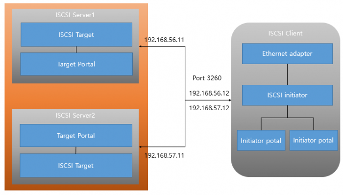

# iscsI 프로토콜과 Longhorn
## overview
Longhorn은 iscsI 프로토콜에 종속적임.

해당 문서는 iscsI 프로토콜을 학습하여, Longhorn과의 관계성을 이해함에 목적이 있음.

## iscsI
- TCP/IP 기반으로 서버 <-> Block Storage 간 데이터 전송을 담당하는 프로토콜
- Fibre Channel, Fibre Switch 대신 IP 네트워크를 통해 SAN을 구축함.
    - (IP 이용하여 Block I/O 전송)
- 기본적으로 **3260** 포트 사용

***iscsI 구성도***

### 구조
#### 1. 네트워크
- TCP/IP 에서 동작. 기본적으로 TCP 포트 3260 사용
#### 2. 데이터 흐름
- iscsI 서버(이니시에이터)에서 발생한 SCSI 명령어를 IP 패킷으로 캡슐화
- 표준 이더넷 네트워크로 데이터 전송
- 스토리지 장치(Target)에서 패킷 수신하여 SCSI 명령어로 변환
- Block Storage System에서 명령어 실행
- 결과를 같은 경로로 서버에 반환

### 장점
- TCP/IP 네트워크를 통해서 SCSI I/O 명령을 고속으로 전송하기 위한 프로토콜 기반의 스토리지 
- IP 기반으로 로컬(LAN) 네트워크 및 광대역(WAN) 네트워크에서 저장소 운영 가능
- Windows 및 Linux 등의 운영 체제에서는 iSCSI 디스크는 실제 하드 디스크로 연결됨
- SAN 기반 구성 보다는 대폭적 저비용 및 IP 네트워크 기반의 유연성이 매우 높음
- Network Teaming과 함께 구성시 매우 높은 고가용 시스템 구축

## 결론 : Longhorn과 iscsI의 관계성
- Longhorn은 K8s를 위한 분산 **Block Storage System** 
- K8s Network 혹은 물리적 네트워크를 통해 물리 서버에 연결되었거나 실제 상면 Storage와 연결
- 이때 Longhorn Manager가 Volume을 생성하기 위해 iscsI 프로토콜을 사용하여 Storage에 SCSI 명령어 요청
- ***생성된 스토리지 볼륨을 K8s Pod에 연결하기 위해 iscsI 프로토콜 사용***

**Longhorn은 내부적으로 iSCSI 타겟을 설정하여 파드가 iSCSI 이니시에이터를 통해 볼륨에 접근할 수 있게 함**