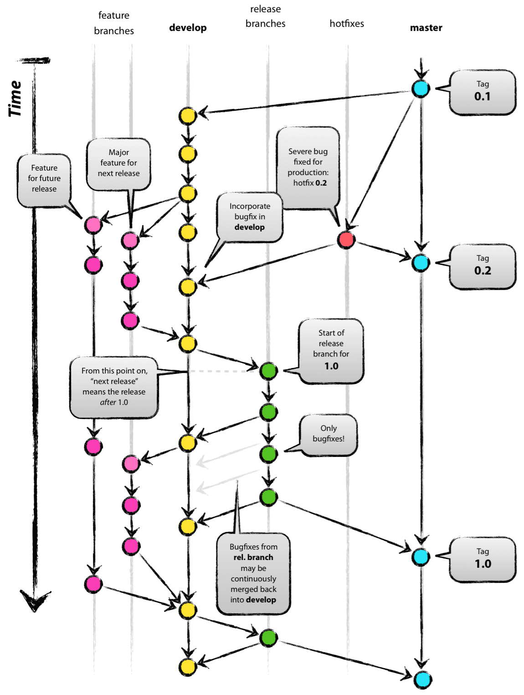

# 시멘틱 태깅 스크립트
## Overview
**GitFlow CI 전략에 맞춘 세멘틱 태깅 스크립트**
- Git 기반으로, 타 소스관리 툴 사용 시 변경 필요(git tag 사용)

## CI
- **master** : 운영계 배포 용도 branch
- **develop** : 개발용 default 브랜치로, 이 브랜치를 기준으로 feature 브랜치를 따고, 각 feature를 합치는 브랜치
- **feature** : 단위 기능 개발용 브랜치
- **release** : 다음배포를 위해 기능에 문제가 없는지 품질체크(QA) 용도의 브랜치
- **hotfix** : 배포가 되고 나서(master에 배포 코드가 합쳐진 후) 버그 발생 시 긴급 수정하는 브랜치

## CD
### 0. 시멘틱 태깅 스크립트
***vx.x.x 규칙 준수***

차례대로 v{prod}.{develop}.{release} 별로 배포될 때 마다 +1씩 증가
- [auto-tag.sh](./auto-tag.sh)

### 1. Jenkins
- [JenkinsFile](./scripts/JenkinsFile)

### 2. gitlab
- [gitlab-ci.yaml](./scripts/gitlab-ci.yaml)

### 3. github action
- [git-action.yaml](./scripts/git-action.yaml)