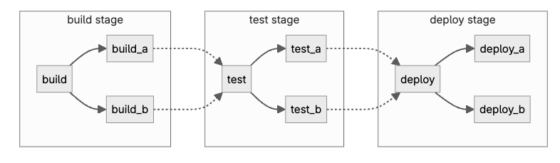
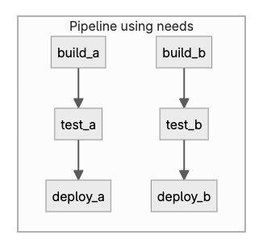
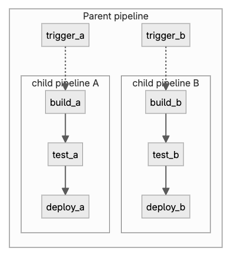

# gitlab ci sample
## overview
gitlab ci 스크립트

## ENV
- Source Repo : SVN
- Build Tool : Gradle
- 배포 환경 : Container
- Gilab 구축 : SaaS

## Requirements


## 주요 사항
### 0. ETC
Gitlab CI Pipeline은 키워드, 변수 등 다양한 방법을 통해 Pipeline을 확장하고 유연하게 작성이 가능함.

### 1. Predefined variables
- Gitlab CI Pipeline에서 미리 정의된 변수 목록
    - [공식문서_Predefined CI/CD variables reference](https://docs.gitlab.com/ci/variables/predefined_variables/)

- 하기 목록은 자주 사용되는 변수 리스트

||||
|--|--|--|
|No|변수명|설명|
|0|```CI_COMMIT_REF_NAME```|프로젝트가 빌드되는 Branch|
|1|```CI_COMMIT_MESSAGE```|커밋 메시지 전문|
|2|```CI_REGISTRY```|Gitlab Container Registry 주소|
|3|```CI_PROJECT_DIR```|Repository가 복제되는 전체 경로 및 작업 실행 위치|
|4|```CI_REGISTRY_USER```|gitlab User|
|5|```CI_REGISTRY_PASSWORD```|gitlab password|

### 2. Gitlab Basic Pipeline Architecture
- [Gitlab_공식문서_Pipeline_architecture](https://docs.gitlab.com/ci/pipelines/pipeline_architectures/#basic-pipelines)

#### 2.1 Basic Pipeline
모든 코드가 하나의 Repository에 위치한 간단한 프로젝트에 적합함.

빌드 단계에서 모든 작업을 동시에 실행하고, 모든 빌드가 완료된 이후 테스트가 진행. Build, Test, Deploy 단계는 이전 단계가 모두 완료된 이후에 실행함.

효율성은 떨어지나, 복잡성이 높지 않아서 유지보수성은 높음.



위 다이어그램의 ```gitlab-ci.yml``` 예시는 다음과 같음.
```yaml
stages:
  - build
  - test
  - deploy

default:
  image: alpine

build_a:
  stage: build
  script:
    - echo "This job builds something."

build_b:
  stage: build
  script:
    - echo "This job builds something else."

test_a:
  stage: test
  script:
    - echo "This job tests something. It will only run when all jobs in the"
    - echo "build stage are complete."

test_b:
  stage: test
  script:
    - echo "This job tests something else. It will only run when all jobs in the"
    - echo "build stage are complete too. It will start at about the same time as test_a."

deploy_a:
  stage: deploy
  script:
    - echo "This job deploys something. It will only run when all jobs in the"
    - echo "test stage complete."
  environment: production

deploy_b:
  stage: deploy
  script:
    - echo "This job deploys something else. It will only run when all jobs in the"
    - echo "test stage complete. It will start at about the same time as deploy_a."
  environment: production
```

#### 2.2 needs 키워드를 사용한 병렬 파이프라인
파이프라인 효율성이 중요하며, 빠르게 작업을 완료하기 위해서 ```needs``` 키워드 활용이 가능함.

Gitlab Pipeline에서 각 작업(build, test, deploy)간의 종속성을 ```needs``` 키워드로 맞춰주면, 같은 stage더라도 더 빠르게 작업을 완료.

만약 ```build_a```와 ```test_a```가 ```build_b```와 ```test_b```보다 훨씬 더 빠르게 완료된다면, GitLab은 ```build_b```가 아직 실행 중인 상태에서도 ```deploy_a```를 시작



위 다이어그램의 ```gitlab-ci.yml``` 예시는 다음과 같음.
```yaml
stages:
  - build
  - test
  - deploy

default:
  image: alpine

build_a:
  stage: build
  script:
    - echo "This job builds something quickly."

build_b:
  stage: build
  script:
    - echo "This job builds something else slowly."

test_a:
  stage: test
  needs: [build_a]
  script:
    - echo "This test job will start as soon as build_a finishes."
    - echo "It will not wait for build_b, or other jobs in the build stage, to finish."

test_b:
  stage: test
  needs: [build_b]
  script:
    - echo "This test job will start as soon as build_b finishes."
    - echo "It will not wait for other jobs in the build stage to finish."

deploy_a:
  stage: deploy
  needs: [test_a]
  script:
    - echo "Since build_a and test_a run quickly, this deploy job can run much earlier."
    - echo "It does not need to wait for build_b or test_b."
  environment: production

deploy_b:
  stage: deploy
  needs: [test_b]
  script:
    - echo "Since build_b and test_b run slowly, this deploy job will run much later."
  environment: production
```

#### 2.3 부모-자식 간 종속적인 Pipeline
파이프라인이 복잡해짐에 따라서, 몇가지 문제가 발생함.
- 하나의 Stage(build or test or deploy)의 모든 단계가 완료된 이후 다음 Stage의 작업이 실행되어야 하는 경우, 대기시간이 발생될 수 있음.
- 단일 파이프라인은 구성이 복잡해지기 때문에, 유지보수성이 저하됨.
- ```include``` 키워드를 포함한 파이프라인은 구성상 복잡성을 증가시키고, 작업이 중복되는 일이 발생할 수 있음.

이러한 문제는 바로 위 [needs Pipeline](#22-needs-키워드를-사용한-병렬-파이프라인)에서 발생될 수 있음.

해당 파이프라인은 두개의 패키지(a, b)로 나뉘어져 있기 때문에, 둘을 분리 관리하는것이 단순성을 높혀 유지보수와 작업 충돌 문제를 예방할 수 있음.

```gitlab-ci```는 다음 세가지 키워드로 부모-자식간 종속성을 만들어 이를 달성함.

- ```rules``` : 해당 영역에 변경 사항이 있을 때만 자식 파이프라인이 트리거되도록 함.
- ```include``` : 공통 코드를 참조하여 코드 중복을 방지
- ```needs``` : 자식 파이프라인 내에 위치하여, 부모-자식 간 종속 관계를 나타냄



위 다이어그램의 ```gitlab-ci.yml``` 예시는 다음과 같음.
```yaml
stages:
  - triggers

trigger_a:
  stage: triggers
  trigger:
    include: a/.gitlab-ci.yml
  rules:
    - changes:
        - a/*

trigger_b:
  stage: triggers
  trigger:
    include: b/.gitlab-ci.yml
  rules:
    - changes:
        - b/*
```

Repository 상 위치가 ```/a/.gitlab-ci.yml``` 이며, ```needs``` 키워드를 사용하는 자식 ```a```에 대한 예시는 다음과 같음.
```yaml
stages:
  - build
  - test
  - deploy

default:
  image: alpine

build_a:
  stage: build
  script:
    - echo "This job builds something."

test_a:
  stage: test
  needs: [build_a]
  script:
    - echo "This job tests something."

deploy_a:
  stage: deploy
  needs: [test_a]
  script:
    - echo "This job deploys something."
  environment: production
```

Repository 상 위치가 ```/b/.gitlab-ci.yml``` 이며, ```needs``` 키워드를 사용하는 자식 ```b```에 대한 예시는 다음과 같음.
```yaml
stages:
  - build
  - test
  - deploy

default:
  image: alpine

build_b:
  stage: build
  script:
    - echo "This job builds something else."

test_b:
  stage: test
  needs: [build_b]
  script:
    - echo "This job tests something else."

deploy_b:
  stage: deploy
  needs: [test_b]
  script:
    - echo "This job deploys something else."
  environment: production
```