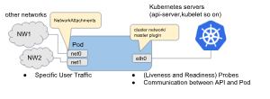
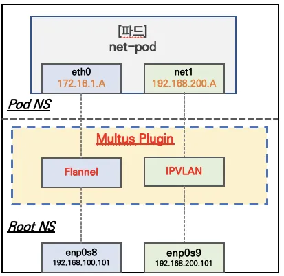

# Multus CNI
## Overview
- [Multus GiHub](https://github.com/k8snetworkplumbingwg/multus-cni)
- [QuickStart Guide](https://github.com/k8snetworkplumbingwg/multus-cni/blob/master/docs/quickstart.md)
- [Usage Guide](https://github.com/k8snetworkplumbingwg/multus-cni/blob/master/docs/how-to-use.md)
- [Multus-cni Configuration Reference](https://github.com/k8snetworkplumbingwg/multus-cni/blob/master/docs/configuration.md)

## 0. 목차
- [1. Multus CNI](#1-multus-cni)
- [2. 기능 List](#2-기능-list)
- [3. Multus 사용 방법](#3-multus-사용-방법)
- [4. calico vs Multus : 역할과 차이점](#4-calico-vs-multus-역할과-차이점)
- [5. 사용 사례](#5-사용-사례)
- [6. 클라우드 별 Multus 사례](#6-클라우드-별-multus-사례)

## 1. Multus CNI
Multus CNI는 Kubernetes Pod에 복수개의 NIC를 등록할 수 있는 CNI 입니다.

일반적으로 각 Kubernetes Pod는 loopback을 제외한 하나의 Network Interface를 가지고 있습니다. 그러나 Multus를 사용하면 복수개의 Interface를 가진 Multi-homed Pod를 생성할 수 있습니다. 이는 다른 CNI 플러그인을 호출할 수 있는 Multus의 "Meta-plugin"을 통해 이루어집니다.

따라서 Kubernetes에서는 기본적으로 단일 CNI 플러그인(Calico, Cilium, Flannel...)만 사용이 가능하나, Multus CNI를 사용하게 되면 Pod 내의 여러개 NIC를 추가할 수 있습니다.

### 1.1 Multi-homed Pod
아래 사진은 Multus CNI를 통해 프로비저닝된 Pod의 CNI 아키텍처 입니다.



위 아키텍처는 Pod가 3개의 Interface를 가진것을 보여주는데, 각각 eth0, net0, net1 입니다.

1. eth0 : Kubernetes의 API-Server, kubelet과 같은 K8s 서비스, 서버와 통신하기 위한 Interface
2. net0, net1 : 추가적으로 생성된 Network Interface이며, VLAN, VXLAN, PTP와 같은 다른 CNI 플러그인을 사용하여 다른 네트워크에 연결됩니다.

상세 Multus Plugin 구성은 다음과 같습니다.



Multus Plugin을 통해 Flannel CNI와 IPVLAN을 사용하게끔 설정합니다. 해당 설정은 NetworkAttachmentDefinition(줄여서 net-attach-def)를 통해 이루어지며, 이는 Kubernetes에서 추가적인 네트워크 인터페이스를 정의하는 객체입니다.

**Pod 첫번째 NIC eth0 :**
- Flannel CNI를 사용하여 pod CIDR로 IP대역을 할당 받고, vxlan overlay 통신을 사용합니다. 노드의 enp0s8과 매핑됩니다.
**Pod 두번째 NIC net1 :** 
- IPVLAN plugin 사용으로 net-attach-def에서 설정한 IP 대역을 할당 받고 VLAN L2통신을 사용합니다. 노드의 enp0s9와 매핑됩니다.


## 2. 기능 List
아래 명시된 기능은 NetworkAttachmentDefinition 를 정의하여 사용이 가능합니다.
- [3. Multus 사용방법](#3-multus-사용-방법) 참고

### 2.1 Multus에서 지원하는 CNI List
[참고 Link-CNI](https://www.cni.dev/plugins/current/main/)

- bridge plugin : 브릿지 환경 제공
- host-device : dpdk driver 를 컨테이너에 binding
- **ipvlan** plugin : L2/L3 모드 제공, 노드에 파드들은 모두 동일한 MAC 주소 사용, DHCP 사용 불가
- **macvlan** plugin : L2 모드 제공, 노드에 파드별로 각기 다른 MAC 주소 사용, DHCP 사용 적합
- ptp plugin : 컨테이너 끼리 1:1 연결
- win-bridge plugin (windows specific) : 브릿지 환경 제공
- win-overlay plugin (windows specific) : 오버레이 환경 제공

### 2.2 IPAM Plugin
Pod에 IP 주소 할당을 관리합니다.

[참고 Link](https://www.cni.dev/plugins/current/ipam/)

- dhcp plugin : DHCP 데몬(서비스)를 통해서 파드에 IP를 자동 할당
- host-local IP address management plugin : host-local databases 에서 파드에 IP 할당
- static IP address management plugin : 컨테이너에 IPv4/IPv6 를 직접 설정
→ 3rd party IPAM 사용 가능 : **Whereabout** IPAM 등

### 2.3 ETC
- tuning : sysctl parameters 값 변경 설정
- portmap : An iptables-based portmapping plugin , 컨테이너의 통신에 관련하는 일부 iptables rules 설정
- bandwidth : traffic control tbf (ingress/egress) 를 통한 대역폭 제한(bandwidth-limiting)
- sbr : source based routing, 소스 기반 라우팅 관련 설정 → 트래픽 통신 경로 분리에 유리 ⇒ 추후에는 VRF 기능으로 발전 예정
- firewall : iptables or firewalld 에 rules 추가를 통한 컨테이너 in/out 트래픽 통제

### 3. Multus 사용 방법
Multus는 위 [기능 List](#2-기능-list)에 명시된 기능을 사용하기 위해 아래와 같은 WorkFlow를 가집니다.

1. NetworkAttachmentDefinition 생성
2. Pod에 Annotation으로 NetworkAttachmentDefinition 등록

#### 3.1 예시
**MACVLAN을 사용하여 Pod에 추가 NIC를 설정하는 NetworkAttachmentDefinition**

- type: "macvlan" → Multus를 통해 MACVLAN CNI 플러그인을 사용
- master: "eth0" → 물리 네트워크 인터페이스와 연결
- mode: "bridge" → MACVLAN을 브릿지 모드로 설정
- ipam → IP 주소 할당을 위해 Static IP 사용

```yaml
apiVersion: k8s.cni.cncf.io/v1
kind: NetworkAttachmentDefinition
metadata:
  name: macvlan-net
spec:
  config: '{
    "cniVersion": "0.3.1",
    "type": "macvlan",
    "master": "eth0",
    "mode": "bridge",
    "ipam": {
      "type": "static",
      "addresses": [
        {
          "address": "192.168.1.100/24",
          "gateway": "192.168.1.1"
        }
      ]
    }
  }'
```

Pod에서 생성한 NetworkAttachmentDefinition를 사용하도록 annotation 추가

```yaml
apiVersion: v1
kind: Pod
metadata:
  name: my-pod
  annotations:
    k8s.v1.cni.cncf.io/networks: macvlan-net
spec:
  containers:
    - name: my-container
      image: busybox
      command: ["sleep", "3600"]
```

## 4. Calico vs. Multus: 역할과 차이점
calico와 Multus를 비교하는 것은 기능별 관점이 너무 상이하여 기능별 비교는 의미가 없습니다. 그러나 함께 사용되는 주체로써 이해를 돕기 위해 비교해 보면 다음 표와 같습니다.

|  | **Calico** | **Multus** |
|---|---|---|
| **주요 역할** | 네트워크 정책(보안) 및 라우팅 제공 | 여러 개의 CNI 플러그인을 Pod에 연결 |
| **CNI 플러그인 유형** | **기본 CNI (Primary CNI)** | **메타 CNI (Meta CNI)** |
| **주 기능** | - Pod 네트워크 제공 (IP 할당) <br> - 네트워크 정책 (NetworkPolicy) 적용 <br> - BGP를 통한 클러스터 외부와 연결 | - 한 개 이상의 네트워크 인터페이스를 Pod에 추가할 수 있도록 함 <br> - Bridge, IPVLAN, MACVLAN 등의 CNI 플러그인을 함께 사용할 수 있게 해줌 |
| **Pod 인터페이스** | `eth0` 하나만 생성 (단일 네트워크) | 여러 개의 인터페이스(`eth0`, `net1`, `net2` 등)를 Pod에 추가 가능 |
| **사용 예시** | - Kubernetes에서 기본 네트워크 설정 <br> - 네트워크 정책을 적용하여 보안 강화 <br> - BGP/Overlay 모드를 활용하여 노드 간 트래픽 관리 | - **Multi-Homed Pod** (여러 네트워크 인터페이스 필요할 때) <br> - **SR-IOV, DPDK, MACVLAN, IPVLAN** 같은 특정 CNI 플러그인 사용 |
| **사용 방식** | 단독으로 사용 가능 (기본 네트워크 플러그인) | **Calico, Flannel 등과 함께 사용** (추가 네트워크용) |
| **추가 설명** | Kubernetes 클러스터에서 가장 많이 사용되는 기본 CNI 플러그인 중 하나 | Pod 내 여러 네트워크 인터페이스를 추가할 수 있도록 보조 역할 수행 |

✅ **Calico는 기본 CNI로 사용하며, Multus는 여러 CNI를 추가할 수 있도록 도와주는 메타 CNI**  
✅ **Multus는 자체적으로 네트워크를 제공하지 않고, 다른 CNI(예: Calico, Flannel, MACVLAN 등)를 사용함**  
✅ **따라서 Multus는 Calico와 경쟁하는 것이 아니라, 함께 사용할 수 있음**  

## 5. 사용 사례
1. 호스트의 다른 Network Interface에 접근해야 할 때
2. Pod 별 IP 대역을 분리하는 등의 고급 네트워킹 정책이 필요할 때(타 CNI도 지원할 수 있으니 요구사항 정제하여 확인필요)
3. 사내 컴플라이언스를 지키기 위해 외부 네트워크 통신과 내부 통신을 격리시켜야 할 때

## 6. 클라우드 별 Multus 사례
Multus CNI는 Kubernetes 환경에서 단일 Pod에 여러 네트워크 인터페이스를 연결하여 고급 네트워크 구성을 가능하게 하는 오픈 소스 CNI 플러그인입니다. 이는 특히 트래픽 분리, 패킷 가속화, 그리고 특정 네트워크 요구 사항을 충족시키기 위해 사용됩니다. 아래는 Multus CNI를 활용한 몇 가지 실제 사례입니다.

1. [AWS EKS에서 Multus 지원](https://aws.amazon.com/ko/about-aws/whats-new/2021/08/amazon-eks-now-supports-multus/?utm_source=chatgpt.com)
Amazon Elastic Kubernetes Service(EKS)는 Multus CNI 플러그인을 지원하여 Pod에 다중 네트워크 인터페이스를 첨부할 수 있도록 합니다. 이는 5G 및 스트리밍 네트워크와 같은 고급 네트워킹 구성이 필요한 사용 사례에서 유용합니다.

2. [Oracle OKE에서 SR-IOV와의 통합](https://docs.oracle.com/ko/learn/sriov_interfaces_pods_oke/?utm_source=chatgpt.com)
Oracle Kubernetes Engine(OKE)은 Multus와 SR-IOV(Single Root I/O Virtualization) CNI 플러그인을 활용하여 Pod에 고성능 네트워크 인터페이스를 제공합니다. 이를 통해 네트워크 집약적인 워크로드에서 성능을 향상시킬 수 있습니다.

3. [Red Hat OpenShift에서 Multus 활용](https://www.redhat.com/ko/blog/using-the-multus-cni-in-openshift?utm_source=chatgpt.com)
Red Hat의 OpenShift는 Multus CNI를 사용하여 Pod에 여러 네트워크 인터페이스를 연결하는 기능을 제공합니다. 이를 통해 다양한 네트워크 요구 사항을 가진 애플리케이션을 효과적으로 지원할 수 있습니다.
