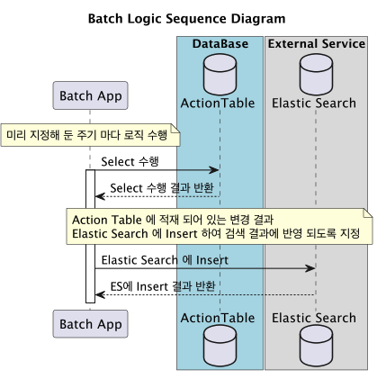

# eventIndexInitBatch
elastic search에 RDB 데이터를 특정 event별로 넣어주는 배치 API
>해당 배치 API는 RDB에 특정 event가 발생했을 경우, 해당 evnet가 발생한 로우만 elastic search에 넣어줍니다.

## 사전 지식
해당 Application은 SpringBatch이기 때문에 , Batch Application의 동작 방식에 대해 이해가 필요합니다.
- [SpringBatch의 동작과정 아키텍처 설명](../allIndexInitBatch/SpringBatch_사용방안.md)

## Overview
부분 배치 로직은 다음과 같습니다.

### 1. MainLogic
먼저 기존 로직에서 , Insert , Update , Delete 이벤트가 대상 테이블에 발생 하면 , ElasticSearch에 색인될 JSON을 생성시킨 뒤 , ActionTable에 해당 정보를 적제해 둡니다. 


### 2. BatchLogic
일정 주기를 가지는 Batch Application이 Action Table에 적재된 변경 정보(Json)를 ElasticSearch에 색인 합니다.



## Table 생성
기반이 되는 나머지 테이블들은 , 아래 링크를 타고가면 확인할 수 있습니다.
- [RDB 정보 섹션에서 찾을수 있음.](../allIndexInitBatch/사용방안.md)

### 1. Action Table 생성
| 컬럼 명             | Data Type   | 요약 정보                       | 비고                                 |
|------------------|-------------|-----------------------------|------------------------------------|
| _id | int         | row별 식별자 값 (auto_increment) | pk                                 |
| action     | varchar(20) | 해당 이벤트 분류값                  | UPDATE , DELETE , INSERT 셋중 하나 들어옴 |
| firstInfoId     | int         | 메인 테이블의 기본키                 | doc id                             |
| changesValue     | varchar(20) | 변경 내용                       | ES에 색인되는 JSON 값이 들어감               |
| updateDateTime     | timestamp   | 변경 발생시간                     | -                                  |

## Json Type 
changeValue 컬럼에 Insert되는 Json은 아래 형식으로 변환 생성되어 ActionTable에 적재됩니다.
- create 일 경우와 Update일 경우에만 Json을 저장하고, Delete일경우엔 doc id만 있으면되기때문에 , changesValue는 비워두고 docId인 fistInfoId만 저장합니다.

### CREATE
- 모든 필드를 저장해둡니다.
```bash
{
    "docInfo": {
        "firstInfoId": 2,
        "name": "2_영상",
        "age": 7000,
        "keyword": ["초록", "힐링이다", "mood"],
        "categories": [
            {
                "main_category": "영상",
                "sub_category": "전문가"
            }
        ]
    }
}
```

### UPDATE
- 변경대상 필드만 저장해 둡니다.
```bash
{
    "docInfo": {
        "update_target": {
            "name": "새로운_영상_이름"
        }
    }
}
```

### 키워드 추가
키워드들을 추가하기 위해서 ,List type으로 키워드 필드를 저장해 둡니다.
```bash
{
  "keywords": ["추가1","추가2"...]  
}
```

### 

## 수행 쿼리
ElasticSearch에 이벤트별 수행해야하는 쿼리는 다음과 같습니다.
- [ElasticSearch Index CRUD 관련 문서.](../../../../DevOps_solutions/Elastic_모음/ElasticSearch/Index_CRUD.md)

### 수정일 경우
- target 필드 값 수정
```bash
{
    "doc" : {
       "target": "new_value"
    }
}
```

- keywords 파라미터 값 추가
```bash
{
  "script": {
    "source": "if (!ctx._source.keyword.contains(params.keywords_to_add)) { ctx._source.keyword.addAll(params.keywords_to_add); }",
    "lang": "painless",
    "params": {
      "keywords_to_add": ["으악셋","으악둘"]
    }
  }
}
```

#### Insert일 경우
- Insert 일 경우엔, 미리 생성해둔 index-template에 맞추어 객체를 생성한 뒤 그대로 Json 변환 후 저장해 둡니다.
```bash
{
    "firstInfoId": 2,
    "name": "2_영상",
    "age": 7000,
    "keyword": ["초록", "힐링이다", "mood"],
    "categories": [
        {
            "main_category": "영상",
            "sub_category": "전문가"
        }
    ]
}
```

#### Delete일 경우
- doc 자체 제거일경우
>json은 저장하지 않고 , doc id만 적재해 둡니다.

- 특정 keyword만 제거할 경우
```bash
{
  "script": {
    "source": "for(int i =0; i< params.keywords_to_remove.size(); i++) {if (ctx._source.keyword.contains(params.keywords_to_remove[i])) {ctx._source.keyword.removeIf(e -> e.equals(params.keywords_to_remove[i]));}}",
    "lang": "painless",
    "params": {
      "keywords_to_remove": ["으악하나","으악둘"]
    }
  }
}
```

