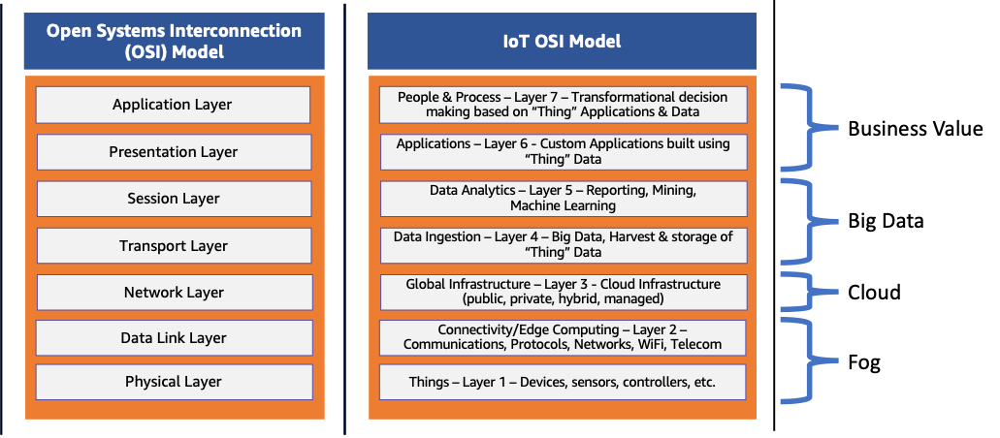

# OSI 7 Layer
## Overview 
osi 7 layer를 복습하기 위한 문서(글은 참고 자료의 공식 문서를 번역하였습니다.)

## 목차
### [1. OSI 7 Layer Model](#1-osi-7-layer-model-1)
### [2. 계층 구조](#2-계층-구조-1)
### [3. OSI 7 Layer Model의 대안](#3-osi-7-layer-model의-대안-1)
### - [3.1 TCP/IP](#31-tcpip-model)
### [4. 참고 자료](#4-참고-자료-1)

## 1. OSI 7 Layer Model
### 1.1 OSI 7 Layer Model이란 무엇인가?
개방형 시스템 상호 연결(Open Systems Interconnection) 모델은 네트워크 통신 기능을 7개의 계층으로 나눈 개념적 프레임워크 모델입니다. 다양한 하드웨어들과 소프트웨어 기술이 지리적, 정치적 경계의 관계 없이 일관되게 작동해야 하기 때문에 네트워크를 통해 데이터를 전송하는것은 복잡합니다. OSI 데이터 모델은 컴퓨터 네트워크를 위한 범용적 언어를 제공해야 해서 다양한 기술들이 표준 프로토콜 또는 통신 규칙들로 통신할 수 있습니다. 특정 계층에 속한 모든 기술은 특정 기능을 제공하고 해당 기능을 수행해야 네트워킹에 유용하게 사용할 수 있습니다. 상위 계층에 속한 기술은 기본 구현 세부 사항에 걱정할 필요 없이 하위 계층의 기술을 사용할 수 있으므로 추상화의 이점이 있습니다.

### 1.2 OSI 7 Layer Model의 중요성
개방형 시스템 상호 연결(OSI) 모델의 계층은 소프트웨어와 하드웨어 컴포넌트 전반에 걸쳐 모든 타입의 네트워크 통신을 캡슐화 합니다. 이 모델은 독립적인 두개의 독립적인 시스템이 현재 운영 계층에 기반한 표준화된 인터페이스 또는 프로토콜을 통해 통신할 수 있도록 디자인되었습니다.

OSI 모델은 다음과 같은 이점을 가집니다.

#### 1.2.1 복잡한 시스템의 대한 이해 공유
엔지니어는 OSI 모델을 사용하여 복잡한 네트워크 시스템 아키텍처를 구성하고 모델링할 수 있습니다. 주요 기능에 따라 각각의 시스템 구성 요소의 운영 계층을 분리할 수 있습니다. 추상화를 통해 더 작고 관리 가능한 부분들로 분해하는 능력은 사람들이 (시스템 전체적인 부분을)전체적인것을 개념화하는것을 더 쉽게 만듭니다.

#### 1.2.2 더 빠른 연구와 개발
OSI 레퍼런스 모델과 함께 엔지니어가 그들의 작업을 더 잘 이해할 수 있습니다. 엔지니어들이 새로운 시스템을 만들때 각각을 통신시키기 위한 네트워크 시스템이 어떤 기술적 계층(또는 계층들)을 대상으로 개발하는지 알 고 있습니다. 엔지니어들은 네트워크 시스템을 개발하고 반복적인 프로세스와 프로토콜을 이용할 수 있습니다.

#### 1.2.3 유연한 표준화
OSI 모델은 레벨간의 사용할 프로토콜을 지정하지 않고 프로토콜이 수행하는 작업을 지정합니다. 네트워크 통신 개발을 표준화하여 시스템의 사전 지식 없이 사람들이 빠르게 이해하고, 구축하고, 더 복잡한 시스템을 분해할 수 있도록 합니다. 또한 세부사항을 추상화하기 때문에 엔지니어는 모든 모델의 측면을 이해할 필요가 없습니다. 현대적인 애플리케이션에서, 하위 레벨의 네트워킹과 프로토콜들을 추상화하여 시스템 설계와 개발을 단순화 합니다. 따라오는 이미지는 현대적인 애플리케이션 개발에서 OSI 모델이 어떻게 사용되는지 보여줍니다.

## 2. 계층 구조
OSI 7 Layer Model은 7개의 다른 Layer로 구성되어 있습니다.

개방형 시스템 상호 연결(OSI) 모델은 국제 표준화 기구(ISO) 등에서 1970년도 후반에 만들어졌습니다. 1984년에 ISO 7498에 의해 첫번째 배포가 이루어졌고, 현재 버전은 ISO/IEC 7498-1:1994 입니다. 다음으로 모델 7개 계층이 제시됩니다.

1. Physical layer
    
    물리 계층은 **물리적 통신 매체와 해당 매체를 통해 데이터를 전송**하는 기술입니다. 기본적으로 데이터 통신은 fiber-optic cables, copper cabling, 그리고 air와 같은 다양한 물리적 채널로 디지털과 전자적 신호를 전송하는 것입니다. 물리계층은 블루투스, NFC, 데이터 전송 속도와 같은 채널과 밀접하게 관련된 기술 및 지표에 대한 표준이 포함됩니다.

2. Data link layer
    
    데이터 링크 계층은 물리 계층이 이미 존재하는 네트워크를 통해 두 기기를 연결하는데 사용되는 기술입니다. 데이터 패킷 안에 캡슐화된 디지털 신호인 **data frames**를 관리합니다. 데이터 링크 계층에서 key focuses는 **흐름 제어**와 **에러 제어** 입니다. Ethernet은 해당 레벨의 표준 예시 입니다. 데이터 링크 계층은 보통 두개의 하위 계층으로 나뉘어 집니다.: **Mac(Media Access Control)** 계층과 LLC(Logical Link Control) 계층

3. Network layer

    네트워크 계층은 **분산된 네트워크 하나 또는 연결된 여러 네트워크의 노드들 또는 기기들 간의 라우팅, 포워딩, 주소 지정과 같은 개념과 관련이 있습니다.** 네트워크 계층은 **흐름제어** 또한 관리할 수 있습니다. 인터넷에서는 인터넷 프로토콜 **v4(IPv4)**와 **IPv6**가 주요 네트워크 계층의 프로토콜 입니다.

4. Transport layer

    전송 계층의 **주요 요점은 데이터 패킷이 주문에 맞게 잘 도착 하였는지, 없어지거나 에러가 없는지, 필요하다면 균일하게 복구해야 하는지 입니다(원활하게 복구).** 전송 계층의 초점은 **흐름제어**, **에러제어**에 있습니다. 해당 계층에서 흔히 사용되는 프로토콜은 연결 기반의 거의 손실이 없는 **TCP (Transmission Control Protocol)**과 무연결 기반의 손실이 있는 **UDP (User Datagram Protocol)**이 있습니다. TCP는 데이터가 온전해야만 할때 흔히 사용되고 (e.g. file share), UDP는 패킷이 없어지는것이 중요하지 않은 경우 사용됩니다 (e.g. video streaming).

5. Session layer

    세션 계층은 **한 세션 내부에 서로 다른 애플리케이션간의 네트워크 조정**을 책임집니다. 세션은 1대1 애플리케이션 연결과 동기화 충돌의 시작과 끝을 관리합니다. **NFS(Network File System)**와 **(SMB)Server Message Block**들은 세션 계층에서 흔히 사용되는 프로토콜 입니다.

6. Presentation layer

    프레젠테이션 계층은 **애플리케이션에서 보내거나 소비하는 데이터 자체 구문을 일차적인 관심사**로 둡니다. 예를들어 **HTML(Hypertext Markup Language), JSON(JavaScipt Object Notation), CSV(Comma Separated Values)**들은 프레젠테이션 계층의 데이터 구조를 설명하는 모델링된 언어 입니다.

7. Application layer 

    애플리케이션 계층은 **특정 타입의 애플리케이션과 표준화된 통신 방법**을 일차적 관심사로 둡니다. 예를들어 브라우저는 **HTTPS(HyperText Transfer Protocol Secure), HTTP** 를 통해 통신할 수 있고, 이메일 클라이언트는 **POP3(Post Office Protocol version 3), SMTP(Simple Mail Transfer Protocol)** 을 통해 통신할 수 있습니다.

## 3. OSI 7 Layer Model의 대안
과거의 네트워킹 모델은 SPX/IPX(Sequenced Packet Exchange/Internet Packet Exchange) 및 NetBIOS(Network Basic Input Output System) 같은 다양한 네트워킹 모델이 사용되었습니다. 오늘날, TCP/IP 모델이 OSI(Open Systems Interconnection) 모델의 대안으로 사양되고 있습니다.

### 3.1 TCP/IP Model
TCP/IP 모델은 5개의 다른 Layer로 구성되어 있습니다.

1. The physical layer
2. The data link layer
3. The network layer
4. The transport layer
5. The application layer

물리 계층, 네트워크 계층, 애플리케이션 계층은 OSI 모델의 직접 매핑되는것 같지만, 그렇지 않습니다. 그보다 TCP/IP 모델은 인터넷 구조 및 프로토콜에 더 잘 매핑됩니다.

OSI 모델도 교육 목적의 전체론적 관점에서 네트워킹 작동 방식을 설명하는 네트워킹 모델로 사용되지만, 현재는 TCP/IP 모델이 더 많이 사용됩니다.

### 3.2 proprietary 프로토콜 및 모델의 참고 사항
중요한 점으로, 모든 인터넷 기반의 시스템들과 애플리케이션들은 TCP/IP 모델 혹은 OSI 모델을 따르는 것은 아니라는 것 입니다. 단순히, 모든 오프라인 기반의 네트워크 시스템과 애플리케이션 또한 OSI 모델이나 다른 모델을 사용하는것 또한 아닙니다.

OSI와 TCP/IP 모델들은 개방형 표준 입니다. 누구나 사용할 수 있고 구축하여 특정 요구사항을 충족하게끔 디자인되었습니다.

어떤 조직들은 프로토콜과 모델을 포함하여 내부 인터넷에서만 사용 가능한 비공개 소스를 디자인합니다. 때때로 그들은 나중에 상호 운용성과 커뮤니티 개발을 위해 일반에 표준을 공개하는 경우도 있습니다. 한 예로, s2n-tls, TLS 프로토콜은 Amazon Web Services (AWS)의 독점 프로토콜 이었지만 현재 오픈소스입니다.

## 4. 참고 자료
- [AWS 공식 문서 OSI 모델이란 무엇인가요?](https://aws.amazon.com/ko/what-is/osi-model/)