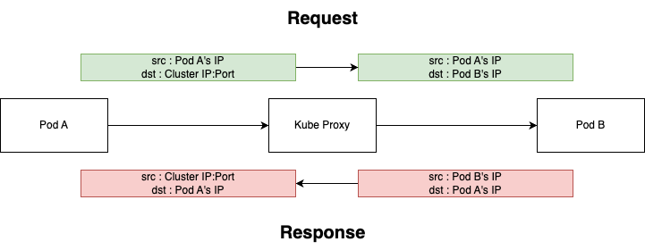
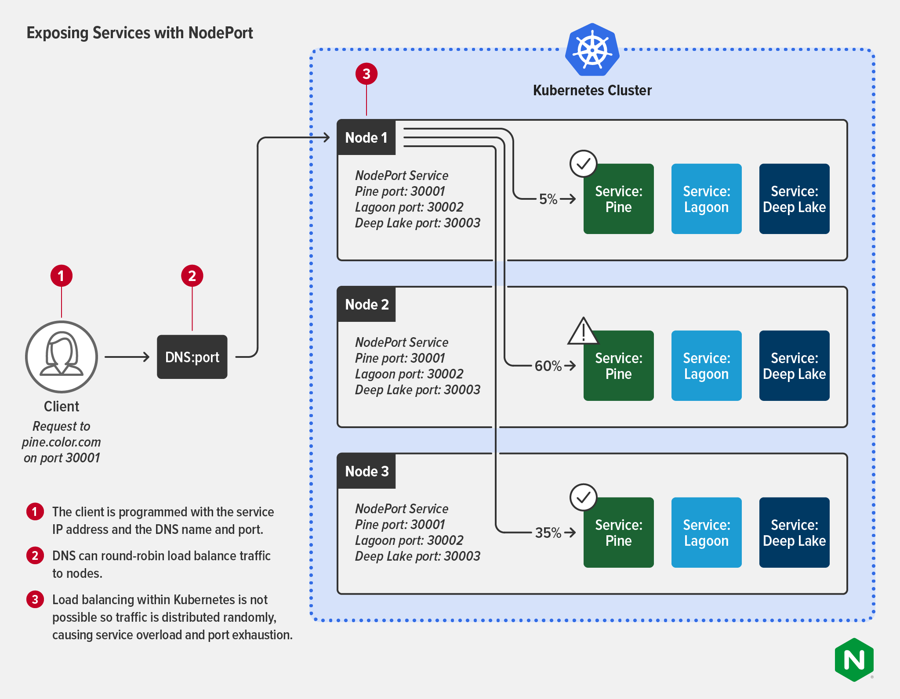
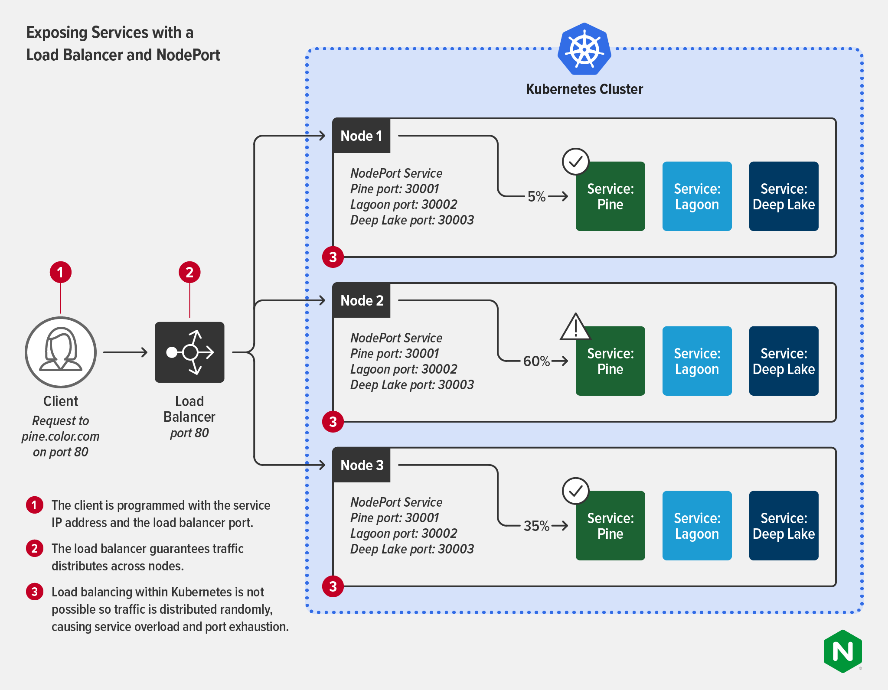

# kubernetes network - kube proxy
kubernetes의 서비스가 어떻게 백엔드 Pod를 찾아가는지에 대한 힌트는, 각 노드에서 작동중인 Kube-proxy가 갖고 있습니다.

따라서 Kubernetes Service는 Kube-Proxy와 밀접한 관계를 갖고 있으며, Service의 구현 방식을 알기 위해선 Kube-Proxy의 동작 방식또한 알아야 합니다.

- [참고문서-NGINX docs](https://nginx.com/blog/kubernetes-networking-101/)
- [blog](https://computing-jhson.tistory.com/107)

## Service 구현 방식
Kubernetes Service는 Pod들을 변하지 않는 안정적인 IP:Port 쌍으로 노출시키며, Kubernetes 내부에는 Service의 IP:Port 로 타 파드에게 접근할 수 있게 됩니다.

Service가 생성하는 IP:Port 는 완전 가상 네트워크 입니다. 어떠한 NIC에도 속하지 않으며, 패킷이 노드를 벗어날 때, 출발지 혹은 도착지의 IP:Port로서도 표시되지 않습니다. Service는 단순히 IP:Port의 쌍으로 백엔드 파드를 묶는다는것으로, Service IP:Port로는 아무것도 나타내지 못합니다. 이것이 Service의 IP:Port로 Ping을 날리지 못하는 이유입니다.

### 1. Kube-Proxy
Service와 관련된 모든 동작은, 각 노드에서 작동하는 Kube-Proxy와 밀접한 관계를 맺고 있습니다. 초기의 Kubernetes는 Kube-Proxy가 실제 프록시로 작동하며 요청을 기다리다가, 들어오는 패킷을 백엔드 파드로 보내기위해 새로운 연결을 생성하였습니다. 이 모드를 ```userspace proxy mode``` 라 합니다. 

현재의 Kube-Proxy는 ```iptables proxy mode``` 가 default이며, 원한다면 ```userspace proxy mode``` 로 임의변경하여 사용할 수 도 있습니다.
- 추가로 ```IPVS mode``` 도 있습니다.

해당 문서는 ```iptables proxy mode``` 를 설명합니다.

#### 1.1 iptables
iptables 는 , 리눅스의 패킷 필터링 도구로써 NAT(Network Address Translation) 에 사용될 수 있습니다. 따라서 들어오는 패킷을 검사하여 원하는 주소로 변경후 내보낼 수 있습니다.

iptables 는 , rule 기반으로 작동하게 되는데, iptables에 등록된 rule에 따라 A 위치로 가는 패킷을 B 위치로 변환하여 보냅니다.

***따라서 이 rule을 잘 관리하게 되면, 파드 A에서 출발한 패킷이 파드 B로 잘 도착하게끔 할 수 있는데, 이 rule을 관리하는 주체가 바로 Kube-Proxy 가 됩니다.***

### 2. Kube-Proxy와 iptables
만약 사용자가 Service를 생성하면, 그 즉시 가상의 IP:Port가 생성되고 API 서버는 모든 워커에 실행중인 Kube-Proxy 에이전트들에게 서비스가 생성되었다고 통보합니다.

그럼 각 노드의 모든 Kube-Proxy는 iptables의 rule을 수정하거나 추가, 삭제하는등의 작업을 하게 되고, ***만들어진 iptables의 rule은 Service의 IP:Port로 가는 패킷을 가로채서 목적지 주소를 변경하여(NAT) 패킷이 알맞는 목적지 파드로 가도록 합니다.***

    iptables는 백엔드 파드에 가는 트래픽을 랜덤 확률로 부하분산합니다. 
    
    그러나 IPVS mode는 L4 LoadBalancing mode이기 때문에 rr, lc, dh 등 많은 loadBalacing 알고리즘을 지원합니다.

#### 2.1 Kube-Proxy의 감시주체
Kube-Proxy은 iptables mode로 작동한다 했을 경우에, Service와 endpoint들의 변경을 계속해서 감시하면서 iptables rule을 계속해서 최신화 합니다.

예를들어 Pod가 생성되거나 삭제될때(ip 생성, 삭제), readiness Probe 상태가 변경될 때, 파드 레이블이 수정되어 Service endpoint에서 벗어날 때 등을 감시합니다.

## 다양한 서비스의 구현방안 with Kube-Proxy
### 1. ClusterIP
ClusterIP Type인 Service 는, 대부분 Pod간 통신에 사용되게 됩니다.

***만약 출발지가 파드 A, 목적지가 파드 B라면...***

위에 작성해 두었듯, Kube-Proxy에 의해 관리되는 iptables rule을 통해서, 출발지 파드 A의 패킷이 iptables rule를 통해 NAT 에 의해 목적지 주소인 파드 B의 IP로 바뀌게 됨으로써 통신이 완료됩니다.

Response 또한 동일하게 DNAT 되어 작동합니다.



### 2. NodePort
NodePort Type의 Service 는, Kubernetes Cluster 외부의 Client가 Kubernetes의 파드에 포트로 접근하기 위해 사용됩니다.

전반적으로 NodePort Type은, 각 노드의 Port를 예약해두고 해당 Port로 들어온 패킷을 ClusterIP와 동일하게 NAT 되어 알맞는 파드로 전달되게 됩니다.

이러한 NAT 작업 또한 Kube-Proxy가 수행하게 됩니다.



그런데 이런 NodePort Type은 큰 단점이 존재하는데,

1. 클라이언트는 연결하기 위해 각 노드 IP를 알아야 하며, 노드는 언제든 변경 삭제될 수 있기에 고정적이지 못합니다.
2. NodePort는 트래픽을 여러 Service로 프록시할 수 없습니다.
3. 위 그림처럼 NodePort는 여러 Kubernetes Cluster 내에서 여러 Service로 부하분산되지 못하고 트래픽이 무작위로 분산되기 때문에 서비스 과부하 및 포트고갈 문제가 발생할 수 있습니다.
    - NodePort 범위 : 30000 ~ 32767

### 3. LoadBalancer
LoadBalancer Type은, Kubernetes Cluster 외부의 클라우드 제공자나 metalLB같은 솔루션을 구축하여 사용합니다.

LB가 외부에서 접근가능한 단일진입점을 제공해주기 떄문에, NodePort의 1번 단점인 노드가 변경될수 있다는 단점은 해결이 가능하며, 각 노드로 트래픽을 부하분산할 수 있습니다.

그러나 LoadBalancer Type 또한 결국 LB의 Target이 되는것은 각 노드의 Backend NodePort기 때문에 여전히 NodePort의 단점을 갖고잇습니다.

이때 NodePort를 통해 들어온 트래픽을 NAT하여 백엔드 Service endpoint로 전달하는 주체는 Kube-Proxy 가 됩니다.

