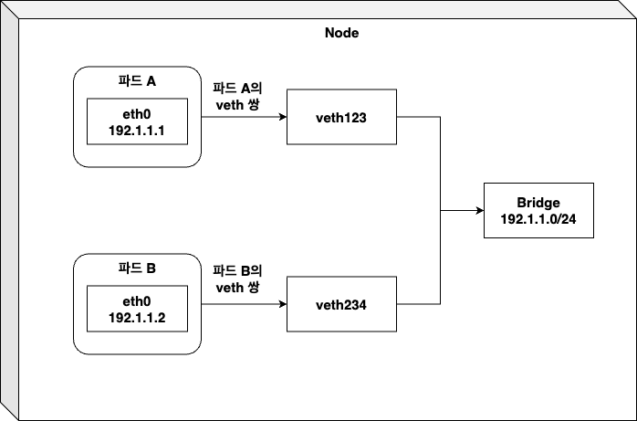
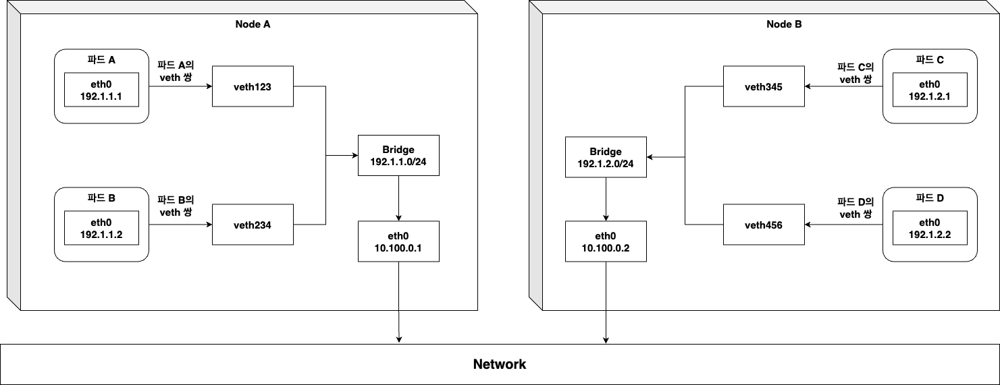

# Kubernetes network - pod간 통신
Kubernetes 상 Pod는 Private Network에 위치합니다.

그러나 다른 노드의 Pod또한 Private Network인데, 둘은 통신이 되어야합니다.

또한 Pod IP는 독립적이어야 하며, Pod간 통신 시 패킷이 NAT 없이 통신되어야 합니다.
- 파드 사이에 NAT가 없다면, Kubernetes 내부 Application이 다른 파드에 IP를 가지고 연결을 수행할 수 있습니다.

그러나 , Pod와 외부 Internet간 통신에는 패킷의 출발지 IP를 변경하는것이 필요한데, 그 이유는 Pod IP는 Private Network이기 때문입니다. 외부로 나갈때 패킷의 IP는 파드 IP에서 호스트 워커노드의 IP로 변환됩니다.
- 파드가 Running중인 Worker Node의 IP로 변환됩니다.

이러한 요구사항을 충족시키기 위해, Kubernetes Network는 아래와 같은 동작방식을 추구합니다.

## Kubernetes Network 기본 동작방식
파드의 IP주소와 네트워크 네임스페이스는 기본적으로 pause 컨테이너에 의해 관리되게 됩니다. 따라서 파드 컨테이너는 pause 컨테이너 네임스페이스를 사용하게 되는데,, 그래서 **파드 네트워크 인터페이스는, Infra 컨테이너인 pause 컨테이너에서 설정된 것임을 알 수 있습니다.**




pause 컨테이너가 실행되기 전에, Kubernetes는 컨테이너를 위한 가상 이더넷 인터페이스 쌍(veth 쌍) 이 생성됩니다.

**이 쌍의 한쪽 인터페이스는 Host의 네임스페이스에 남아있게 되고, (ifconfig 시 볼 수 있는 veth~ 목록으로 ifconfig로 확인할 수 있습니다.) 나머지 한쪽은 컨테이너 네트워크 네임스페이스 안으로 옮겨져서 이름이 eth0로 변경되게 됩니다.**

이 쌍은, 파이프와 같은데, 한쪽으로 들어가게되면 다른 한쪽으로 나오게 됩니다. 반대로 들어가도 동일하게 작동합니다.

그리고 Host의 네트워크 네임스페이스에 있는 인터페이스는, container runtime이 사용할 수 있도록 설정된 네트워크 브리지에 연결되게 됩니다.

그리고 파드 내부의 eth0 인터페이스는, 브리지의 CIDR 안에서 IP를 할당받게 되는데, **컨테이너 내부에 작동하는 Application에서 eth0 인터페이스(container 네임스페이스의 인터페이스)로 전송하면, Host 네임스페이스 다른쪽인 veth123 인터페이스로 나오면서 브리지로 전달되게 됩니다. 이는 브리지에 연결된 모든 네트워크 인터페이스에서 해당 패킷을 수신할 수 있음을 의미합니다.**

- 여기서 설명하는 Host 란 파드가 실행중인 worker node를 의미합니다.

  따라서 worker node는 파드가 실행될 때 생성되는 가상 네트워크 인터페이스(veth123 등..)와 브리지에 연결된 네트워크 인터페이스 두개가 생성되고, 이 둘은 리눅스 네임스페이스로 분리되게 됩니다.(커널은 공유)

## 노드 내부 파드간 통신
위 그림에서 파드 A가 보낸 패킷을 파드 B가 받기 위해 동작방식을 간단히 작성해보면,

1. 파드 A가 패킷을 보내는데, eth0로 보냄
2. eth0로 보내진 패킷은 veth123으로 나옴
3. veth123에서 브리지로 패킷이 전달
4. 브리지는 해당패킷을 veth234로 전달
5. veth234로 들어간 패킷은 eth1로 나오면서 패킷전달 완료

가 됩니다.

## 노드끼리의 통신
그렇다면 노드끼리 통신하기 위해선, 해당 브리지를 어떻게든 연결시켜야 파드에서 나온 패킷이 전달될것입니다.

이때 노드들의 브리지끼리 연결하는 방법으론 , **오버레이**, **언더레이 네트워크**, **기본 3계층 라우팅** 을 통해 가능합니다.

또한 처음 요구사항이었던 파드 IP들은 유일해야 한다는 점 또한 고려해야 합니다.



위 그림을 보면, 노드끼리 통신하기 위해서는 노드의 물리적 네트워크 인터페이스인 eth0 와 같은 애들이 브리지에 연결되어야 한다는것을 알 수 있습니다.

또한 라우팅테이블 설정을 해주어야하는데,
- Node A에서 발생한 패킷이 Node B로 가게되려면, 목적지가 192.1.2.0/24 이어야 하고, 
- Node B에서 발생한 패킷이 Node A로 가게되려면, 목적지가 192.1.1.0/24 이어야 합니다.

**그러나 해당 설정은 두 노드가 라우터 없이 스위치로만 연결됐을 경우에만 동작하는데, 라우터는 패킷이 참조하는 파드 IP가 Private 대역에 속하기 때문에 패킷을 삭제하기 때문입니다.**
- 라우터는 일반적으로 Private IP 주소를 가진 패킷을 인터넷으로 전달하기 때문에, 패킷이 삭제됩니다.
- 스위치로만 했을 경우 동작하는 이유는, 라우터 없이 연결되면 라우팅이 노드의 로컬 라우팅테이블에 의존하기에 라우터를 거치지 않아서 동작합니다.

라우터의 라우팅 테이블 설정으로 Private 대역으로 통하는 패킷을 강제로 전달할 순 있지만, 노드간 라우터가 늘어나면 설정하기 어려워져 불가능에가깝고 실수도 일어날 수 있기 때문에, **SDN(Software Defined Network) 를 사용합니다.**

## SDN - Software Defined Network
SDN을 사용하면 노드간 하부 네트워크 대역이 아무리 복잡해지더라도, 노드들이 같은 네트워크에 연결된 것으로 봅니다.

또한 파드에서 전송된 패킷은 캡슐화 되어 네트워크로 다른 파드가 실행중인 노드로 전달되며, de-encapsulated 단계를 거쳐서 패킷 형태로 대상 파드에 전달되게 됩니다.

***SDN을 쉽게 사용하기 위해 CNI가 개발되었는데 , 종류는 다음과 같습니다.***
- Calico
- Flannel
- Weave Net
...등

cni를 설치하는건 간단히 yaml을 배포하기만 하면 되고, CNI는 각 호스트 네트워크마다 필요하기 때문에 DeamonSet 형태로 배포됩니다.

Kubeadm 기준에서 kubelet을 설치할 때, ```--network-plugin=cni``` 옵션을 주고 kubelet을 시작하면 노드에 CNI 인터페이스에 연결할 수 있습니다.