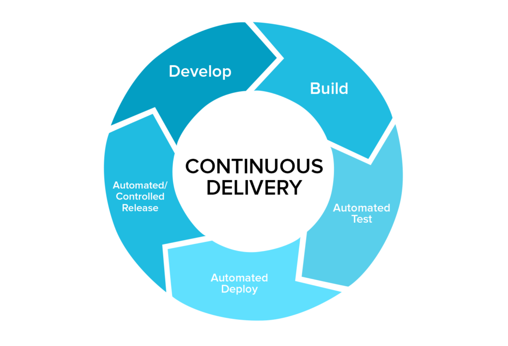
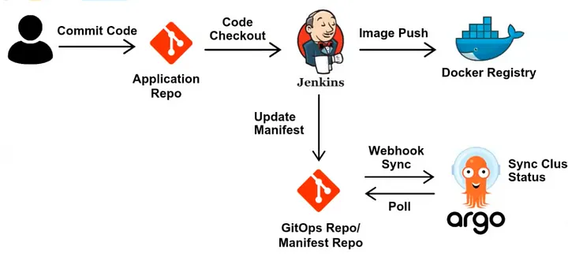
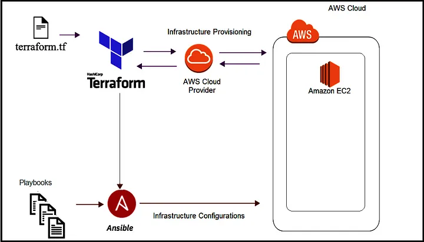
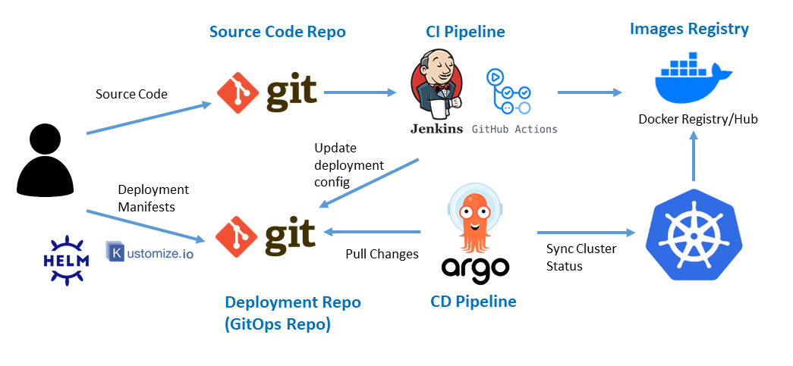
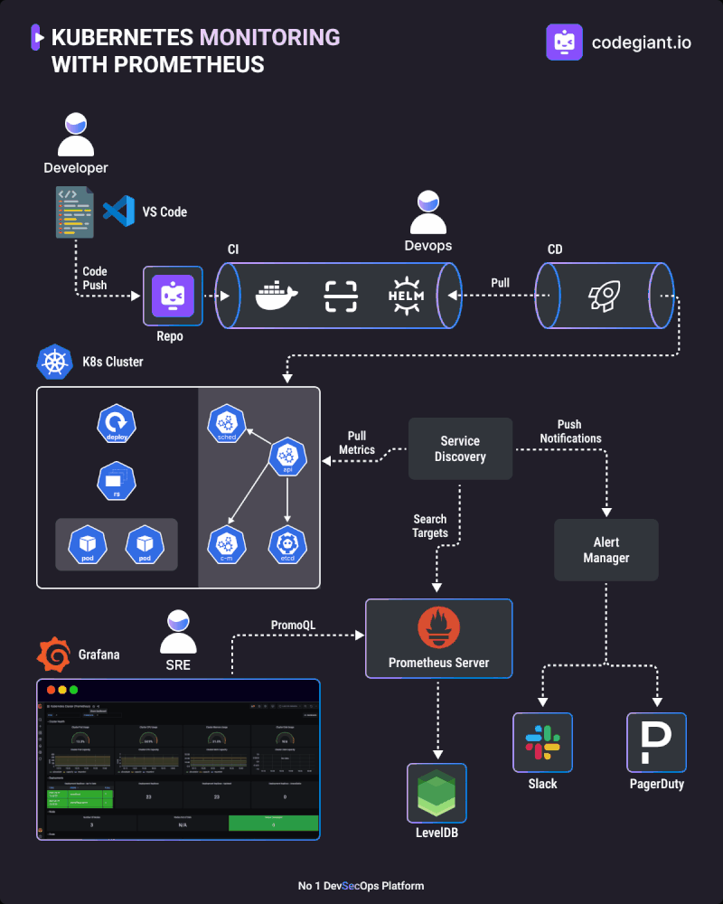
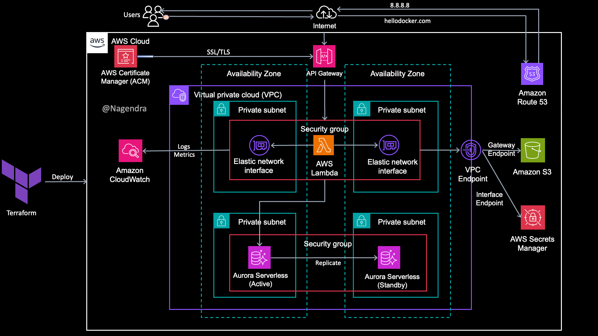
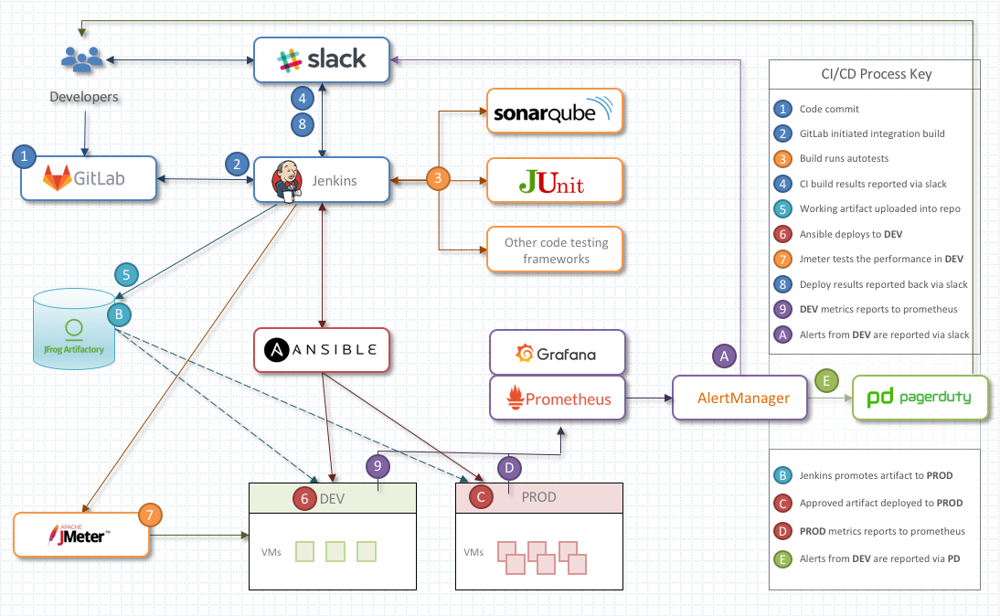
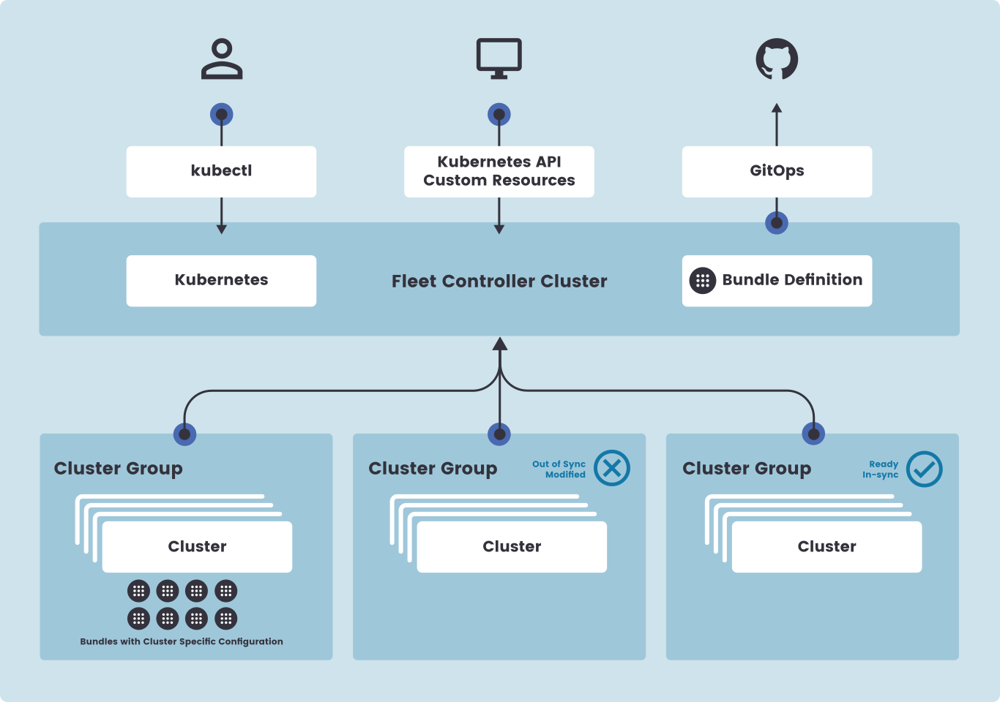

# CI/CD OverView
## 목차
0. 개요
1. 왜 CI/CD인가?
2. 기본 개념
3. Tool Chain
4. 핵심 사례
5. SUSE Ranche와 CI/CD
6. 참고 문서

## 0. 개요
CI/CD의 개념과 적용 사례, 동작 원리의 이해를 목적으로 합니다.

## 1. 왜 CI/CD인가?

현대 인프라 및 애플리케이션 아키텍처의 변화와 CI/CD는 직접적 상관 관계를 가집니다.

분산된 환경(마이크로서비스 아키텍처, 이벤트 드라이븐 아키텍처 등..), 고도화된 사용자 요구사항, 빠른 시장 변화에 대응하기 위한 방법으로 CI/CD를 적용하게 됩니다.

### 1.1 소프트웨어 개발 주기의 혁신
전통적 개발 방식은 개발, 테스트, 배포가 순차적으로 이루어지고 많은 문서와 긴 주기를 가집니다.

이는 서비스 신규 기능에 피드백 지연 결과가 나타났으며, 사용자 요구사항에 민첩하게 대응하기 어려워진다는 단점이 발생합니다.

이에 빠른 주기로 코드를 통합(Continuous Integration : CI)하고 배포(Continuous Delivery : CD)함으로써 개선하게 됩니다.

### 1.2 리스크 관리
CI/CD는 작은 단위를 자주 배포시키기 때문에, 문제가 발생하더라도 빠르게 해결 및 롤백할수 있어 코드 변경의 리스크를 줄입니다.

### 1.3 사용자 경험 최적화
지속적으로 발전하고 고도화되는 사용자 요구사항을 빠르게 충족하기 위해 기능 릴리즈 주기를 줄이고 자주 테스트를 진행하여 높은 품질을 제공합니다.

## 2. 기본 개념
CI/CD는 지속적 통합(Continuous Integration : CI)과 지속적 배포(Continuous Delivery : CD)의 합성어로, DevOps 문화의 핵심적인 철학입니다.

소프트웨어 개발 라이프사이클을 최소화하고 빠르게 배포하는 것을 목표로 합니다.

### 2.1 CI(Continuous Integration)의 개념과 주요 프로세스
#### 2.1.1 CI(Continuous Integration))란?

코드 변경 사항을 코드 형상 관리 저장소(ex : GitLab, GitHub, SVN 등)에 자주 Push하여 통합합니다.

이는 개발 간 코드 충돌을 방지하며, 빠르게 테스트하여 릴리즈 시 발생되는 문제를 즉시 해결할 수 있도록 합니다.

### 2.1.2 주요 프로세스
1. 코드 변경 및 Push
    - 각 개발자는 Git과 같은 버전 관리 시스템을 사용하여 코드 형상 관리 저장소에 Push

2. 자동화된 Build
    - 특정 이벤트를 기반으로 CI 서버에서 Build 과정을 자동화

3. 품질 Test
    - 주기적이고 자동화된 단위, 통합 테스트를 진행하여 테스트 실패 시 즉각적 원인 분석과 수정

4. 결과 확인
    - 빌드/테스트 결과를 보고. CI 서버를 통해 모니터링 자동화 가능

5. 아티팩트 생성
    - 빌드/테스트 통과한 애플리케이션 대상 실행 파일, 라이브러리, 컨테이너 이미지 등의 아티팩트 생성

6. Branch 관리
    - CI는 Gi의 Branch 관리 전략(Git Flow, Trunk-Based Development 등)과 연계되어 운영

### 2.2.1 CD(Continuous Delivery)의 개념과 주요 프로세스

빌드된(아카이빙 된) 코드를 자동화된 프로세스를 통해 안정적으로 배포합니다.

이때 사용자 피드백을 빠르게 수용하여 서비스 품질을 높여 비즈니스 목표를 달성할 수 있습니다.

### 2.2.2 주요 프로세스
1. CI 단계 완료
    - CI 파이프라인에서 코드를 통합하고, 빌드 및 테스트 통과

2. 아티팩트 저장
    - CI에서 생성된 실행 가능한 코드(아티팩트)를 아티팩트 저장소(Nexus, Container Registry)에 저장

3. 배포 자동화
    - TEST, STG, PROD 환경에 배포하는 프로세스 자동화.
    - OpenSource Tool Chain(Jenkins, ArgoCD 등...)또는 배포 스크립트(Terraform, Ansible) 활용

4. 환경별 테스트
    - STG env : PROD와 유사한 환경에서 성능, 부하, 통합테스트 수행
    - QA env : QA Team이 최종 검증

5. 승인 및 릴리즈
    - PROD 배포 전 수동 승인(옵션)을 통해 최종적으로 승인하여 PROD 배포

6. PROD 환경 배포
    - Canary, Blue-Green, Rolling Update 등의 배포 전략을 통해 위험관리

7. 모니터링 및 피드백
    - 배포 이후 모니터링 Tool(DataDog, ELK Stack, EFK Stack 등..)을 통한 시스템 상태 분석 및 사용자 피드백 수집
    - 문제 발생 시 핫픽스 적용

## 3. Tool Chain
### CI
- Jenkins
- Gitlab Runner(상용)
- Tekton
- CircleCI
- Travis CI

### CD
- Jenkins
- Gitlab Runner(상용)
- Tekton
- ArgoCD
- Rancher Fleet

### Monitoring
- ELK, EFK Stack
- DataDog
- Prometheus, Grafana
- Splunk
- Thanos
- OpenTelemetry
- Grafana Loki

### Chat
- Slack
- MS Teams
- Discord

## 4. 핵심 사례
### 4.1 Jenkins와 Argo를 통한 K8s 배포 관리

- **CI :** Git, Jenkins
- **CD :** Docker, K8s

### 4.2 Terraform, Ansible을 통한 IaaS 인프라 자동화 관리

- **CI :** Jenkins... ETC
- **CD :** Terraform, Ansible

### 4.3 GitOps를 활용한 K8s 상태 관리

- **CI :** Git, Jenkins
- **CD :** ArgoCD
- **Status Managing Tool :** Helm, Kustomize

### 4.4 CI/CD 파이프라인의 Observability 강화

- **CI :** Jenkins... ETC
- **CD :** Argo... ETC
- **Monitoring :** Prometheus, Grafana
- **Notification :** Slack... ETC

### 4.5 서버리스(Serverless) 환경의 CI/CD

- **CI :** AWS CodeBuilder(CodePipeline)
- **CD :** AWS CodeDeploy(CodePipeline)
- **Deploy Target :** Serverless Service

### 4.6 CI/CD와 Code Test의 통합

- **CI :** Jenkins, Gitlab
- **Test :** sonarQube, Junit, Jmeter... ETC
- **Registry :** Docker Registry... ETC
- **Deploy :** Ansible
- **Manage :** Slack
- **Monitoring :** Grafana, Prometheus, AlertManager... ETC

## 5. SUSE Rancher와 CI/CD
Rancher Fleet을 통한 GitOps 구현이 가능합니다.

허나 Fleet은 **GitOps의 CD 영역**만을 담당합니다. ArgoCD와 비슷한 역할을 수행하며, Rancher에 등록된 Multi Cluster들에게 Helm, Kubernetes Manifest Sync 작업을 대체합니다.

***Code 통합, Test, Monitoring 등은 추가 Tool Chain을 기획/구축해야만 합니다.***

## 6. 참고문서
- [이미지_DevOps](https://velog.io/@wisdxx/DevOps%EB%9E%80)
- [이미지_Continuous_Integration](https://www.pagerduty.com/resources/learn/what-is-continuous-integration/)
- [이미지_Continuous_delivery](https://www.altexsoft.com/blog/continuous-delivery-and-integration-rapid-updates-by-automating-quality-assurance/)
- [이미지_Terraform_with_ansible](https://medium.com/geekculture/the-most-simplified-integration-of-ansible-and-terraform-49f130b9fc8)
- [이미지_Jenkins_Argo를_통한_k8s_배포](https://medium.com/@lilnya79/gitops-argocd-continuous-delivery-with-jenkins-and-github-8d19ac5ece4c)
- [이미지_GitOps를_통한_K8s_상태관리](https://blog.pages.kr/2882)
- [이미지_CICD_Observability](https://www.linkedin.com/pulse/kubernetes-monitoring-prometheus-registfy-mj0be/)
- [이미지_Serverless_cicd](https://medium.com/@shakamuri.n/aws-fully-serverless-architecture-with-ci-cd-f1729839635d)
- [이미지_cicd_code_test](https://pesin.space/talks/2018-rew-cicd/)
- [이미지_fleet](https://ranchermanager.docs.rancher.com/integrations-in-rancher/fleet/architecture)