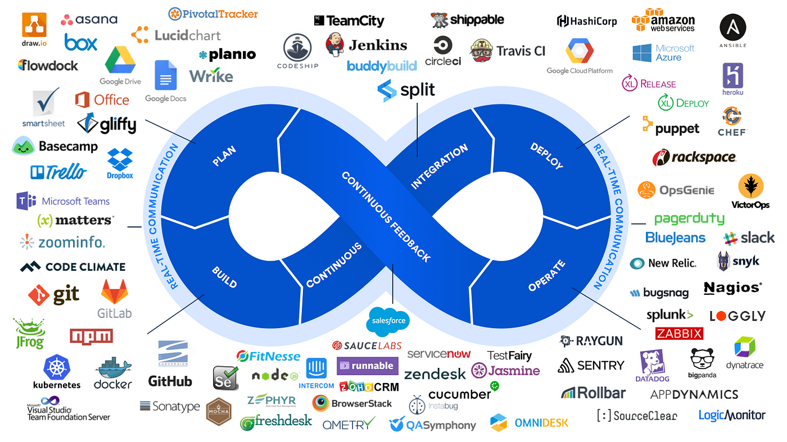

# CI/CD OverView
## 목차
0. 개요
1. 왜 CICD인가?
2. 기본 개념
3. 핵심 요소
4. 심화 과정
5. SUSE Ranche와 CICD
6. 장단점
7. 참고 문서

## 0. 개요
CI/CD의 개념과 적용 사례, 동작 원리의 이해를 목적으로 합니다.

## 1. 왜 CI/CD인가?

현대 인프라 및 애플리케이션 아키텍처의 변화와 CI/CD는 직접적 상관 관계를 가집니다.

분산된 환경(마이크로서비스 아키텍처, 이벤트 드라이븐 아키텍처 등..), 고도화된 사용자 요구사항, 빠른 시장 변화에 대응하기 위한 방법으로 CI/CD를 적용하게 됩니다.

### 1.1 소프트웨어 개발 주기의 혁신
전통적 개발 방식은 개발, 테스트, 배포가 순차적으로 이루어지고 많은 문서와 긴 주기를 가집니다.

이는 서비스 신규 기능에 피드백 지연 결과가 나타났으며, 사용자 요구사항에 민첩하게 대응하기 어려워진다는 단점이 발생합니다.

이에 빠른 주기로 코드를 통합(Continuous Integration : CI)하고 배포(Continuous Delivery : CD)함으로써 개선하게 됩니다.

### 1.2 리스크 관리
CI/CD는 작은 단위를 자주 배포시키기 때문에, 문제가 발생하더라도 빠르게 해결 및 롤백할수 있어 코드 변경의 리스크를 줄입니다.

### 1.3 사용자 경험 최적화
지속적으로 발전하고 고도화되는 사용자 요구사항을 빠르게 충족하기 위해 기능 릴리즈 주기를 줄이고 자주 테스트를 진행하여 높은 품질을 제공합니다.

## 2. 기본 개념
CI/CD는 지속적 통합(Continuous Integration : CI)과 지속적 배포(Continuous Delivery : CD)의 합성어로, DevOps 문화의 핵심적인 철학입니다.

소프트웨어 개발 라이프사이클을 최소화하고 빠르게 배포하는 것을 목표로 합니다.

### 2.1 CI(Continuous Integration)의 개념과 주요 프로세스
#### 2.1.1 CI(Continuous Integration))란?

코드 변경 사항을 코드 형상 관리 저장소(ex : GitLab, GitHub, SVN 등)에 자주 Push하여 통합합니다.

이는 개발 간 코드 충돌을 방지하며, 빠르게 테스트하여 릴리즈 시 발생되는 문제를 즉시 해결할 수 있도록 합니다.

### 2.1.2 주요 프로세스
1. 코드 변경 및 Push
- 각 개발자는 Git과 같은 버전 관리 시스템을 사용하여 코드 형상 관리 저장소에 Push

2. 자동화된 Build
- 특정 이벤트를 기반으로 CI 서버에서 Build 과정을 자동화

3. 품질 Test
- 주기적이고 자동화된 단위, 통합 테스트를 진행하여 테스트 실패 시 즉각적 원인 분석과 수정

4. 결과 확인
- 빌드/테스트 결과를 보고. CI 서버를 통해 모니터링 자동화 가능

5. 아티팩트 생성
- 빌드/테스트 통과한 애플리케이션 대상 실행 파일, 라이브러리, 컨테이너 이미지 등의 아티팩트 생성

6. Branch 관리
- CI는 Gi의 Branch 관리 전략(Git Flow, Trunk-Based Development 등)과 연계되어 운영

### 2.1 CD(Continuous Delivery)의 개념과 주요 프로세스