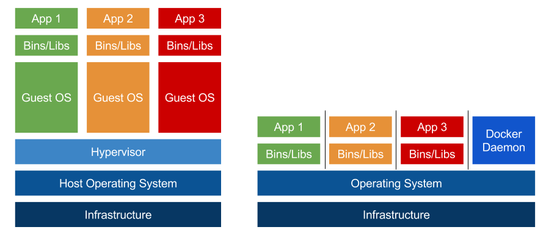

# 가상화 기술과 VM(Virtual Machine)
## 목차
[1. 개요](#1-개요-1)

[2. 가상화 기술](#2-가상화-기술-1)
- [2.1 종류](#21-종류)
- [2.2 장점](#22-장점)
- [2.3 예시](#23-예시)

[3. 가상화 vs 가상 머신](#3-가상화-vs-가상-머신-1)

[4. 가상 머신을 사용하는 이유](#4-가상-머신을-사용하는-이유-1)

[5. 가상 머신과 하이퍼바이저(hypervisor)](#5-가상-머신과-하이퍼바이저hypervisor-1)
- [하이퍼바이저의 유형](#51-하이퍼바이저-유형)

[6. 가상 머신의 문제점](#6-가상-머신의-문제점-1)

[7. 가상머신과 클라우드](#7-가상머신과-클라우드-1)

[8. 가상머신과 컨테이너, Hypervisor vs Docker Engine](#8-가상머신과-컨테이너-hypervisor-vs-docker-engine-1)

[9. 참고자료](#9-참고자료-1)

## 1. 개요
가상 머신은 일종의 컴퓨팅 환경으로, 격리된 시스템으로 작동하며 하드웨어 리소스 풀에서 만들어진 자신의 CPU, Memory, network interface, storage를 포함합니다. hypervisor라 불리는 소프트웨어가 필수 컴퓨팅 리소스를 격리하고 VM 생성과 관리를 지원합니다.

가상화 기술을 통해 물리적 하드웨어 상에서 생성된 논리적 컴퓨터입니다.

## 2. 가상화 기술
가상화는 서버, 스토리지, 네트워크 및 기타 물리적 시스템을 논리적으로 분리하여 여러 운영체제나 애플리케이션이 하나의 물리적 하드웨어에서 독립적으로 동작할 수 있도록 하는 기술입니다.

물리 자원의 효율적 사용과 확장성, 비용절감을 가능하게 합니다.

### 2.1 종류
**1. 하드웨어 가상화:**

컴퓨터 및 VM(운영체제) 버전을 포함한 하드웨어를 가상화하면 하나의 가상화된 통합 기본 서버가 생성됩니다.

**2. 소프트웨어 가상화:**

하나 이상의 게스트 OS가 물리적 호스트 시스템에서 실행될 수 있도록 하는 하드웨어를 포함한 컴퓨터 시스템을 만듭니다.

**3. 스토리지 가상화:**

여러 개의 물리적 스토리지 디바이스를 통합하여 스토리지를 가상화합니다. 이 장치는 단일 스토리지 단위로 제공되므로 성능 향상과 속도를 높일 수 있습니다.

**4. 네트워크 가상화:**

물리적 네트워크 인프라에서 분리된, 전적으로 분산된 시스템 세트에 걸쳐 애플리케이션 기반 클라우드 가상 네트워킹을 지원합니다. 네트워크 가상화는 채널 간 대역폭을 할당하여 서버 및 장치에 실시간으로 리소스를 제공합니다.

**5. 데스크톱 가상화:**
    
데스크탑 환경을 물리적 장치에서 분리하고 원격 서버에 데스크탑을 저장하여 모든 장치에서 액세스할 수 있도록 합니다.

### 2.2 장점
**1. 효율적 리소스 사용**

하나의 컴퓨터 시스템에서 하나의 서버를 실행하는 대신 필요에 따라 서버를 생성하고 풀로 반환하여 동일한 컴퓨터 시스템에 가상 서버 풀을 생성할 수 있습니다.
    
또한 여러개의 물리적 서버를 사용하는 대신 하나의 물리적 서버로 통합함으로써 서버의 유지관리 비용을 줄일 수 있습니다.

**2. 자동화된 IT 관리**

물리적 컴퓨터가 가상화되었기 때문에 소프트웨어 도구로 관리가 가능합니다. 가상 머신 템플릿을 정의하여 반복적이고 일관된 방식으로 인프라 복제가 가능하기에 수동 작업시 발생 가능한 휴먼에러를 줄일 수 있습니다.

**3. 신속한 재해복구**

자연 재해, 사이버 공격과 같은 문제가 발생하여 IT 인프라를 교체하거나 고치기 위한 시간을 줄일 수 있습니다.

물리적 서버를 사용한 경우엔 교체하거나 고치기 위한 시간이 몇 시간에서 며칠까지 늘어날 수 있지만, 물리 서버가 가상화된 경우엔 이러한 작업을 몇 분 안에 완료할 수 있습니다.

### 2.3 예시
**하이퍼바이저(ex: VMware, KVM, Hyper-V)**
- 여러 운영체제를 하나의 물리 서버에서 동시에 실행합니다.

**컨테이너 가상화**(Docker 등)
- 애플리케이션을 격리하여 독립적 실행 환경을 제공합니다.

## 3. 가상화 vs 가상 머신
요약하자면 가상화는 물리적 하드웨어 환경을 논리적으로 분리하여 여러 환경으로 만들 수 있게 하는 기술이며, 가상 머신은 가상화 기술로 생성된 독립적인 컴퓨터 환경을 의미합니다.

## 4. 가상 머신을 사용하는 이유
호스트 하드웨어에 별도의 머신처럼 작동하는 격리된 환경을 만들 수 있습니다. 따라서 다음과 같은 이점이 있습니다.

**1. 서버 통합**

서버를 가상화하여 사용한다면 하나의 물리 서버에 여러개의 가상 서버를 배치하여 하드웨어 성능을 높힐 수 있습니다.

**2. 비용 절감**

서버 통합의 이점을 통해서 관리할 물리 서버를 줄임으로써 비용을 절감할 수 있습니다.

**3. 안정성**

가상 머신과 가상 머신 구성요소는 가상으로 존재하며 다른 가상 머신과 격리됩니다. 다른 가상 머신에 문제가 발생하더라도, 다른 게스트 VM(가상 머신)은 정상 작동 합니다. 또한 물리적 호스트 OS는 영향을 받지 않습니다.

## 5. 가상 머신과 하이퍼바이저(hypervisor)
가상 머신은 하이퍼바이저라는 소프트웨어를 통해 가상화 기술로 만들어진 논리적인 물리 컴퓨터 입니다. 여러개의 가상 머신(VM)을 하나의 물리 서버(호스트 OS)에서 실행할 수 있습니다.

하이퍼바이저는 가상 머신을 호스트 컴퓨터에서 실행하고 모든 VM에 프로세서, 메모리 및 스토리지를 배포할 수 있도록 해주는 소프트웨어 계층입니다. 물리적 자원을 가상 머신에 할당하고, 각각의 가상 머신이 독립적으로 운영체제를 실행할 수 있도록 지원합니다.

### 5.1 하이퍼바이저 유형
**1. type 1 (네이티브 또는 베어메탈 하이퍼바이저)**

물리적 하드웨어 위에서 바로 실행되며, 가상머신을 바로 관리합니다. 성능이 높고, 대규모 서버 가상화에 적합합니다. (ex: VMware ESXi, Microsoft Hyper-V, KVM)

**2. type 2 (호스트형 하이퍼바이저)**

기존 호스트 OS의 운영체제 위에서 실행되며, 그 위에서 가상 머신을 관리합니다. 개발자 테스트 환경이나 데스크톱 가상화에 주로 사용됩니다. (ex: VMware Workstation, Oracle VirtualBox)

## 6. 가상 머신의 문제점
가상 머신을 사용할 경우, 호스트 OS 성능에 매우 의존적이라는 문제점이 있습니다.

여러 운영체제와 하이퍼바이저 레이어를 실행하기 때문에 성능을 높히기 위한 비용이 발생할 수 있습니다.

## 7. 가상머신과 클라우드
기본적으로 가상화 기술은 클라우드 컴퓨팅을 가능하게 합니다. 

클라우드 제공업체는 자체 데이터센터를 설정하고 유지 관리합니다. 이들은 기반 하드웨어 리소스를 사용하는 서로 다른 가상 환경을 생성하여, 사용자로 하여금 API를 사용해서 이 클라우드 리소스에 엑세스 하도록 합니다.

따라서 둘다 물리적 리소스에서 기능적 환경을 만드는 데 중점을 둡니다. 때문에 동일하다고 혼동할 수 있습니다. 그러나 둘은 차이점이 명확합니다.

가상화를 통한 가상 머신은 단일 하드웨어에서 여러 가상 시스템을 실행하는 기술입니다. 그러나 클라우드는 네트워크에서 확장 가능한 리소스를 추상화하여 공유하는 환경 입니다.

    확장 가능한 리소스의 추상화?
    
    이 말은 클라우드의 핵심 특징에 관련이 있습니다.
    
    확장 가능한: 클라우드는 사용자의 수요에 따라 CPU, Memory, 스토리지를 동적으로 확장, 축소합니다. 
    
    추상화: 물리적 하드웨어와 인프라 복잡성을 숨기고 가상의 자원을 서비스처럼 제공하는데, 이때 리소스는 물리적 자원이 아닌 "추상화"된 형태로 제공됩니다.
    

## 8. 가상머신과 컨테이너, Hypervisor vs Docker Engine
컨테이너 기술 또한 가상화 기술의 한 종류입니다. 리소스를 격리한다 라는 차원에서 보면 둘은 비슷해 보이지만, 그렇지 않습니다.

Hypervisor로 가상화 된 가상 머신(VM)은 각각 독립적인 운영 체제를 가지고 있으며 물리적 하드웨어 자원을 직접 할당받아 작동합니다. (이는 각 VM마다 커널을 갖고있다는것을 의미합니다.) 따라서 **Hypervisor로 격리된 가상 머신(VM)은 하드웨어 차원에서 격리**됩니다.

컨테이너 또한 가상화 기술에 일부입니다. 그러나 호스트 운영체제의 커널을 공유하고, 각 컨테이너는 독립된 애플리케이션 환경을 제공합니다. 따라서 **컨테이너, Docker Engine은 OS 레벨에서의 격리**만 지원합니다.

하이퍼바이저는 격리된 가상 머신마다 OS를 가지기 때문에 무겁고 성능 오버헤드가 상대적으로 크다는 단점이 있지만, 하드웨어 차원에서 격리되기 때문에 안정성과 보안적 이점이 컨테이너보다 높습니다.

컨테이너는 호스트 운영 체제와 커널을 공유하고 애플리케이션만 격리하여 경량화 되어 가볍지만, 격리 수준이 하이퍼바이저보다 낮기 때문에 호스트 커널에 의존적이라는 단점이 있습니다.

결론으로 도커 엔진은 컨테이너 기반 가상화를 관리하고, 하이퍼바이저는 가상 머신(VM) 기반 가상화를 관리합니다.

## 9. 참고자료
- [사진 참고 : Docker is NOT a Hypervisor](https://blog.mikesir87.io/2017/05/docker-is-not-a-hypervisor/)
- [이론 참고 : AWS 문서 - 가상화란 무엇인가요?](https://aws.amazon.com/ko/what-is/virtualization/)
- [이론 참고 : oracle 문서 - VM(가상 머신)이란 무엇입니까?](https://www.oracle.com/kr/cloud/compute/virtual-machines/what-is-virtual-machine/#virtualization)
- [이론 참고 : Red Hat 문서 - What is a virtual machine (VM)?](https://www.redhat.com/en/topics/virtualization/what-is-a-virtual-machine)
- [이론 참고 : Google Cloud 문서 - 가상 머신이란?](https://cloud.google.com/learn/what-is-a-virtual-machine?hl=ko#what-is-a-virtual-machine)
- [이론 참고 : Red Hat 문서 - What is a hypervisor?](https://www.redhat.com/en/topics/virtualization/what-is-a-hypervisor)