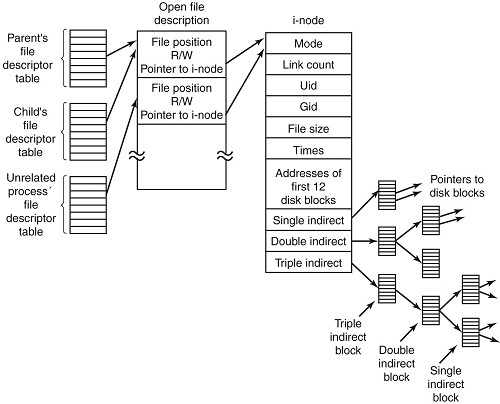

# Linux File Link의 이해_(inode, Symbolic Link(Soft Link), Hard Link)
## 목차
[0. 개요](#0-개요)

[1. inode란?](#1-inode란)
- [1.1 확인 방법](#11-확인-방법)
- [1.2 메타데이터 종류](#12-메타데이터-종류)
- [1.3 Linux 시스템에서 파일을 읽는 방법](#13-linux-시스템에서-파일을-읽는-방법)
- [1.4 결론](#14-결론)

[2. Linux 파일 Link의 이해](#2-linux-파일-Link의-이해)
- [2.1 Hard Link](#21-hard-link)
- [2.2 Symbolic Link(Soft Link)](#22-symbolic-linksoft-link)
- [2.3 Hard Link vs Symbolic Link(Soft Link)](#23-hard-link-vs-symbolic-linksoft-link)

[3. Link별 사용 시기](#3-link별-사용-시기)
- [3.1 Symbolic Link(Soft Link)](#31-symbolic-link)
- [3.2 Hard Link](#32-hard-link)

[4. inode가 부족할 경우](#4-inode가-부족할-경우)

[5. 참고 문서](#5-참고-문서)

## 0. 개요
Linux는 파일의 Link를 Hard Link, Soft Link(또는 Symbolic Link)로 나뉩니다.

inode와 Linux 파일 Link 시스템을 이해하여 둘의 차이점을 확인하기 위한 문서입니다.

## 1. inode란?
Linux는 inode라는 계념을 가지고 있습니다. inode는 index-node의 줄임말입니다. 여기서 index란, 무엇을 빠르게 찾기 위해서 쓰는 용어를 뜻합니다.
이때 무언가는 Linux 시스템에서 **파일(또는폴더)**을 뜻합니다. 

그림으로 inode의 구조는 다음과 같습니다.



inode는 UFS(유닉스 파일 시스템)와 같은 유닉스 계통 파일 시스템에서 사용하는 자료 구조입니다. 

Linux는 ***모든 파일, 폴더에 inode를 한 개씩 부여합니다. inode 번호는 Linux에서 고유하고 파일 허가권, 소유권, 파일의 실제 위치 등 파일의 메타데이터를 가집니다.***

따라서 **inode 번호를 통해 파일, 폴더를 구분하는 것이 가능**합니다.

inode는 실제 파일 내용을 갖고 있지는 않습니다. ***inode는 실제 파일을 빠르게 찾기 위한 인덱스이기 때문에 파일 내용을 갖고 있는 주소를 포함***할 뿐입니다.
- C언어의 포인터와 같은 느낌

### 1.1 확인 방법
Linux 명령어를 통해 실제 파일, 폴더의 inode 번호를 확인할 수 있습니다.

```bash
# test.txt 파일의 inode 번호는 8528990
$ ls -i
8528990 test.txt

# stat 명령어로 test.txt inode 메타데이터 정보 확인
$ stat test.txt
  File: test.txt
  Size: 0         	Blocks: 0          IO Block: 4096   regular empty file
Device: ca01h/51713d	Inode: 8528990     Links: 1
Access: (0644/-rw-r--r--)  Uid: ( 1000/ec2-user)   Gid: ( 1000/ec2-user)
Context: unconfined_u:object_r:user_home_t:s0
Access: 2024-09-20 15:43:19.657794675 +0000
Modify: 2024-09-20 15:43:19.657794675 +0000
Change: 2024-09-20 15:43:19.657794675 +0000
 Birth: 2024-09-20 15:43:19.657794675 +0000
```

### 1.2 메타데이터 종류
inode가 가지고 있는 메타데이터 종류는 다음과 같습니다.

|inode가 가지고 있는 정보 이름|설명|
|--|--|
|inode 번호|inode 고유 식별 번호|
|파일 모드(퍼미션)|16비트 플래그로 파일의 실행 권한. 소유자의 권한, 소유자 그룹의 권한, 기타 사용자의 권한, 파일 형식, 실행 플래그 등을 나타낸다.|
|Link 수|이 inode에 대한 참조 수|
|소유자 명|파일 소유자 아이디|
|그룹 명|파일 소유자의 그룹 아이디|
|파일 크기|파일의 크기(bytes)|
|파일 주소|실제 데이터가 나오는 파일 주소|
|마지막 접근 정보|마지막으로 파일에 접근한 시간|
|마지막 수정 정보|마지막으로 파일을 수정한 시간|
|inode 수정 정보|마지막으로 inode를 수정한 시간|

### 1.3 Linux 시스템에서 파일을 읽는 방법
만약 cat 명령어로 test.txt 파일을 읽는다 가정했을 때, 아래 순서로 Linux는 파일을 읽습니다.

#### 1. 파일 이름을 통한 디렉터리 검색
- test.txt는 파일이므로, 커널은 파일이 위치한 디렉터리에서 파일 이름을 검색함.
- ***디렉터리 자체는 파일 시스템에서 inode 번호를 매핑하는 테이블처럼 동작***함. 즉 파일 이름은 inode 번호와 매핑되어 있음.

#### 2. inode 번호 확인
- test.txt를 찾으면, ***매핑되는 inode 번호를 얻음.*** 이를 통해 파일 메타데이터를 포함한 inode 구조체로 커널을 안내함.

#### 3. inode에서 파일 메타데이터 확인
- 커널은 inode에서 메타데이터를 읽는데, 여기엔 파일이 저장된 실제 데이터 블록의 위치 정보도 포함되어 있음.
- 이때 파일 퍼미션도 확인하여 해당 사용자가 접근 권한이 있는지 판단함.

#### 4. 파일 데이터 블록 접근
- 권한이 확인되면, inode에 저장된 데이터 블록을 바탕으로 실제 파일이 저장된 디스크 블록에 접근해 데이터를 읽음.

#### 5. 파일 내용 출력
- cat 명령어는 파일 내용을 출력하기 때문에, 커널은 파일 데이터를 읽어 터미널에 출력함.

### 1.4 결론
inode는 파일의 메타데이터와 실제 데이터 블록 위치를 관리하는 핵심 역할을 합니다.

## 2. Linux 파일 Link의 이해
Linux는 윈도우의 바로 가기와 같은 기능을 Link로 수행합니다.

**Hard Link와 Soft(Symbolic) Link**로 나뉘어 지며, 이 둘을 이해하기 위해선 inode를 이해해야 합니다.

### 2.1 Hard Link
Hard Link는 원본 파일과 동일한 inode를 직접 가르킵니다. 그렇기 때문에 Hard Link를 생성하면, 원본 파일과 동일한 inode 번호를 가집니다.

따라서 원본 파일이 사라지더라도 디스크에 저장된 데이터만 살아 있다면 원본 파일에 접근이 가능합니다.

***Hard Link에는 새로운 inode 생성이 없으며, 일반적인 복사와는 다릅니다. 일반적인 복사는 실제 데이터를 복사하게 되는데, Hard Link는 inode 번호만 복사하기 때문입니다.***

#### 2.1.1 생성 방법

```bash
$ ln [원본 파일명] [Link_파일명]

# usecase
$ ln test.txt test-Hard.txt
```

생성 결과 원본 파일과 Hard Link inode는 동일한 번호(동일한 inode) 인 것을 확인할 수 있습니다.

```bash
# inode 번호가 동일함.
$ ls -il
8528994 -rw-r--r--. 2 ec2-user ec2-user 5 Sep 20 16:36 test-Hard.txt
8528994 -rw-r--r--. 2 ec2-user ec2-user 5 Sep 20 16:36 test.txt
```

### 2.2 Symbolic Link(Soft Link)
Symbolic Link는 윈도우의 바로 가기와 매우 유사하며 **또 다른 inode를 생성해서 원본 파일을 가르키는 포인터를 가리키고, 포인터는 다시 원본 파일을 가리킵니다.**

Symbolic Link는 원본 파일이 제거되면 원본 파일 포인터가 원본 파일을 가리키지 못하기 때문에 접근할 수 없습니다.

#### 2.1.1 생성 방법
```bash
$ ln -s [원본 파일명] [Link_파일명]

# usecase
$ ln -s test.txt test-symbolic.txt
```

생성 결과 새로운 inode가 생성되었기 때문에, 다른 inode 번호를 나타냅니다.

```bash
# inode 번호가 다름.
$ ls -il
8528985 lrwxrwxrwx. 1 ec2-user ec2-user 8 Sep 20 16:38 test-symbolic.txt -> test.txt
8528991 -rw-r--r--. 1 ec2-user ec2-user 5 Sep 20 16:38 test.txt
```

### 2.3 Hard Link vs Symbolic Link(Soft Link)


그림과 같이 Hard Link와 Symbolic Link는 동작 방식에 차이가 있습니다.

**가장 큰 차이점은 inode 생성 여부에 있으며, 이에 따른 원본 파일 제거 시 접근 불가/가능 여부가 달라지게 됩니다.**

|Symbolic Link|구분|Hard Link|
|--|--|--|
|ln -s [원본_파일명] [Link_파일명]|생성 명령어|ln [원본 파일명] [Link_파일명]|
|파일과 Directory 모두 생성 가능|생성 종류|파일만 생성 가능|
|파일 또는 Directory 이름에 대한 Link를 가리킴|Link 기능|원본 파일에 대한 참조 또는 포인터|
|액세스 불가능|원본 파일 삭제 시|엑세스 가능|
|다른 inode 번호|inode 번호|동일한 inode 번호|
|다른 파티션에 Link 가능|다른 파티션 Link 여부|다른 파티션에 Link 불가능|
|데이터 접근 시 원본 inode를 경유함.|특징|원본 파일에 대한 동일한 inode로 바로 데이터에 접근함.|

## 3. Link별 사용 시기
### 3.1 Symbolic Link
- Directory에 대한 Link
    - Hard Link는 Directory에 대한 Link를 지원하지 않지만, Symbolic Link는 디렉터리를 참조할 수 있음. 
- 다른 파일 시스템 또는 Directory로 Link
    - Symbolic Link로 다른 파일 시스템이나 다른 Directory에 있는 파일을 참조할 수 있음. Hard Link는 같은 파일 시스템 내에서만 동작하므로, 이러한 경우 Symbolic Link를 사용해야 함. 
	- 예시: /home/user/docs에 있는 파일을 /mnt/external-drive/docs와 연결할 때.
### 3.2 Hard Link
- 데이터 중복 제거
    - 여러 디렉터리에서 같은 파일을 여러 곳에서 참조하고 싶을 때 Hard Link를 사용하면 하나의 데이터 파일만 유지하기 때문에 파일 시스템 저장 공간을 절약하는데 유용함.
- 백업 시스템
    - Hard Link는 같은 데이터를 공유하기 때문에, 데이터 블록을 중복 저장하지 않고도 백업할 수 있음. 예를 들어 매일 백업하는데 변하지 않는 파일은 Hard Link로 처리하여 저장 공간을 절약함.
- 파일 무결성 보장
    - 원본 파일이 삭제되더라도 Hard Link를 통해 파일 데이터를 유지시킬 수 있음.

## 4. inode가 부족할 경우
- 관련 내용은 inode 튜닝과 관련한 문서를 따로 작성할 예정

시스템 운영 중 파일 시스템에 여유 공간이 있음에도 불구하고, 아래와 같은 에러가 발생할 수 있습니다.

```bash
$ cp test.txt /applog
cp: cannot create regular file '/applog/test.txt': No space left on device
```

이는 파일 시스템 사용 공간과 inode 공간이 부족하기 때문에 발생합니다.

아래 명령어로 파일 시스템별 현재 inode 개수 현황을 확인할 수 있습니다.
```bash
$ df -i
Filesystem      Inodes IUsed   IFree IUse% Mounted on
devtmpfs        118843   317  118526    1% /dev
tmpfs           121543     1  121542    1% /dev/shm
tmpfs           819200   524  818676    1% /run
/dev/xvda1     4188096 47436 4140660    2% /
tmpfs          1048576    15 1048561    1% /tmp
/dev/xvda128         0     0       0     - /boot/efi
tmpfs            24308    14   24294    1% /run/user/1000
```

세가지 대응 방법이 있겠습니다.

1. 필요 없는 파일 제거
2. 파일 시스템 증설
3. inode 개수 증가

## 5. 참고 문서
- [이론 참조 : Linux 파일 Link (하드 Link / 심볼릭 Link / inode)](https://inpa.tistory.com/entry/LINUX-%F0%9F%93%9A-%ED%95%98%EB%93%9C-%EB%A7%81%ED%81%ACHard-link-%EC%8B%AC%EB%B3%BC%EB%A6%AD-%EB%A7%81%ED%81%ACsymbolic-link-%EC%95%84%EC%9D%B4%EB%85%B8%EB%93%9Cinode)
- [이론,사진 참조 : Linux 시스템의 아이노드(inode), 심볼릭 Link(Symbolic Link), 하드 Link(Hard Link)에 대해서.](https://i5i5.tistory.com/341)
- [사진 참조 : Hard Link and Symbolic Link](https://velog.io/@jinh2352/Hard-Link-and-Symbolic-Link)
- Chat GPT