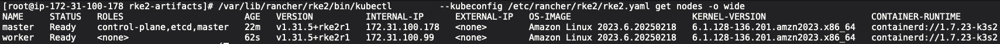

# SUSE Linux RKE2 Tarball 설치
## 설치 테스트 2025/03 진행

## 참고 문서
- **[RKE2 Requirements](https://docs.rke2.io/install/requirements/#linux)**
- **[RKE2 Air-Gap Install](https://docs.rke2.io/install/airgap?_highlight=prere#prerequisites)**
- **[RKE2 Configuration Option](https://docs.rke2.io/install/configuration#configuration-file)**
- **[RKE2 Offline 환경 설치 방안 ( Tarball Method ) - RKE2 Air-Gap](../2022/offline%20상태에서%20Rancher%20RKE2%20설치%20-%20Tarball.md)**
- **[RKE2 Server Configuration Reference](https://docs.rke2.io/reference/server_config)**
- **[RKE2 Agent Configuration Reference](https://docs.rke2.io/reference/linux_agent_config)**
- **[RKE2 공식 문서_High Availability](https://docs.rke2.io/install/server_roles)**

## RKE2 최소 요구사항
- **[Requirements | RKE2](https://docs.rke2.io/install/requirements)**

| Server CPU | Server RAM | Number of Agents |
| --- | --- | --- |
| 2 | 4 GB | 0-225 |
| 4 | 8 GB | 226-450 |
| 8 | 16 GB | 451-1300 |
| 16+ | 32 GB | 1300+ |

## 설치 대상 버전정보
|Name|Version|
|---|---|
|RKE2|v1.31.5|
|calico CNI|-|

- **[RKE2 v1.31.5 GitHub 릴리즈](https://github.com/rancher/rke2/releases/tag/v1.31.5%2Brke2r1)**

## 테스트 목표
- Control-Plane 2EA
- Worker 1EA

## 방화벽 정보
RKE2가 사용하는 필수 Port 목록은 다음과 같음
- calico CNI 사용할 경우

## Inbound Network Rules
### RKE2 기본 포트
| Port | Protocol | Source | Destination | Description |
|------|----------|--------|------------|-------------|
| 6443 | TCP | RKE2 agent nodes | RKE2 server nodes | Kubernetes API |
| 9345 | TCP | RKE2 agent nodes | RKE2 server nodes | RKE2 supervisor API |
| 10250 | TCP | All RKE2 nodes | All RKE2 nodes | kubelet metrics |
| 2379 | TCP | RKE2 server nodes | RKE2 server nodes | etcd client port |
| 2380 | TCP | RKE2 server nodes | RKE2 server nodes | etcd peer port |
| 2381 | TCP | RKE2 server nodes | RKE2 server nodes | etcd metrics port |
| 30000-32767 | TCP | All RKE2 nodes | All RKE2 nodes | NodePort port range |

### Calico CNI 관련 포트
| Port | Protocol | Source | Destination | Description |
|------|----------|--------|------------|-------------|
| 179 | TCP | All RKE2 nodes | All RKE2 nodes | Calico CNI with BGP |
| 4789 | UDP | All RKE2 nodes | All RKE2 nodes | Calico CNI with VXLAN |
| 5473 | TCP | All RKE2 nodes | All RKE2 nodes | Calico CNI with Typha |
| 9098 | TCP | All RKE2 nodes | All RKE2 nodes | Calico Typha health checks |
| 9099 | TCP | All RKE2 nodes | All RKE2 nodes | Calico health checks |

## 0. 설치 방법
RKE2 폐쇄망 환경 설치는 2가지 방법으로 나뉨

1. tarball
2. private registry

테스트 환경은 private registry가 없기 때문에, tarball 설치 방법으로 진행

## 0. 사전 준비(CNI = canal)
RKE2 설치용 tar File RKE2 Public Github에서 다운로드
- rke2-images.linux-amd64.tar.gz
- rke2.linux-amd64.tar.gz
- sha256sum-amd64.txt

```bash
wget https://github.com/rancher/rke2/releases/download/v1.31.5%2Brke2r1/rke2-images.linux-amd64.tar.gz
wget https://github.com/rancher/rke2/releases/download/v1.31.5%2Brke2r1/rke2.linux-amd64.tar.gz
wget https://github.com/rancher/rke2/releases/download/v1.31.5%2Brke2r1/sha256sum-amd64.txt
```

### 주의 !!! ###
**만약 CNI Plugin을 default canal이 아닌 calico, cilium, flannel 등으로 설치하기 위해선, 추가로 rke2-images.linux-amd64.tar.gz 파일을 해당 CNI에 맞는 tar로 다운받아야 함**
- rke2-images.linux-amd64.tar.gz
- rke2-images-calico.linux-amd64.tar.gz **-> 추가**
- rke2.linux-amd64.tar.gz
- sha256sum-amd64.txt

## 0 사전 준비(CNI = Cailco)
```bash
# calico cni rke2-image 추가
wget https://github.com/rancher/rke2/releases/download/v1.31.5%2Brke2r1/rke2-images-calico.linux-amd64.tar.gz
wget https://github.com/rancher/rke2/releases/download/v1.31.5%2Brke2r1/rke2-images.linux-amd64.tar.gz
wget https://github.com/rancher/rke2/releases/download/v1.31.5%2Brke2r1/rke2.linux-amd64.tar.gz
wget https://github.com/rancher/rke2/releases/download/v1.31.5%2Brke2r1/sha256sum-amd64.txt
```

RKE2 Install 쉘 스크립트 다운로드
- install script

```bash
curl -sfL https://get.rke2.io --output install.sh
```

이후 위 4가지 파일 모두 설치대상 서버로 이동
```bash
scp -i "pem_key" rke2-images.linux-amd64.tar.gz ec2-user@1.1.1.1:/home/ec2-user/rke2-images.linux-amd64.tar.gz
...
```

설치 대상 서버에서 rke2-artifacts 폴더 구성

```bash
mkdir /root/rke2-artifacts
mv rke2-images.linux-amd64.tar.gz rke2.linux-amd64.tar.gz rke2-images-calico.linux-amd64.tar.gz sha256sum-amd64.txt install.sh /root/rke2-artifacts/
cd /root/rke2-artifacts/
``` 

## 1. Install RKE2
RKE2 설치할 모든 Node 접근 후 아래 작업 수행

1. Disale Swap
2. network bridge 설정

```bash
$ sudo swapoff -a
$ sudo sed -i '/ swap / s/^\(.*\)$/#\1/g' /etc/fstab

$ cat <<EOF | sudo tee /etc/modules-load.d/k8s.conf
br_netfilter
EOF

$ cat <<EOF | sudo tee /etc/sysctl.d/k8s.conf
net.bridge.bridge-nf-call-ip6tables = 1
net.bridge.bridge-nf-call-iptables = 1
EOF
$ sudo sysctl --system
```

```install.sh``` 사용하여 구성환경 설치(image install 등)
```bash
# 위의 준비과정에서 다운로드한 파일이 있는 디렉토리로 이동
$ cd /root/rke2-artifacts

# INSTALL_RKE2_ARTIFACT_PATH에 방금 생성한 artifacts 폴더를 지정하여 install.sh를 실행
# rke2-images-calico tar파일도 같이 설치
$ sudo su
$ INSTALL_RKE2_ARTIFACT_PATH=/root/rke2-artifacts sh install.sh
[INFO]  staging local checksums from /root/rke2-artifacts/sha256sum-amd64.txt
[INFO]  staging gzip airgap image tarball from /root/rke2-artifacts/rke2-images.linux-amd64.tar.gz
[INFO]  staging tarball from /root/rke2-artifacts/rke2.linux-amd64.tar.gz
[INFO]  verifying airgap tarball
[INFO]  decompressing airgap tarball to /var/lib/rancher/rke2/agent/images
[INFO]  Installing airgap image from /root/rke2-artifacts/rke2-images-calico.linux-amd64.tar.gz
[INFO]  verifying tarball
[INFO]  unpacking tarball file to /usr/local
```

## 2. Control Plane Config File 작성
Control-Plane, Worker 모두 RKE2 설치용 Config File을 작성해야 함.(아래 옵션 참고)
- **[RKE2 Configuration Option](https://docs.rke2.io/install/configuration#configuration-file)**
- **[RKE2 Server Configuration Reference](https://docs.rke2.io/reference/server_config)**
- **[RKE2 Agent Configuration Reference](https://docs.rke2.io/reference/linux_agent_config)**

프로덕션에서 사용할 예정이기 때문에, cis, selinux 등의 보안설정은 모두 enable
- [Amazon Linux에서는 selinux 설정이 따로 필요. 링크 참고](https://docs.rke2.io/security/selinux)

기본적으로 RKE2는 config.yaml 파일을 ```/etc/rancher/rke2/config.yaml``` 경로에 저장함.

**주의 사항**
profile의 cis설정을 진행하면 , rke2는 해당 옵션값의 cis 벤치마크설정이 들어간 podSecurityPolicy를 자동으로 생성 

따라서 root권한이 필요한 파드가 생성되면 아래 에러 발생

    container has runAsNonRoot and image will run as root (pod: "rke2-coredns-rke2-coredns-547d5499cb-crp7j_kube-system(747e37be-d4c2-433a-8a26-84da86c2ef07)", container: coredns)

```bash
# Config 파일 작성
mkdir -p /etc/rancher/rke2
cat << EOF >>  /etc/rancher/rke2/config.yaml
write-kubeconfig-mode: "0644"
node-name:
  - "master"
tls-san:
  - "rancher.test.jinseong"
  - "172.31.100.178"
profile: "cis"
selinux: true

disable-apiserver: false
disable-controller-manager: false
disable-scheduler: false
disable-etcd: false

cni: "calico"
EOF
```

| 옵션 | 설명 | 값 |
|------|------|------|
| `write-kubeconfig-mode` | `kubeconfig` 파일의 권한을 설정 | `0644` |
| `tls-san` | 추가적인 Subject Alternative Name(SAN)을 지정하여 TLS 인증서에 포함할 호스트명/IP를 설정. Control-Plane 들의 IP 작성 | `rancher.test.jinseong`, `192.168.65.138`, `192.168.65.139` |
| `profile` | 클러스터의 보안 프로파일을 설정 (CIS 벤치마크 준수, valid items: cis, cis-1.23 (deprecated)) | `cis` |
| `selinux` | SELinux를 활성화할지 여부 (`true`로 설정 시 보안 정책 적용) | `true` |
| `cni` | RKE2 CNI Plugin 명시 | Default : `canal` |

**주의 사항**
RKE2 Config 파일은 수동으로 생성해야 함. 이때 RKE2가 동작하고 있을 때 config.yaml을 수정 후 반영하고 싶다면, RKE2 재 시작이 필요함.

**특징**
HA 구성을 위해 API-Server, etcd 등을 분리하기 위해서 ```config.yaml``` 설정 변경으로 구성할 수 있음.
- **[RKE2 공식 문서_High Availability](https://docs.rke2.io/install/server_roles)**
- **[HA 구성 config.yaml](#1-ha-구성)**

### CIS Mode Enable
```bash
$ sudo cp -f /usr/local/share/rke2/rke2-cis-sysctl.conf /etc/sysctl.d/60-rke2-cis.conf

$ sysctl -p /etc/sysctl.d/60-rke2-cis.conf
vm.panic_on_oom = 0
vm.overcommit_memory = 1
kernel.panic = 10
kernel.panic_on_oops = 1

$ sudo systemctl restart systemd-sysctl

$ useradd -r -c "etcd user" -s /sbin/nologin -M etcd
```

## 3. Enable RKE2
RKE2를 활성화 시켜서 설치를 마무리 합니다.
```bash
# daemon 재실행
systemctl daemon-reload

# rke2-server service 활성화
systemctl enable rke2-server.service

# service 실행
systemctl start rke2-server.service

# rke 실행 로그 확인
journalctl -u rke2-server -f
```

## 4. 설치 완료 확인
- 추가적인 유틸은 ```/var/lib/rancher/rke2/bin/``` 아래에 설치되며, ```kubectl```, ```crictl```, ```crt``` 등이 존재합니다.
- 두 개의 CleanUp 스크립트가 ```/usr/local/bin/rke2``` 아래에 설치되며, 각각 ```rke2-killall.sh```, ```rke2-uninstall.sh``` 입니다
- kubeconfig 파일은 ```/etc/rancher/rke2/rke2.yaml``` 에 작성됩니다.
- 다른 서버 또는 에이전트 노드를 등록하는 데 사용할 수 있는 토큰은 ```/var/lib/rancher/rke2/server/node-token``` 위치에 생성됩니다.
```bash
# 노드 확인
/var/lib/rancher/rke2/bin/kubectl \
        --kubeconfig /etc/rancher/rke2/rke2.yaml get nodes

# 파드 확인
/var/lib/rancher/rke2/bin/kubectl \
        --kubeconfig /etc/rancher/rke2/rke2.yaml get pods --all-namespaces

# containerd 사용가능 이미지 확인
ctr --address /run/k3s/containerd/containerd.sock images ls
```

## 5. RKE2 Worker(Agent) 설치 방안
### 5.1 요구사항
- Master Node와 [포트 List](#rke2-기본-포트)참고하여 해당 포트로 통신이 가능해야 함.

### 5.2 설치 진행
- 기본적 진행 방향은 control-plane과 동일하지만, ```config.yaml```과 ETCD User 설정이 없다는 차이가 있음.

#### 5.2.1 설치 필요 파일 복사(CNI = Calico)
- rke2-images.linux-amd64.tar.gz
- rke2-images-calico.linux-amd64.tar.gz 
- rke2.linux-amd64.tar.gz
- sha256sum-amd64.txt

#### 5.2.2 설치 대상 서버에서 rke2-artifacts 폴더 구성

```bash
mkdir /root/rke2-artifacts
mv rke2-images.linux-amd64.tar.gz rke2.linux-amd64.tar.gz rke2-images-calico.linux-amd64.tar.gz sha256sum-amd64.txt install.sh /root/rke2-artifacts/
cd /root/rke2-artifacts/
``` 

#### 5.2.3 Swap, Network 설정
1. Disale Swap
2. network bridge 설정

```bash
$ sudo swapoff -a
$ sudo sed -i '/ swap / s/^\(.*\)$/#\1/g' /etc/fstab

$ cat <<EOF | sudo tee /etc/modules-load.d/k8s.conf
br_netfilter
EOF

$ cat <<EOF | sudo tee /etc/sysctl.d/k8s.conf
net.bridge.bridge-nf-call-ip6tables = 1
net.bridge.bridge-nf-call-iptables = 1
EOF
$ sudo sysctl --system
```

#### 5.2.4 RKE2 구성환경 설치
```install.sh``` 사용하여 구성환경 설치(image install 등)
```bash
# 위의 준비과정에서 다운로드한 파일이 있는 디렉토리로 이동
$ cd /root/rke2-artifacts

# INSTALL_RKE2_ARTIFACT_PATH에 방금 생성한 artifacts 폴더를 지정하여 install.sh를 실행
# rke2-images-calico tar파일도 같이 설치
$ sudo su
$ INSTALL_RKE2_ARTIFACT_PATH=/root/rke2-artifacts sh install.sh
[INFO]  staging local checksums from /root/rke2-artifacts/sha256sum-amd64.txt
[INFO]  staging gzip airgap image tarball from /root/rke2-artifacts/rke2-images.linux-amd64.tar.gz
[INFO]  staging tarball from /root/rke2-artifacts/rke2.linux-amd64.tar.gz
[INFO]  verifying airgap tarball
[INFO]  decompressing airgap tarball to /var/lib/rancher/rke2/agent/images
[INFO]  Installing airgap image from /root/rke2-artifacts/rke2-images-calico.linux-amd64.tar.gz
[INFO]  verifying tarball
[INFO]  unpacking tarball file to /usr/local
```

#### 5.2.5 config.yaml 구성 및 cis 설정
- **server :** Master 서버(RKE2 supervisor API)
- **token :** Master 서버 ```/var/lib/rancher/rke2/server/node-token``` 기입
```bash
# Config 파일 작성
mkdir -p /etc/rancher/rke2
cat << EOF >>  /etc/rancher/rke2/config.yaml
write-kubeconfig-mode: "0644"
server:  https://172.31.100.178:9345
token: K1032c62bfb6a9348f83d4bdb461c71f7989ad85be63bcb794eb1df3671056020f4::server:6606b57bf08dc409a81ea26a1c9879f1
node-name:
  - "worker"
tls-san:
  - "rancher.test.jinseong"
  - "172.31.100.178"
profile: "cis"
selinux: true
EOF
```

4. cis Mode enable
```bash
$ sudo cp -f /usr/local/share/rke2/rke2-cis-sysctl.conf /etc/sysctl.d/60-rke2-cis.conf

$ sysctl -p /etc/sysctl.d/60-rke2-cis.conf
vm.panic_on_oom = 0
vm.overcommit_memory = 1
kernel.panic = 10
kernel.panic_on_oops = 1

$ sudo systemctl restart systemd-sysctl
```

#### 5.2.6 RKE2 agent up
```bash
# RKE2 agent UP
$ systemctl enable rke2-agent.service
$ systemctl start rke2-agent.service
# 로그 확인
$ journalctl -u rke2-agent -f
```

## 6. 결과 확인
- Control-Plane 1EA
- Worker 1EA

### 6.1 Cluster Status


### 6.2 Pod Status


## ETC
### 1. HA 구성
- 기본적인 tarball 설치 방법은 동일함.(tarball 파일 이동, swap, network, selinux 설정, install.sh, deamon start..)
- ```config.yaml``` 이 핵심

HA 구성을 위해 Control-Plane Node를 분산시키는 config.yaml
- **token :** Master 서버 ```/var/lib/rancher/rke2/server/node-token``` 기입
- **server :** Master 서버(RKE2 supervisor API)
- **node-name :** 중복 이름 불가
- **tls-san :** master node ip 기입
- disable-apiserver, disable-controller-manager, disable-scheduler, disable-etcd 세부 조절하여 HA 아키텍처 구성
```bash
mkdir -p /etc/rancher/rke2
cat << EOF >>  /etc/rancher/rke2/config.yaml
write-kubeconfig-mode: "0644"
token: K1032c62bfb6a9348f83d4bdb461c71f7989ad85be63bcb794eb1df3671056020f4::server:6606b57bf08dc409a81ea26a1c9879f1
server:  https://172.31.100.178:9345
node-name:
  - "master-2"
tls-san:
  - "rancher.test.jinseong"
  - "172.31.100.178"
  - "172.31.10.124"
profile: "cis"
selinux: true

disable-apiserver: false
disable-controller-manager: false
disable-scheduler: false
disable-etcd: false

cni: "calico"
EOF
```

### 2, 제거
- [참고문서_Linux Uninstall](https://docs.rke2.io/install/uninstall#linux-uninstall)

### RPM Method
```bash
/usr/bin/rke2-uninstall.sh
```

### Tarball Method
```bash
/usr/local/bin/rke2-uninstall.sh
```
### Windows Uninstall
```bash
c:/usr/local/bin/rke2-uninstall.ps1
```