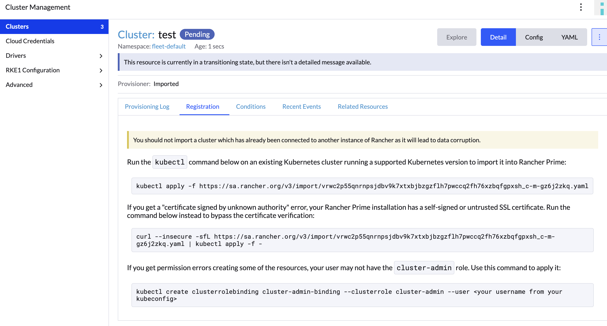
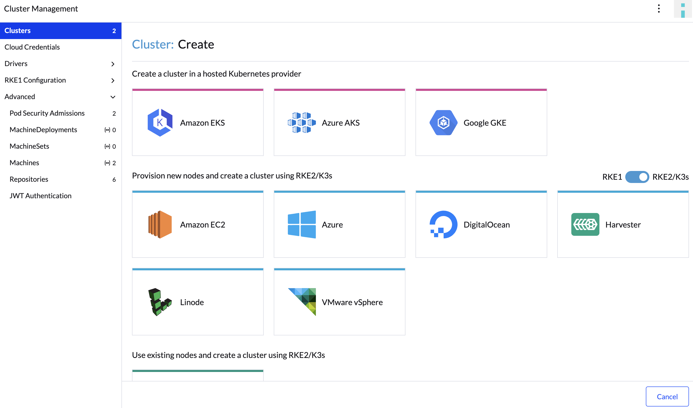

# Rancher cluster import 방법
## Overview
Rancher Server에서 DownStream Cluster를 Import하는 방법에 대해 기술.

## Prerequired
- Rancher Server(Main Rancher Cluster) <-> Agent 간 통신은 WebSocket으로 터널을 구성하여 연결함.
- **Agent는 Rancher Server의 URL Resolve가 가능해야 함.**
    - 만일 불가능하다면, coreDNS 설정 수정이 필요
    - [HelmConfig 참고](./Agent_HelmChartConfig.yaml)
- 만일 Rancher Server가 사설 인증서로 TLS 구성이 되어있다면, **Agent 서버측은 해당 인증서를 신뢰할 수 있어야 함.**

## 종류
Rancher는 DownStream Cluster를 관리하는 방법으로 2가지를 제시함.

1. RKE2, EKS, AKS 등 외부 Cluster Import
2. Rancher Create Cluster로 RKE2 생성 및 Import

따라서 각 방법마다 Import하는 방법이 상이

## RKE2, EKS, AKS 등 외부 Cluster Import
1. Rancher UI 상, Cluster Import 이동

2. Import 대상 K8s Cluster 종류 선택 후 상세 설정
- **Agent Environment Vars**
    - DownStream Cluster Agent Pod의 ENV 구성
- Label & Annotation

3. Agnet 생성 Yaml Script 복사/붙여넣기
- import 용도의 cattle-system NS, Agent Pod 생성 Yaml Script curl 명령어 생성됨.
- 해당 명령어 DownStream Cluster에 복사 & 붙여넣기하여 Import

## Rancher Create Cluster로 RKE2 생성 및 Import
1. Rancher UI 상, Cluster Create로 이동

2. 구축 대상 K8s Cluster 종류 선택 후 상세 설정
- **Agent Environment Vars**
    - DownStream Cluster Agent Pod의 ENV 구성
- Label & Annotation

3. Agnet 생성 Yaml Script 복사/붙여넣기 
- import 용도의 cattle-system NS, Agent Pod 생성 Yaml Script curl 명령어 생성됨.
- 해당 명령어 DownStream Cluster에 복사 & 붙여넣기하여 Create & Import

## 결론
- 2가지 방식 모두 장단점이 존재하며, 어느 방안이 더 나은지를 판단하기에는 무리가 있음.

    기존 클러스터를 가져오는것은, RKE2가 아닌 이기종 K8s Cluster를 Rancher Server에서 통합 관리할 수 있다는 장점을 가지며, 
    
    클러스터를 생성하는것은 초기 설정에 대한 공수를 줄일 수 있으며 구성 변경방안을 간소화시킴으로써 K8s 관리 Solution을 사용하는 의의와 정확히 일치함.

    하여 환경과 상황에 맞는 방안을 선택하는 것이 중요함.
