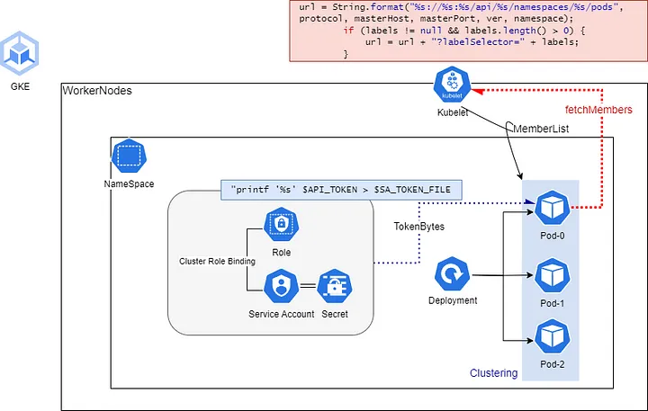

# tomcat_session_clustering_in_k8s
해당 문서는 Kubernetes 환경에서 Pod로 배포된 Tomcat끼리의 Session Clustering을 테스트한 문서입니다.

## Overview
기본적으로 Tomcat에선 2가지 방법을 제공합니다.

1. **KubernetesMemberShipProvider**
2. **DNSMemberShipProvider**

## 1. KubernetesMemberShipProvider
아키텍처는 다음과 같습니다.

