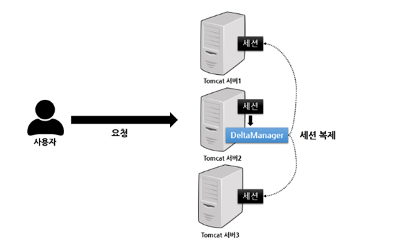
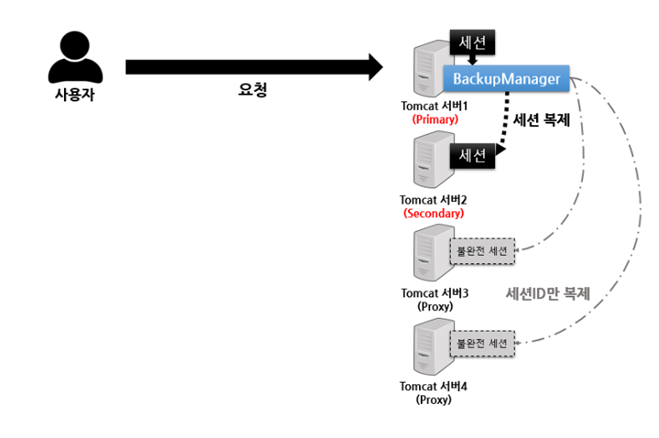

# Tomcat Session clustering
여러대의 Tomcat 서버로 Clustering된 Tomcat은 세션 공유를 위해 두가지 클래스를 제공합니다.

1. DeltaManager
2. BackupManager

## 1. DeltaManager
DeltaManager 아키텍처 입니다.

All-to-All 방식이라고도 하며, 하나의 세션 데이터가 변경되면 변경된 사항이 모든 서버로 복제되는 형태입니다.

Member를 맺고 있는 Tomcat WAS에게 모두 세션 데이터를 복제하기 때문에, 클라이언트 요청을 한곳으로 고정하는 Stiky Session을 걸지 않아도 동일한 환경을 제공받습니다.

**그러나 모든 서버가 전체 세션을 유지하고 있기 때문에 세션을 찾기 위한 추가 네트워크 I/O가 발생하지 않아도 되지만, 그만큼 메모리가 많이 필요합니다.**

또한 모든 서버에 세션을 전파해야 하기 때문에, ***시간차로 인한 세션 불일치 문제가 발생할 수 있습니다.***

따라서 Tomcat 공식 문서에서도 해당 방식을 사용하는 것은 소규모 클러스터(Tomcat 4대 미만) 에서 좋고, 대규모 클러스터 환경에서는 사용하지 않는것을 권장합니다.

## 2. BackupManager
BackupManager 아키텍처 입니다.

DeltaManager의 단점을 보완하기 위해, 전체 서버에 세션을 복제하는 것이 아닌 Secondary 서버를 선택해서 Secondary에만 세션을 복제하는 방식입니다.

**이외의 나머지 서버에는 세션 Key에 해당되는 JESSIONID만 복제하고 저장하면서, 메모리를 절약할 수 있습니다.**

Primary와 Secondary 노드를 선택하는것은 Apache Tomcat의 [Tribes Clustering](#021-tribes-clustering) Framework을 통해 선택됩니다.

그러나 세션ID만 가지고 있는 서버에서 다른 서버로 세션 정보를 요청할 경우 온전한 세션 정보를 얻기 위해 Primary, Secondary에 재 요청을 보내야 하는 과정이 필수적이라는 단점이 있습니다.

비교적 대규모 클러스터 환경에서 적합합니다.

#### 2.1 Tribes Clustering
각 세션은 고유한 Session ID 값을 기반으로 해시 값을 계산합니다. 이 값을 사용해서 노드 중 Primary와 Secondary를 선택합니다.

노드 순서는 일반적으로 IP 주소, Host Name, 또는 UUID를 기반으로 정렬됩니다. 정렬된 노드 리스트에서 특정 세션 ID의 해시 값에 가장 가까운 노드를 Primary, 그 다음을 Secondary로 선택합니다.
- (정렬은 사전식, 즉 순차적으로 정렬됨. ex: 1.1.1.1, 1.1.1.2 ....)

Tribes Clustering은 로드벨런싱을 고려하기 때문에 트래픽을 RR, 균등하게 분산합니다.

가용성을 위해 자동 Fail-Over를 지원합니다.

***Primary와 Secondary 개수를 튜닝하는것이 가능하기 때문에, 적절한 개수를 둠으로써 Scale Out에 의한 세션 불일치 문제를 최소화 해야 합니다.***

## 3 ETC
Session을 공유한다는것은 사실 상태가 동일하다는 말과 같기 때문에 Scale Out이 빈번하게 발생하는 Cloud 환경엔 적합하지 않습니다.
- 서버는 죽을 수 있다..

또한 세션을 공유하거나, 불완전 세션을 완전하게 만들기 위한 과정에서 발생하는 네트워크 통신 과정은, 추가 트래픽이 발생하는것과 같은말이기 때문에, 대규모 Cluster 환경에서는 적합하진 않습니다.

따라서 JWT 토큰과 같은 키값을 통해 로그인 기능 등의 상태를 관리하는게 적합하지만,, 때에 따라 세션을 공유해야할 수 있기 때문에 해당 문서를 정리합니다.