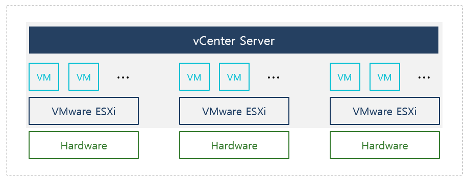

# VMWare vSphere 기초 개념
## 개념 정리
- ***ESXi***
    - VMware에서 자체개발한 Hypervisor. 가상화 환경을 위해 만들어진 최소한의 기능을 지원하는 **OS**
    - Type-1 Hypervisor, 전가상화 하이퍼바이저

- ***vSAN***
    - VMware의 SDN(Software Defined Storage). 서버 내장 스토리지를 클러스터로 묶어 공유 스토리지 풀을 구성하는 기술.
    - SAN, NAS 없이 HA나 DRS가 가능하게끔 함.
    - 클러스터로 구성이 가능하며, 2가지 구조로 배포 가능.
        - 1. ESA(Express Storage Architecture)
            - NVMe 디스크만 지원, 네트워크 속도 요구 최소치가 25GB, 권장 100GB.
            - 높은 성능을 가지며, storage Pool 개념으로 스토리지 장애 발생하더라도 디스크 교체만으로 장애처리 가능
        - 2. OSA(Original Storage Architecture)
            - ESXi 호스트 디스크를 그룹으로 묶어 가상화.
            - 네트워크 속도 요구치는 최소 1GB, 권장 10GB
    - 장점 
        - **VM마다 RAID 구성을 스토리지 정책으로 할당 가능**
        - RAID 1, RAID 5, RAID 6 지원
        - *타입과 FTT 개수에 따라 필요 최소 ESXi 호스트 수 달라짐.
            ||||
            |--|--|--|
            |구성|FTT(허용되는 호스트 장애 수)|필요한 최소 호스트 수|
            |RAID 1(Mirroring)|1|3|
            |RAID 5(Erasure coding)|1|4|
            |RAID 1(Mirroring)|2|5|
            |RAID 6(Erasure coding)|2|6|
            |RAID 1|3|7|
        
- **NSX-T**
    - VMware의 SDN
    - vSphere, KVM, 베어메탈, 컨테이너(CNI) 등 다양한 워크로드 지원

- ***vCenter Server***

    - 다수의 ESXi를 한번에 관리할 수 있는 중앙집중관리 및 모니터링 솔루션.
    - **다수 ESXi 모니터링 및 통합관리 기능 사용 가능.**
    - **단순 관리용도 서비스이기에, vCenter에서 장애 발생하더라도 전체 VMware에는 영향도가 없음.**
    - 별도 VM에 설치

- ***vSphere***
    - VMware 플랫폼 전체의 상품군을 지칭함.(ESXi, vCenter 등..)

- ***vSphere Client***
    - ESXi 호스트 또는 vCenter Server에 접속하여 관리하기 위한 사용자 인터페이스 도구.(UI)
    - 가상 머신 생성, 설정, 관리
    - HTML5 웹 클라이언트로 제공되며, 비용은 무료임.(ESXi, vCenter 일부로 제공)
    - vCenter와 차이는 관리 방안과 역할에 있음. [링크 참고](#vcenter-server-vs-vsphere-client)

- ***datastore***
    - EXSi 하이퍼바이저에서 사용할 스토리지를 가상화한 영역
    - HDD, NAS, SSD 등을 논리적 스토리지 풀로 가상화함.
    - 저장하는 파일 유형
        - *VMDK(가상머신 디스크 파일)
        - MX(가상머신 구성 파일)
        - IoS Image File 등
    - 지원하는 스토리지 유형
        - VMFS(VMware File System): VMware 전용 파일 시스템, 블록 기반 스토리지
        - NFS(Network File System): 네트워크 파일 시스템, NAS 장치와 함께 사용
        - vSAN: VMware의 소프트웨어 정의 스토리지 솔루션(ESXi에서 사용)
        - vVols(Virtual Volumes): 외부 스토리지 시스템의 기능을 활용하는 VMware 기술

## 핵심 기능
**- 아래 글에서, 클러스터 단위라는 의미는 ESXi 호스트 Cluster를 의미함.**
**- 대부분의 기능은 ESXi 호스트들에 대해 공유 스토리지가 마운트되어 있어야 사용이 가능.**

### 1. vMotion
가상시스템이 상주중인 ESXi 호스트 위치 또는 datastore 위치를 서비스 무중단으로 이동할 수 있음.
- Host vMotion : 가상시스템이 상주하는 ESXi 호스트 위치 변경
- Storage vMotion : 가상시스템이 저장된 datastore 위치 변경
- Host & Storage vMotion : 호스트 및 datastore 위치 동시 변경

VM이 켜진상태로 이동하는것을 ***Hot Migration***, 꺼진상태로 이동하는것을 ***Cold Migration***

vMotion은 네트웤을 이용한 기능이라, 별도 NIC를 이용하는것이 권장됨. (VMKernel 어뎁터 기능 필요)
- ***Hot Migration, Host vMotion 시에는 vMotion 네트워크를 사용하며, 그 외에는 관리 네트워크를 사용**

vMotion은 대량의 데이터전송이 발생하기에, 높은 대역폭을 요구함.
- ***최소 1Gbps, 권장 10Gbps***

#### 실제 구성 예
1. 물리적 구성:
- 2개 이상의 물리적 NIC (권장: 관리용 1개, vMotion용 1개 이상)
- 고성능 스위치(10Gbps 이상 권장)

2. 논리적 구성:
- 관리 VMkernel 포트: 192.168.1.x/24 (관리 VLAN 10)
- vMotion VMkernel 포트: 10.0.0.x/24 (vMotion VLAN 20)
- 각 VMkernel 어댑터에 서비스 활성화(vMotion 포트에는 vMotion 서비스 활성화)

**관리 VLAN이란 ESXi 호스트 관리 및 vCenter 통신 등 기본적 관리 트래픽을 관리하는 네트웤을 의미**

### 2. vSphere HA
하드웨어 혹은 ESXi 호스트 장애 시 해당 호스트에 상주중인 VM이 정상 호스트로 페일오버되는 기능.

#### 상세
클러스터 레벨에서 해당기능 Enable 시, 내부 알고리즘에 따라 1대의 Host가 Master로 선정되고 나머지 Host는 Slave로 선정.
- ***선출 기준 : (1) 데이터스토어 수량이 많은 호스트, (2) 수량이 동일할 경우, MOID가 높은 호스트***

역할이 결정된다면 각 호스트는 내부 FDM Agent를 통해 핫빗을 주고 받는데,
슬레이브는 자신의 상태를 마스터에게 보고하며, 마스터는 자신으로부터 보호되는 가상시스템과 슬레이브 모니터링 결과를 vCenter에게 전달

#### 주의 사항
- **클러스터 단위의 기능이기에, 다른 클러스터로는 넘어가지 않음**
- **각 가상시스템은 vSphere HA로부터 보호받지 않도록 재정의할 수 있다. (예: OS 이중화로 구성된 Active - Standby 가상시스템)** 

### 3. vSphere DRS
VMWare 클러스터 내부 ESXi 호스트 별 리소스가 불균형할 경우, vm이 다른 ESXi 호스트로 자원을 재배치하거나 알려주는 기능.
vMotion 기반으로 동작하며, ESXi Cluster 레벨에서 사용 가능.

VM이 배치되는 자동화 수준을 지정할 수 있음.
- 완전 자동화 : VM 배치 및 권장사항이 자동 수행
- 부분 자동화 : VM 생성 시 초기배치만 자동으로 수행되며, 그 외에는 권장사항 알람 표시
- 수동 : VM 배치 및 권장사항이 모두 알람으로 표시

DRS 완전 자동화는 잘 사용되지 않는데, 아무리 무중단이라 할지라도 Ping이 1~2ms Loss 될 수 있기 때문임.
DB와같은경우 이는 서비스에 치명적일 수 있기 때문에, 이와같은 이유로 DB는 가상화가 아닌 단독구성으로 하는경우가 많음.

### 4. Clone & Template
- Clone VM : 가상시스템을 동일하게 복제하는 기능
- Template : 1대의 VM을 Template화 하여 동일하게 생성하는 기능

## ETC
#### vCenter Server vs vSphere Client
- 역할의 차이
    - vCenter Server : 여러 ESXi 호스트를 중앙 집중 관리하는 백엔드 서버
    - vSphere Client : 관리 용도의 HTML5 기반 UI 인터페이스

- 관계적 차이
    - **vSphere Client는 vCenter Server 또는 ESXi 호스트에 직접 연결하는 데 사용됨.** 
    - 만약 vCenter Server가 없는 상태로 vSphere Client 단독으로 사용하면, 제한된 기능들만 사용이 가능하고 클러스터링, HA, DRS등 사용 불가
    - ***vCenter Server 단독으로 사용불가함. 얘는 백엔드 서버기 때문임. 여기에 연결하기 위한 WEB Client가 vSphere Client.***
    - ***현재는 vCenter Server에 HTML5 기반 웹 인터페이스가 내장되어 있기 때문에, 추가구축 필요 없음**

- 비용
    - vSphere Client는 무료지만, vCenter Server는 유료임

- 실무 예시
    - 소규모 환경(ESXi 호스트 1~3대) : vSphere Client만 사용해서 비용 최적화
    - 대규모 환경(ESXi 호스트 4대 이상) : vCenter를 설치한 뒤, vSphere Client로 vCenter에 연결하여 모든 호스트를 중앙 관리

- 결론
    - vCenter Server : ESXi를 관리하기 위한 백엔드 서버(DB 포함). 고급 관리기능(HA, DRS 등..)사용 가능
    - vSphere Client : ESXi 호스트를 관리하기 위한 WEB UI. 단독으로도 사용이 가능하나, vCenter Server가 가진 고급 기능을 사용하기 위해선 vCenter Server를 연결해야 함.

## 참고 문서
- [VMware_공식문서_VMWare ESXi: An Overview](https://www.cloud4u.com/blog/what-is-vmware-esxi/)
- [블로그_[VMWware] vCenter Server란?](https://smallrich.tistory.com/5)