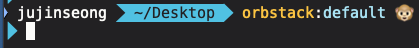
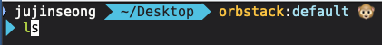
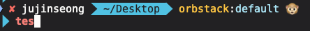

# overview
Shell 초기 세팅 시 사용

## 요구사항
1. OrbStack, Docker Desktop 등 설치 필요
2. 실리콘 칩(M1, M2...)맥 사용
3. iTerm2의 Font 설정 필요(Font 이름 : DejaVu Sans Mono for Powerline)

## 사용 방법
```bash
chmod +x mac_basic_setting.sh

./mac_basic_setting.sh
```

## 결과
#### Mac User 명, 디렉토리 위치, Kube context 이름, Default NS, Random Emoji 출력



#### 명령어 자동입력



#### 잘못된 명령어 기입 시 빨간색으로 하이라이트

