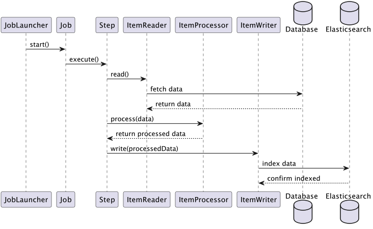

# Batch Project 사용방안
## 사전 사항 - elasticsearch 구축
elastic Search를 아래 문서를 따라 구축합니다.

### ***주의***
elastic search API들은 elastic search에 접근할 때 , 토큰기반 인증 또는 ID & PWD 기반 인증을 해야 합니다.

**따라서 elasticsearch를 구축할 때 , 유저를 같이 생성해줘야 합니다.**

- [엘라스틱서치 구축 방안](../../../../DevOps_solutions/Elastic_모음/README.md#elasticsearch-id--password-생성---로컬-환경)

## overview
- elasticsearch bulk vs save

bulk API를 통해 색인을 진행합니다.
- 모든 데이터를 색인하기 때문에 , 성능 향상을 위해서 bulk API로 진행합니다.

bulk API 는 , 

    Elasticsearch의 Bulk API는 다수의 인덱스/업데이트/삭제 작업을 단일 API 호출로 실행할 수 있게 해주는 기능입니다. 

    이를 통해 데이터를 대량으로 Elasticsearch에 삽입하거나, 

    여러 작업을 한 번의 호출로 실행할 수 있습니다.

## 참고 문서
batch 사용방안 정리
- https://velog.io/@cho876/Spring-Batch-job-%EC%83%9D%EC%84%B1

batch 최신 변동사항 정리
- https://alwayspr.tistory.com/49

batch 생성 스키마 정리
- https://zzang9ha.tistory.com/426

ElasticSearch 형태소분석 참고문서
- https://esbook.kimjmin.net/06-text-analysis/6.7-stemming/6.7.2-nori

## RDB Table 정보
전체 정보 테이블과 , 카테고리 테이블로 나뉩니다.

이 두가지 테이블을 Join하여 ElasticSearch에 색인할 예정입니다.

### 1. firstInfo Table
- 실제 데이터값이 저장되는 테이블 입니다.

|컬럼 명|Data Type|요약 정보|비고|
|------|---|---|--|
|firstInfoId|int|row별 Id 값|PK|
|name|varchar(20)|컬럼이름|-|
|age|int|더미 int값 넣음|-|

### 2.  category_table
- 각 컬럼별 카테고리가 저장된 테이블입니다.

|컬럼 명|Data Type|요약 정보|비고|
|------|---|---|--|
|category_seq|int|row별 식별자 int값 (auto_increment) |-|
|firstInfoId|int|firstInfo Table의 firstIdInfo 값을 외래키로 지정|FK|
|category|varchar(20)|카테고리 명|-|

### Join Query
- 수행할 Join Query는 다음과 같습니다.

```Query
select firstInfo.firstInfoId, name, age, category from firstInfo join category_table on firstInfo.firstInfoId = category_table.firstInfoId;
```

## ElasticSearch 세팅
카테고리 , 이름 , age 별 검색이 가능해야 하기 때문에 doc 들에 대한 형태소 분석이 가능해야 합니다.

따라서 **nori 한글 형태소 분석기를 사용합니다.**

테스트 환경은 ElasticSearch 노드 개수가 1대이기떄문에 , 샤드 및 레플리카 개수 지정 없이 index 패턴만 설정합니다.

### nori 설치
엘라스틱서치에 nori 플러그인을 설치합니다.
>elasticsearch 홈 디렉토리에서 빈폴더안에 실행파일들 있음
>도커도 동일 : 컨테이너 내부 접근하여 설치하면 됨
```bash
// 설치
$ bin/elasticsearch-plugin install analysis-nori

// 제거
$ bin/elasticsearch-plugin remove analysis-nori
```

nori 형태소분석기가 잘 설치되었는지 엘라스틱서치에 쿼리를 보내서 확인합니다.

일반 standard tokenizer를 사용하면 , 공백만 자를 수 있습니다.
```bash
GET _analyze
{
  "tokenizer": "standard",
  "text": [
    "동해물과 백두산이"
  ]
}

# response
{
  "tokens" : [
    {
      "token" : "동해물과",
      "start_offset" : 0,
      "end_offset" : 4,
      "type" : "<HANGUL>",
      "position" : 0
    },
    {
      "token" : "백두산이",
      "start_offset" : 5,
      "end_offset" : 9,
      "type" : "<HANGUL>",
      "position" : 1
    }
  ]
}
```

nori 형태소분석기를 tokenizer로 사용해서 테스트하면 , 한국어 사전 정보를 통해 어근 , 합성어등을 분리시킬 수 있습니다.

nori_tokenizer에는 다음과 같은 옵션이 있습니다.
- ***user_dictionary :*** 사용자 사전이 저장된 파일의 경로를 입력합니다.
- ***user_dictionary_rules :*** 사용자 정의 사전을 배열로 입력합니다.
- ***decompound_mode :*** 합성어의 저장 방식을 결정합니다. 다음 3개의 값을 사용 가능합니다.
  - ***none :*** 어근을 분리하지 않고 완성된 합성어만 저장합니다.
  - ***discard (디폴트) :*** 합성어를 분리하여 각 어근만 저장합니다.
  - ***mixed :*** 어근과 합성어를 모두 저장합니다.

```bash
GET _analyze
{
  "tokenizer": "nori_tokenizer",
  "text": [
    "동해물과 백두산이"
  ]
}

# response
{
  "tokens" : [
    {
      "token" : "동해",
      "start_offset" : 0,
      "end_offset" : 2,
      "type" : "word",
      "position" : 0
    },
    {
      "token" : "물",
      "start_offset" : 2,
      "end_offset" : 3,
      "type" : "word",
      "position" : 1
    },
    {
      "token" : "과",
      "start_offset" : 3,
      "end_offset" : 4,
      "type" : "word",
      "position" : 2
    },
    {
      "token" : "백두",
      "start_offset" : 5,
      "end_offset" : 7,
      "type" : "word",
      "position" : 3
    },
    {
      "token" : "산",
      "start_offset" : 7,
      "end_offset" : 8,
      "type" : "word",
      "position" : 4
    },
    {
      "token" : "이",
      "start_offset" : 8,
      "end_offset" : 9,
      "type" : "word",
      "position" : 5
    }
  ]
}
```

### index 생성
nori tokenizer를 사용하는 index를 생성합니다.
- 인덱스 명 : info_index

각 파라미터별 설명은 다음과 같습니다.
- analysis의 analyzer를 custom type으로 지정 , tokenizer nori_tokenizer 지정,
- nori_tokenizer decompound_mode를 mixed로 지정
- name , age , category 검색이 가능
  - category가 과자 라면 , 과자입니다 검색했을경우에 과자 추출
  - name이 주진성 이라면 , 주진성2, 주진성이다. 주진성입니다 검색했을 경우 주진성 추출
  - 과자 주진성 모두 검색하면 , 과자 카테고리 및 주진성 이름 추출
```bash
PUT info_index
{
  "settings": {
    "analysis": {
      "analyzer": {
        "korean": {
          "type": "custom",
          "tokenizer": "nori_tokenizer"
        }
      },
      "tokenizer": {
        "nori_tokenizer": {
          "type": "nori_tokenizer",
          "decompound_mode": "mixed"
        }
      }
    }
  },
  "mappings": {
    "properties": {
      "category": {
        "type": "text",
        "analyzer": "korean"
      },
      "name": {
        "type": "text",
        "analyzer": "korean"
      },
      "age":{
        "type": "integer"
      }
    }
  }
}
```

### 검색결과 확인
생성한 index에 대해 검색쿼리를 날려보면 , 요구사항에 부합하게 잘 작동하는것을 확인할 수 있습니다.
>아래쿼리 날리면 , 카테고리가 과자 또는 자연인 doc을 모두 검색해옵니다.
```bash
curl info_index/_search
{
  "query": {
    "match": {
      "category": "과자자자연"
    }
  }
}
```

>아래쿼리 날리면, 카테고리가 과자인 doc들과 ,  이름이 겔럭시워치 인 doc을 모두 검색해옵니다.
```bash
curl info_index/_search
{
    "query": {
        "bool": {
            "should": [  # should 로 쿼리 수행결과 가중치 높힘
                {
                    "match_phrase": { # match_phrase 로 쿼리가 정확히 맞는 doc만 추출
                        "name": {
                            "query": "겔럭시워치"
                        }
                    }
                },
                {
                    "match":{
                        "category": "과자"
                    }
                }
            ]
        }
    }
}
```

쿼리문법은 아래 문서를 참고
- [ElasticSearch 가이드북](https://esbook.kimjmin.net/05-search)

## dependency
아래 의존성 추가합니다.
- JPA 페이징 사용하여 select 해야되기때문에 JPA 추가
- elasticSearch에 색인해야하기 때문에 spring-boot-starter-data-elasticsearch 추가
>해당 예제에선 3.1.2 버전 사용

```gradle
// elasticSearch 에 색인 하기 위한 dependency
// https://mvnrepository.com/artifact/org.springframework.boot/spring-boot-starter-data-elasticsearch
implementation 'org.springframework.boot:spring-boot-starter-data-elasticsearch:3.1.2'

//JPA
implementation 'org.springframework.boot:spring-boot-starter-data-jpa'
```

## 프로세스


## 코드 설명
### Entity 객체 생성
select 결과값의 Entity 객체와 , Processor 계층에서 변환되어 ElasticSearch로 색인될 Entity 객체를 생성합니다.
- [Entity Code](./src/main/java/com/example/indexinitbatch/elasticIndexing/Entity)

elasticSearch로 ```InfoDtoIndex``` 를 색인해야하기 때문에 , 어노테이션으로 elasticSearch index 정보를 생성해줍니다.
- [InfoDtoIndex Code](./src/main/java/com/example/indexinitbatch/elasticIndexing/Entity/InfoDtoIndex.java)
>각 어노테이션 별 설명은 주석 처리 해두었 습니다.


### Reader 생성
RDB에 저장된 각 필드별 카테고리를 elasticSearch에 색인 해야 하기에 , 카테고리 테이블 , 메인 테이블을 Join한 쿼리를 수행 하여 결과를 리턴받습니다.

**ItemReader 구현체인 JdbcPagingItemReader 를 리턴함으로써 Reader 객체를 생성합니다.**

- [Reader Code](./src/main/java/com/example/indexinitbatch/elasticIndexing/Service/Reader)
>해당코드의 설명은 주석 처리 해두었 습니다.

### Processor 생성
Reader에서 반환받은 InfoDto 엔티티를 InfoDtoIndex 엔티티로 변환 합니다.

- [Processor Code](./src/main/java/com/example/indexinitbatch/elasticIndexing/Service/Processor)

### Writer 생성
Processor 계층에서 변환된 InfoDtoIndex 엔티티들을 모두 elasticSearch에 색인 합니다.

색인 시 , _bulk API를 통해서 색인합니다.
- [bulk API 관련 문서](https://esbook.kimjmin.net/04-data/4.3-_bulk)
>save와 bulk 두가지중 고민
> 
>save : 단일 데이터를 색인하기 위해 설계됨
>bulk : 여러개 데이터 (대량) 를 색인하기 위해 설계됨
> 
>위 테스트 코드는 RDB의 전체 데이터를 색인하기 때문에 , bulk 사용

- [Writer Code](./src/main/java/com/example/indexinitbatch/elasticIndexing/Service/Writer)

### Job과 Step 생성
Job , Step , 병렬처리를 위한 TaskExcutor 메서드를 생성합니다.

- [Job, Step Code](./src/main/java/com/example/indexinitbatch/elasticIndexing/Config/ElasticBatchGlobalConfig.java)

### JobLauncher 생성
만든 Job을 수행할 JobLauncher를 외부 모듈 (jenkins 등..) 을 사용할 수 있지만 , 해당 코드에선 코드내부에 ```@Scheduled(cron = "0 * * * * *")``` 로 크론 탭 생성하여 Job 수행 합니다.

- [JobLauncher Code](./src/main/java/com/example/indexinitbatch/elasticIndexing/Config/BatchJobConfig.java)

