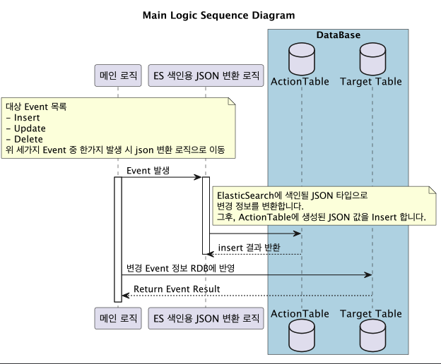

# eventIndexInitBatch
elastic search에 RDB 데이터를 특정 event별로 넣어주는 배치 API
>해당 배치 API는 RDB에 특정 event가 발생했을 경우, 해당 evnet가 발생한 로우만 elastic search에 넣어줍니다.

## 사전 지식
해당 Application은 SpringBatch이기 때문에 , Batch Application의 동작 방식에 대해 이해가 필요합니다.
- [SpringBatch의 동작과정 아키텍처 설명](../allIndexInitBatch/SpringBatch_사용방안.md)

## Overview
부분 배치 로직은 다음과 같습니다.

### 1. MainLogic
먼저 기존 로직에서 , Insert , Update , Delete 이벤트가 대상 테이블에 발생 하면 , 트리거를 사용하여 Action Table에 변경 정보를 적재해 둡니다.

### 2. BatchLogic
일정 주기를 가지는 Batch Application이 Action Table에 적재된 변경 정보를 ElasticSearch에 색인 합니다.

## Table 생성
기반이 되는 나머지 테이블들은 , 아래 링크를 타고가면 확인할 수 있습니다.
- [RDB 정보 섹션에서 찾을수 있음.](../allIndexInitBatch/사용방안.md)

### 1. Action Table 생성
| 컬럼 명             | Data Type   | 요약 정보                       | 비고                                 |
|------------------|-------------|-----------------------------|------------------------------------|
| _id | int         | row별 식별자 값 (auto_increment) | pk                                 |
| action     | varchar(20) | 해당 이벤트 분류값                  | UPDATE , DELETE , INSERT 셋중 하나 들어옴 |
| firstInfoId     | int         | 메인 테이블의 기본키                 | -                                  |
| changesValue     | varchar(20) | 변경 내용                       | -                                  |
| updateDateTime     | timestamp   | 변경 발생시간                     | -                                  |

### 
