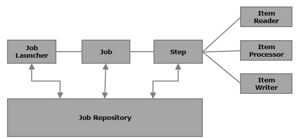

# Spring Batch 사용방안
## Spring batch 동작 방식
### 구성 요소

#### **1. Batch Scheduler**
spring batch는 내부적으로 스케줄러를 가지고있지 않기 떄문에 , 혼자서 job을 수행하며 동작할 수 없습니다.

따라서 외부 스케줄러가 있어야 하고, Batch Scheduler라 함은 외부 모듈을 의미합니다. 해당 외부 스케줄러가 batch job을 동작시키게 됩니다.


스케줄러의 종류로는 아래와 같습니다.
1. Quartz Scheduler
2. Jenkins
3. Scheduler annotation

등..

#### **2. JobRepository**
Spring Batch의 실행 상태, 메타데이터, 실행 이력 들을 저장하고 관리합니다.

배치 작업의 실행과 관련된 모든 정보를 저장하는데 사용되며 , 작업 실패 , 성공 , 재시작 등의 상황에서 매우 중요하게 작동합니다.

```JobRepository```의 책임

1. 배치 작업의 실행 상태 관리: 
   
   
    JobRepository는 JobExecution 및 StepExecution의 상태를 추적합니다.

    예를 들어, 작업이 현재 실행 중인지, 실패했는지, 성공했는지와 같은 상태 정보를 저장합니다.

2. 배치 메타데이터 저장: 

    
    JobRepository는 JobInstance, JobParameters, JobExecution, StepExecution 등의 배치 관련 메타데이터를 저장합니다.

3. 배치 작업의 재시작: 
   
   
    작업이 실패하면 해당 작업을 재시작할 때 JobRepository의 메타데이터를 사용하여 어디서 중단되었는지를 파악하고, 

    중단된 지점부터 작업을 재개할 수 있습니다.

4. 중복 실행 방지: 

    
    같은 파라미터로 작업을 여러 번 실행하는 것을 방지하기 위해 JobRepository를 사용할 수 있습니다. 

    예를 들어, 이미 실행된 파라미터로 작업을 다시 시작하려고 하면 JobRepository는 이를 감지하고 작업을 실행하지 않을 수 있습니다.

```JobRepository```는 이러한 책임 요소를 완수하기 위해서 , 

RDB에 위 메타데이터를 저장해야 하기 때문에 Spring Batch Application이 무조건 RDB와 연결되어야만 하는 이유입니다.
- 메타데이터 스키마는 IDE 툴에서 찾을 수 있습니다.

#### **2.1 Job**
실제 배치 과정을 하나의 단위로 묶어놓은 객체 입니다.

배치 처리 과정의 최상위 Object 입니다.

따라서 Job은 여러개의 Step으로 나뉘어 집니다.

Job에선 배치 작업의 시작과 끝을 정의하며 , 전체 작업의 흐름과 처리 순서를 나타내게 됩니다.


#### **2.2 JobLauncher**
JobLauncher 는 Job을 실행하는 역할을 담당합니다.

JobLauncher 는 주로 외부 이벤트나 사용자 요청에 응답하여 Job을 시작하는데 사용하게 됩니다.

Job & JobParameters를 param으로 받고 배치 수행 후, JobExecution을 반환 합니다.

#### **2.3 Step**
Step은 실제 배치 처리의 한 단계(세그먼트) 를 의미합니다.

Step에서 실제로 데이터 읽기 , 처리 , 쓰기 등의 연산이 발생하게 됩니다.

Step의 주요 구성 요소는 다음과 같습니다.

- ***ItemReader:*** 
  - 데이터를 읽는 역할을 합니다. 예를 들어, 파일에서 라인을 읽거나 데이터베이스에서 레코드를 조회하는 작업을 수행합니다.
- ***ItemProcessor:*** 
  - ItemReader를 통해 읽은 데이터에 대한 로직을 처리하는 역할을 합니다. 예를 들어, 데이터 변환, 필터링, 비즈니스 룰 적용 등의 작업을 수행할 수 있습니다.
- ***ItemWriter:*** 
  - 처리된 데이터를 저장하거나 출력하는 역할을 합니다. 예를 들어, 데이터를 파일에 쓰거나 데이터베이스에 저장하는 작업을 수행합니다.
- ***Chunk:*** 
  - Step은 'Chunk' 방식으로 데이터를 처리합니다. Chunk는 한 번에 처리되는 데이터 항목의 집합을 의미하며, ItemReader로부터 데이터를 읽은 후 ItemProcessor로 처리하고, ItemWriter로 데이터를 쓰는 전체 과정을 의미합니다. 이 Chunk 방식은 대량의 데이터를 효율적으로 처리하는 데 유용합니다.
- ***Tasklet:***
  - Step은 데이터 기반의 처리가 아닌 단순한 작업(예: 디렉토리 생성, 파일 삭제 등)을 수행하기 위해 Tasklet 방식도 지원합니다. Tasklet은 ItemReader, ItemProcessor, ItemWriter의 조합이 아닌 단일 작업을 수행합니다.
- ***재시작 및 오류 처리:*** 
  - Step은 재시작 가능하며, 오류 발생 시 다양한 오류 처리 전략을 제공합니다. 예를 들어, 실패한 데이터 항목을 건너뛰거나, 오류 발생 시 작업을 중단하는 등의 전략을 설정할 수 있습니다.
>ETC
>
>Step에서 Chunk와 Tasklet둘중 하나를 선택해야 합니다.
>
>Tasklet은 ItemReader, ItemProcessor, ItemWriter 이 필요 없는 단일처리를 하기 때문에, 큰 데이터가아닌 단일 데이터에 대해 복잡한 로직일경우 많이 사용되며,,
>Chunk는 처리할 모든 record를 모두 읽은(ItemReader, ItemProcessor) 후에 모두 읽어들이는데 성공 하면 , 한번에 쓰기 (ItemWriter) 하는 방식 입니다.
> 
>따라서 대용량 데이터에 대해 단순작업할땐 Chunk, 복잡한 로직이 들어갈경우 Tasklet을 사용합니다.


#### **3. ItemReader*
데이터를 읽는 역할을 합니다. 예를 들어, 파일에서 라인을 읽거나 데이터베이스에서 레코드를 조회하는 작업을 수행합니다.

#### **4. ItemProcessor*
ItemReader를 통해 읽은 데이터에 대한 로직을 처리하는 역할을 합니다. 예를 들어, 데이터 변환, 필터링, 비즈니스 룰 적용 등의 작업을 수행할 수 있습니다.
>그냥 단순히 읽고 쓰는것만 필요하다면 , Processor 과정은 없어도 됩니다.

#### **3. ItemWriter*
처리된 데이터를 저장하거나 출력하는 역할을 합니다. 예를 들어, 데이터를 파일에 쓰거나 데이터베이스에 저장하는 작업을 수행합니다.

여기서 타 API를 호출하거나 , Kafka topic을 발행하거나 , elasticSearch 에 색인하는 등의 작업이 일어 납니다.