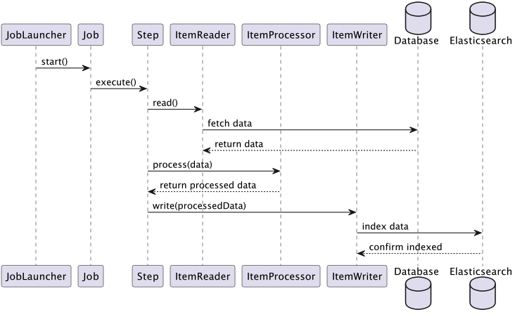

# Batch Project 사용방안

## 참고 문서
batch 사용방안 정리
- https://velog.io/@cho876/Spring-Batch-job-%EC%83%9D%EC%84%B1

batch 최신 변동사항 정리
- https://alwayspr.tistory.com/49

batch 생성 스키마 정리
- https://zzang9ha.tistory.com/426

## dependency
아래 의존성 추가합니다.
- JPA 페이징 사용하여 select 해야되기때문에 JPA 추가
- elasticSearch에 색인해야하기 때문에 spring-boot-starter-data-elasticsearch 추가
>해당 예제에선 3.1.2 버전 사용

```gradle
// elasticSearch 에 색인 하기 위한 dependency
// https://mvnrepository.com/artifact/org.springframework.boot/spring-boot-starter-data-elasticsearch
implementation 'org.springframework.boot:spring-boot-starter-data-elasticsearch:3.1.2'

//JPA
implementation 'org.springframework.boot:spring-boot-starter-data-jpa'
```

## 프로세스


## 코드 설명
### Entity 객체 생성
select 결과값의 Entity 객체와 , Processor 계층에서 변환되어 ElasticSearch로 색인될 Entity 객체를 생성합니다.
- [Entity Code](./src/main/java/com/example/indexinitbatch/elasticIndexing/Entity)

elasticSearch로 ```InfoDtoIndex``` 를 색인해야하기 때문에 , 어노테이션으로 elasticSearch index 정보를 생성해줍니다.
- [InfoDtoIndex Code](./src/main/java/com/example/indexinitbatch/elasticIndexing/Entity/InfoDtoIndex.java)
>각 어노테이션 별 설명은 주석 처리 해두었 습니다.


### Reader 생성
RDB에 저장된 각 필드별 카테고리를 elasticSearch에 색인 해야 하기에 , 카테고리 테이블 , 메인 테이블을 Join한 쿼리를 수행 하여 결과를 리턴받습니다.

**ItemReader 구현체인 JdbcPagingItemReader 를 리턴함으로써 Reader 객체를 생성합니다.**

- [Reader Code](./src/main/java/com/example/indexinitbatch/elasticIndexing/Service/Reader)
>해당코드의 설명은 주석 처리 해두었 습니다.

### Processor 생성
Reader에서 반환받은 InfoDto 엔티티를 InfoDtoIndex 엔티티로 변환 합니다.

- [Processor Code](./src/main/java/com/example/indexinitbatch/elasticIndexing/Service/Processor)

### Writer 생성
Processor 계층에서 변환된 InfoDtoIndex 엔티티들을 모두 elasticSearch에 색인 합니다.

- [Writer Code](./src/main/java/com/example/indexinitbatch/elasticIndexing/Service/Writer)

### Job과 Step 생성
Job , Step , 병렬처리를 위한 TaskExcutor 메서드를 생성합니다.

- [Job, Step Code](./src/main/java/com/example/indexinitbatch/elasticIndexing/Config/ElasticBatchGlobalConfig.java)

### JobLauncher 생성
만든 Job을 수행할 JobLauncher를 외부 모듈 (jenkins 등..) 을 사용할 수 있지만 , 해당 코드에선 코드내부에 ```@Scheduled(cron = "0 * * * * *")``` 로 크론 탭 생성하여 Job 수행 합니다.

- [JobLauncher Code](./src/main/java/com/example/indexinitbatch/elasticIndexing/Config/BatchJobConfig.java)