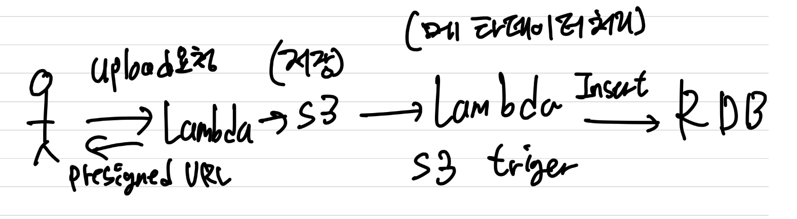
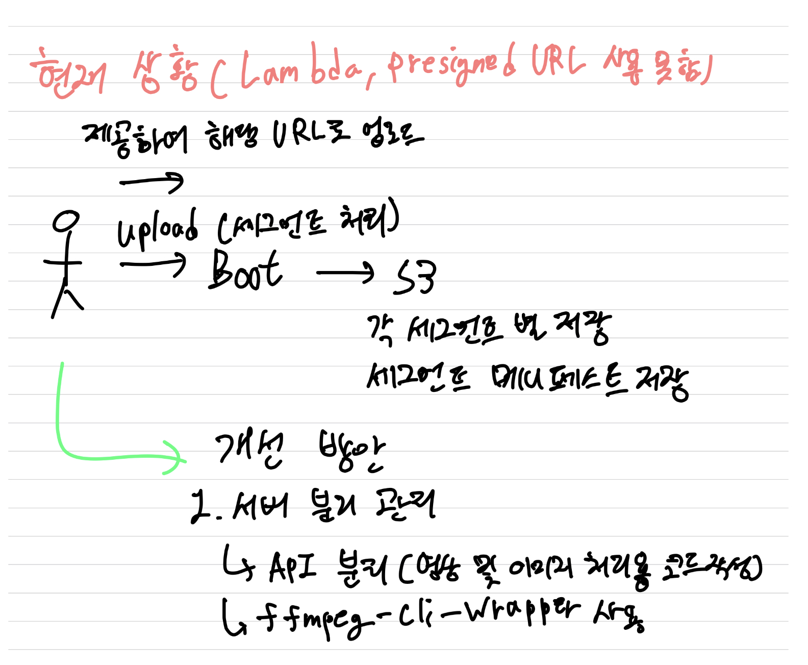

# OverView
해당 폴더는 kakao icloud를 통해 플랫폼 개발 과정중 발생한 기술적 이슈 사항들에 대한 고찰 및 해결 방안을 정리한 폴더 입니다.

## repository RoadMap
### S3 Presigned URL
object storage에 저장된 대용량 파일을 , 접근권한을 가진 사용자만 접근하여 업로드 및 다운로드가 가능해야 했습니다.

따라서 , AWS의 S3 Endpoint를 presigendURL로 생성하여 , 미리 권한을 부여하고 , 설정된 시간만큼만 접근이 가능하게끔 개발하였습니다.
- [PresgiendURL 관련 정보 (dependency등)에 대한 README](./BackEnd_Spring/awsS3PresignedURL/README.md)
- [PresgiendURL Code_aws일 경우](./BackEnd_Spring/awsS3PresignedURL/src/main/java/com/presignedurl/awss3presignedurl/logic/aws/)
- [PresgiendURL Code_openstack object storage swift service일 경우](./BackEnd_Spring/awsS3PresignedURL/src/main/java/com/presignedurl/awss3presignedurl/logic/openstackSwift/)

>카카오의 icloud에선 , presignedURL을 사용하여 개발하려고 하였으나 , icloud에서 제공하지 않고있는 제약사항이 있었음.
>
>icloud가 openstack 기반으로 되어있음을 깨달았고 , keystone에 swift (object storage service) 유저를 생성하여 개발하려 했으나 (openstack4j 라이브러리 사용), 보안상 이유로 실패
>
>***X-Auth-Token*** 값을 spring에서 keystone (kakao icloud keystone service) 에 요청하여 발급받은 후, FrontEnd에서 해당 토큰으로 object storage에 인증하는 방식으로 우회하여 개발하였음.

### 전체 api return json을 통일하는 방안 (에러 포함)
BackEnd SpringBoot에서 발생한 error 및 데이터 response를 공통 관리하고 , 규격을 통일하기 위해 controller의 response Domain을 통일하였으며 , Error 또한 ```@RestControllerAdvice``` 및 ```@ExceptionHandler```을 통해 에러 response를 통일하였습니다.

또한 custom Exception 처리에 , Exception Enum Class를 미리 정의하여 에러 코드 및 메세지를 통합 관리 하였습니다.

- [에러 공통처리 code 및 사용방안 README](./BackEnd_Spring/awsS3PresignedURL/src/main/java/com/presignedurl/awss3presignedurl/Error/)
- [정상 로직 수행 시 controller code 및 공통처리 사용방안 ](./BackEnd_Spring/awsS3PresignedURL/src/main/java/com/presignedurl/awss3presignedurl/commonResponse/)

### 영상 및 이미지 처리에 대한 고찰
s3 object storage에 영상 && 이미지를 저장해야하는 상황이며 , 해당 영상 또는 이미지의 해상도나 영상이라면 영상의 길이 등의 메타데이터를 따로 RDB에 저장해야 했습니다.

아래는 관련 방안에 대해 study한 결과가 모여있는 디렉터리 입니다.
- [best architecture](#best-architecture) 를 기반으로 콘텐츠를 어떻게 관리해야할지 study 하였으며 , 차후 실 운영단계에서는 아래와 같은 변경사항이 예상됩니다.
    - [code](./contentsManage/)

>**변경사항**
>
>1. backEnd -> nodejs 에서 spring Boot Application 변경
>
>2. lambda 사용 못하기 때문에 , 람다함수를 boot application으로 대체
> 
>3. presignedURL 사용 못하기 때문에 , Temp URL로 변경하거나 , x-auth-token을 통해서 관리

#### Best Architecture 
AWS 일 경우 , 

1. client가 업로드 요청하면 , Lambda or 특정 Backend 서버에 presigned URL 생성 요청
2. FE 측에서 callBack 요청으로 보냈기에 , response 받은 presigned URL로 contents S3에 저장
3. S3에 저장 트리거를 걸고있는 Lambda function이 동작하면서 , S3에 저장된 contents 메타데이터 추출
4. 추출 후 RDB에 메타데이터 저장



#### Lambda , presignedURL을 사용할 수 없을 경우

1. client가 세그먼트별로 영상을 쪼개서 Backend로 영상 저장
    - slo 방식으로 저장했기 때문에 , 각 세그먼트와 세그먼트 메니페스트 파일 두개를 s3에 저장
2. [ffmpeg-cli-wrapper 오픈소스](https://github.com/bramp/ffmpeg-cli-wrapper) 사용하여 , 해당 코드 올라가는 서버에 ffmpeg 설치 후 영상 저장하여 메타데이터 추출 후 RDB 저장
    - [테스트 코드 위치](./BackEnd_Spring/ffmpegTest/src/main/java/com/ffmpeg/ffmpegtest/service/ffmpegCli.java)




### 영상 및 이미지 스트리밍과 빠르게 확인할수 있게끔 하는 CDN 관련 고찰
CDN을 통해 메인 페이지 이미지들을 빠르게 받아볼 수 있도록 해야 함

- TEST 결과
>1. S3 bucket 또는 Domain과 연결해서 , 연결된 곳의 캐시를 먹일 수 있음.
>2. 캐시 저장 유효기간을 정할 수 있는데 , 만약 실제 스토리지에 해당 데이터가 삭제되었더라도 , 유효기간이 지나지 않으면 캐시를 새로 받아오지 않기 때문에 반영되지 않음.
>3. origin path를 지정해서 , object storage에 특정 path에만 접근할 수 있게끔 설정할 수 있음. 
>   - 나머지 데이터들은 지킬 수 있다.
>4. https 접근 가능하도록 적용 가능


### PresignedURL 및 람다를 사용하지 못할 경우 , contents의 메타데이터를 추출해야 할 때의 시퀀스 다이어그램
요구사항중 , 업로드된 contents들의 메타데이터 (해상도 , 포멧 , 비트레이트 , 영상 길이 등)을 추출해서 RDB에 저장해야 했습니다.

PresignedURL을 사용하지 못하고 , ***X-Auth-Token***을 사용해 object storage에 저장해야 했으며 , 업로드되는 contents들을 chunk별로 쪼개서 백엔드에 요청이 들어왔을 경우 , ***맨 앞 chunk만 임시 저장소에 저장하여 ffmpeg와 ffmpeg-cli-wrapper를 이용해 메타데이터를 추출*** 하는 로직으로 진행하였습니다.

>람다 쓰고싶어요
>
>람다를 사용한다면 , 서버리스 상태에서 메타데이터를 뽑아낼 수 있기 때문에 , 메모리 사용량이나 임시디렉토리에 저장되는 금액등을 걱정하지 않아도 되며 , 
>
>현 상태는 자바 어플리케이션 내부에서 모든 로직을 수행하기에 동시성 이슈또한 고려 대상인데 , 람다를 사용한다면 각 로직들을 분리시켜놓고 트리거로 연결할 수 있기에 장점이 많아보입니다..

#### 시퀀스 다이어그램

<!--  -->

>**영상 처리로직 자체를 변경해야될것같음**
>
>그 이유는 , 현재 FE에서 각 chunk를 쪼게서 , 맨앞 chunk로 메타데이터를 추출하게 되는데,
>
>영상 및 이미지 등의 멀티미디어 컨텐츠는 , **atom(or box) 라는 단위가 미디어 바이트 어딘가에 저장되어 있고, 이친구가 해당 미디어의 모든 메타데이터를 품고 있습니다.**
>
>그런데 , 바이트별로 쪼개는 과정에서 해당 atom이 깨지거나 누락되는 경우가 발생하여 , 로직상 atom이 있는 chunk를 찾아서 메타데이터를 추출해보려 했지만 ,,
>
>atom 자체가 깨진것인지 , 에러는 안나지만 메타데이터 값이 깨져서 출력되는 현상이 발생했습니다..
>
>따라서, **FrontEnd에서 사용자에게 ffmpeg를 설치하게끔 요청하고, 설치가 되었다면 메타데이터 추출을 FE 리엑트에서 진행하도록 로직 변경 예정 입니다.**

#### 로직 변경 후 시퀀스 다이어그램
- upload 로직 변경 후 최종본 시퀀스 다이어그램입니다.
- **영상 및 미디어 콘텐츠들의 atom값을 조절하는것은 , 모든 파일을 저장하는것 외에는 불가능하다 판단되어 , 임시 디렉토리에 모든 파일을 저장하되 FrontEnd와 BackEnd API 사이에 종단점 Queue API를 두어서 , 임시 디렉토리가 수용이 가능할 때만 Upload API로 이동하게끔 개발 할 예정입니다.**


### slo 업로드 방식

### slo 다운로드 방식에 대한 고찰
slo방식으로 object storage에 업로드 되었기때문에 , 대용량 파일은 chunk별로 쪼개져서 저장되고 , 각 chunk들을 관리하는 manifest object 파일이 생성되었습니다.

다운로드 기능 자체는 백엔드 서버에서 각 chunk별 Temp URL을 생성하여 제공하는것으로 정했습니다.

쪼개진 파일을 재 조합하여 다운로드하는 기능이 필요했는데 , 각 chunk를 다운로드하고 조합하는 주체가 백엔드가 될지 , 프론트엔드가 될지를 고민하며 장단점을 정리해 두었습니다.

>스트리밍 기능이 필요한 경우엔 , Temp URL을 생성해서 차례대로 프론트엔드에 보내주면 되는것으로 예상됩니다.
>
>만약 서버측에서 처리한다 했을때 10MB의 청크를 1000명이 동시에 다운로드한다면 , 총 10GB 메모리가 필요하게 됩니다.

#### **결론**
>서버측에서 병합하거나 , 프론트엔드에서 병합하는것이 아니라 , SLO 방식으로 업로드 할 때 ,각 청크를 관리할 수 있게끔 각 청크의 uid , 저장된 버킷 위치 , 크기 정보를 가지고있는 manifest Object file을 생성해서 같이 업로드하게 되는데 ,
>
>해당 파일을 다운로드받기만 하면됩니다.
>
>해당 manifest Object json File 이 병합작업이 끝난 실제 파일이라고 생각하면 됩니다.

#### 장 - 단점 by chatGPT

**1. 프론트엔드에서 병합:**

***장점:***

    서버 부하 감소: 서버는 파일 병합 작업을 처리하지 않기 때문에 추가적인 자원을 사용하지 않습니다.
   
    네트워크 대역폭 감소: 서버는 파일을 개별적으로 전송하므로, 한 번에 큰 파일을 전송하는 것보다 네트워크 부하가 덜합니다.
   
    유연성: 사용자가 필요한 파일만 선택하여 다운로드하거나 병합할 수 있습니다.
***단점:***

    클라이언트 성능 의존: 사용자의 장치 성능에 따라 병합 속도가 달라질 수 있습니다. 저성능 장치에서는 이 작업이 부담스러울 수 있습니다.
   
    브라우저 호환성: 일부 브라우저에서는 병합 작업을 지원하지 않을 수 있습니다.
   
    복잡성: 프론트엔드 코드가 복잡해질 수 있으며, 에러 처리와 관련된 코드도 필요합니다.

**2. 백엔드에서 병합:**

***장점:***

    일관된 성능: 서버 환경이 일정하기 때문에 병합 성능이 일정합니다. 클라이언트 환경에 의존하지 않기 때문에 사용자에게 일관된 경험을 제공합니다.
   
    단순한 클라이언트 로직: 클라이언트는 단순히 병합된 파일을 요청하고 다운로드받기만 하면 되므로, 클라이언트 측 코드가 간소화됩니다.
   
    에러 핸들링: 에러 발생 시, 서버에서 로그를 수집하고 적절한 응답을 전송하는 것이 더 효과적입니다.

***단점:***

    서버 부하 증가: 많은 사용자가 동시에 병합된 파일을 요청할 경우, 서버 부하가 크게 증가할 수 있습니다.
   
    네트워크 대역폭 증가: 큰 파일을 한 번에 전송하기 때문에 네트워크 부하가 더 클 수 있습니다.
   
    일시적 저장 공간 필요: 병합 후의 파일을 임시로 저장할 공간이 필요합니다.

### 대용량 파일 저장 속도 최적화 과정
500메가가 넘어가는 파일을 저장했을때 , 청크가 나뉘는속도도 느릴뿐더러 각각 청크들마다 object storage에 저장 요청을 한번씩 따로따로 보내기 때문에 , 속도저하 및 IOExcecption 등 여러 문제가 발생했습니다.

따라서 현재 상황에 대해 먼저 생각해보았습니다.
#### x-Auth-Token 발급
object storage 및 kakao icloud (openstack) 에 접근할 때엔 , 대부분의 요청은 x-Auth-Token과 같이 보내야 합니다.

해당 토큰값으로 접근하는 유저가 유효한지 판단하며 , 토큰 유효시간은 12시간 입니다.
>x-Auth-Token은 openstack keyStone 서비스에 생성 요청을 하여 , response로 오는 헤더에 값을 가지고와야합니다.
>
>따라서 그만큼 레이턴시가 길어집니다.

따라서 object storage에 접근할 때 마다 x-Auth-Token을 새로 발급하게끔 구현하였는데 , 요청이 만약 100개가 온다면 , x-Auth-Token의 발급요청 , 응답 과정까지 +100 번이 추가되기 때문에

**x-Auth-Token 생성 책임을 서블릿 인터셉터로 분리하여 속도를 최적화 하였습니다.**
- 필요한 요청에만 x-Auth-Token을 한번 응답받게끔 구현하였습니다.

>테스트 결과 , ***기존에 9초가 걸리던 upload 기능이 , 3초로 줄어드는 효과를 얻었습니다***

#### 청크별 큐 생성하여 object storage 적재 요청수를 낮추기
이전 구현 방식으로는 , SLO 방식으로 업로드 하기 때문에 하나의 파일을 나눈 chunk가 10개라면 , 10번 object storage에 upload 요청하였습니다.

이러한 방안은 10번 요청 응답이 발생하기 때문에 , 이 과정에도 속도 저하가 일어날것이라 생각하여 ,

각 chunk를 백엔드 서버 내부에 10개 또는 20개 등 테스트 후 최적 개수로 **ConcurrentLinkedQueue**에 저장해 두었다가

각 큐에 들어간 chunk가 특정 개수를 만족하면 , 그때 한번에 upload하는것으로 업로드 속도를 최적화할 예정입니다.
>kakao icloud object storage에 각 chunk를 저장해야 하는데 , 한번 요청에 한 chunk만 들어갈 수 있어 해당방법은 보류되었습니다.

#### 청크 upload 요청시 스레드풀 생성하여 병렬 처리
이전 구현 방식으론 , 각 청크들이 한번에 하나의 스레드만 작동하면서 upload를 진행하였습니다.

해서, 16개 스레드 풀을 생성하여 , 한번에 16개의 스레드가 생성되어 16번씩 요청을 처리하도록 하여 성능을 개선하였습니다.
>이전의 요청에선 5분 이상이 걸리던 1GB 영상이 , 업로드시 1분 35초가 소요되는것을 확인할 수 있었습니다.

#### 메타데이터 추출과 청크 업로드
업로드 과정에서 , 맨앞 청크만 빼서 임시 디렉토리에 저장한 뒤 , ffmpeg를 사용하여 메타데이터를 추출하고 , 그 다음 청크들을 업로드하게 됩니다.

이 과정에서 또한 속도 저하가 일어난다 생각되기  때문에 , **각 청크 업로드** 로직과 **메타데이터 추출** 로직은 병렬로 수행되게끔 리펙토링할 예정입니다.

