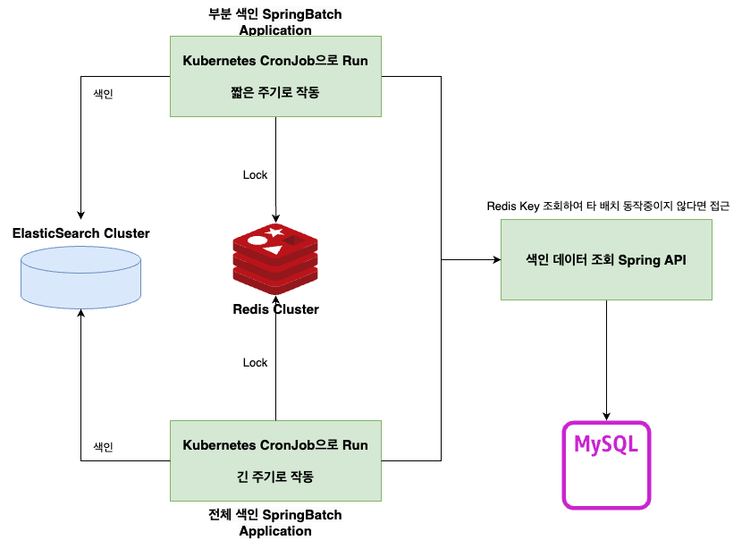

# 검색엔진 기능 구축
elastic search를 활용하여 검색 속도 개선 및 카테고리별 검색 기능을 개발하는동안 고찰했던 정보를 기록하였습니다.

## RDB에있는 데이터를 엘라스틱서치 클러스터에 색인 시키기
spring batch를 활용해서 , RDB에 있는 검색관련 정보들을 join-select 한 다음, 생성된 entity를 사용해서 elastic search의 index 색인 작업이 첫번째 동작과정

- 고민해볼 포인트
>spring batch의 주기
>
>전체 인덱스를 주기별로 계속 붓는다면 , 붓기전에 upload된 데이터는 , batch가 돌기 전까진 검색할 수 없다는 단점이 있음. 또한 추가되거나 삭제된 정보도 볼 수 없다.
>
>따라서 부분(upload , delete) 이벤트만 실행하는 batch를 하나 더 개발해서 , 부분 batch는 전체 batch보다 짧은 주기로 동작하게끔 하는 방안을 고려중
- [elasticsearch 색인 정책에 대한 고찰](#rdb-데이터-색인-구조)

### 첫번째 결과
Spring Batch Job에서 , JPA로 RDB 데이터를 모두 Select 한 후 , 프로세싱한뒤 elasticSearch에 색인하였습니다.
>현재는 RDB의 전체 데이터를 JobSchuduler에 맞게 elasticSearch에 색인중 입니다.
- [SpringBatch_Application](../BackEnd_Spring/searchFunctionTest/allIndexInitBatch/)

또한 ElasticSearch High Level Rest API를 통해 색인된 doc 들을 검색하는 API를 개발하였습니다.
>합성어 별 검색이 가능하게끔 구현하였습니다.
- [SpringBoot_Search_Application](../BackEnd_Spring/searchFunctionTest/searchAPI/)


### 두번째 결과
요구사항이 변경됨으로써 , keyword 카테고리가 신설되었습니다.

keyword는 무한적으로 늘어날 수 있으며, 키워드별 검색이 가능해야 합니다.

#### elasticSearch 색인 결과
색인 결과, 다음과 같은 결과값을 얻을 수 있었습니다.

```bash
{
  "took" : 12,
  "timed_out" : false,
  "_shards" : {
    "total" : 1,
    "successful" : 1,
    "skipped" : 0,
    "failed" : 0
  },
  "hits" : {
    "total" : {
      "value" : 10,
      "relation" : "eq"
    },
    "max_score" : 1.0,
    "hits" : [
      {
        "_index" : "info_index",
        "_id" : "NvTmsIoBQfoKA-fq89pY",
        "_score" : 1.0,
        "_source" : {
          "firstInfoId" : 1,
          "name" : "1_사진",
          "age" : 30,
          "keyword" : [
            "새벽",
            "자연"
          ],
          "categories" : [
            {
              "main_category" : "사진",
              "sub_category" : "일반인"
            }
          ]
        }
      },
      {
        "_index" : "info_index",
        "_id" : "OPTmsIoBQfoKA-fq89pY",
        "_score" : 1.0,
        "_source" : {
          "firstInfoId" : 2,
          "name" : "2_영상",
          "age" : 22,
          "keyword" : [
            "초록",
            "힐링이다",
            "mood"
          ],
          "categories" : [
            {
              "main_category" : "영상",
              "sub_category" : "전문가"
            }
          ]
        }
      },
...계속...
```

#### 두번째 결과의 문제점
같은 doc들을 키워드별로 묶는것까진 성공하였습니다.
- RDB to NoSQL 이었기 때문에, keyword와 기준점이 되는 firstInfoId값만을 꺼내는 SQL 쿼리와, 모든정보를 select 해오는 쿼리를 따로 작동시켜,
- 첫번째 쿼리(firstInfoId, keyword) 결과값과 두번쨰 쿼리 결과값을 대조하면서 , 같은 firstInfoId를 갖는 row는 List로 묶어주었습니다.

그러나 , 문제가발생했습니다.

묶긴묶었는데, 색인된 doc이 중복된다는 문제점 입니다.

**행이 9개 이고 , 중복된 행이 3개라면 6개만 색인되어야 하는데,, 중복되는 doc은 카테고리가 묶여서 중복된채로 색인된다는것이 문제였습니다.**

##### 문제점을 해결하기 위해 다음 시도를 해봤습니다.
1. 청크 개수조절
현재는 reader에서 읽어온 청크를 processer로 넘길 때 , 1개만 넘기게끔 되어있었는데, 이걸 10개로 늘렸습니다.

>그런데 이렇게하면 의미가 없는것이, select 해오는 row 개수가 무한대로 증식될 수 있는데,, 청크를 아무리 늘려도, 다음 청크에서 중복값이 존재한다면 또 같은 문제가 발생할것입니다.
2. reader 로직 수정
- processer 추가
reader 또는 processer에 reader에서 select 해온 row들을 모두 순회하면서 중복값을 제거하는 로직을 추가했습니다.

>그러나 이것또한 의미가 없는것이 .. 1번의 청크 개수가 종속적으로 묶여있기 때문에 아무리 모두 순회한다 해도, 청크개수만큼만 순회할수 밖에 없기 때문에 , 동일하게 다음 청크에서 중복값이 존재한다면 또 같은 문제가 발생할것입니다.

#### 문제점 해결 방안
결과적으로 코드상 SpringBatch에서 중복데이터값을 해결하는것은 불가능하다고 판단되었습니다.

그 이유는 , 

**ElasticSearch에 색인시켜주는 주체가 SpringBatch이고, SpringBatch는 청크별로 색인 데이터를 관리하기 때문에 그렇게 판단하였습니다.**
- 청크별로 관리하기에, 코드 로직상 select 해온 데이터를 순회해서 정제한다 하더라도 다음 청크가 존재할 수 있기 때문입니다.
- 그렇다고 청크를 무제한으로 둔다는것은 중복데이터를 정재하기위해 속도나 리소스 사용량등 모든것을 포기하는 것이기 때문입니다.

따라서 ***Logstash***를 도입하여 ElasticSearch에 적재된 데이터를 정재하는 방안으로 진행하였습니다.
- [Logstash 설치방안 및 기본 사용방안](../../DevOps_solutions/Elastic_모음/Logstash/Logstash_docker_install.md)
- [요구사항에 맞게끔 Logstash 도입하여 필터링 하는 도입기](../../DevOps_solutions/Elastic_모음/Logstash/Pipeline/ElasticSearch_중복값_제거.md)

목적은 : ***Logstash*** 를 통해, ElasticSearch에 적재된 모든 데이터들을 대상으로 firstInfoId를 기준으로 fiter를 걸어서, 중복값을 제거하려 합니다.

#### 해결방안 변경!!!!
Logstash를 사용하지 않고, **Springbatch 코드상에서 중복값을 제거합니다.**

이것이 가능해진 이유는, **select의 주체가 타 API에서 수행하고, Springbatch에선 해당 API를 통해 Select된 결과를 ResponseBody로 가져오는 로직으로 수정하였기 때문입니다.**

### 세번째 결과
부분 색인 SpringBatch와 , 전체 색인 SpringBatch Application으로 아키텍쳐를 나누게 되었습니다.

#### Redis
Redis를 **분산 Lock**으로 사용함으로써 , 상대방 Batch Application이 동작중인지를 판별하여, 동시에 동작되며 동시성이 깨지는 경우가 생기지 않도록 방지합니다.

#### Redis 분산 Lock
부분 데이터 색인 배치와 , 전체 데이터 색인 배치는 서로다른 주기로 작동합니다.

각 배치는 잡이 시작될 때 , Redis Key를 생성하고 , 잡이 완벽하게 완료될 경우에만 Redis Key를 제거합니다.

각 배치가 생성하고 지우는 키는 따로 존재합니다.
- ex) 
  - ***partKey*** -> 부분 색인 배치가 생성
  - ***allKey*** -> 전체 색인 배치가 생성

1. **전체 데이터 색인**
    - 전체 데이터 색인 시 , 잡이 수행되기 전 부분 데이터 색인 Batch가 생성한 ***partKey*** 가 존재하는지 확인합니다.
    - 만약 존재 할 경우, 해당 키가 제거될때 까지 미리 설정해둔 시간동안 전체 데이터 색인 App은 ```Thread.sleep(시간)``` 을 통해 정지합니다.
    - 만약 정지하고 있을 때, 특정 긴 시간(timeout seconds) 이 지난다면 Timeout 에러를 발생시키고 Application이 중지됩니다.
    - 키가 없다고 판별됐을 경우에만 배치 Application이 ***allKey***를 생성 후 잡을 수행하고 , 잡이 완료될 경우에만 Redis에 등록한 ***allKey***를 제거합니다.

2. **부분 데이터 색인**

    - 전체 데이터 색인과 마찬가지로 , 잡이 수행되기 전 전체 데이터 색인 Batch가 생성한 ***allKey*** 가 존재하는지 확인합니다.
    - 만약 존재 할 경우, 해당 키가 제거될때 까지 미리 설정해둔 시간동안 전체 데이터 색인 App은 ```Thread.sleep(시간)``` 을 통해 정지합니다.
    - 만약 정지하고 있을 때, 특정 긴 시간(timeout seconds) 이 지난다면 Timeout 에러를 발생시키고 Application이 중지됩니다.
    - 키가 없다고 판별됐을 경우에만 배치 Application이 ***partKey***를 생성 후 잡을 수행하고 , 잡이 완료될 경우에만 Redis에 등록한 ***partKey***를 제거합니다.

>위같은 로직을 통해 각 색인 Batch Application이 동시에 작동하며 동시성 이슈를 발생시키지 못하도록 방지하였습니다.

#### 부분 데이터 색인과 전체 색인
둘로 나눈 이유는 아래와 같습니다.

**1. 성능 최적화**

    빈번한 변동이 발생하지 않는 대부분의 데이터는 재색인의 부담 없이 그대로 유지되며, 
     
    변동된 부분만 색인되기 때문에 전체적인 색인 작업의 부담이 줄어듭니다.

**2. 데이터 일관성**

    전체 데이터를 주기적으로 색인함으로써 RDB와 Elasticsearch 간의 데이터 불일치 문제를 최소화할 수 있습니다.

**3. 세그먼트 관리**

    전체 색인 작업 중에 데이터를 flush하면 세그먼트 조각화를 방지하고, 성능을 최적화하는 데 도움을 줍니다.


#### [세그먼트 조각화란 ?](../../DevOps_solutions/Elastic_모음/ElasticSearch/세그먼트_조각화.md)

아키텍처는 다음과 같습니다.




### 고려해야될 사항 및 추가 개발사항
**1. 카테고리 종류**

현재는 카테고리가 1Depth만 존재하는데 , 최소 2Depth까지 들어가도록 개발해야합니다.
- 카테고리 관리 테이블이 따로있어야할듯
>대분류 카테고리 관리 테이블, 중분류 카테고리 관리 테이블, keyword 관리 테이블, 메인 정보 테이블과 카테고리 관리 테이블을 연결짓는 ref 테이블을 생성하여 해결

**2. 검색 우선순위**

현재는 Id값을 기반으로 검색 결과가 오름차순 정렬하게끔 되어 있는데, 아래 요구사항대로 정렬되어야 합니다.

- 요구사항
    - 만약 ```우주정거장``` 이라는 검색어가 검색됐다면 , 우선순위를 ```우주정거장``` 전체가 match되는 doc이 최 상단으로 추출되고 , 그 후 어미별 좌측부터 우측으로 ```우주``` 추출 , ```정거장``` 순으로 추출되어야 합니다.
>검색 요청 시 QueryDSL 구문으로 해결할 예정

## RDB 데이터 색인 구조
색인용 Spring Batch API는 아래 두가지로 가져가려 하고 있습니다.
- 아래 두가지 Batch API가 동시에 발생한다면, elasticsearch에 저장된 데이터 정합성이 맞지 않는 문제가 발생할 수 있기에, 한개가 실행될 때에는 다른 한개는 실행되면 안됩니다.
>둘이 중복실행되는것을 막기 위해서 Reids를 적극 도입하여 , flag를 설정

**1. 전체 데이터 색인**
- 

[전체 색인 Batch test code](../BackEnd_Spring/searchFunctionTest/allIndexInitBatch/)

전체 색인은 하루에 한번 등 긴 주기로 동작하며 모든 데이터를 elasticsearch에 저장합니다.
>bulk API를 통해 진행

**2. 부분 데이터 색인**
- 

[부분 색인 Batch test code](../BackEnd_Spring/searchFunctionTest/eventIndexInitBatch/)

부분 색인은 RDB row에 특정 event (update, delete, insert) 가 되었을 경우 , 짧은 주기 (10초 등) 에 event가 발생한 row만 데이터를 elasticsearch에 색인 합니다.
>bulk API를 통해 진행

### 아키텍처
#### 동기화 기준
ElasticSearch와 동기화를 맞춰야되는 기준은 다음과 같을것 입니다.

1. 새로운 카테고리가 등록되었을 경우
    - 관리자만 가능
2. 새로운 영상이 업로드 되었을 경우
3. 업로드된 영상의 카테고리가 변경 (추가 , 제거) 되었을 경우
4. 영상이 삭제되었을 경우

>위 이벤트가 발생했을 때 , Elastic Search에도 반영되야만 합니다.

따라서 event Table을 생성하였습니다.

**- eventTable**

|컬럼 명|Data Type|요약 정보|비고|
|------|---|---|--|
|_id|int|row별 Id 값|PK|
|action|varchar(20)|어떤 이벤트가 발생했는지 체크 - UPDATE && DELETE && Create|-|
|firstIdInfo|int|카테고리들의 식별번호|FK|
|changesValue|varchar(500)|doc 별 실제변경내용|해당 칼럼으로 바로 ElasticSearch에 색인할 수 있도록 bulk 형 json으로 넣어두기|
|updateDateTime|timestemp|이벤트 발생 일자|-|

#### 고려 항목
1. 이벤트 테이블에 등록 방법
- 코드상에서 같이 해주는 방법 (insert) 과, DB 트리거등록 방법 두가지로 나뉠듯
2. 이벤트 테이블에 관리 방법
- 외부 DB를 또 생성 ?

### 이론들
#### bulk API vs 일반 색인
bulk API는 elasticsearch에서 다수(대량) 인덱스에 대해 색인, 갱신, 제거를 단일 API로 수행할 수 있게 해주는 기능 입니다.

bulk API를 사용한다면 아래와 같은 이점을 가질 수 있습니다.
- 일반 색인과 다르게 대량의 문서를 한번에 호출로 elasticSearch에 색인하기 때문에 , 속도가 훨씬 빠릅니다.
- 다수 인덱스를 색인하려고 여러번 elasticsearch를 호출하지 않기 때문에 , 네트워크 오버헤드를 최소화할 수 있습니다.
- Bulk API를 사용하여 인덱스, 업데이트, 삭제 작업을 혼합하여 실행할 수 있습니다.
